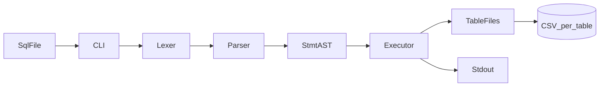

# sql_parsor

**sql_parsor**는 텍스트 SQL 파일을 CLI로 받아 **INSERT / SELECT** 를 파싱·실행하고, **테이블당 CSV 파일**에 저장·조회하는 **C 기반 SQL 처리기** 프로젝트입니다.

## 프로젝트 소개

- 프로젝트 한 줄 소개: 파일 기반 미니 DB — **입력(SQL) → 파싱 → 실행 → 저장**
- 해결하려는 문제: DB 엔진의 **lexer / parser / executor / storage** 경계를 직접 구현하며 학습·포트폴리오용 결과물 확보
- 핵심 사용자: 수요 코딩회 참가 팀, 리뷰어, 발표 청중
- 핵심 가치: 문서화된 CLI·SQL 계약, 재현 가능한 테스트, 데모 가능한 완주
- 진행 기간 / 팀 규모: (기입)

## 기획 의도

- 기존 방식의 불편함: SQL 처리 흐름이 블랙박스로 남기 쉽다.
- 우리가 해결하려는 핵심 포인트: **과제 범위 안**에서 end-to-end 파이프라인을 완성한다.
- 이번 MVP에서 집중한 가치: **INSERT/SELECT**, **파일 DB**, **테스트**, **README 데모**

## 핵심 기능

- SQL 스크립트 파일을 인자로 받는 **CLI** (`sql_processor <path.sql>`)
- **INSERT INTO … VALUES** — CSV 파일에 행 추가
- **SELECT … FROM** — CSV에서 읽어 **stdout** 출력 (포맷은 `docs/03-api-reference.md` 기준)
- **WEEK7**: CSV 첫 컬럼이 `id` 이면 **자동 증가 PK** + 메모리 **B+ 트리 인덱스**; `SELECT … WHERE id = <정수>` 는 인덱스 룩업(그 외 SELECT는 전체 스캔)
- **CREATE TABLE 미구현** — `data/*.csv` 는 사전 준비(헤더 포함)
- **단위·통합 테스트** (CTest 등)

## 데모 시나리오 (발표 4분용)

1. 저장소를 클론하고 `data/users.csv` 처럼 **헤더가 있는 CSV** 가 있다고 설명한다.
2. `sample.sql` 에 `INSERT INTO users VALUES (...);` 와 `SELECT * FROM users;` 가 있음을 보여준다.
3. 프로젝트 루트에서 빌드 후 `sql_processor sample.sql` 을 실행한다.
4. 터미널에 **SELECT 결과**가 나오고, `users.csv` 끝에 **새 행**이 붙었음을 확인한다.
5. (시간 있으면) 잘못된 SQL 파일을 실행해 **stderr** 와 **비제로 종료 코드**를 보여준다.

## 터미널 출력 예시 (자리 표시)

구현 전 골격 단계에서는 다음과 같이 동작할 수 있습니다.

```text
> sql_processor
usage: sql_processor <path.sql>
```

실제 파싱·실행 완료 후에는 이 섹션을 **진짜 출력 캡처**로 교체합니다.

## 아키텍처 요약

자세한 내용은 `docs/02-architecture.md` 를 참고합니다.

- 클라이언트: 없음 (CLI만)
- 코어: C — Lexer → Parser → Executor → CSV Storage
- 데이터 저장소: `data/<table>.csv` (테이블당 파일)
- 인증 / 상태 관리: 없음
- 배포 방식: 소스 빌드 (로컬)




## 기술 스택


| 영역       | 사용 기술                       |
| -------- | --------------------------- |
| Frontend | N/A (CLI)                   |
| Core     | C (C11 권장), CMake           |
| Database | 파일 기반 CSV (`data/` 디렉터리)    |
| Infra    | 로컬 빌드                       |
| Testing  | CTest, (선택) 스크립트 기반 SQL 픽스처 |


## Quick Start

### 1) 빌드

프로젝트 루트에서:

```bash
cmake -S . -B build
cmake --build build
```

**Windows (Visual Studio 생성기)** 실행 파일 예:

- `build\Debug\sql_processor.exe`
- `build\Release\sql_processor.exe`

**단일 구성(ninja/make)** 예:

- `build/sql_processor` 또는 `build/sql_processor.exe`

### WEEK7: B+ 트리 벤치(로컬)

CTest에는 넣지 않았습니다. 빌드 후 **프로젝트 루트**에서 실행합니다.

```bash
cmake --build build --target bench_bplus
./build/bench_bplus              # 기본 n=1_000_000 삽입 + n회 검증 검색
./build/bench_bplus 10000        # 빠른 스모크
./build/bench_bplus compare 1000000 10000   # 100만 삽입 후 k회 인덱스 vs 선형 스캔
```

- `bench_bplus [n]`: 트리에 `1..n` 삽입 뒤, 각 키를 `bplus_search`로 전부 검증합니다.
- `bench_bplus compare <n> <k>`: `n`개 키 삽입 후, 동일한 `k`개의 **난수 id 질의**(시드 고정)에 대해 **B+ 룩업**과 **길이 n 배열을 맨 앞부터 스캔하는 선형 탐색** 시간을 각각 잽니다. `sql_processor`의 `WHERE id`(인덱스) vs 전 행 스캔(풀스캔에 가까운 CPU 비용)을 **디스크 I/O 없이** 분리해 비교합니다.

#### 실측 예시 (한 로컬 환경)

아래는 `cmake -G Ninja -B build-ninja -DCMAKE_C_COMPILER=gcc` 로 `bench_bplus`를 빌드한 뒤, Windows에서 `.\build-ninja\bench_bplus.exe compare 1000000 10000` 한 결과입니다. CPU·최적화 옵션에 따라 달라집니다.


| 항목                          | 값                                   |
| --------------------------- | ----------------------------------- |
| 날짜                          | 2026-04-15                          |
| 명령                          | `bench_bplus compare 1000000 10000` |
| n (삽입·인덱스 크기)               | 1,000,000                           |
| k (질의 횟수, 난수 id)            | 10,000                              |
| 삽입                          | 0.209 s                             |
| 인덱스 k회 룩업                   | 0.009 s                             |
| 선형 스캔 k회 (매번 최악 n회 비교에 가까움) | 4.216 s                             |
| 비율 (선형 ÷ 인덱스)               | 약 468×                              |


전체 파이프라인에서 **100만 줄 SQL INSERT**까지 포함한 측정은 I/O·파싱 비용이 커서 별도 스크립트로 수행하는 것을 권장합니다. 위 표는 **룩업 알고리즘 차이**에 초점을 둔 재현 값입니다.

### 2) 실행

```bash
./build/sql_processor sample.sql
```

Windows PowerShell 예:

```powershell
.\build\Debug\sql_processor.exe .\sample.sql
```

현재 구현은 `INSERT`/`SELECT`를 실제로 파싱·실행합니다. `sample.sql`과 `data/`를 맞춰 실행하면 SELECT 결과가 stdout(TSV)으로 출력됩니다.

### 3) 테스트

```bash
ctest --test-dir build --output-on-failure
```

### 4) 실시간 데모 페이지 (Node + Express)

`Step 1~5(SQL 입력 → Lexer → Parser(AST) → Executor → 결과)`를 브라우저에서 확인할 수 있습니다. 상단 메뉴에서 **Week 6**(MVP 파이프라인)과 **Week 7**(`docs/weeks/WEEK7/learning-guide.md` 의 **단계 1~7**별 실습·프리셋·터미널 안내) 페이지를 나눠 둡니다.

```bash
cmake --build build-ninja
cd demo
npm install
npm start
```

(`build-gcc`, Visual Studio 멀티 구성 `build/Release` 등) 빌드 산출물에 `sql_processor_trace` 가 있으면 데모 서버가 자동으로 찾습니다.

브라우저에서 `http://localhost:4010` 접속:

- **홈**: 주차별 데모로 이동
- **Week 6**: 예제 버튼·5단계 패널
- **Week 7**: 왼쪽 **단계 1~7** 네비 + 단계별 공부/점검 + SQL 프리셋(단계 1·7은 터미널 `ctest` / `bench_bplus` 안내)
- 실행 시 `stdout/stderr/exit code` 확인
- 토큰(kind/text/line/column), AST, executor 호출 흐름 확인
- `users.csv` 실행 전/후 diff 확인

## 프로젝트 문서

- [Codex 작업 규칙](AGENTS.md)
- [기획 문서](docs/01-product-planning.md)
- [아키텍처 문서](docs/02-architecture.md)
- [CLI·SQL 계약](docs/03-api-reference.md)
- [개발 가이드](docs/04-development-guide.md)
- [주차별 보조 문서](docs/weeks/README.md) — WEEK6 학습 가이드, WEEK7 B+ 트리 과제 틀 등 (스펙 아님)
- [템플릿 사용법](00-how-to-use-this-template.md)

## 프로젝트 구조

```text
sql_parsor/
├─ AGENTS.md
├─ CMakeLists.txt
├─ README.md
├─ include/
│  ├─ ast.h
│  ├─ csv_storage.h
│  ├─ executor.h
│  ├─ lexer.h
│  ├─ parser.h
│  └─ sql_processor.h
├─ src/
│  ├─ ast.c
│  ├─ csv_storage.c
│  ├─ executor.c
│  ├─ lexer.c
│  ├─ main.c
│  ├─ main_trace.c
│  ├─ parser.c
│  ├─ sql_processor.c
│  └─ sql_trace.c
├─ demo/
│  ├─ package.json
│  ├─ server.js
│  └─ public/
│     ├─ app.js
│     ├─ app-week7-lab.js
│     ├─ week7-lab.json
│     ├─ nav.js
│     ├─ index.html
│     ├─ week6.html
│     ├─ week7.html
│     └─ styles.css
├─ tests/
│  ├─ test_bootstrap.c
│  ├─ test_csv_storage.c
│  ├─ test_executor.c
│  ├─ test_lexer.c
│  ├─ test_main_integration.c
│  ├─ test_parser_insert.c
│  ├─ test_parser_select.c
│  └─ sql/
├─ data/
│  └─ users.csv
├─ sample.sql
└─ docs/
   ├─ 01-product-planning.md
   ├─ 02-architecture.md
   ├─ 03-api-reference.md
   ├─ 04-development-guide.md
   └─ weeks/
      ├─ README.md
      ├─ WEEK6/
      │  ├─ assignment.md
      │  ├─ learning-guide.md
      │  ├─ presentation-script.md
      │  └─ presentation-visuals.md
      └─ WEEK7/
         ├─ assignment.md
         ├─ learning-guide.md
         ├─ sequences.md
         └─ implementation-order.md
```

## 현재 범위

- 요구사항 / 범위: `docs/01-product-planning.md`
- 설계 기준: `docs/02-architecture.md`
- CLI·SQL 계약: `docs/03-api-reference.md`
- 작업 방식: `docs/04-development-guide.md`
- Codex 작업 규칙: `AGENTS.md`
- (연계) B+ 트리 주차 과제 틀: `docs/weeks/WEEK7/README.md`

## 트러블슈팅 / 배운 점

발표에서 강조할 기술 포인트를 2~3개만 적습니다.

- 문제 1: CSV 필드 안의 콤마·따옴표 처리
  - 해결: RFC 4180 스타일 직렬화·파서와 동일 규칙 유지 (`docs/03-api-reference.md`)
- 문제 2: Windows vs Unix 실행 파일 경로
  - 해결: README와 AGENTS에 **Debug/Release** 경로 명시, CI에서 단일 생성기 사용 검토
- 문제 3: (팀이 채움)

## Known Limitations

- CREATE TABLE 및 스키마 변경 미지원
- JOIN, 서브쿼리, 트랜잭션 미지원
- Stretch 기능(WHERE 등)은 `docs/01-product-planning.md` 의 Optional 에 따름

## 과제·문서 정렬 체크리스트

구현이 진행될수록 아래를 채워 발표·PR 전에 확인합니다.

- CLI로 **텍스트 SQL 파일**을 전달할 수 있다(`docs/03-api-reference.md`).
- **INSERT / SELECT** 파싱·실행·파일 I/O가 문서와 일치한다.
- **CREATE TABLE 없음**, 스키마·`data/*.csv` 사전 존재 가정이 유지된다.
- 저장 포맷·테이블→파일 매핑이 `docs/02-architecture.md` 와 **하나로 고정**되어 있다.
- 단위·통합 테스트 전략이 `docs/04-development-guide.md` 대로 동작한다.
- README 데모 시나리오와 실제 명령·출력이 어긋나지 않는다.
- `AGENTS.md` 의 빌드·테스트 명령이 README Quick Start 와 **충돌하지 않는다**.

