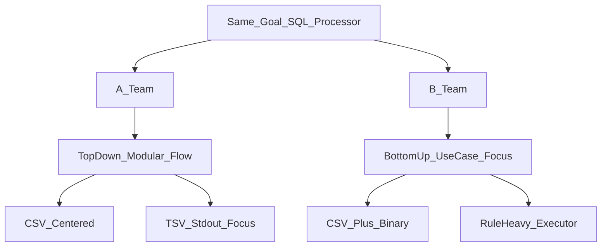
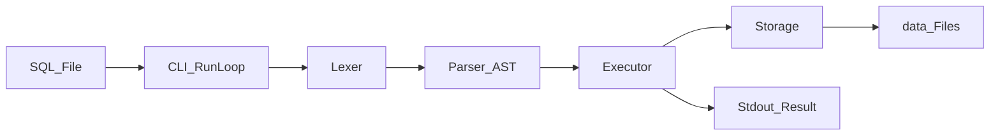
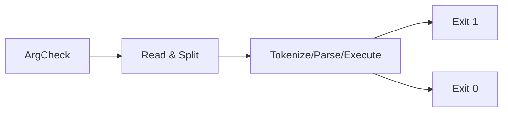
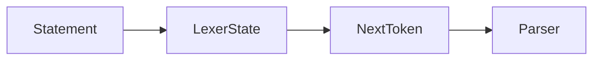
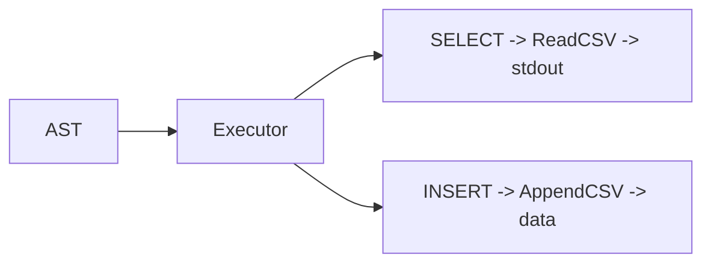
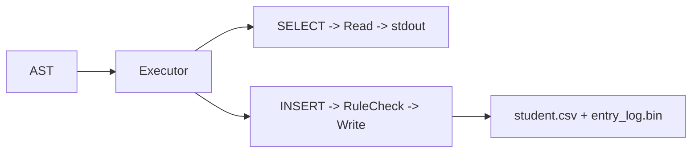
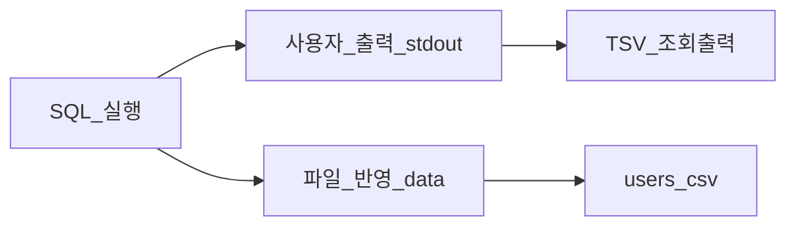
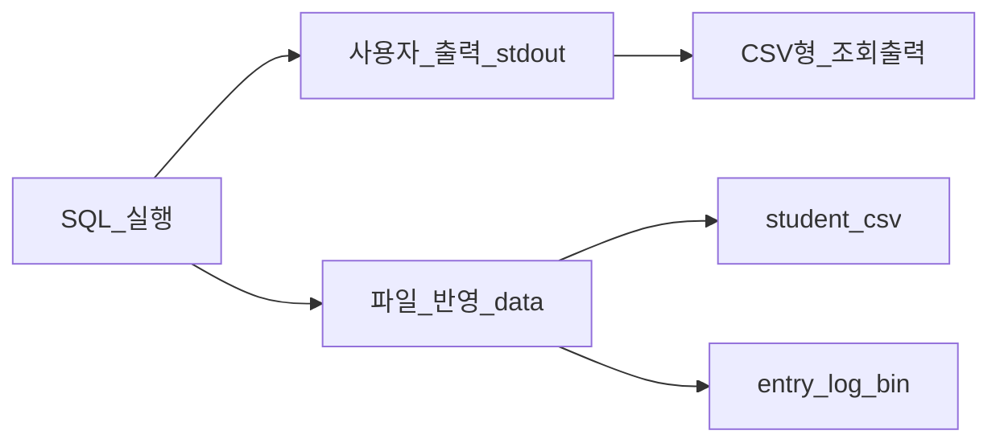

# sql_parsor

`sql_parsor`는 SQL 파일을 입력받아 파싱하고, 실행 결과를 터미널 출력과 데이터 파일 반영으로 확인할 수 있는 C 기반 미니 SQL 엔진입니다.

이 README는 `docs/06-presentation-script-4min.md`의 발표 대본과 `docs/07-presentation-visuals.md`의 시각화 자료를 합쳐, 발표 자료처럼 바로 보여줄 수 있도록 정리한 버전입니다.

## 프로젝트 한 줄 소개

같은 목표의 SQL 처리기를 두 조가 서로 다른 방식으로 구현했고, 그 차이를 아키텍처와 실행 흐름 중심으로 비교하는 프로젝트입니다.

## 1. 협업 방식과 접근 차이

이번 프로젝트는 2인 1조 페어 프로그래밍으로 진행되었고, 두 조가 같은 목표를 어떻게 다른 방식으로 구현했는지 비교했습니다.

- A조는 Lexer, Parser 같은 시스템 구성 요소를 코드 단위로 쌓아 올리며 전체 실행 흐름과 구조를 이해하는 데 집중했습니다.
- B조는 실제로 다룰 데이터 테이블과 시나리오를 먼저 정의하고, 이를 처리하는 기능을 우선 구현하는 방식으로 접근했습니다.



핵심 메시지:

- A조: 파이프라인 이해와 가시성 중심
- B조: 요구 규칙과 도메인 처리 중심

## 2. 전체 아키텍처

시스템 전체를 한 문장으로 요약하면, "SQL 파일을 입력받아 파싱 후, 실행 결과를 CSV 파일에 반영하는 C 기반 미니 SQL 엔진"입니다.

흐름은 단순합니다. CLI가 SQL 파일을 읽어 문장 단위로 분리하고, Lexer가 토큰으로 나누고, Parser가 AST를 생성한 뒤, Executor가 실제 동작을 수행합니다. 결과는 `stdout`과 `data/*` 파일 반영으로 나타납니다.



핵심 메시지:

- SQL 입력이 단계적으로 변환되어 실행됩니다.
- 사용자 출력과 파일 반영이 동시에 존재합니다.

## 3. CLI 계층 비교

시작점은 `main` 함수입니다. 파일 경로를 입력받아 SQL 문장을 처리 파이프라인에 넘기는데, 여기서 두 조는 에러 처리 전략이 달랐습니다.

- A조는 파싱 오류와 실행 또는 I/O 오류를 분리해 종료 코드를 더 세분화했습니다.
- B조는 사용자 메시지는 상세히 보여주되, 종료 코드는 성공과 실패 중심으로 단순화했습니다.

### A조 CLI


### B조 CLI



핵심 메시지:

- A조는 CLI에서 오류를 `1/2/3`처럼 더 세밀하게 나눕니다.
- B조는 성공과 실패 중심으로 흐름을 단순화합니다.

## 4. Lexer 방식 비교

Lexer는 SQL 문자열을 토큰 단위로 분해하는 단계입니다.

- A조는 상태를 유지한 채 요청할 때마다 토큰을 하나씩 반환하는 방식입니다.
- B조는 문장 전체를 한 번에 토큰 리스트로 만든 뒤 파서에 전달합니다.

### A조 Lexer



### B조 Tokenizer


핵심 메시지:

- A조는 스트리밍 방식이라 파서와의 연결이 유연합니다.
- B조는 전체 토큰을 한눈에 보기 좋아 디버깅에 유리합니다.

## 5. Parser 방식 비교

Parser는 토큰이 문법에 맞는지 검증하고 AST를 생성하는 단계입니다.

- A조는 일반적인 `SELECT`, `INSERT` 문법을 폭넓게 처리할 수 있도록 설계해 확장성이 높습니다.
- B조는 특정 테이블과 정해진 요구사항을 처리하는 전용 패턴 중심으로 구현해 안정성을 높였습니다.

### A조 Parser


### B조 Parser


핵심 메시지:

- A조: 확장 여지를 둔 일반형 파서
- B조: 요구 범위를 좁힌 전용 파서

## 6. Executor와 Storage 비교

Parser가 의미를 만든다면, Executor는 그 의미를 실제 동작으로 바꾸는 역할을 합니다.

- A조는 Executor가 Parser 결과를 Storage에 바로 연결하는 단순한 구조를 가집니다.
- B조는 Executor 안에서 권한 체크, 타입 변환, 존재 여부 검사 같은 비즈니스 규칙을 더 많이 처리합니다.

### A조 Executor + Storage



### B조 Executor + Storage



핵심 메시지:

- A조는 실행 경로를 단순하게 유지합니다.
- B조는 실행 규칙 검증을 더 엄격하게 수행합니다.

## 7. 실행 결과와 시연 포인트

실행 결과는 실시간 터미널 출력과 `data` 폴더의 파일 저장으로 확인할 수 있습니다.

- A조는 결과를 TSV 형태로 보여주고, 처리 과정 전체를 시각적으로 확인하는 데 강점이 있습니다.
- B조는 단순 출력뿐 아니라 Binary 로그 조회와 데이터 정합성 검증까지 포함해 실제 서비스형 데이터 관리에 더 가깝습니다.

### A조 실행 결과



### B조 실행 결과



핵심 메시지:

- 두 조 모두 화면 출력과 파일 반영이 분리되어 있습니다.
- A조는 CSV 중심, B조는 CSV와 Binary를 함께 다룹니다.

## 발표 데모 흐름

발표에서는 두 조의 장점을 합쳐 핵심만 시연합니다.

1. B조의 데이터 설계 포인트를 먼저 설명합니다.
2. 기준 데이터는 CSV, 이벤트 로그는 Binary로 분리한 이유를 짚습니다.
3. 이후 A조의 아키텍처로 전체 실행 흐름을 검증합니다.
4. 데모 페이지에서 SQL 실행 결과를 단계별로 보여줍니다.
5. 마지막으로 `users.csv`를 열어 화면 결과와 실제 파일 반영이 일치하는지 확인합니다.

데모 페이지에서 확인할 수 있는 항목은 아래와 같습니다.

- SQL 입력
- Lexer 토큰
- Parser AST
- Executor 호출 흐름
- `stdout`
- `exit code`
- CSV diff

## 빠른 실행

프로젝트 루트 `sql_parsor/` 에서 실행합니다.

### 빌드

```bash
cmake -S . -B build
cmake --build build
```

### 실행

```powershell
.\build\Debug\sql_processor.exe .\sample.sql
```

또는 단일 구성 생성기에서는 다음처럼 실행할 수 있습니다.

```bash
./build/sql_processor sample.sql
```

### 테스트

```bash
ctest --test-dir build --output-on-failure
```

### 데모 페이지

```bash
cmake --build build-gcc
cd demo
npm install
npm start
```

브라우저 접속 주소:

```text
http://localhost:4010
```

## 예제 SQL

```sql
INSERT INTO users VALUES (2, 'bob', 'bob@example.com');
SELECT * FROM users;
SELECT id, email FROM users;
```

## 프로젝트 구조

```text
sql_parsor/
├─ include/
├─ src/
├─ data/
├─ tests/
├─ demo/
├─ docs/
├─ sample.sql
└─ README.md
```

## 관련 문서

- `docs/06-presentation-script-4min.md`
- `docs/07-presentation-visuals.md`
- `docs/02-architecture.md`
- `docs/03-api-reference.md`
- `docs/04-development-guide.md`

## 결론

이 프로젝트는 하나의 SQL 처리기를 두 가지 엔지니어링 관점으로 비교해 본 결과물입니다.

- B조는 규칙 중심 설계의 강점을 보여줍니다.
- A조는 전체 파이프라인의 가시성과 검증 편의성을 보여줍니다.
- 두 접근 모두 같은 목표를 다른 방식으로 달성할 수 있다는 점을 확인할 수 있습니다.
