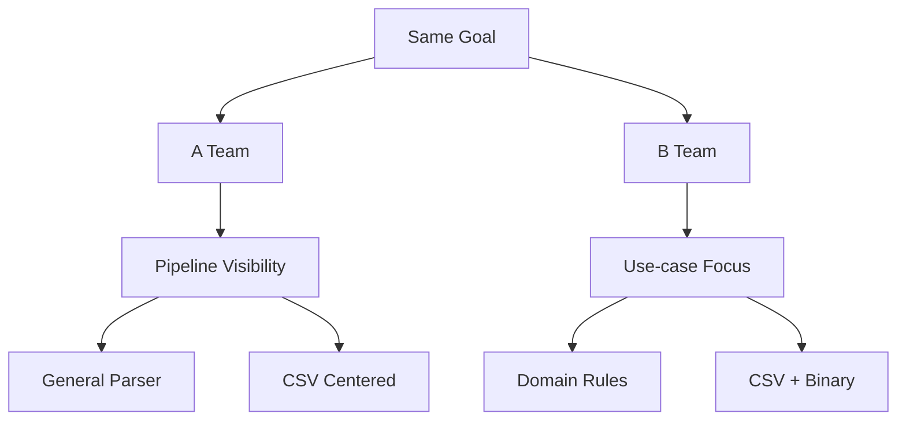
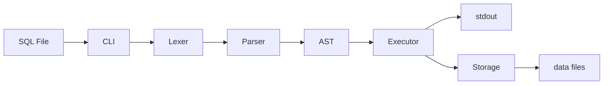
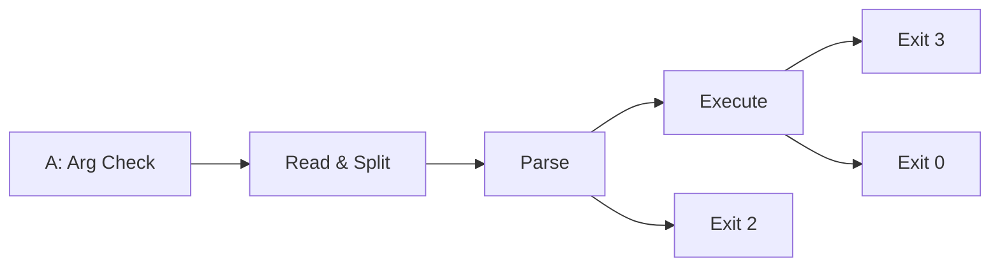
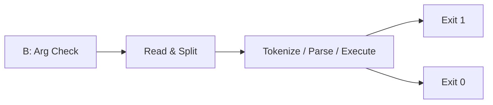
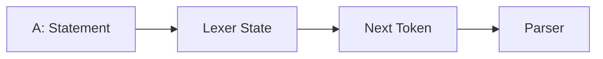
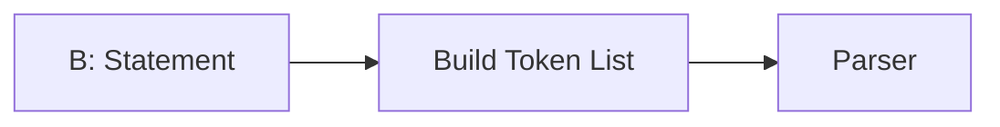
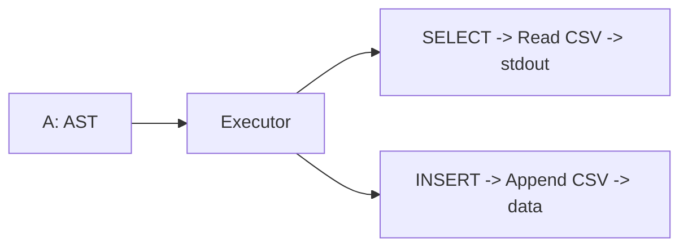
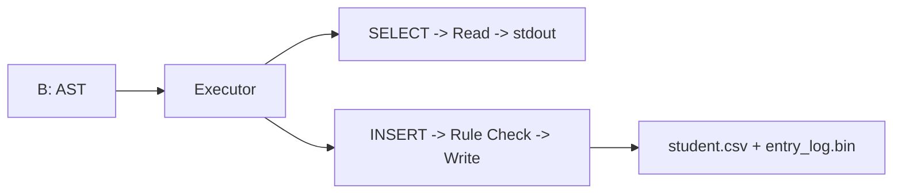
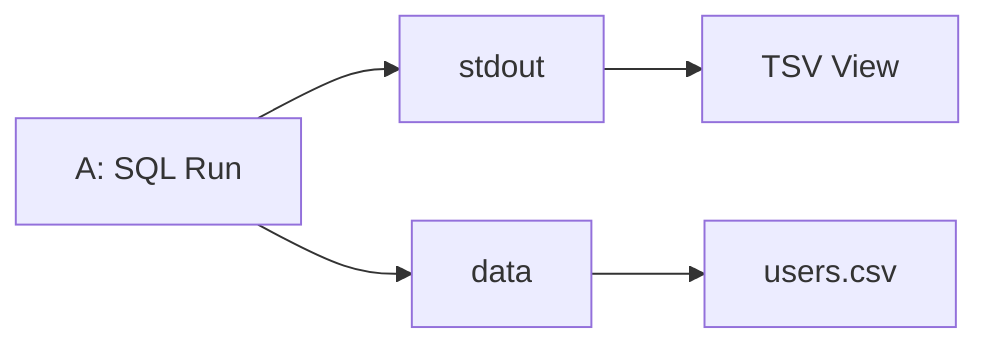
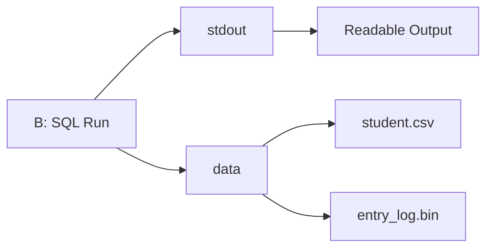

# sql_parsor

`sql_parsor`는 SQL 파일을 입력받아 파싱하고, 실행 결과를 터미널 출력과 데이터 파일 반영으로 확인할 수 있는 C 기반 미니 SQL 엔진입니다.

하나의 목표를 두 가지 방식으로 구현한 프로젝트라는 점이 이 저장소의 핵심입니다. 같은 SQL 처리기라도 어디에 초점을 두느냐에 따라 구조와 장점이 달라질 수 있다는 점을 비교해 보여줍니다.

## What We Built

- SQL 파일 입력
- Lexer, Parser, AST, Executor 기반 처리
- `stdout` 결과 출력
- CSV 파일 반영
- C와 CMake로 구현한 미니 SQL 실행 파이프라인

## Two Approaches, One Goal

이번 프로젝트는 같은 목표를 향해 두 조가 서로 다른 관점으로 구현한 결과를 비교합니다.

- A조는 파이프라인의 흐름과 구조를 또렷하게 드러내는 방식에 집중했습니다.
- B조는 실제 데이터 규칙과 시나리오를 안정적으로 처리하는 방식에 집중했습니다.



| 관점 | A조 | B조 |
| --- | --- | --- |
| 중심 가치 | 실행 흐름의 가시성 | 도메인 규칙의 안정성 |
| 설계 방향 | 범용 파이프라인 | 요구사항 중심 구현 |
| 저장 방식 | CSV 중심 | CSV + Binary |
| 강점 | 구조를 이해하고 검증하기 좋음 | 실제 규칙을 엄격히 처리하기 좋음 |

## Architecture

전체 구조는 SQL 한 줄이 어떤 단계를 거쳐 실제 동작으로 이어지는지 명확하게 보여주는 데 초점이 맞춰져 있습니다.



입력은 SQL 파일이고, 처리 결과는 두 방향으로 드러납니다. 하나는 사용자가 바로 보는 `stdout`이고, 다른 하나는 실제 데이터 파일 반영입니다.

## Layer Comparison

### CLI

CLI는 전체 실행의 시작점입니다.

- A조는 오류 원인을 더 잘 구분할 수 있도록 종료 코드를 세분화했습니다.
- B조는 성공과 실패 중심으로 단순하게 정리해 흐름을 간결하게 유지했습니다.





### Lexer

Lexer는 SQL 문자열을 토큰 단위로 나누는 계층입니다.

- A조는 토큰을 하나씩 꺼내는 스트리밍 방식입니다.
- B조는 전체 토큰 목록을 먼저 만든 뒤 파서에 넘깁니다.





### Parser

Parser는 문법 검증과 AST 생성의 중심입니다.

- A조는 `SELECT`, `INSERT`를 더 일반적으로 확장할 수 있는 방향을 택했습니다.
- B조는 특정 요구사항을 안정적으로 처리하는 전용 패턴 중심으로 설계했습니다.


### Executor and Storage

Executor는 AST를 실제 동작으로 바꾸고, Storage는 그 결과를 파일에 반영합니다.

- A조는 실행 경로를 단순하게 유지해 흐름이 잘 드러납니다.
- B조는 권한, 타입, 존재 여부 같은 도메인 규칙을 더 깊게 반영합니다.





## Output

두 구현 모두 결과를 화면 출력과 파일 반영으로 나눠 보여줍니다. 차이는 무엇을 중심에 두느냐입니다.

- A조는 처리 과정과 결과를 눈으로 확인하기 좋은 형태에 강합니다.
- B조는 기록 관리와 데이터 정합성까지 포함한 더 엄격한 처리에 강합니다.





## Quick Start

프로젝트 루트 `sql_parsor/` 기준입니다.

### Build

```bash
cmake -S . -B build
cmake --build build
```

### Run

```powershell
.\build\Debug\sql_processor.exe .\sample.sql
```

또는:

```bash
./build/sql_processor sample.sql
```

### Test

```bash
ctest --test-dir build --output-on-failure
```

## Sample SQL

```sql
INSERT INTO users VALUES (2, 'bob', 'bob@example.com');
SELECT * FROM users;
SELECT id, email FROM users;
```

## Project Structure

```text
sql_parsor/
├─ include/
├─ src/
├─ data/
├─ tests/
├─ demo/
├─ docs/
├─ sample.sql
└─ README.md
```

## Summary

이 프로젝트는 SQL 처리기 자체를 만드는 것에 그치지 않고, 같은 목표를 서로 다른 엔지니어링 관점으로 풀어낸 결과를 비교해서 보여준다는 점에 의미가 있습니다.
