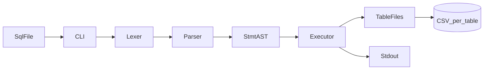

# sql_parsor

**sql_parsor**는 텍스트 SQL 파일을 CLI로 받아 **INSERT / SELECT** 를 파싱·실행하고, **테이블당 CSV 파일**에 저장·조회하는 **C 기반 SQL 처리기** 프로젝트입니다.

## 프로젝트 소개

- 프로젝트 한 줄 소개: 파일 기반 미니 DB — **입력(SQL) → 파싱 → 실행 → 저장**
- 해결하려는 문제: DB 엔진의 **lexer / parser / executor / storage** 경계를 직접 구현하며 학습·포트폴리오용 결과물 확보
- 핵심 사용자: 수요 코딩회 참가 팀, 리뷰어, 발표 청중
- 핵심 가치: 문서화된 CLI·SQL 계약, 재현 가능한 테스트, 데모 가능한 완주
- 진행 기간 / 팀 규모: (기입)

## 기획 의도

- 기존 방식의 불편함: SQL 처리 흐름이 블랙박스로 남기 쉽다.
- 우리가 해결하려는 핵심 포인트: **과제 범위 안**에서 end-to-end 파이프라인을 완성한다.
- 이번 MVP에서 집중한 가치: **INSERT/SELECT**, **파일 DB**, **테스트**, **README 데모**

## 핵심 기능

- SQL 스크립트 파일을 인자로 받는 **CLI** (`sql_processor <path.sql>`)
- **INSERT INTO … VALUES** — CSV 파일에 행 추가
- **SELECT … FROM** — CSV에서 읽어 **stdout** 출력 (포맷은 `docs/03-api-reference.md` 기준)
- **CREATE TABLE 미구현** — `data/*.csv` 는 사전 준비(헤더 포함)
- **단위·통합 테스트** (CTest 등)

## 데모 시나리오 (발표 4분용)

1. 저장소를 클론하고 `data/users.csv` 처럼 **헤더가 있는 CSV** 가 있다고 설명한다.
2. `sample.sql` 에 `INSERT INTO users VALUES (...);` 와 `SELECT * FROM users;` 가 있음을 보여준다.
3. 프로젝트 루트에서 빌드 후 `sql_processor sample.sql` 을 실행한다.
4. 터미널에 **SELECT 결과**가 나오고, `users.csv` 끝에 **새 행**이 붙었음을 확인한다.
5. (시간 있으면) 잘못된 SQL 파일을 실행해 **stderr** 와 **비제로 종료 코드**를 보여준다.

## 터미널 출력 예시 (자리 표시)

구현 전 골격 단계에서는 다음과 같이 동작할 수 있습니다.

```text
> sql_processor
usage: sql_processor <path.sql>
```

실제 파싱·실행 완료 후에는 이 섹션을 **진짜 출력 캡처**로 교체합니다.

## 아키텍처 요약

자세한 내용은 `docs/02-architecture.md` 를 참고합니다.

- 클라이언트: 없음 (CLI만)
- 코어: C — Lexer → Parser → Executor → CSV Storage
- 데이터 저장소: `data/<table>.csv` (테이블당 파일)
- 인증 / 상태 관리: 없음
- 배포 방식: 소스 빌드 (로컬)



## 기술 스택

| 영역 | 사용 기술 |
| --- | --- |
| Frontend | N/A (CLI) |
| Core | C (C11 권장), CMake |
| Database | 파일 기반 CSV (`data/` 디렉터리) |
| Infra | 로컬 빌드 |
| Testing | CTest, (선택) 스크립트 기반 SQL 픽스처 |

## Quick Start

### 1) 빌드

프로젝트 루트에서:

```bash
cmake -S . -B build
cmake --build build
```

**Windows (Visual Studio 생성기)** 실행 파일 예:

- `build\Debug\sql_processor.exe`
- `build\Release\sql_processor.exe`

**단일 구성(ninja/make)** 예:

- `build/sql_processor` 또는 `build/sql_processor.exe`

### 2) 실행

```bash
./build/sql_processor sample.sql
```

Windows PowerShell 예:

```powershell
.\build\Debug\sql_processor.exe .\sample.sql
```

현재 구현은 `INSERT`/`SELECT`를 실제로 파싱·실행합니다. `sample.sql`과 `data/`를 맞춰 실행하면 SELECT 결과가 stdout(TSV)으로 출력됩니다.

### 3) 테스트

```bash
ctest --test-dir build --output-on-failure
```

### 4) 실시간 데모 페이지 (Node + Express)

`Step 1~5(SQL 입력 → Lexer → Parser(AST) → Executor → 결과)`를 브라우저에서 확인할 수 있습니다.

```bash
cmake --build build-gcc
cd demo
npm install
npm start
```

브라우저에서 `http://localhost:4010` 접속:

- 예제 버튼으로 SQL 템플릿 선택
- 실행 시 `stdout/stderr/exit code` 확인
- 토큰(kind/text/line/column), AST, executor 호출 흐름 확인
- `users.csv` 실행 전/후 diff 확인

## 프로젝트 문서

- [Codex 작업 규칙](AGENTS.md)
- [기획 문서](docs/01-product-planning.md)
- [아키텍처 문서](docs/02-architecture.md)
- [CLI·SQL 계약](docs/03-api-reference.md)
- [개발 가이드](docs/04-development-guide.md)
- [단계별 학습 가이드](docs/05-learning-resources.md) (공부용; 스펙 아님)
- [템플릿 사용법](00-how-to-use-this-template.md)

## 프로젝트 구조

```text
sql_parsor/
├─ AGENTS.md
├─ CMakeLists.txt
├─ README.md
├─ include/
│  ├─ ast.h
│  ├─ csv_storage.h
│  ├─ executor.h
│  ├─ lexer.h
│  ├─ parser.h
│  └─ sql_processor.h
├─ src/
│  ├─ ast.c
│  ├─ csv_storage.c
│  ├─ executor.c
│  ├─ lexer.c
│  ├─ main.c
│  ├─ main_trace.c
│  ├─ parser.c
│  ├─ sql_processor.c
│  └─ sql_trace.c
├─ demo/
│  ├─ package.json
│  ├─ server.js
│  └─ public/
│     ├─ app.js
│     ├─ index.html
│     └─ styles.css
├─ tests/
│  ├─ test_bootstrap.c
│  ├─ test_csv_storage.c
│  ├─ test_executor.c
│  ├─ test_lexer.c
│  ├─ test_main_integration.c
│  ├─ test_parser_insert.c
│  ├─ test_parser_select.c
│  └─ sql/
├─ data/
│  └─ users.csv
├─ sample.sql
└─ docs/
   ├─ 01-product-planning.md
   ├─ 02-architecture.md
   ├─ 03-api-reference.md
   ├─ 04-development-guide.md
   └─ 05-learning-resources.md
```

## 현재 범위

- 요구사항 / 범위: `docs/01-product-planning.md`
- 설계 기준: `docs/02-architecture.md`
- CLI·SQL 계약: `docs/03-api-reference.md`
- 작업 방식: `docs/04-development-guide.md`
- Codex 작업 규칙: `AGENTS.md`

## 트러블슈팅 / 배운 점

발표에서 강조할 기술 포인트를 2~3개만 적습니다.

- 문제 1: CSV 필드 안의 콤마·따옴표 처리
  - 해결: RFC 4180 스타일 직렬화·파서와 동일 규칙 유지 (`docs/03-api-reference.md`)
- 문제 2: Windows vs Unix 실행 파일 경로
  - 해결: README와 AGENTS에 **Debug/Release** 경로 명시, CI에서 단일 생성기 사용 검토
- 문제 3: (팀이 채움)

## Known Limitations

- CREATE TABLE 및 스키마 변경 미지원
- JOIN, 서브쿼리, 트랜잭션 미지원
- Stretch 기능(WHERE 등)은 `docs/01-product-planning.md` 의 Optional 에 따름

## 과제·문서 정렬 체크리스트

구현이 진행될수록 아래를 채워 발표·PR 전에 확인합니다.

- [ ] CLI로 **텍스트 SQL 파일**을 전달할 수 있다(`docs/03-api-reference.md`).
- [ ] **INSERT / SELECT** 파싱·실행·파일 I/O가 문서와 일치한다.
- [ ] **CREATE TABLE 없음**, 스키마·`data/*.csv` 사전 존재 가정이 유지된다.
- [ ] 저장 포맷·테이블→파일 매핑이 `docs/02-architecture.md` 와 **하나로 고정**되어 있다.
- [ ] 단위·통합 테스트 전략이 `docs/04-development-guide.md` 대로 동작한다.
- [ ] README 데모 시나리오와 실제 명령·출력이 어긋나지 않는다.
- [ ] `AGENTS.md` 의 빌드·테스트 명령이 README Quick Start 와 **충돌하지 않는다**.
