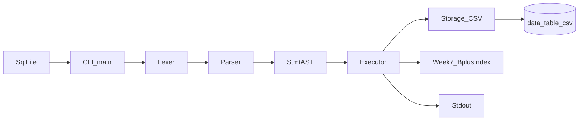
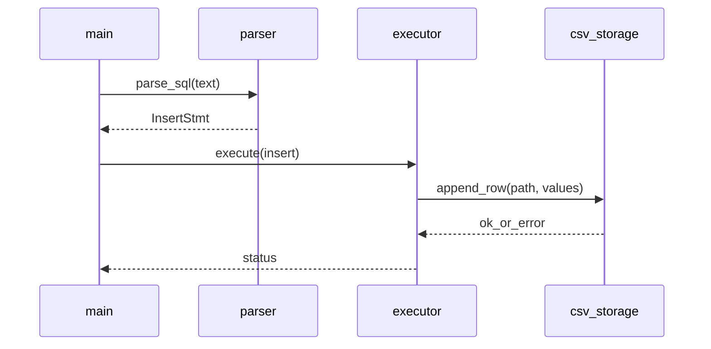
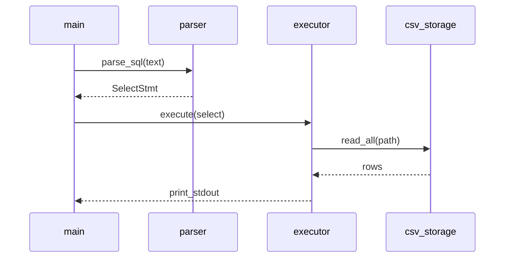

# 02. Architecture

MVP 범위는 `docs/01-product-planning.md`를 따른다.

## 1) 기술 스택 선택 이유


| 영역  | 선택 기술                     | 선택 이유                   | 대안                                   |
| --- | ------------------------- | ----------------------- | ------------------------------------ |
| 언어  | C (C11 권장)                | 과제 요구사항, 저수준 I/O·메모리 이해 | C++ (과제 범위 밖이면 비권장)                  |
| 빌드  | CMake                     | 크로스 플랫폼, CTest 통합       | Makefile만 (Windows 팀원 고려 시 CMake 우선) |
| 테스트 | CTest + 테스트 실행 파일 또는 스크립트 | 회귀·발표 시 검증 재현           | 수동 실행만 (비권장)                         |
| 저장소 | OS 파일시스템 + **CSV**        | 디버깅·발표·diff 용이          | 바이너리(구현 부담↑)                         |


## 2) 시스템 구성




설명:

- **CLI**: 인자로 받은 `.sql` 파일을 읽어 **문장 단위**로 파서에 넘긴다.
- **Lexer**: 문자 스트림을 토큰 스트림으로 변환한다.
- **Parser**: 토큰에서 **INSERT** / **SELECT** 구문 트리를 만든다.
- **Executor**: AST를 해석해 Storage를 호출하고, SELECT 결과를 stdout에 포맷한다.
- **Storage**: 논리 테이블명을 물리 경로로 매핑해 **fopen / append / read** 한다.
- **Week7_BplusIndex**: CSV 헤더 첫 컬럼이 `id`인 테이블에 한해, 프로세스 메모리 B+ 트리로 PK 룩업·자동 증가 `id`를 지원한다(상세는 `docs/weeks/WEEK7/sequences.md`).

## 3) 레이어 구조

권장 디렉터리(구현 시):

```text
include/
├─ lexer.h
├─ parser.h
├─ ast.h
├─ executor.h
└─ csv_storage.h
src/
├─ main.c
├─ lexer.c
├─ parser.c
├─ ast.c
├─ executor.c
└─ csv_storage.c
tests/
├─ test_lexer.c
├─ test_parser.c
├─ ...
└─ sql/               # 통합용 .sql 픽스처
data/
└─ *.csv              # 사전 준비 테이블 파일(헤더 포함)
```

책임:

- **main.c**: 인자 검증, 파일 읽기, 문장 루프, 종료 코드
- **lexer.c**: 토큰화만 (키워드 대소문자 정책은 `docs/03-api-reference.md`)
- **parser.c**: 구문 분석만
- **executor.c**: “무엇을 할지” — INSERT/SELECT 의미
- **csv_storage.c**: “파일에 어떻게 쓰고 읽을지” — 경로, 인코딩 가정, 이스케이프

## 4) 데이터 모델

### 논리: 테이블

- 테이블 이름은 SQL 식별자 규칙에 따른다(자세한 규칙은 `docs/03-api-reference.md`).
- 각 테이블은 **하나의 CSV 파일**에 대응한다.

### 물리: 파일 매핑

- **기본 규칙**: `data/<table_name>.csv`
- **작업 디렉터리**: CLI를 실행한 **현재 작업 디렉터리(CWD)** 를 기준으로 상대 경로를 해석한다(문서·README·테스트에서 동일하게 유지).

### CSV 형식(고정)

1. **첫 번째 줄**: 헤더 행 — 컬럼 이름, 콤마 구분. 테이블 스키마는 이 헤더에 의해 정의된다.
2. **둘째 줄 이후**: 데이터 행. **INSERT** 는 **항상 파일 끝에 한 줄**을 추가한다.
3. 필드 구분자: **콤마(`,`)**
4. 문자열 필드: **큰따옴표(`"`)** 로 감싼다. 내부 `"` 는 `""` 로 이스케이프(RFC 4180 스타일 권장).
5. 숫자: 따옴표 없이 저장 가능.
6. NULL 표현: 구현이 채택한 리터럴(예: 빈 필드 또는 `\N`)을 `docs/03-api-reference.md`와 **동일**하게 유지한다.

**INSERT** 시 컬럼 개수는 헤더 컬럼 수와 **일치**해야 한다. 불일치 시 에러.

## 5) 정합성·엣지 규칙

- **파일 없음 + INSERT**: `data/<table>.csv` 가 없으면 **에러**(테이블은 사전 존재 가정). (구현 편의상 자동 생성으로 바꿀 경우 문서·테스트 동시 수정.)
- **파일 없음 + SELECT**: 에러.
- **빈 데이터(헤더만)**: SELECT 는 헤더만 또는 0행 출력 — 동작을 `docs/03-api-reference.md`에 맞출 것.
- **동시 실행**: MVP 에서는 **단일 프로세스** 가정. 파일 잠금은 문서화만 하고 생략 가능.

## 6) 핵심 시퀀스

**6.1·6.2**는 6주차까지의 **MVP 실행 흐름**이다(기존과 동일).  
**WEEK7(B+ 인덱스 연계)** 용 시퀀스는 학습·설계 분리를 위해 `[docs/weeks/WEEK7/sequences.md](weeks/WEEK7/sequences.md)`에만 상세 다이어그램을 둔다. 코드에서는 `executor` 등에 문서 경로를 주석으로만 짚어도 된다.

### 6.1 MVP — INSERT 한 문장




### 6.2 MVP — SELECT 한 문장




### 6.3 WEEK7 연계 — 시퀀스 다이어그램 위치

B+ 트리·자동 `id`·`WHERE id = …` 가 붙은 뒤의 **INSERT / SELECT(인덱스 vs 풀스캔)** 시퀀스는 파일이 길어질 수 있으므로, **이 저장소에서는 주차 문서로만** 관리한다.

- **파일**: `[docs/weeks/WEEK7/sequences.md](weeks/WEEK7/sequences.md)`
- **갱신 시점**: 인덱스 삽입 시점, 룩업 실패 시 정책, `read_all` 대신 부분 읽기 API 등이 코드에 반영될 때마다 위 파일과 필요 시 `docs/03-api-reference.md`를 함께 맞춘다.

## 7) 운영·실행 메모

- **빌드 산출물**: CMake 기본 빌드 트리 `build/` (gitignore 권장).
- **Windows**: Visual Studio 생성기 사용 시 실행 파일이 `build/Debug/sql_processor.exe` 또는 `build/Release/sql_processor.exe` 일 수 있다. README에 **두 경우**를 명시한다.
- **환경 변수**: MVP 에서 필수 아님.
- **로깅**: stderr 에 human-readable 메시지로 충분.

