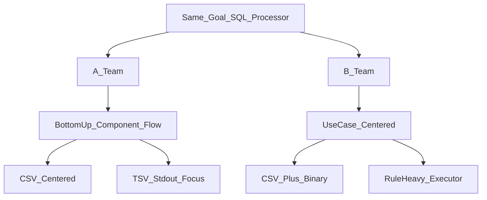
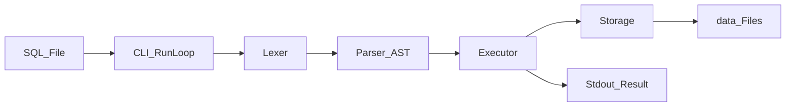
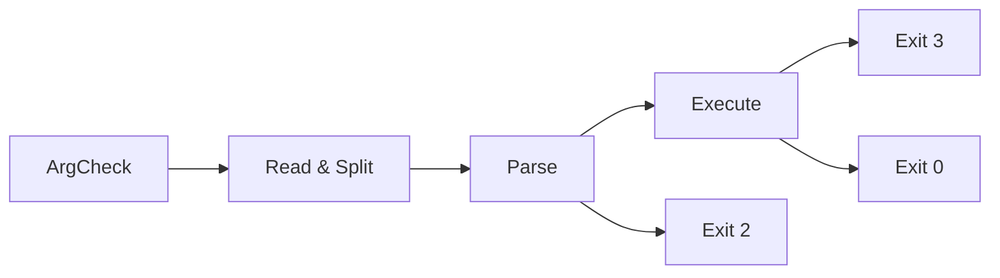
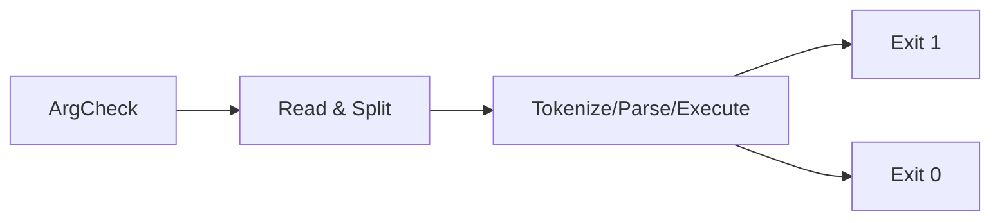
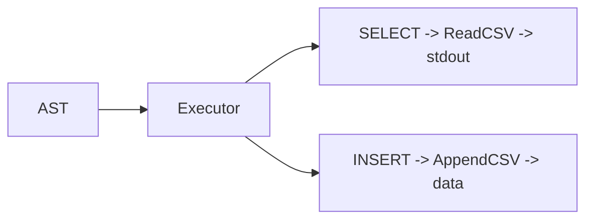
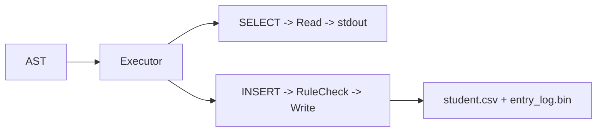
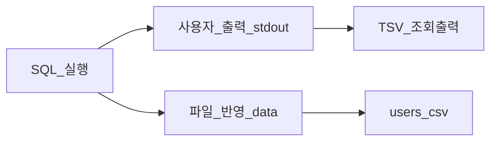
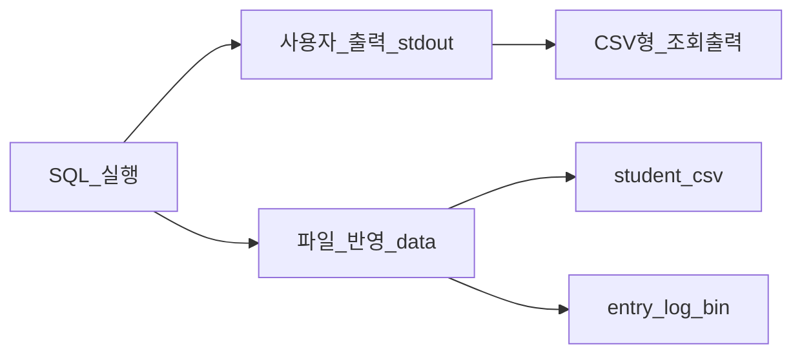

# 07. 발표용 시각화 다이어그램 모음

이 문서는 `docs/06-presentation-script-4min.md` 대본 순서에 맞춘 시각화 자료입니다.  
발표 중에는 섹션 제목과 다이어그램만 보여주고, 설명은 대본으로 진행하면 가장 깔끔합니다.

---

## 1) 협업 방식(A/B 조 비교)

핵심 메시지:

- A조: Bottom-up(구성 요소부터) · 파이프라인 가시성
- B조: Use-case 중심(테이블·시나리오 먼저, 그에 맞는 기능) · 도메인 규칙

---

## 2) 전체 아키텍처(큰 그림)

핵심 메시지:

- SQL 입력이 단계적으로 변환되어 실행된다.
- 사용자 출력(`stdout`)과 파일 반영(`data/*`)이 동시에 존재한다.

---

## 3) CLI 계층 동작 (A/B 비교)

### A조 (CLI)

### B조 (CLI)

핵심 메시지:

- A조는 CLI에서 오류를 `1/2/3`으로 세분화한다.
- B조는 성공/실패 중심으로 단순하게 관리한다.

---

## 4) Lexer 방식 비교 (A/B 모두)

### A조 (Lexer)

### B조 (Tokenizer)

핵심 메시지:

- A조: 스트리밍 방식(토큰 1개씩)
- B조: 버퍼링 방식(토큰 목록 전체)

---

## 5) Parser 방식 비교 (A/B 모두)

### A조 (Parser)

### B조 (Parser)

핵심 메시지:

- A조: 확장 여지를 둔 파서
- B조: 요구 범위를 좁힌 전용 파서

---

## 6) Executor + Storage 역할 (A/B 비교)

### A조 (Executor + Storage)

### B조 (Executor + Storage)

핵심 메시지:

- A조는 실행 경로를 단순하게 유지한다.
- B조는 실행 규칙 검증 로직을 executor에 더 많이 둔다.

---

## 7) 실행 결과(두 경로, A/B 비교)

### A조 (실행 결과)

### B조 (실행 결과)

핵심 메시지:

- 두 조 모두 화면 출력과 파일 반영이 분리된다.
- A조는 CSV 중심, B조는 CSV+Binary를 함께 다룬다.

