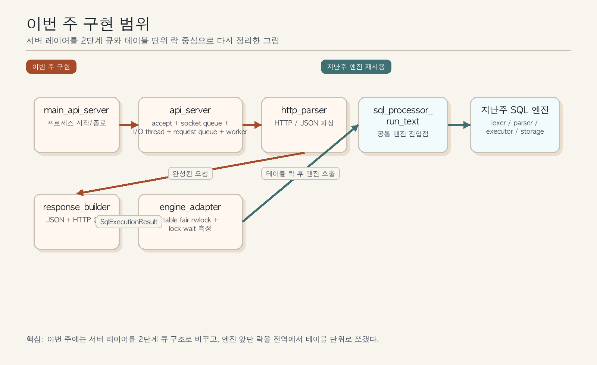
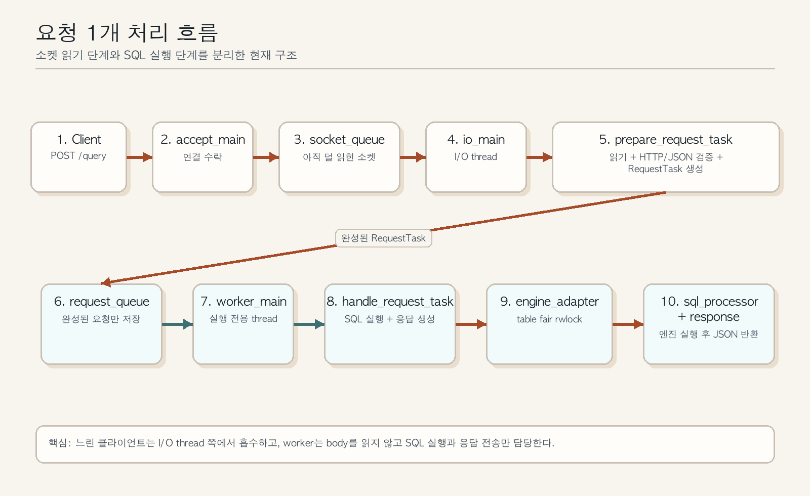
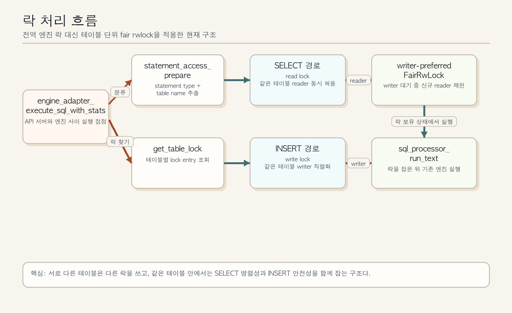

# WEEK8 API 서버 동시성 구조 설명서

이 문서는 지난주 SQL 엔진 전체 설명서가 아니라, 이번 주에 실제로 추가하고 수정한 `소켓 서버`, `스레드 풀`, `요청 큐`, `병렬 처리`, `락 정책`, `종료 처리`만 설명하는 발표용 자료다.

설명 기준은 현재 코드 기준이며, 중심 파일은 `src/api_server.c`, `src/engine_adapter.c`, `src/main_api_server.c`, `tests/test_api_server.c`다.

## 1. 이번 수정의 핵심

1. 예전처럼 worker가 소켓을 잡고 HTTP body를 직접 읽는 구조가 아니다.
2. 지금은 `accept thread -> socket queue -> I/O thread -> parsed request queue -> worker thread`로 역할을 나눴다.
3. 그래서 느린 클라이언트가 worker를 오래 붙잡는 문제가 줄어들었다.
4. 실행 큐에는 `소켓 fd`가 아니라 `완성된 요청 객체`가 들어간다.
5. 엔진 락도 전역 lock 하나가 아니라 `테이블 단위 fair rwlock`으로 바꿨다.
6. `SELECT`는 같은 테이블 안에서 여러 개가 함께 지나갈 수 있고, `INSERT`는 같은 테이블에서만 직렬화된다.
7. writer가 기다리는 동안 신규 reader를 막아서 writer starvation도 줄였다.
8. queue 대기 시간, read/parse 시간, lock 대기 시간, SQL 실행 시간도 찍을 수 있게 했다.

## 2. 전체 흐름 한 번에 보기

1. 외부 클라이언트가 `POST /query`로 요청을 보낸다.
2. `accept_main`이 연결만 받고 `AcceptedSocket`을 socket queue에 넣는다.
3. `io_main`이 socket queue에서 연결을 꺼낸다.
4. `prepare_request_task`가 요청 전체를 읽고, HTTP와 JSON을 검사하고, SQL 문자열까지 꺼낸다.
5. 검사가 끝난 요청은 `RequestTask` 형태로 parsed request queue에 들어간다.
6. `worker_main`은 이 완성된 요청만 가져가서 SQL 실행과 응답 작성만 담당한다.
7. `handle_request_task`가 `engine_adapter_execute_sql_with_stats`를 호출한다.
8. `engine_adapter`는 SQL에서 테이블명을 뽑고, 해당 테이블의 read/write lock을 건다.
9. 그 뒤에만 `sql_processor_run_text`를 호출해서 기존 엔진을 실행한다.
10. 결과가 돌아오면 `response_builder`가 JSON과 HTTP 응답을 만들고, worker가 이를 전송한다.

## 3. `src/api_server.c` 함수 흐름 설명

이 파일은 이번 주 수정의 중심이다. 소켓 수락, 두 단계 큐, I/O thread, worker thread, 종료 순서가 모두 여기 있다.

### 3.1 `struct ApiServer`

1. `listen_fd`는 서버 소켓이다.
2. `accept_thread`는 연결을 받는 전용 스레드다.
3. `io_threads`는 느린 클라이언트와 HTTP body 읽기를 담당한다.
4. `workers`는 SQL 실행과 응답 전송만 담당한다.
5. `socket_queue`는 아직 HTTP 요청을 다 읽지 않은 연결을 담는 큐다.
6. `request_queue`는 이미 검증이 끝난 `RequestTask`를 담는 실행 큐다.
7. `stopping`은 종료 절차가 시작됐는지 알려주는 플래그다.

### 3.2 `accept_main`

1. listen socket에서 `accept()`를 반복 호출한다.
2. 새 연결이 오면 `AcceptedSocket` 구조체를 만든다.
3. 연결을 바로 실행 worker에게 넘기지 않고 `socket_queue_push`로 socket queue에 넣는다.
4. socket queue가 꽉 차면 여기서 바로 `503`을 보내고 연결을 닫는다.
5. 즉, `accept_main`의 역할은 "연결 받기와 1차 분배"다.

### 3.3 `socket_queue_push`, `socket_queue_pop`

1. 이 둘은 아직 덜 읽힌 소켓을 관리하는 큐 함수다.
2. `socket_queue_push`는 accept thread가 새 연결을 넣을 때 호출한다.
3. `socket_queue_pop`은 I/O thread가 읽을 연결을 꺼낼 때 호출한다.
4. 이 큐 덕분에 worker가 느린 소켓 I/O에 직접 묶이지 않는다.

### 3.4 `prepare_request_task`

1. `AcceptedSocket`을 받아서 실제 실행 가능한 `RequestTask`로 바꾸는 함수다.
2. 먼저 소켓 read timeout을 건다.
3. `http_parser_read_request`로 raw HTTP 요청 전체를 읽는다.
4. `http_parser_parse_request`로 method, path, JSON body, SQL 문자열을 해석한다.
5. `validate_request`로 `/query`, `POST`, `sql` 존재 여부를 확인한다.
6. 중간에 하나라도 실패하면 여기서 바로 `400`, `404`, `405`, `500` 응답을 보내고 종료한다.
7. 성공하면 worker가 바로 실행할 수 있는 `RequestTask`를 만들어 반환한다.
8. 즉, 이 함수가 "소켓을 실행 가능한 요청으로 승격"시키는 단계다.

### 3.5 `io_main`

1. I/O thread가 실행하는 루프 함수다.
2. `socket_queue_pop`으로 연결 하나를 꺼낸다.
3. `prepare_request_task`로 요청을 완성한다.
4. 완성된 요청이면 `request_queue_push`로 parsed request queue에 넣는다.
5. parsed request queue가 꽉 차면 여기서 `503`을 보내고 연결을 닫는다.
6. 즉, `io_main`은 "네트워크 I/O와 요청 검증 전담자"다.

### 3.6 `request_queue_push`, `request_queue_pop`

1. 이 둘은 실행 대기 중인 `RequestTask`를 관리하는 큐 함수다.
2. 실행 큐에는 더 이상 `client fd`만 들어가지 않는다.
3. 이미 읽기와 검증이 끝난 요청 객체만 들어간다.
4. 그래서 worker는 body를 읽느라 대기하지 않고, SQL 실행에만 집중할 수 있다.

### 3.7 `worker_main`

1. worker thread가 도는 메인 루프다.
2. `request_queue_pop`으로 완성된 요청을 하나 가져온다.
3. `handle_request_task`를 호출해 SQL 실행과 응답 전송을 처리한다.
4. 응답이 끝나면 소켓을 닫고 다음 요청을 기다린다.
5. 즉, `worker_main`은 "실행 전용 스레드"가 되도록 역할을 좁힌 함수다.

### 3.8 `handle_request_task`

1. worker가 실제로 요청 하나를 끝내는 함수다.
2. `engine_adapter_execute_sql_with_stats`를 호출해 SQL을 실행한다.
3. 실행 결과는 `SqlExecutionResult`로 받는다.
4. `response_builder_build_result_json`으로 JSON body를 만든다.
5. `response_builder_build_http_response`로 최종 HTTP 응답 문자열을 만든다.
6. `send_all`로 응답을 전송한다.
7. 마지막에 metrics가 켜져 있으면 queue 대기, parse, lock wait, SQL 실행 시간도 함께 기록한다.

### 3.9 `api_server_start`

1. 서버 객체와 두 개의 큐를 만든다.
2. listen socket을 `socket`, `bind`, `listen` 순서로 연다.
3. `io_threads`를 먼저 만들고, `workers`를 만들고, 마지막에 `accept_thread`를 만든다.
4. 즉, 서버 시작 순서는 "실행 준비 완료 후 연결 수락 시작"이다.

### 3.10 `api_server_stop`

1. `stopping = 1`로 바꿔서 더 이상 정상 처리 경로가 진행되지 않게 한다.
2. socket queue와 request queue의 wait 상태를 모두 깨운다.
3. listen socket을 `shutdown`하고 닫아서 새 연결을 중단한다.
4. `accept_thread`, `io_threads`, `workers`를 순서대로 join한다.
5. 즉, 종료 순서는 "새 연결 중단 -> 잠든 스레드 깨우기 -> thread join"이다.

### 3.11 `api_server_destroy`

1. `api_server_stop` 이후 남은 큐 엔트리와 소켓을 전부 정리한다.
2. socket queue에 남아 있던 연결도 닫는다.
3. request queue에 남아 있던 요청 객체도 해제한다.
4. mutex, condition variable, thread 배열, queue 배열도 모두 해제한다.
5. 즉, `destroy`는 메모리와 소켓까지 포함한 최종 정리 단계다.

## 4. `src/engine_adapter.c` 함수 흐름 설명

이 파일은 API 서버와 기존 SQL 엔진 사이에서 동시성 제어를 담당한다.

### 4.1 `FairRwLock`

1. `readers`, `waiting_writers`, `writer_active`를 직접 관리하는 custom rwlock 구조다.
2. 핵심 목적은 "writer가 기다리면 신규 reader를 잠시 막는 정책"을 구현하는 것이다.
3. 즉, 기본 `pthread_rwlock_t`에 맡기지 않고 프로젝트 요구에 맞는 공정 정책을 직접 썼다.

### 4.2 `fair_rwlock_rdlock`

1. read lock을 잡는 함수다.
2. writer가 이미 실행 중이거나, writer가 대기 중이면 reader도 기다린다.
3. 그래서 `SELECT`가 계속 들어와도 기다리던 `INSERT`가 계속 밀리는 현상을 줄일 수 있다.

### 4.3 `fair_rwlock_wrlock`

1. write lock을 잡는 함수다.
2. 먼저 `waiting_writers`를 증가시켜 "지금 writer가 기다리고 있다"는 사실을 공유한다.
3. active writer나 reader가 남아 있으면 기다린다.
4. 들어가면 `writer_active = 1`로 바꿔 배타 구간을 시작한다.

### 4.4 `get_table_lock`

1. SQL에서 뽑아낸 테이블명으로 lock entry를 찾는다.
2. 처음 보는 테이블이면 새 lock entry를 생성한다.
3. 테이블명이 없으면 fallback lock을 사용한다.
4. 이 함수 덕분에 `users`와 `orders`가 서로 다른 락을 쓰게 된다.

### 4.5 `statement_access_prepare`

1. SQL 문자열을 보고 `SELECT`인지 `INSERT`인지, 어떤 테이블인지 판단한다.
2. `parser_parse_insert`, `parser_parse_select`를 활용해 가능한 한 정확하게 테이블명을 뽑는다.
3. 파싱이 애매하면 최소한 첫 토큰으로 statement type이라도 분류한다.
4. 결과적으로 `statement_type`, `access_mode`, `table_name`을 만든다.

### 4.6 `engine_adapter_execute_sql_with_stats`

1. 이번 수정에서 가장 중요한 실행 함수다.
2. 먼저 `statement_access_prepare`로 SQL의 접근 성격을 파악한다.
3. 그 다음 `get_table_lock`으로 해당 테이블의 락을 찾는다.
4. `SELECT`면 read lock, `INSERT`면 write lock을 잡는다.
5. 락을 잡은 뒤에만 `sql_processor_run_text`를 호출한다.
6. 실행이 끝나면 즉시 락을 해제한다.
7. 동시에 `lock_wait_ns`, `execute_ns`도 기록해서 병목 측정에 쓸 수 있게 했다.

### 4.7 이번 락 구조의 의미

1. 예전 전역 write lock 방식이면 쓰기 작업은 테이블이 달라도 모두 한 줄로 섰다.
2. 지금은 테이블별 락이라서 서로 다른 테이블의 작업은 덜 막힌다.
3. read/write 분리도 테이블별로 적용되므로 같은 테이블 안에서도 `SELECT` 병렬성이 살아난다.
4. writer 대기 중 신규 reader를 막아 writer starvation 가능성도 줄였다.

## 5. 이번 수정이 해결하려는 문제와 실제 반영점

### 5.1 느린 클라이언트가 worker를 붙잡는 문제

1. 원래는 worker가 소켓에서 body를 직접 읽으면, 느린 연결 하나가 worker 하나를 계속 붙잡는다.
2. 지금은 `io_main`과 `prepare_request_task`가 body 읽기를 맡는다.
3. worker는 이미 완성된 요청만 받으므로 SQL 처리량이 더 안정적이다.

### 5.2 큐가 너무 빨리 차는 문제

1. 원래는 아직 body도 안 온 소켓이 실행 큐 슬롯을 차지할 수 있었다.
2. 지금은 실행 큐가 `RequestTask`를 담으므로, 정말 실행 가능한 요청만 큐에 들어간다.
3. socket queue와 request queue를 분리해 어디서 막히는지도 더 분명해졌다.

### 5.3 쓰기 작업이 전역 lock 앞에서 직렬화되는 문제

1. 원래는 전역 엔진 락이면 서로 다른 테이블도 같이 막혔다.
2. 지금은 `get_table_lock`을 통해 테이블 단위 락을 쓴다.
3. 따라서 `users`와 `orders`가 동시에 오더라도 같은 락 하나를 두고 경쟁하지 않는다.

### 5.4 writer starvation 가능성

1. `SELECT`가 계속 들어오면 `INSERT`가 매우 오래 기다릴 수 있다.
2. 지금은 writer가 기다리기 시작하면 신규 reader를 잠시 막는다.
3. 그래서 읽기 위주 부하에서도 쓰기 요청이 계속 밀리는 상황을 줄였다.

### 5.5 측정 지표 부족 문제

1. 병목을 모르고 worker 수만 늘리면 성능이 오히려 나빠질 수 있다.
2. 지금은 `SQL_API_SERVER_METRICS=1`로 metrics를 켜면 대기 시간과 실행 시간을 나눠서 볼 수 있다.
3. 그래서 이후에는 "worker 수를 얼마나 둘지"를 감으로 정하지 않고 측정값을 보고 조정할 수 있다.

## 6. 테스트로 확인한 내용

### 6.1 `test_slow_client_does_not_block_execution`

1. 일부만 보낸 느린 클라이언트를 하나 열어 둔다.
2. 그 상태에서 다른 정상 요청을 보낸다.
3. 정상 요청이 `200 OK`로 끝나면, 느린 클라이언트가 worker를 막지 않았다는 뜻이다.

### 6.2 `test_queue_full`

1. worker 1개, queue 1개 조건으로 서버를 띄운다.
2. 첫 요청은 실행 중으로 두고, 둘째 요청은 parsed request queue에 대기시킨다.
3. 셋째 요청은 초과분이므로 `503`을 받아야 한다.
4. 즉, "실행 중 1개 + 대기 1개 + 초과 1개" 상황을 분리해서 검증한다.

### 6.3 mixed read/write 테스트의 의미

1. `SELECT`와 `INSERT`가 섞여 들어올 때 서버가 깨지지 않는지 본다.
2. read/write lock과 기존 SQL 엔진 연결이 함께 동작하는지 확인한다.
3. API 서버 수정이 엔진 결과 형식을 망가뜨리지 않았는지도 함께 본다.

## 7. 발표할 때 이렇게 설명하면 된다

1. 이번 주 구현의 핵심은 worker가 네트워크 I/O까지 다 하던 구조를 분리해, `소켓 읽기 단계`와 `SQL 실행 단계`를 나눈 것이다.
2. 그래서 느린 클라이언트가 worker를 붙잡는 문제를 줄였고, 실행 큐에는 완성된 요청만 들어가게 만들었다.
3. 동시에 엔진 락도 전역 lock에서 테이블 단위 fair rwlock으로 바꿔, 다른 테이블끼리는 덜 막히고 writer starvation도 줄였다.
4. 결국 이번 수정은 "외부 API 서버의 병렬성"과 "내부 DB 엔진의 동시성 제어"를 실제 구조 수준에서 개선한 작업이라고 보면 된다.

## 8. 한 문장 결론

1. 이 프로젝트의 이번 주 수정은 `소켓 수락`, `요청 읽기`, `SQL 실행`을 분리한 2단계 큐 기반 스레드 풀과, `테이블 단위 fair rwlock`을 도입해, 느린 클라이언트와 전역 락 때문에 생기던 병목을 줄이도록 서버 구조를 고친 작업이라고 설명하면 된다.
