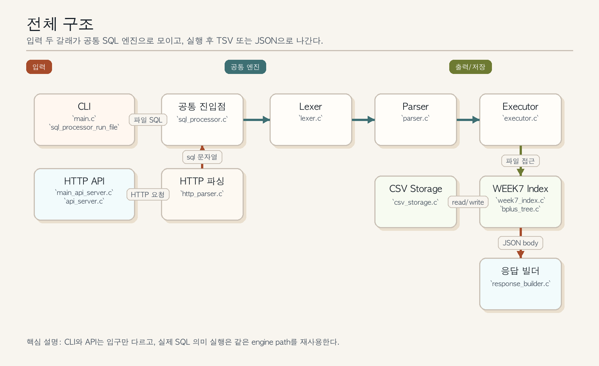
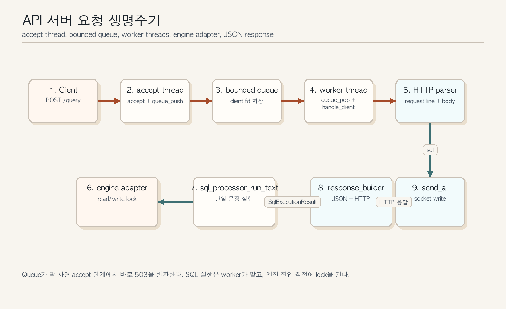
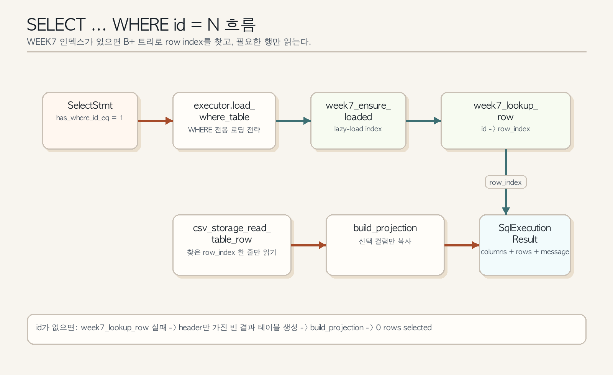
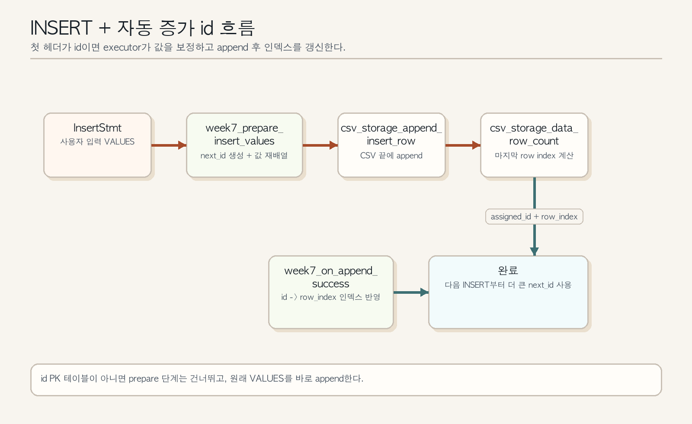

# 미니 DBMS + HTTP API 서버 의사코드 가이드

이 문서는 현재 구현된 C 기반 미니 DBMS + HTTP API 서버 코드를 빠르게 읽기 위한 설명용 문서다.

- 목적 1: 각 함수가 무엇을 하는지 빠르게 이해한다.
- 목적 2: 요청이 서버를 통과해 SQL 엔진까지 가는 전체 흐름을 한 번에 잡는다.
- 목적 3: 발표, 리뷰, 디버깅 때 코드 구조를 설명 가능한 수준으로 정리한다.
- 범위: `src/`, `include/`, WEEK7 인덱스 코드, CLI/API/trace 실행 경로.
- 제외: 테스트 코드 세부 구현, 프론트엔드 데모 페이지 세부 구현.

이 문서는 구현 스펙을 새로 정의하지 않는다. 동작 계약은 기존 문서인 `docs/01-product-planning.md`, `docs/02-architecture.md`, `docs/03-api-reference.md`, `docs/04-development-guide.md`, `docs/api-server-layer-spec.md`를 따른다.

## 읽는 순서

- 1단계: 아래 전체 구조 그림으로 큰 흐름을 본다.
- 2단계: `CLI` 경로와 `HTTP API` 경로 중 내가 설명할 경로를 먼저 읽는다.
- 3단계: `sql_processor.c`의 문장 분리와 dispatch를 본다.
- 4단계: `lexer -> parser -> executor -> csv_storage` 흐름을 따라간다.
- 5단계: `WHERE id = ...` 또는 자동 증가 `id`가 중요하면 WEEK7 인덱스 섹션을 추가로 본다.

## 1. 전체 구조 한눈에 보기



그림 설명:

- 입력은 두 갈래다. `sql_processor`는 파일 기반 CLI 입력을 받고, `sql_api_server`는 HTTP JSON body 안의 SQL 문자열을 받는다.
- 두 갈래 모두 결국 공통 엔진인 `sql_processor_run_text` 또는 `sql_processor_run_file` 계열로 모인다.
- 엔진 내부에서는 `lexer`가 토큰을 만들고, `parser`가 AST를 만들고, `executor`가 의미를 실행한다.
- 실제 데이터 접근은 `csv_storage`가 담당한다.
- WEEK7 기능이 켜지는 지점은 `executor` 안쪽이다. `WHERE id = ...`는 `week7_index`와 `bplus_tree`를 거쳐 빠른 단건 조회를 시도한다.
- API 경로는 엔진 앞단에 `http_parser`, `engine_adapter`, `response_builder`, `api_server` 스레드/큐 레이어가 추가된다.

## 2. 진입점별 실행 흐름

## 2.1 CLI 실행 파일 `sql_processor`

관련 파일:

- `src/main.c`
- `src/sql_processor.c`

핵심 의사코드:

```text
main(argc, argv):
    if argc != 2:
        print usage to stderr
        return 1

    return sql_processor_run_file(argv[1], stdout, stderr)

sql_processor_run_file(path, out, err):
    open sql file
    read whole file into memory
    return run_sql_script(buffer, len, out, err)

run_sql_script(sql_text):
    scan characters
    split statements by semicolon
    ignore semicolons inside string literals
    for each statement:
        rc = execute_one_statement(statement)
        if rc != 0:
            stop immediately and return rc
    return 0

execute_one_statement(statement):
    trim whitespace
    try INSERT parser first
    if INSERT parse succeeds:
        executor_execute_insert(ast)
        return success or exec error

    reset lexer and try SELECT parser
    if SELECT parse succeeds:
        executor_execute_select_result(ast, result)
        render result as TSV to stdout
        return success or exec error

    if neither parser accepts:
        return parse error
```

설명 포인트:

- CLI는 "파일 전체를 읽은 뒤 문장 단위로 순차 실행"한다.
- `sql_processor_run_file`은 파일 I/O 진입점이다.
- `run_sql_script`는 세미콜론 기준으로 문장을 나누되, 문자열 리터럴 내부의 세미콜론은 무시한다.
- `execute_one_statement`가 실질적인 분기점이다. 여기서 `INSERT`인지 `SELECT`인지 판별된다.
- CLI에서는 SELECT 결과가 `executor_render_select_tsv`를 통해 바로 `stdout`으로 출력된다.

## 2.2 HTTP API 실행 파일 `sql_api_server`

관련 파일:

- `src/main_api_server.c`
- `src/api_server.c`
- `src/http_parser.c`
- `src/engine_adapter.c`
- `src/response_builder.c`



핵심 의사코드:

```text
main_api_server(argc, argv):
    parse optional port and worker count
    install SIGINT and SIGTERM handlers
    api_server_start(config)
    while stop signal not received:
        sleep(1)
    api_server_destroy(server)

api_server_start(config):
    create listening socket
    create bounded queue
    create worker threads
    create accept thread

accept thread:
    accept client socket
    if queue has space:
        enqueue socket
    else:
        return 503 immediately

worker thread:
    dequeue socket
    handle_client(socket)
    close socket

handle_client(socket):
    raw = http_parser_read_request(socket)
    request = http_parser_parse_request(raw)
    validate path == /query
    validate method == POST
    validate request.sql exists

    engine_adapter_execute_sql(request.sql, result)
    json = response_builder_build_result_json(result)
    http = response_builder_build_http_response(200, json)
    send response
```

설명 포인트:

- API 서버는 `accept thread -> bounded queue -> worker threads` 구조다.
- HTTP 요청 처리와 SQL 엔진 실행을 분리해서, accept 루프가 느린 쿼리 때문에 막히지 않게 했다.
- `engine_adapter_execute_sql`는 엔진에 들어가기 직전의 동시성 제어 지점이다.
- 성공이든 실패든 최종 응답은 JSON이며, HTTP 오류와 엔진 오류를 구분해서 만든다.

## 2.3 Trace 실행 파일 `sql_processor_trace`

관련 파일:

- `src/main_trace.c`
- `src/sql_trace.c`

핵심 의사코드:

```text
main_trace(argc, argv):
    open trace jsonl file
    sql_processor_run_file_trace(sql_path, stdout, stderr, trace_file)

sql_processor_run_file_trace(path, out, err, trace):
    read sql file
    split into statements
    for each statement:
        record statement_start
        record lexer token list
        record parser_result
        record executor_call
        record statement_end
    record process_end
```

설명 포인트:

- 발표나 디버깅 때 가장 설명하기 좋은 보조 실행기다.
- 실제 엔진을 그대로 태우면서 각 단계 이벤트를 JSONL로 남긴다.
- "코드가 어떻게 흘렀는지"를 시각적으로 확인하고 싶을 때 유용하다.

## 3. 공통 SQL 엔진 흐름

## 3.1 단일 문장 처리의 중심: `sql_processor.c`

이 파일은 CLI와 API가 공유하는 엔진 입구다.

핵심 의사코드:

```text
sql_processor_run_text(sql, out, err):
    clear out result
    count non-empty statements
    if statement count != 1:
        return parse error result

    execute_one_statement(first_statement, out, NULL, err, 1)

execute_one_statement(stmt, result, out_stream, err_stream, stmt_no):
    trim statement
    if empty:
        return 0

    try parser_parse_insert
    if success:
        rc = executor_execute_insert(insert_ast)
        if rc != 0:
            return standardized exec error
        return standardized insert success result

    try parser_parse_select
    if success:
        rc = executor_execute_select_result(select_ast, temp_result)
        if rc != 0:
            return standardized exec error
        if out_stream exists:
            render TSV
        move temp_result to caller
        return 0

    return standardized parse error
```

왜 중요한가:

- `sql_processor_run_file`는 CLI용 다중 문장 실행기다.
- `sql_processor_run_text`는 API용 단일 문장 실행기다.
- 둘 모두 실제 문장 실행은 `execute_one_statement`에 모인다.
- 즉, 발표할 때 "공통 엔진은 어디냐"는 질문에 `sql_processor.c`를 중심으로 설명하면 된다.

## 3.2 Lexer: 문자열을 토큰으로 바꾸는 단계

관련 파일:

- `include/lexer.h`
- `src/lexer.c`

핵심 의사코드:

```text
lexer_next(lex, tok):
    skip whitespace and -- comments
    if end of input:
        emit EOF

    if identifier start:
        consume identifier
        if keyword matches:
            emit keyword token
        else:
            emit identifier token

    else if signed integer:
        consume integer and emit TOKEN_INTEGER

    else if quote:
        decode SQL string literal
        emit TOKEN_STRING

    else if punctuation like (, ), ,, ;, *, =:
        emit single-char token

    else:
        emit TOKEN_ERROR
```

설명 포인트:

- lexer는 SQL을 이해하지 않는다. 오직 글자를 토큰 단위로 자른다.
- `--` 줄 주석과 공백을 건너뛴다.
- 문자열은 작은따옴표 기준이며 `''`를 내부 작은따옴표 하나로 복원한다.
- 키워드는 대소문자를 무시하고 검사한다.

## 3.3 Parser: 토큰을 AST로 바꾸는 단계

관련 파일:

- `include/parser.h`
- `include/ast.h`
- `src/parser.c`
- `src/ast.c`

핵심 의사코드:

```text
parser_parse_insert(lex):
    expect INSERT
    expect INTO
    read table identifier
    expect VALUES
    expect (
    parse value list until )
    expect ; or EOF
    build InsertStmt

parser_parse_select(lex):
    expect SELECT
    parse * or explicit column list
    expect FROM
    read table identifier
    optionally parse WHERE id = integer
    expect ; or EOF
    build SelectStmt
```

설명 포인트:

- parser는 문법 검증과 AST 생성만 담당한다.
- 실제 CSV 접근이나 파일 쓰기는 하지 않는다.
- `WHERE`는 일반식을 파싱하지 않고, WEEK7 범위에서 `WHERE id = <integer>`만 허용한다.
- `ast.c`는 파싱 결과를 해제하는 메모리 정리 전용 모듈이다.

## 3.4 Executor: AST의 의미를 실제로 수행하는 단계

관련 파일:

- `include/executor.h`
- `src/executor.c`



### INSERT 실행 의사코드

```text
executor_execute_insert(stmt):
    if table invalid:
        fail

    pr = week7_prepare_insert_values(stmt, prepared_values, assigned_id)
    if table has id primary key:
        use prepared_values with generated id
    else:
        use original stmt values

    csv_storage_append_insert_row(table, values)
    total_rows = csv_storage_data_row_count(table)
    row_index = total_rows - 1

    if generated id was used:
        week7_on_append_success(table, assigned_id, row_index)

    return success
```

### SELECT 실행 의사코드

```text
executor_execute_select_result(stmt, out):
    if WHERE id = ... exists:
        table = load_where_table(stmt)
    else:
        table = csv_storage_read_table(stmt->table)

    build_projection(table, stmt, out)
    free loaded csv table

load_where_table(stmt):
    week7_ensure_loaded(table)
    check table really has id primary key
    if id exists in B+ tree:
        read only that single row from csv
    else:
        return header-only table with zero rows

build_projection(table, stmt, out):
    decide which columns to expose
    map selected columns to header indices
    copy selected headers
    copy selected row values
    set message like "N rows selected"
```

설명 포인트:

- executor는 "무슨 의미를 실행할지"를 결정한다.
- INSERT는 WEEK7 자동 증가 `id` 지원 여부에 따라 값을 보정한 뒤 CSV에 append한다.
- SELECT는 전체 테이블을 읽거나, `WHERE id = ...`라면 단일 행만 읽어도 되는지 판단한다.
- 결과는 `SqlExecutionResult` 구조체에 채워지고, CLI에서는 TSV로, API에서는 JSON으로 다시 렌더링된다.

## 3.5 CSV Storage: 실제 파일을 읽고 쓰는 단계

관련 파일:

- `include/csv_storage.h`
- `src/csv_storage.c`

핵심 의사코드:

```text
csv_storage_read_table(table):
    path = data/<table>.csv
    open file
    read header line
    parse header cells
    for each non-blank data line:
        parse csv cells
        validate column count
        append row to in-memory table
    return CsvTable

csv_storage_read_table_row(table, row_index):
    open file
    read header
    scan data rows until desired row_index
    if found:
        return one-row CsvTable
    else:
        return header-only CsvTable

csv_storage_append_insert_row(table, values):
    open file and read header count
    validate header_count == value_count
    detect whether trailing newline is missing
    reopen in append mode
    serialize each SQL value into CSV form
    write newline if needed
    append row
```

설명 포인트:

- 저장 포맷의 기준은 항상 `data/<table>.csv`다.
- CSV는 메모리로 올릴 때 헤더와 데이터 행을 분리해서 저장한다.
- 문자열 저장은 큰따옴표로 감싸고 내부 큰따옴표는 `""`로 이스케이프한다.
- `NULL`은 빈 필드로 저장된다.

## 3.6 WEEK7 인덱스: 자동 증가 `id`와 빠른 단건 조회

관련 파일:

- `include/week7/week7_index.h`
- `src/week7/week7_index.c`
- `include/week7/bplus_tree.h`
- `src/week7/bplus_tree.c`



### `week7_index.c` 핵심 의사코드

```text
week7_ensure_loaded(table):
    lock index map
    if already loaded:
        return success

    read full CSV table
    if first header is not id:
        mark loaded but non-id-pk table
        return success

    create B+ tree
    for each row:
        parse first column as strict integer id
        insert id -> row_index into B+ tree
        update max id

    next_id = max_id + 1
    mark loaded

week7_prepare_insert_values(stmt):
    ensure table metadata is loaded
    if table has no id primary key:
        return "not applicable"

    allocate new value array of full column count
    generate next_id
    put generated id into first column
    copy caller values into remaining columns
    return prepared values

week7_on_append_success(table, assigned_id, row_index):
    insert assigned_id -> row_index into B+ tree
    bump next_id if needed

week7_lookup_row(table, id):
    ensure table is loaded
    search B+ tree
    return row_index if found
```

### `bplus_tree.c` 핵심 의사코드

```text
bplus_search(tree, key):
    descend from root to leaf
    linearly scan leaf keys
    return payload(row_index) if found

bplus_insert(tree, key, payload):
    if key already exists:
        reject duplicate
    find target leaf
    if leaf has room:
        insert in sorted order
    else:
        split leaf
        propagate separator key to parent
        split internal nodes recursively if needed
```

설명 포인트:

- `week7_index.c`는 "테이블별 인덱스 캐시 관리자"다.
- `bplus_tree.c`는 실제 자료구조 구현체다.
- executor는 직접 B+ 트리를 만지지 않고 `week7_index` API를 통해서만 접근한다.

## 4. HTTP 레이어 세부 흐름

## 4.1 `http_parser.c`

핵심 의사코드:

```text
http_parser_read_request(fd):
    repeatedly recv into growing buffer
    detect end of headers by CRLFCRLF
    parse Content-Length when available
    stop when full body is received
    reject oversized or malformed request

http_parser_parse_request(raw):
    parse request line into method and path
    validate HTTP version starts with HTTP/1.
    parse Content-Length header
    copy request body
    from JSON body, extract "sql" string field only
```

설명 포인트:

- 매우 작은 수제 HTTP 파서다.
- chunked transfer나 keep-alive는 지원하지 않는다.
- JSON도 일반 파서를 쓰지 않고, `"sql"` 문자열 필드만 추출하는 최소 구현이다.

## 4.2 `engine_adapter.c`

핵심 의사코드:

```text
engine_adapter_execute_sql(sql, out):
    detect first token
    if SELECT:
        acquire global read lock
    else:
        acquire global write lock

    sql_processor_run_text(sql, out, NULL)
    release lock
```

설명 포인트:

- API 서버가 직접 parser/executor를 부르지 않고, 꼭 이 어댑터를 통해 들어간다.
- `SELECT`는 동시에 여러 개 실행될 수 있고, `INSERT`는 직렬화된다.

## 4.3 `response_builder.c`

핵심 의사코드:

```text
response_builder_build_result_json(result):
    start JSON object
    write status, statementType, message
    if INSERT success:
        write affectedRows
    if SELECT success:
        write columns and rows arrays
    if engine error:
        write exitCode

response_builder_build_http_response(status_code, json_body):
    build HTTP status line
    add Content-Type, Content-Length, Connection headers
    append JSON body
```

설명 포인트:

- SQL 엔진 결과를 네트워크 응답으로 바꾸는 마지막 단계다.
- CLI는 TSV를, API는 JSON을 쓰므로 이 파일이 API 전용 view 계층 역할을 한다.

## 5. 함수 역할 사전

이 섹션은 발표와 코드 리뷰 때 "이 함수는 뭐 하는 함수냐"를 빠르게 찾기 위한 요약이다.

## 5.1 `src/main.c`

- `usage`: 잘못된 CLI 인자일 때 사용법 한 줄을 출력한다.
- `main`: 인자 개수를 검사하고 `sql_processor_run_file`로 넘기는 CLI 진입점이다.

## 5.2 `src/main_api_server.c`

- `on_signal`: 종료 시그널을 받으면 메인 루프를 멈추게 하는 플래그를 세운다.
- `parse_number`: 포트와 worker 개수 문자열을 정수로 바꾼다.
- `usage`: `sql_api_server [port] [workers]` 사용법을 출력한다.
- `main`: 서버 설정을 읽고 `api_server_start`로 서버를 띄우고, 종료 시그널이 오면 destroy한다.

## 5.3 `src/main_trace.c`

- `usage`: trace 실행 파일 사용법을 출력한다.
- `main`: trace 출력 파일을 연 뒤 `sql_processor_run_file_trace`를 실행한다.

## 5.4 `src/sql_processor.c`

- `dup_cstr`: C 문자열을 heap에 복사한다.
- `trim_start`: 문장 앞쪽 공백을 건너뛴다.
- `trim_end`: 문장 뒤쪽 공백을 잘라낸다.
- `skip_utf8_bom`: UTF-8 BOM이 있으면 시작 오프셋을 3으로 맞춘다.
- `set_result_message`: `SqlExecutionResult.message`에 새 문자열을 저장한다.
- `write_error_line`: stderr에 한 줄 오류 메시지를 쓴다.
- `move_or_clear_result`: 임시 결과를 호출자에게 넘기거나, 호출자가 없으면 정리한다.
- `finalize_error`: 표준화된 에러 결과 구조체를 만들고 필요하면 stderr에도 출력한다.
- `finalize_insert_success`: INSERT 성공 시 공통 결과 구조체를 만든다.
- `execute_one_statement`: INSERT 또는 SELECT 파서를 시도하고 executor를 호출하는 핵심 dispatcher다.
- `count_nonempty_statements`: API 입력이 정확히 한 문장인지 세기 위해 공백 문장을 제외하고 개수를 센다.
- `run_sql_script`: SQL 파일 전체를 문장 단위로 순서대로 실행한다.
- `sql_processor_run_file`: 파일을 메모리로 읽고 스크립트 실행을 시작한다.
- `sql_processor_run_text`: API용 단일 문장 실행 진입점이다.
- `sql_processor_free_result`: `SqlExecutionResult`를 정리하는 얇은 wrapper다.

## 5.5 `src/lexer.c`

- `is_ident_start`: 식별자 첫 글자 규칙을 검사한다.
- `is_ident_char`: 식별자 후속 글자 규칙을 검사한다.
- `to_lower_c`: ASCII 대문자를 소문자로 바꾼다.
- `keyword_kind`: 식별자 모양 문자열이 SQL 키워드인지 판별한다.
- `skip_ws_and_comments`: 공백과 `--` 주석을 건너뛴다.
- `lexer_init`: lexer 상태를 초기화한다.
- `decode_string`: 작은따옴표 문자열을 읽고 `''` 이스케이프를 복원한다.
- `lexer_next`: 다음 토큰 하나를 만들어 호출자에게 준다.

## 5.6 `src/parser.c`

- `ident_is_id`: 식별자 토큰이 `id`인지 대소문자 무시로 검사한다.
- `dup_slice`: 길이가 주어진 문자열 조각을 새 메모리로 복사한다.
- `lexer_expect`: 다음 토큰이 기대한 종류인지 검사한다.
- `value_from_token`: 토큰을 `SqlValue` 구조체로 바꾼다.
- `free_values_partial`: INSERT 파싱 도중 실패했을 때 부분 생성된 값 배열을 정리한다.
- `free_columns_partial`: SELECT 파싱 도중 실패했을 때 부분 생성된 컬럼 배열을 정리한다.
- `parser_parse_insert`: `INSERT INTO ... VALUES (...)` 문을 `InsertStmt`로 바꾼다.
- `parser_parse_select`: `SELECT ... FROM ... [WHERE id = ...]` 문을 `SelectStmt`로 바꾼다.

## 5.7 `src/ast.c`

- `ast_insert_stmt_free`: `InsertStmt`와 그 내부 메모리를 해제한다.
- `ast_select_stmt_free`: `SelectStmt`와 그 내부 메모리를 해제한다.

## 5.8 `src/executor.c`

- `dup_cstr`: 결과 구조체에 넣을 문자열을 복사한다.
- `set_result_message`: SELECT/INSERT 결과 메시지를 만든다.
- `set_select_message`: `N row(s) selected` 메시지를 만든다.
- `executor_execute_insert`: INSERT AST를 실제 CSV append로 실행하고, 필요하면 WEEK7 인덱스도 갱신한다.
- `find_header_index`: SELECT 컬럼 이름이 CSV 헤더 몇 번째인지 찾는다.
- `load_where_table`: `WHERE id = ...`일 때 인덱스를 이용해 필요한 행만 읽는다.
- `load_select_table`: 일반 SELECT인지 WHERE SELECT인지에 따라 읽기 전략을 고른다.
- `build_projection`: 원본 CSV 테이블에서 필요한 컬럼만 골라 `SqlExecutionResult`를 만든다.
- `executor_execute_select_result`: SELECT AST를 실행해 구조화 결과를 만든다.
- `executor_render_select_tsv`: SELECT 결과를 CLI 출력 형식인 TSV로 렌더링한다.
- `executor_execute_select`: SELECT 실행과 TSV 렌더링을 한 번에 수행하는 편의 함수다.

## 5.9 `src/csv_storage.c`

- `dup_cstr`: 문자열 복사 helper다.
- `csv_cell_push`: 가변 길이 셀 배열에 새 셀을 붙인다.
- `parse_csv_line`: CSV 한 줄을 셀 배열로 파싱한다.
- `free_cells`: 셀 문자열 배열을 해제한다.
- `is_blank_line`: 공백뿐인 줄인지 검사한다.
- `build_table_path`: 논리 테이블 이름을 `data/<table>.csv` 경로로 바꾼다.
- `csv_storage_read_table`: CSV 전체를 읽어 헤더와 모든 데이터 행을 메모리로 적재한다.
- `csv_storage_read_table_row`: 지정한 데이터 행 한 줄만 읽어 온다.
- `append_csv_escaped`: 문자열 셀을 CSV 규칙에 맞게 큰따옴표 이스케이프하여 쓴다.
- `csv_storage_append_insert_row`: INSERT 값을 CSV 한 줄로 직렬화해 파일 끝에 붙인다.
- `csv_storage_column_count`: 헤더 컬럼 수만 빠르게 읽는다.
- `csv_storage_data_row_count`: 헤더를 제외한 데이터 행 수를 센다.
- `csv_storage_free_table`: `CsvTable` 전체 메모리를 해제한다.

## 5.10 `src/sql_result.c`

- `sql_statement_type_name`: statement enum을 문자열 이름으로 바꾼다.
- `sql_execution_result_clear`: 결과 구조체가 가진 모든 heap 메모리를 해제한다.

## 5.11 `src/engine_adapter.c`

- `skip_utf8_bom`: SQL 앞쪽 BOM을 건너뛸지 계산한다.
- `detect_statement_type`: 첫 토큰을 읽어 INSERT/SELECT/unknown을 판별한다.
- `engine_adapter_execute_sql`: statement type에 따라 read/write lock을 잡고 엔진을 실행한다.

## 5.12 `src/http_parser.c`

- `dup_slice`: 원시 바이트 구간을 널 종료 문자열로 복사한다.
- `dup_cstr`: 일반 문자열 복사 helper다.
- `set_error`: HTTP 파서 에러 상태 코드와 메시지를 한 번에 채운다.
- `ascii_strncasecmp_local`: ASCII 범위에서 헤더 이름을 대소문자 무시 비교한다.
- `find_header_end`: `\r\n\r\n`를 찾아 헤더 끝 위치를 찾는다.
- `parse_content_length_header`: 헤더에서 `Content-Length` 값을 읽는다.
- `json_skip_ws`: JSON 파싱 중 공백을 건너뛴다.
- `json_parse_string`: JSON 문자열 하나를 파싱해 escape를 해제한다.
- `extract_sql_field`: JSON body에서 `"sql"` 필드만 뽑아낸다.
- `http_parser_read_request`: 소켓에서 전체 HTTP 요청을 읽어 raw 문자열로 모은다.
- `http_parser_parse_request`: raw HTTP 요청을 `HttpRequest` 구조체로 분해한다.
- `http_request_free`: `HttpRequest` 내부 메모리를 해제한다.

## 5.13 `src/response_builder.c`

- `sb_reserve`: string builder 버퍼 용량을 늘린다.
- `sb_append`: 문자열을 builder 뒤에 붙인다.
- `sb_append_char`: 문자 하나를 builder 뒤에 붙인다.
- `sb_append_json_string`: JSON 문자열 이스케이프를 적용해 값을 기록한다.
- `http_reason_phrase`: 상태 코드에 맞는 HTTP reason phrase를 반환한다.
- `response_builder_build_result_json`: SQL 실행 결과를 JSON body 문자열로 만든다.
- `response_builder_build_error_json`: HTTP 에러용 간단한 JSON body를 만든다.
- `response_builder_build_http_response`: status line, header, body를 합쳐 최종 HTTP 응답 문자열을 만든다.

## 5.14 `src/api_server.c`

- `close_fd_if_open`: 열린 소켓 FD를 안전하게 닫는다.
- `send_all`: 응답 버퍼 전체를 소켓으로 끝까지 전송한다.
- `send_json_response`: 에러/간단 응답을 JSON + HTTP 형태로 만들어 전송한다.
- `set_client_timeout`: 클라이언트 소켓 읽기 타임아웃을 설정한다.
- `handle_client`: 요청 읽기, 검증, SQL 실행, JSON 응답 생성을 모두 담당한다.
- `queue_push`: accept thread가 새 client fd를 bounded queue에 넣는다.
- `queue_pop`: worker thread가 queue에서 client fd를 꺼낸다.
- `worker_main`: queue에서 소켓을 꺼내 `handle_client`를 반복 호출한다.
- `accept_main`: listen 소켓에서 연결을 받고 queue가 차 있으면 503으로 거절한다.
- `api_server_start`: 소켓, 큐, 스레드를 생성해 서버를 시작한다.
- `api_server_stop`: 서버 종료 플래그를 세우고 listen 소켓과 스레드를 정리한다.
- `api_server_destroy`: stop 이후 남은 리소스와 대기 중 소켓을 해제한다.
- `api_server_port`: 실제 바인딩된 포트를 반환한다.

## 5.15 `src/sql_trace.c`

- `dup_slice`: trace용 문자열 복사 helper다.
- `trim_start`: trace 대상 문장의 앞 공백을 정리한다.
- `trim_end`: trace 대상 문장의 뒤 공백을 정리한다.
- `json_write_string`: trace JSONL에 안전하게 문자열을 기록한다.
- `token_kind_name`: 토큰 enum을 사람이 읽을 수 있는 이름으로 바꾼다.
- `trace_lexer_tokens`: 한 문장의 모든 lexer 토큰을 JSON 배열로 기록한다.
- `trace_value`: `SqlValue`를 JSON 객체로 기록한다.
- `trace_insert_ast`: INSERT AST를 JSON으로 기록한다.
- `trace_select_ast`: SELECT AST를 JSON으로 기록한다.
- `execute_one_statement_trace`: 한 문장을 실행하면서 parser/executor 단계 이벤트를 trace에 남긴다.
- `run_sql_text_trace`: 텍스트 전체를 문장 단위로 trace 실행한다.
- `sql_processor_run_file_trace`: trace 실행용 파일 I/O 진입점이다.

## 5.16 `src/week7/week7_index.c`

- `ascii_strcasecmp`: 헤더 첫 컬럼 이름이 `id`인지 비교할 때 쓰는 대소문자 무시 비교 함수다.
- `dup_cstr`: 문자열 복사 helper다.
- `clear_loaded_state`: 특정 테이블 인덱스 엔트리의 로딩 상태를 초기화한다.
- `parse_strict_id_value`: CSV 첫 컬럼이 엄격한 정수 문자열인지 검사하고 숫자로 바꾼다.
- `week7_reset`: 테스트나 재초기화를 위해 전체 인덱스 캐시를 비운다.
- `find_ent_unlocked`: 현재 메모리 캐시에서 테이블 엔트리를 찾는다.
- `alloc_ent_unlocked`: 테이블 엔트리가 없으면 새로 만든다.
- `week7_ensure_loaded`: CSV를 읽어 테이블 메타데이터와 B+ 트리를 lazy-load한다.
- `week7_table_has_id_pk`: 해당 테이블이 `id` PK 테이블인지 확인한다.
- `int64_to_sqlvalue`: 자동 생성한 정수 id를 `SqlValue`로 만든다.
- `dup_sqlvalue`: 기존 SQL 값을 새 배열로 복사한다.
- `week7_free_prepared`: 자동 생성용으로 만든 값 배열을 해제한다.
- `week7_prepare_insert_values`: 자동 증가 id가 필요한 INSERT 입력을 실제 저장용 값 배열로 재구성한다.
- `week7_on_append_success`: CSV append 성공 뒤 인덱스에 새 id와 row index를 반영한다.
- `week7_lookup_row`: 특정 id가 몇 번째 데이터 행인지 B+ 트리에서 찾는다.

## 5.17 `src/week7/bplus_tree.c`

- `node_new`: 새 B+ 트리 노드를 할당한다.
- `node_free`: 서브트리를 재귀적으로 해제한다.
- `bplus_destroy`: 트리 전체를 파괴한다.
- `bplus_create`: 빈 루트 리프를 가진 새 트리를 만든다.
- `find_leaf`: 특정 키가 들어갈 리프 노드까지 내려간다.
- `bplus_search`: 키를 찾아 payload를 반환한다.
- `leaf_insert_sorted`: 빈 자리가 있는 리프에 키를 정렬 순서대로 삽입한다.
- `leaf_split_insert`: 꽉 찬 리프를 둘로 나누며 새 키를 삽입한다.
- `internal_split_insert`: 꽉 찬 내부 노드를 분할한다.
- `insert_into_parent`: 자식 분할 결과를 부모에 반영하고 필요하면 부모도 재귀 분할한다.
- `bplus_insert_or_replace`: 키가 있으면 payload만 덮어쓰고, 없으면 일반 삽입한다.
- `bplus_insert`: 신규 키를 삽입하고, 필요하면 분할을 전파한다.

## 5.18 `src/bench_bplus.c`

- `run_full`: 대량 삽입과 전체 검색 검증 벤치를 수행한다.
- `prng`: 비교 벤치에서 난수 질의를 만들기 위한 간단한 의사난수 함수다.
- `run_compare`: B+ 트리 검색과 선형 스캔 성능을 비교한다.
- `main`: 벤치 모드를 해석하고 적절한 실험을 실행한다.

## 6. 발표와 리뷰에서 이렇게 설명하면 좋다

- 첫 문장: "이 프로젝트는 입력을 두 갈래로 받지만, 결국 같은 SQL 엔진으로 모이는 구조입니다."
- CLI 설명: "`main.c`는 얇고, 실제 문장 분리와 실행 분기는 `sql_processor.c`가 담당합니다."
- parser 설명: "`lexer`는 토큰만 만들고, `parser`는 AST만 만들고, `executor`부터 실제 의미가 실행됩니다."
- storage 설명: "`csv_storage`는 `data/<table>.csv`를 기준으로 읽고 쓰는 순수 파일 계층입니다."
- API 설명: "`api_server`는 HTTP와 스레드 관리만 하고, 실제 SQL 실행은 `engine_adapter`를 거쳐 기존 엔진을 재사용합니다."
- 동시성 설명: "`SELECT`는 read lock, `INSERT`는 write lock으로 보호해서 간단한 서버 동시성을 확보했습니다."
- WEEK7 설명: "`WHERE id = ...`일 때만 인덱스를 타고, 나머지 SELECT는 일반 CSV 스캔입니다."

## 7. 디버깅할 때 보는 순서

- 문장 분리가 이상하면 `sql_processor.c`의 `run_sql_script`, `count_nonempty_statements`를 본다.
- 토큰이 이상하면 `lexer.c`의 `skip_ws_and_comments`, `decode_string`, `lexer_next`를 본다.
- 문법 오류가 이상하면 `parser.c`의 `parser_parse_insert`, `parser_parse_select`를 본다.
- SELECT 결과 컬럼/행이 이상하면 `executor.c`의 `load_select_table`, `build_projection`을 본다.
- 파일 내용이 이상하면 `csv_storage.c`의 `parse_csv_line`, `csv_storage_append_insert_row`를 본다.
- `WHERE id = ...`가 느리거나 틀리면 `week7_index.c`의 `week7_ensure_loaded`, `week7_lookup_row`를 본다.
- HTTP 400/405/503이 이상하면 `http_parser.c`, `api_server.c`, `response_builder.c`를 차례로 본다.
- 단계별 관찰이 필요하면 `sql_processor_trace`와 `sql_trace.c`를 사용한다.

## 8. 한 줄 요약

- CLI와 HTTP는 입력만 다르고, 공통 엔진은 `sql_processor.c`를 중심으로 재사용된다.
- 엔진 내부 책임 분리는 `lexer -> parser -> executor -> csv_storage`로 비교적 깔끔하다.
- API 서버는 `accept thread + queue + worker threads + engine_adapter` 구조로 공통 엔진을 감싼다.
- WEEK7 인덱스는 executor 내부에서 선택적으로 사용되는 가속 레이어다.
