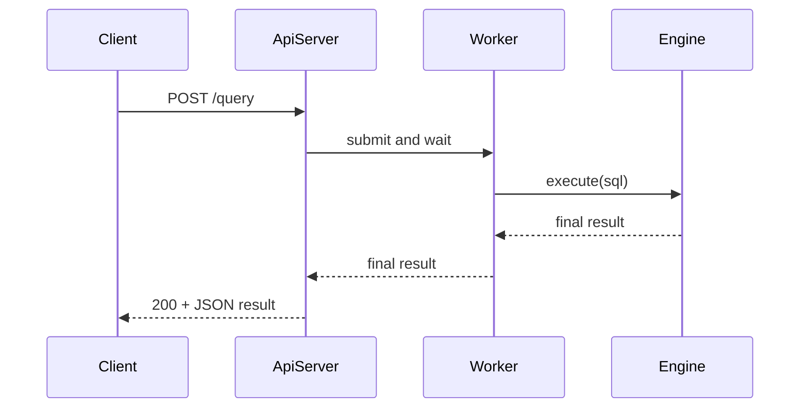
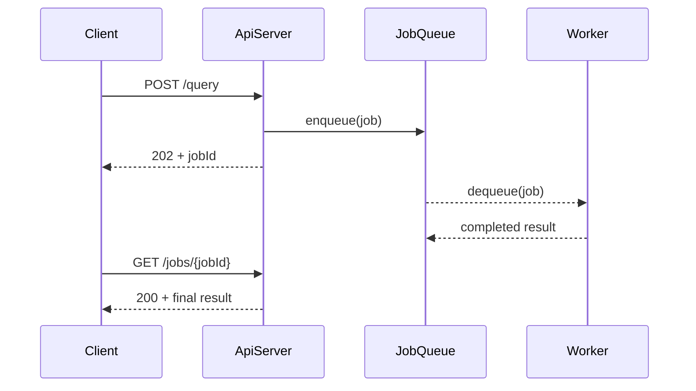
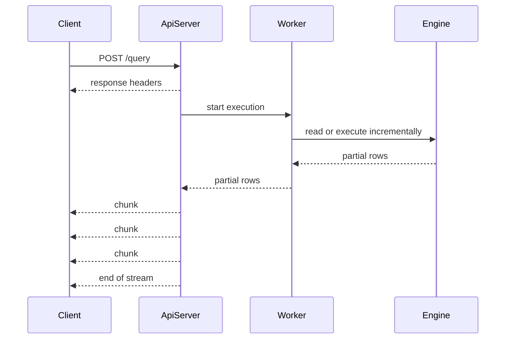

# Study — 엔드포인트의 동기 / 비동기 / 스트리밍

이 문서는 API 엔드포인트 구현 시 자주 비교되는 세 가지 방식,  
즉 **동기(synchronous)**, **비동기(asynchronous)**, **스트리밍(streaming)** 을 공부하기 쉽게 정리한 학습용 문서다.

이 문서는 **학습용 보조 자료**이며, 현재 프로젝트의 정본 스펙을 직접 바꾸지 않는다.

관련 정본 및 주차 문서:

- `docs/01-product-planning.md`
- `docs/02-architecture.md`
- `docs/03-api-reference.md`
- `docs/04-development-guide.md`
- `docs/weeks/WEEK8/1. planning.md`
- `docs/weeks/WEEK8/2. architecture.md`
- `docs/weeks/WEEK8/3. contract.md`

## 1) 먼저 핵심 구분

- **동기**: 요청을 받으면 서버가 작업을 끝낼 때까지 처리하고, 최종 결과를 한 번에 응답한다.
- **비동기**: 요청을 먼저 접수한 뒤, 작업은 백그라운드나 별도 흐름에서 처리하고 결과는 나중에 받게 한다.
- **스트리밍**: 응답 전체가 완성될 때까지 기다리지 않고, 준비된 데이터부터 조금씩 나눠서 보낸다.

핵심 차이는 다음과 같다.

- **동기 vs 비동기**는 주로 "최종 결과를 언제 응답하느냐"의 차이
- **스트리밍**은 주로 "응답을 한 번에 보내느냐, 나눠 보내느냐"의 차이

즉, 비동기와 스트리밍은 같은 말이 아니다.

## 2) 현재 WEEK8 `/query`는 왜 동기인가?

현재 WEEK8 문서 기준 `POST /query`는 **외부 계약 관점에서 동기 응답**이다.

처리 흐름:

1. 클라이언트가 요청을 보낸다.
2. 서버가 worker에게 작업을 맡긴다.
3. worker가 SQL 엔진 실행을 마친다.
4. 서버가 최종 JSON 결과를 한 번에 반환한다.

중요한 점:

- 내부에서 **Thread Pool**을 써도, 클라이언트가 최종 결과를 한 번에 받으면 외부 계약은 동기다.
- 즉, **내부 동시성**과 **외부 비동기 API**는 다른 개념이다.

## 3) 동기 방식

### 3.1 개념

가장 일반적인 HTTP API 방식이다.  
요청 하나에 대해 응답 하나가 바로 대응되며, 응답에는 최종 결과가 담긴다.

### 3.2 장점

- 구조가 단순하다.
- 클라이언트가 사용하기 쉽다.
- 테스트와 디버깅이 비교적 쉽다.
- 성공/실패 시점이 분명하다.

### 3.3 단점

- 오래 걸리는 작업에서는 연결을 오래 유지해야 한다.
- 요청이 길수록 타임아웃과 대기 시간이 문제된다.
- 중간 진행 상황을 사용자에게 보여주기 어렵다.
- 동시 요청이 많아지면 worker와 queue 부담이 커진다.

### 3.4 잘 맞는 상황

- 빠르게 끝나는 조회/삽입 API
- MVP나 데모 구현
- 클라이언트 계약을 최대한 단순하게 유지해야 할 때

## 4) 비동기 방식

### 4.1 개념

비동기 엔드포인트는 최종 결과를 바로 응답하지 않아도 되는 형태다.  
보통 먼저 "요청을 접수했다"는 응답을 주고, 이후 결과를 조회하거나 알림으로 받는다.

### 4.2 장점

- 오래 걸리는 작업을 다루기 좋다.
- 요청 접수와 실제 완료를 분리할 수 있다.
- 대기열, 재시도, 상태 관리 같은 운영 정책을 붙이기 쉽다.
- export, 리포트 생성, 긴 SQL 작업 같은 기능에 적합하다.

### 4.3 단점

- 설계와 구현이 복잡해진다.
- `jobId`, 상태 조회 API, 보관 기간 정책이 추가된다.
- 클라이언트도 polling 또는 callback 흐름을 이해해야 한다.
- 응답 timeout과 실제 작업 중단을 분리해서 설계해야 한다.

### 4.4 잘 맞는 상황

- 작업 시간이 길 수 있는 경우
- 클라이언트가 즉시 최종 결과를 받지 않아도 되는 경우
- 서버 보호 정책이 중요한 경우

### 4.5 WEEK8 관점에서의 변화

WEEK8 API에 비동기를 도입하면 보통 다음이 필요하다.

- `POST /query`가 `202 Accepted`와 `jobId`를 반환
- `GET /jobs/{jobId}` 같은 상태/결과 조회 엔드포인트 추가
- `queued`, `running`, `done`, `failed` 같은 상태 모델 정의

즉, 단순한 구현 변경이 아니라 **외부 API 계약 변화**가 같이 발생한다.

## 5) 스트리밍 방식

### 5.1 개념

스트리밍은 최종 응답을 한 번에 만들지 않고,  
준비된 데이터부터 chunk 단위로 나눠 보내는 방식이다.

### 5.2 장점

- 첫 결과를 빨리 보여줄 수 있다.
- 대용량 결과를 메모리에 한 번에 모으지 않아도 된다.
- 사용자가 체감하는 응답 속도가 좋아진다.
- 실시간 로그, AI 응답, 긴 SELECT 결과에 잘 맞는다.

### 5.3 단점

- 서버와 클라이언트 구현 난도가 올라간다.
- 중간에 실패하면 에러 표현이 까다롭다.
- 취소, 연결 종료, backpressure 대응을 더 신경 써야 한다.
- 일반 JSON 한 덩어리 응답보다 테스트가 어렵다.

### 5.4 잘 맞는 상황

- 결과가 매우 큰 조회
- 부분 결과를 빨리 보여줘야 하는 기능
- 실시간성 자체가 중요한 기능

### 5.5 WEEK8 관점에서의 변화

현재 `POST /query`는 결과를 하나의 JSON으로 반환한다.  
스트리밍을 도입하면 보통 다음 질문이 같이 따라온다.

- 포맷을 NDJSON, chunked JSON, SSE 중 무엇으로 할 것인가?
- SELECT 결과를 행 단위로 보낼 것인가?
- 중간에 에러가 나면 마지막 chunk에서 어떻게 표현할 것인가?
- 클라이언트 취소 시 엔진 실행도 멈출 것인가?

따라서 스트리밍은 성능만의 문제가 아니라 **응답 계약 재설계 문제**이기도 하다.

## 6) 세 방식 비교

| 항목 | 동기 | 비동기 | 스트리밍 |
| --- | --- | --- | --- |
| 응답 시점 | 작업 완료 후 한 번 | 접수 후 먼저 응답, 결과는 나중 | 작업 중간부터 조금씩 |
| 클라이언트 난이도 | 낮음 | 중간~높음 | 중간~높음 |
| 서버 구현 난이도 | 낮음 | 높음 | 높음 |
| 긴 작업 대응 | 약함 | 강함 | 강함 |
| 중간 결과 표시 | 어려움 | 별도 상태 조회 필요 | 매우 좋음 |
| 큰 결과 처리 | 보통 | 보통 | 매우 좋음 |
| 대표 HTTP 패턴 | `200 OK` | `202 Accepted` + polling | chunked transfer / SSE |

## 7) 어떤 상황에 무엇을 고르면 좋은가?

### 동기가 좋은 경우

- 과제나 MVP를 빠르게 완성해야 할 때
- 요청당 처리 시간이 짧을 때
- 클라이언트 계약을 단순하게 유지하고 싶을 때

### 비동기가 좋은 경우

- 요청이 길어 타임아웃 위험이 클 때
- 결과를 바로 줄 필요가 없을 때
- 재시도, 큐, 작업 상태 추적이 중요할 때

### 스트리밍이 좋은 경우

- 결과가 크거나 오래 생성될 때
- 부분 결과를 빨리 보여줘야 할 때
- 실시간 출력이 중요할 때

## 8) 자주 헷갈리는 포인트

### 8.1 Thread Pool을 쓰면 비동기인가?

반드시 그렇지 않다.

- 내부에서는 여러 worker가 병렬로 처리할 수 있다.
- 하지만 클라이언트가 최종 결과를 한 번에 기다리면 외부 계약은 동기다.

즉, "멀티스레드"와 "비동기 엔드포인트"는 구분해야 한다.

### 8.2 스트리밍이면 비동기인가?

항상 같은 뜻은 아니다.

- 스트리밍은 응답 전달 방식이다.
- 비동기는 완료 시점 설계 방식이다.

둘은 함께 쓸 수도 있고, 따로 쓸 수도 있다.

### 8.3 비동기면 무조건 빠른가?

그렇지 않다.

- 실제 SQL 엔진 작업 시간이 줄어드는 것은 아니다.
- 비동기는 서버 자원 점유 방식과 사용자 경험을 더 잘 다루게 해준다.
- 대신 복잡도와 운영 부담이 늘 수 있다.

## 9) WEEK8 기준 실전 선택

이번 주차 기준으로는 다음 선택이 가장 현실적이다.

- `GET /health`: 동기
- `POST /query`: 우선 동기
- 내부 처리: Thread Pool + bounded queue

이 선택의 장점:

- 계약이 단순하다.
- 구현과 테스트 범위를 통제하기 쉽다.
- 발표와 설명이 쉽다.
- 나중에 비동기/스트리밍 확장 논의를 붙이기 좋다.

확장은 보통 다음 순서가 자연스럽다.

1. 먼저 동기 계약과 내부 동시성을 안정화한다.
2. 오래 걸리는 작업이 병목이면 비동기 job API를 검토한다.
3. 큰 결과나 실시간 출력이 중요해지면 스트리밍 응답을 검토한다.

## 10) Q&A 대비

### Q1. 우리 서버는 Thread Pool을 쓰는데 왜 동기 방식이라고 하나요?

A. 내부 구현은 여러 worker가 병렬로 처리할 수 있지만, 클라이언트는 하나의 요청에 대해 최종 결과가 준비될 때까지 기다린 뒤 한 번에 응답을 받습니다. 따라서 외부 계약 기준으로는 동기 방식입니다.

### Q2. 비동기 방식으로 바꾸면 제일 먼저 무엇이 달라지나요?

A. 보통 `POST /query`가 최종 결과 대신 `202 Accepted`와 `jobId`를 반환하게 됩니다. 그다음 `GET /jobs/{jobId}` 같은 상태 조회 API와 작업 상태 모델이 필요해집니다.

### Q3. 스트리밍은 언제 도입하는 게 좋나요?

A. 결과가 크거나 오래 생성될 때, 또는 사용자가 중간 결과를 빨리 봐야 할 때 유리합니다. 예를 들어 긴 SELECT 결과, 로그 출력, 실시간 이벤트, AI 응답 같은 경우가 대표적입니다.

### Q4. 비동기와 스트리밍 중 무엇이 더 좋은가요?

A. 더 좋고 나쁨의 문제가 아니라 목적이 다릅니다. 오래 걸리는 작업을 안정적으로 운영하고 싶으면 비동기, 부분 결과를 빨리 전달하고 싶으면 스트리밍이 더 적합합니다.

### Q5. 현재 과제에서는 무엇을 선택하는 것이 가장 현실적인가요?

A. 현재 WEEK8 범위에서는 외부 API는 동기로 유지하고, 내부에서 Thread Pool과 bounded queue로 동시성을 처리하는 방식이 가장 구현 난이도와 설명 가능성의 균형이 좋습니다.

## 11) 한 줄 정리

- **동기**: 단순하고 현재 MVP에 가장 잘 맞는다.
- **비동기**: 긴 작업 운영에 강하지만 계약과 구현이 복잡해진다.
- **스트리밍**: 큰 결과와 실시간성에 강하지만 응답 포맷과 오류 처리가 어렵다.
