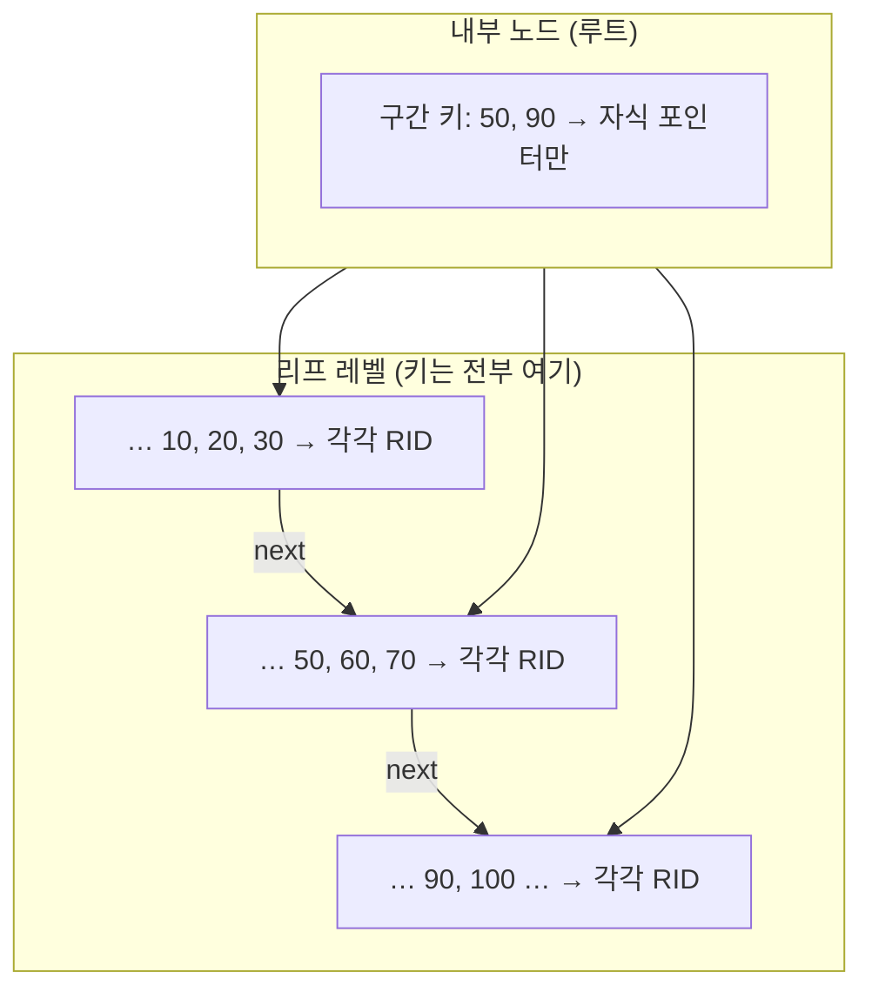
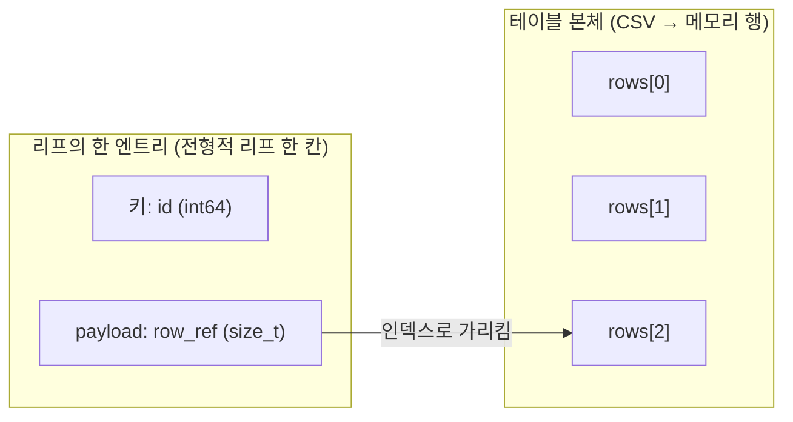
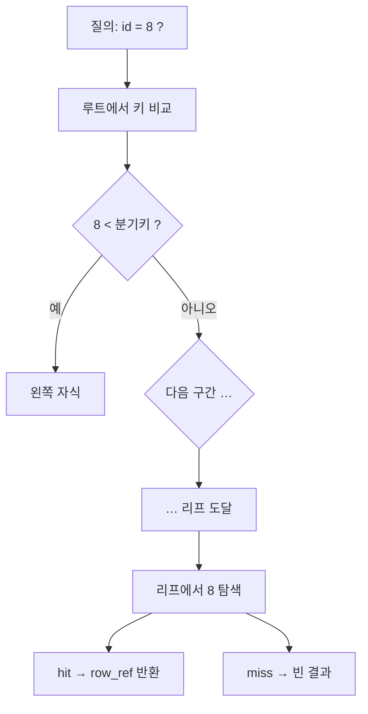
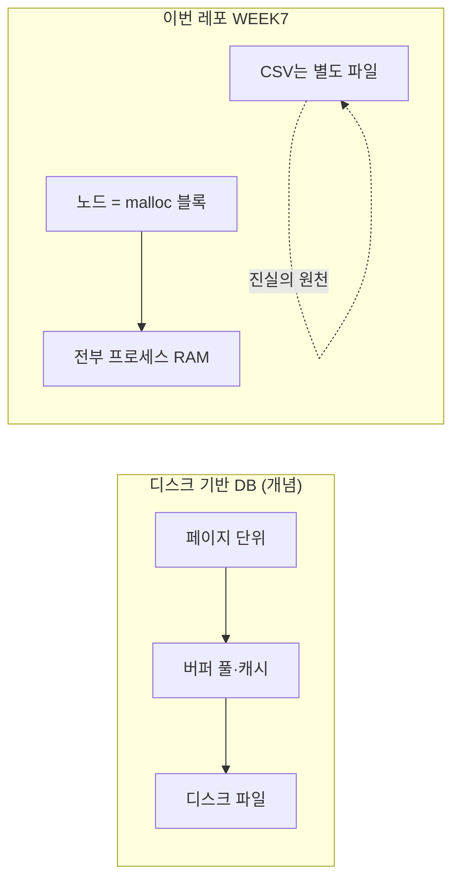
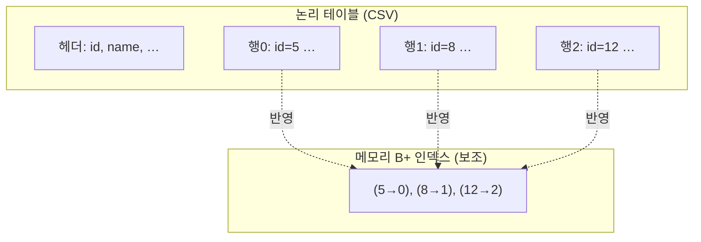
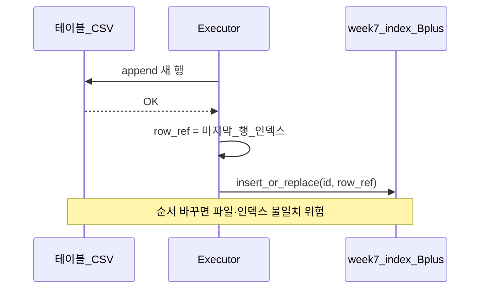
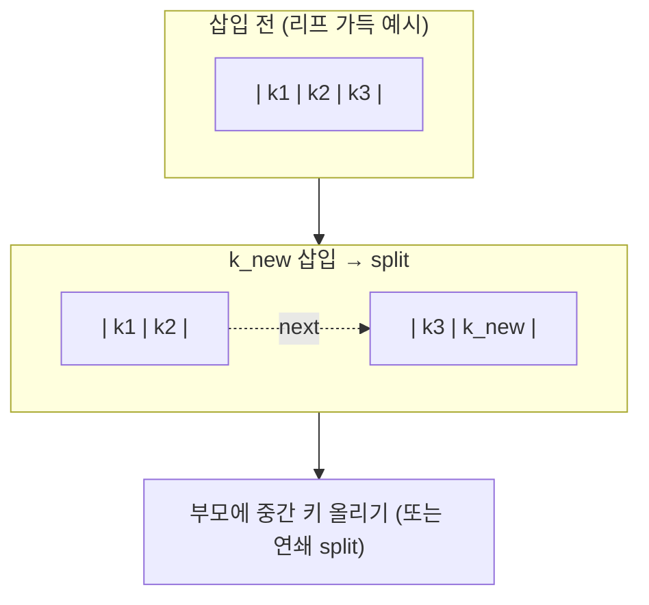
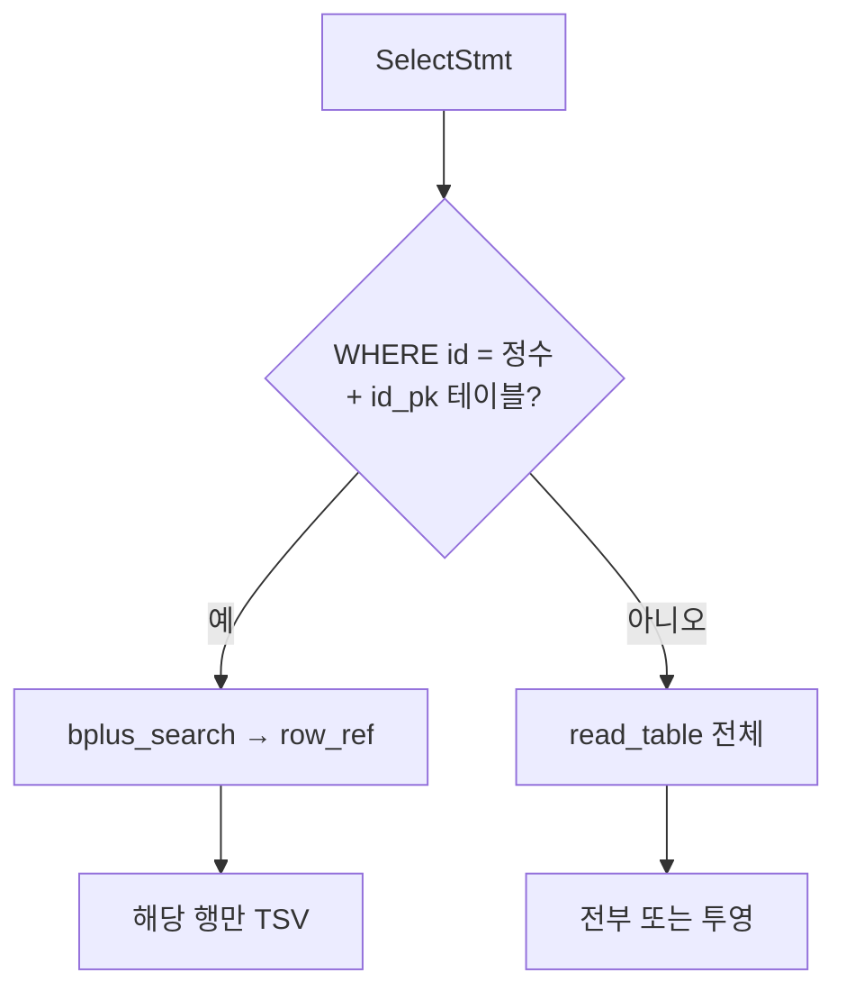
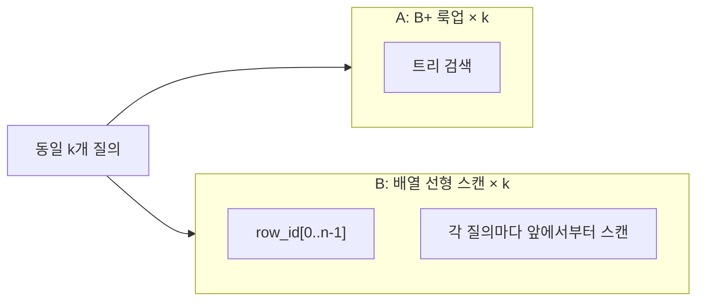

# WEEK7 학습용 대본·설명 노트 — 통합본 (B+ 인덱스)

> **통합본** = `[presentation-script.md](presentation-script.md)` 원본 대본 + `[presentation-script-easy.md](presentation-script-easy.md)`의 **난해한 부분 풀이**를 각 절 직후 **“(통합·풀이)”** 블록으로 넣은 것이다. 원본만·풀이만 따로 유지하고 싶으면 위 두 파일을 본다.  
> **용도**: 한 파일로 처음부터 끝까지 읽기, 스터디 공유. 발표에서는 섹션을 잘라 쓰면 된다.  
> **정본**: 동작·문법·종료 코드는 `docs/03-api-reference.md` WEEK7 절, 아키텍처 안내는 `docs/02-architecture.md` §6, 실행 순서 그림은 `[sequences.md](sequences.md)`를 우선한다.

---

## 목차

1. [이번 주차가 다루는 문제](#1-이번-주차가-다루는-문제)
2. [배경 지식: 인덱스와 B+ 트리](#2-배경-지식-인덱스와-b-트리) — 하위: [2.4 다이어그램](#24-다이어그램) · [발표용 분리 파일](presentation-visuals.md)
3. [우리 프로젝트에 붙인 범위](#3-우리-프로젝트에-붙인-범위)
4. [용어: id_pk, row_ref, next_id](#4-용어-id_pk-row_ref-next_id)
5. [INSERT 경로 — 순서와 책임](#5-insert-경로--순서와-책임)
6. [SELECT 경로 — 분기와 I/O 현실](#6-select-경로--분기와-io-현실)
7. [파서·Lexer — 허용하는 WHERE](#7-파서lexer--허용하는-where)
8. [B+ 트리 모듈 — 구현할 때 짚을 점](#8-b-트리-모듈--구현할-때-짚을-점)
9. [테스트가 검증하는 것](#9-테스트가-검증하는-것)
10. [벤치마크 해석](#10-벤치마크-해석)
11. [하지 않은 것과 설계 트레이드오프](#11-하지-않은-것과-설계-트레이드오프)
12. [자주 묻는 질문 (길게)](#12-자주-묻는-질문-길게)
13. [문서·코드 읽기 순서 (복습)](#13-문서코드-읽기-순서-복습)
14. [데모 시나리오 (발표 발췌용)](#14-데모-시나리오-발표-발췌용)
15. [팀 메모 빈칸](#15-팀-메모-빈칸)

**통합·풀이 블록**: §1.A, §4.A, §5.A, §6.A, §7.A, §8.A, §11.A — 원문 직후에 [presentation-script-easy.md](presentation-script-easy.md)의 풀이를 붙였다.

---

## 1. 이번 주차가 다루는 문제

6주차 MVP까지의 SELECT는, 단순화하면 **“CSV 파일 전체를 읽고 메모리에 올린 뒤, 조건 없이(또는 컬럼 투영만 하여) 출력”**에 가깝다. 테이블이 커질수록 **매 SELECT마다 파일 전체 I/O와 파싱**이 반복된다.

현실 DB에서는 **주 키(primary key)**에 대해 **인덱스**를 두고, `WHERE primary_key = 상수` 같은 질의는 **해당 페이지(또는 행)만** 찾아가도록 최적화한다. 이번 주차는 그중 아주 작은 조각만 가져온다.

- **대상 테이블**: CSV 헤더의 **첫 번째 컬럼 이름**이 대소문자 무시로 `id`인 경우만 “PK 테이블”로 취급한다.
- **INSERT**: 사용자가 넣은 첫 번째 값은 무시하고, 내부 `**next_id`**(파일에 있는 최대 `id` + 1)를 첫 컬럼에 기록한다.
- **SELECT**: `WHERE id = <정수>` 형태만 인덱스를 탄다. 그 외는 기존처럼 풀스캔 경로다.

이렇게 범위를 좁히면, **파서·실행기·저장소**의 경계를 크게 깨지 않고도 “인덱스가 있을 때와 없을 때”를 코드와 문서로 대비할 수 있다.

### 1.A 실행 흐름 속 WEEK7 (통합·풀이)

SQL 파일을 실행하면, 대략 **글자를 잘게 쪼개고(Lexer) → 문법에 맞는지 보며 트리로 만든 뒤(Parser) → 그 트리를 보고 파일을 읽거나 쓴다(Executor + csv_storage)**. WEEK7에서 새로 생긴 일은 **Executor와 파일 사이**에, 특정 종류의 표에 한해 **메모리 안의 B+ 트리**가 끼어든 것이다.

“인덱스가 생겼다”고 해서 **모든 SQL의 모든 단계가 바뀌는 것은 아니다.** 바뀌는 것은 **조건이 딱 맞을 때의 INSERT 끝부분**과, **조건이 딱 맞을 때의 SELECT 중 “어느 줄을 골라 올까”를 정하는 부분**이다. 나머지는 6주차 때와 같은 길을 많이 탄다.

**왜 “맨 앞 칸 이름이 `id`”인 표만 특별한가.** 우리는 **CREATE TABLE**을 실행하지 않으므로, 주 키를 SQL로 선언받지 못한다. 그래서 **CSV 첫 줄(헤더)** 만 보고, **맨 앞 칸 이름이 `id`냐 아니냐**로만 판단한다. 현실 DB보다 훨씬 좁은 규칙이지만, **구현·문서·테스트를 단순하게** 만들기 위한 선택이다. 규칙에 안 맞는 표는 **인덱스 혜택을 아예 받지 않는다.**

---

## 2. 배경 지식: 인덱스와 B+ 트리

### 2.1 인덱스가 하는 일

인덱스는 **검색 키 → 레코드 위치**로 가는 보조 구조다. 테이블 본체(여기서는 CSV)는 그대로 두고, 질의 종류에 따라 인덱스만 타고 가면 된다.

- **해시 인덱스**: 키의 해시로 버킷에 O(1) 평균 접근. **등호(=)** 질의에 강하다. 범위 질의(`id BETWEEN …`)에는 약하다.
- **B+ 트리**: 키가 정렬된 트리. 리프에 키가 모이고, 내부 노드는 자식으로의 길을 안내한다. **등호와 범위** 모두 교과서적으로 잘 맞고, 디스크 DB에서는 **페이지 단위**와도 잘 맞는다.

이번 과제는 **B+ 트리 구조를 직접 구현**하는 쪽에 무게가 있으므로, 해시 대신 B+를 택한 것으로 이해하면 된다.

### 2.2 B 트리와 B+ 트리

- **B 트리**: 키가 내부 노드에도 있을 수 있다.
- **B+ 트리**: **실제 키 값은 리프에만** 두고, 내부 노드는 구간을 나누는 **복사 키**만 가지는 경우가 많다. 리프를 연결하면 **순차 스캔**도 쉽다.

우리 구현은 **메모리 전용**이라 디스크 페이지·캐시는 없지만, “리프에 payload(행 번호)를 붙인다”는 식으로 **DB 입문·강의에서 흔히 그리는 B+ 트리 개념도**와 맞춰 이해하면 좋다(특정 책을 읽지 않아도 된다).

### 2.3 복잡도 직관

- 키 개수 n, 차수가 상수로 고정되면 **트리 높이**는 O(\log n)이다. 따라서 **룩업 한 번**은 대략 O(\log n) 비교·포인터 따라가기다.
- **풀스캔**은 행 수에 비례해 **평균 O(n)** 의 비교(또는 I/O)가 든다.

같은 “한 건 찾기”라도 n이 크면 둘의 차이가 벤치에 드러난다. 다만 **우리 SELECT 인덱스 경로**는 아직 `csv_storage_read_table`로 전체를 읽을 수 있어, **SQL 엔드투엔드 I/O**만으로는 이 차이가 가려질 수 있다. 그 점은 `[sequences.md](sequences.md)`와 README에도 적어 두었다.

### 2.4 다이어그램

아래 그림은 **이 대본 안에서** 바로 읽을 수 있게 넣었다. 발표 슬라이드·보조 모니터에는 동일 내용을 `[presentation-visuals.md](presentation-visuals.md)`만 띄워도 된다.

#### 2.4.1 전형적인 B+ 트리(개념도) — 디스크 엔진과의 대응

내부 노드는 **자식으로 가는 길**만 안내하고, **실제 검색 키는 리프**에 모인다고 생각하면 된다. 디스크 기반 DB에서는 리프 항목이 **RID / 페이지+슬롯** 같은 “행 위치”를 가리킨다.




- 내부: “50 미만은 왼쪽, 50 이상 90 미만은 가운데 …” 식의 **라우팅 키**.
- 리프: **정렬된 키 + 레코드 위치(포인터)**. 리프끼리 `next`로 잇면 범위 스캔.

#### 2.4.2 우리 구현과의 1:1 대응 (리프 = `id` + `row_ref`)

메모리에는 **페이지 객체가 없고**, 리프 한 칸이 곧 **(검색 키 id, payload = row_ref)** 한 쌍이다. `row_ref`는 CSV를 `read_table`로 읽었을 때의 **0-based 데이터 행 인덱스**다.




- 흔한 설명대로 “리프에 (키, RID)”가 있다면, 우리에선 **“(id, row_ref)”**로 옮겨 온 것에 가깝다.
- **RID 대신 row 번호**를 쓰는 이유: MVP가 **파일 한 덩어리 + 메모리 테이블** 모델이라, “몇 번째 데이터 행인지”가 곧 위치다.

#### 2.4.3 ASCII — 개념도 한 장을 머릿속에 붙일 때

차수는 예시로만 작게 그렸다(실제 코드는 `BP_MAX_KEYS` 등 고정 차수).

**내부 vs 리프 (개념만)**

```
                        +------------------+
                        | 내부: 50 | 90    |  ← 라우팅용 복사 키
                        +--+--+--+--+--+--+
                           |     |     |
              +------------+     |     +------------+
              v                  v                  v
    +-------------------+ +-------------------+ +-------------------+
    | 리프: 10 20 30    | | 리프: 50 60 70    | | 리프: 90 100 …   |
    | RID RID RID       | | RID RID RID       | | RID  …            |
    +---------+---------+ +---------+---------+ +---------+---------+
              \-------------------+-------------------/
                        next 체인 (범위 스캔·개념도)
```

**우리 리프 한 블록 (키 옆이 곧 `row_ref`)**

```
  리프 (메모리)
  +------+------+------+
  | id:5 | id:8 | id:12|   ← 검색 키 (정렬)
  +------+------+------+
  | row:0| row:1| row:2|   ← payload = CSV 데이터 행 인덱스
  +------+------+------+
```

`WHERE id = 8` → 리프에서 `8` 찾음 → `row_ref = 1` → `rows[1]` 출력.

#### 2.4.4 검색 한 번 — 루트에서 리프까지




- 높이만큼 **내부에서 몇 번** 갈림길을 탄 뒤, **리프 한 번**에서 키 일치를 본다 → O(\log n) 직관.

#### 2.4.5 디스크 B+ vs 우리 메모리 B+




- **트리 구조·리프 payload 개념**은 위와 같은 일반적인 B+ 설명과 같다.
- **없는 것**: 페이지 경계, 디스크 I/O를 줄이는 리프 배치, latch 등.

#### 2.4.6 테이블 본체 vs 인덱스 (논리적 두 층)




- 본체는 **파일에 누적되는 행들**; 인덱스는 **id → 행 번호**를 빨리 찾기 위한 사전.
- 프로세스 종료 시 인덱스는 사라져도, 다음에 CSV를 읽어 **다시 채울 수 있다**.

#### 2.4.7 INSERT 직후 — 파일과 트리를 맞추는 순서




#### 2.4.8 split 직관

가득 찬 리프에 키가 하나 더 들어오면 **한 노드를 둘로 쪼갠다**. 부모에도 자리가 없으면 **부모도 분할**이 올라간다.




#### 2.4.9 SELECT 두 갈래 (인덱스 vs 풀스캔)




- §6 “SELECT 경로”와 같은 그림이다.

#### 2.4.10 `bench_bplus compare`가 격리하는 것




- SQL·CSV I/O 없이 **CPU에서만** “로그 높이 vs O(n) 스캔” 차이를 본다(§10).

---

## 3. 우리 프로젝트에 붙인 범위

자세한 체크리스트는 `[assignment.md](assignment.md)`를 본다. 요약만 적는다.


| 구분    | 내용                                                                        |
| ----- | ------------------------------------------------------------------------- |
| 트리 연산 | 삽입, 검색. 동일 키 재삽입 시 payload 갱신(`bplus_insert_or_replace`). **삭제 없음**.      |
| PK 판별 | 헤더 **첫 컬럼** 이름이 `id`(대소문자 무시).                                            |
| SQL   | `WHERE id = <정수>` **한 패턴**만. 그 외 WHERE는 **파싱 실패**.                        |
| 저장    | 인덱스는 **프로세스 메모리**. 종료 후 소멸, 재실행 시 CSV에서 **재구축**(`week7_ensure_loaded` 등). |
| 벤치    | `bench_bplus`, `bench_bplus compare n k` — CTest 필수 아님.                   |


---

## 4. 용어: id_pk, row_ref, next_id

- **id_pk 테이블**: 위 PK 규칙을 만족하는 테이블. 이 테이블에만 자동 `id`와 인덱스가 켜진다.
- `**next_id`**: 다음 INSERT에 쓸 정수. 보통 `max(파일에 있는 id) + 1`에서 시작하고, INSERT마다 증가한다.
- **row_ref (payload)**: **0-based 데이터 행 인덱스**. `csv_storage_read_table`이 돌려준 `CsvTable`에서 `rows[row_ref]`가 그 `id`에 대응하는 행이라고 보면 된다.  
  - 헤더만 있는 CSV면 데이터 행이 0개이므로, 데이터가 생기면 인덱스의 payload는 `0, 1, 2, …` 순으로 간다(구현이 행을 append한다는 전제).

이 세 가지를 팀에서 같은 말로 통일해 두면, 시퀀스 다이어그램과 코드 리뷰가 수월하다.

### 4.A `row_ref`를 0부터 센다 (통합·풀이)

`row_ref`는 **화면에 찍히는 “몇 번째 줄”이 아니다.** 프로그램이 CSV를 읽어 메모리에 올렸을 때 **데이터 행 배열의 인덱스**다. 헤더는 보통 따로 두고, 데이터만 `rows[0]`, `rows[1]`…에 넣는다고 상상하면 된다. 그래서 **0부터 센다.** 사람은 “1번째 데이터”라고 말해도, 코드에서는 **첫 데이터가 0번**인 것이 헷갈리는 지점이니, 트리에 적힌 숫자 = **그 배열 칸 번호**라고 외워 두면 executor 동작이 읽힌다.

---

## 5. INSERT 경로 — 순서와 책임

append → `row_ref` → 인덱스 반영 **순서 그림**은 §**2.4.7**을 본다.

### 5.1 왜 순서가 중요한가

디스크(파일)에 행이 먼저 기록되고, 그 **행 번호**가 확정된 뒤에야 인덱스에 `(id → row_ref)`를 넣을 수 있다. 반대로 인덱스만 먼저 넣고 파일 쓰기가 실패하면, 트리만 듣기 어려운 상태가 된다. 그래서 **append 성공 → 행 인덱스 확정 → 인덱스 삽입** 순서가 자연스럽다.

### 5.2 구현에서의 호출 흐름 (개념)

`[sequences.md](sequences.md)` §1과 같다. 이름만 나열하면 대략 다음과 같다.

1. `executor_execute_insert`가 호출된다.
2. `week7_prepare_insert_values` — id_pk이면 자동 `id`가 들어간 값 배열을 준비한다. 아니면 기존 로직만 탄다.
3. `csv_storage_append_insert_row` — 파일 끝에 한 줄 추가.
4. 성공 시 `csv_storage_data_row_count`(또는 동등한 API)로 **데이터 행 개수**를 구해, 마지막 행의 인덱스를 `total - 1`처럼 확정한다(단일 프로세스 전제).
5. `week7_on_append_success(id, row_index)` — 내부에서 `bplus_insert_or_replace`로 트리에 반영.

### 5.3 실패와 정합성

- **append 실패**: 파일에 줄이 안 붙었으므로 인덱스도 넣지 않는다. 기존과 같다.
- **append 성공 후 인덱스 삽입 실패**: 이상적인 엔진은 트랜잭션으로 롤백하지만, **본 MVP 확장에서는 롤백을 하지 않을 수 있다.** 그 경우 CSV에는 행이 남고 인덱스만 어긋날 수 있으므로, **문서에 “현재 정책”을 한 줄** 적어 두고 발표에서 솔직히 말하는 것이 좋다. 실제 문구는 `03-api-reference.md`·`sequences.md`를 본다.

### 5.4 CSV에 이미 중복 id가 있는 경우

재기동 후 `week7_ensure_loaded`가 파일을 읽어 트리를 채울 때, **같은 id가 여러 행**이면 “어느 행이 진짜인가”가 필요하다. 구현은 **`bplus_insert_or_replace`**로 **마지막으로 읽힌 행의 row_ref**가 남도록 하는 쪽이 자연스럽다(과제 명세와 일치시킴).

### 5.A INSERT 한 줄이 지나가는 이야기 (통합·풀이)

`id` 표라면 먼저 **이번에 파일에 쓸 번호**를 정한다. VALUES 맨 앞은 **스펙상 무시**된다. “번호는 시스템이 책임진다”는 약속 때문이다. 그다음 **파일 끝에 한 줄**이 붙는다. 여기까지 성공해야 “방금 생긴 줄이 데이터 기준 몇 번째인지”를 말할 수 있다. **그 다음에야** 메모리 트리에 `(id → row_ref)`를 적는다.

순서를 바꾸고 싶은 생각(트리 먼저, 파일 나중)은 이해되지만, **파일 쓰기가 실패했는데 트리만 갱신**되면 “번호는 있는데 파일에는 없다”가 된다. 반대로 파일만 쓰고 트리를 빼먹으면 SELECT가 색인 길로 갈 때 **못 찾는다.** 그래서 **파일 반영이 확정된 뒤** 색인을 맞춘다.

인덱스 삽입 단계에서 실패하면 **파일 줄은 이미 붙어 있을 수 있다.** 진짜 DB는 롤백하지만 MVP 확장에서는 **안 할 수도 있다**고 문서에 적는다. 발표에서는 “**진실은 파일**, 색인은 그에 맞춘 복사본”이라고 풀어 말하면 된다.

---

## 6. SELECT 경로 — 분기와 I/O 현실

인덱스 vs 풀스캔 **분기 그림**은 §**2.4.9**에 두었다.

### 6.1 실행기 분기 조건 (개념)

1. AST에 `**has_where_id_eq`** 가 참이고, 정수 값이 있다.
2. **그 테이블이 id_pk**이다(`week7_table_has_id_pk` 등).

둘 다 만족하면 **인덱스 경로**를 탄다.

- **id_pk가 아닌데** `WHERE id = …`를 썼다면: 인덱스가 없으므로 **실행 오류**로 처리하는 것이 사용자 혼란이 적다(정본·테스트 확인).

### 6.2 hit / miss

- **hit**: 트리에서 `id`에 대응하는 `row_ref`를 얻는다. 그 행만 stdout 포맷(TSV)에 맞게 출력한다.
- **miss**: 키가 트리에 없다. **에러가 아니라 성공(종료 코드 0)**으로, **헤더만** 출력하고 데이터 행은 없다. SQL에서 “빈 결과 집합”에 가깝게 해석하면 된다.

발표에서 **반드시 miss를 한 번 시연**하는 것을 권장한다. “에러가 아니다”를 몸으로 보여 주는 것이 이해에 도움이 된다.

### 6.3 I/O: 이상과 현실

이상적으로는 `row_ref`만 알면 **그 줄만** 파일에서 읽어 오면 된다. 현재 구현이 `**read_table`로 전체를 읽은 뒤 한 행만 출력**한다면, **알고리즘은 인덱스**지만 **I/O는 풀스캔과 비슷**할 수 있다. 벤치·발표에서 “무엇을 비교했는지”를 명확히 말해야 오해가 없다.

- **CPU 룩업 차이**만 보여 주려면 `bench_bplus compare`가 맞다.
- **엔드투엔드 SQL**까지 100만 INSERT로 재현하려면, 생성한 SQL 크기·디스크·파싱 시간을 별도로 설명하는 것이 좋다.

### 6.A SELECT 갈림·miss·비 PK (통합·풀이)

파서가 만든 트리에 `WHERE id = 정수`가 있고 표가 `id` 표이면, 실행기는 **색인으로 “몇 번째 데이터 줄인지”**를 먼저 본다. 그 다음 **그 줄 내용을 가져와야** 한다. 여기서 헷갈리는 점: **줄 번호는 빨리 찾아도**, 파일에서 **한 줄만 읽는 API**를 안 쓰면 내부적으로는 **표 전체를 한 번 읽고** 그중 한 줄만 고를 수 있다. **머리는 빨리 찾았는데 손은 전체를 펼친 것**에 가깝다. 그래서 “인덱스 = 항상 빨라졌다”는 말은 **CPU만·I/O까지**를 나눠 말해야 한다. `bench_bplus compare`는 전자를 재는 도구다.

`WHERE id = 9999`인데 9999가 없으면, 감각은 “오류”로 가기 쉽지만 SQL에서는 **조건에 맞는 행이 0개**일 뿐이라 **문법 오류가 아니다.** 그래서 **성공(0)**으로 두고 **헤더만** 나올 수 있다. 팀에서 “버그냐” 논쟁이 나지 않게 **의도된 동작**을 문서와 시연으로 고정한다.

`id` 표가 **아닌데** `WHERE id = …`를 쓴 경우는, 색인 기능이 **없는데 쓴 것**에 가깝다. 파싱은 통과할 수 있어도 **실행기에서 막는** 선택을 했다. 이건 **miss(기능은 있는데 결과 없음)** 와 다르다 — miss는 에러가 아니고, 비 PK 표의 `WHERE id`는 **에러에 가깝게** 처리된다.

---

## 7. 파서·Lexer — 허용하는 WHERE

### 7.1 허용되는 형태 (개념)

`SELECT … FROM <table> WHERE id = <integer> ;`

- `WHERE` 다음은 식별자 `**id`**(대소문자 무시), `=`, **정수 리터럴**만.
- 컬럼 목록이 `*`이든 일부 컬럼이든, WHERE 패턴만 맞으면 된다(정본은 `03-api-reference.md`).

### 7.2 거절되는 예 (파싱 단계에서)

- `WHERE id = '1'` (문자열)
- `WHERE id = 1.0` (부동소수)
- `WHERE user_id = 1` (다른 컬럼명)
- `WHERE id > 1`, `WHERE id = 1 OR 1=1`
- `WHERE …` 가 더 붙는 경우

**지원하지 않는 WHERE는 파싱 에러**로 두면, 실행기까지 내려가지 않아 디버깅이 쉽다.

### 7.3 Lexer

`WHERE` 키워드와 `=` 토큰(`TOKEN_EQ` 등)이 추가된다. `sql_processor_trace`를 쓰는 팀은 토큰 스트림을 한 번 찍어 보면 학습에 도움이 된다.

### 7.A 파서를 아주 좁게 막는 이유 (통합·풀이)

`WHERE id > 1` 같은 것은 많은 DB에선 당연하지만, 우리는 **구현하지 않기로 잘랐다.** 실행기까지 내려가서 “미지원”을 처리하면 **어디서 틀렸는지** 찾기가 번거롭다. 그래서 **파싱 단계에서 패턴 밖이면 문법 오류**로 끊는다. “파서가 깐깐하다”기보다 **지원 범위를 문장 단계에서 자르기** 위한 선택이다.

---

## 8. B+ 트리 모듈 — 구현할 때 짚을 점

구체 상수명은 `include/week7/bplus_tree.h`를 본다. 여기서는 학습 질문만 정리한다. **전형적인 B+ 구조·리프 payload·split·검색 흐름 그림**은 §**2.4**에 두었다.

### 8.1 차수·노드 타입

- 리프와 내부 노드가 **같은 최대 키 개수**를 쓰는지, 자식 포인터 개수가 어떻게 되는지.
- **가득 찬 리프**에 삽입하면 **분할**이 일어난다. 리프를 둘로 나누고 **부모에 키가 올라간다**.

### 8.2 부모·루트

- 부모도 가득 차면 **내부 노드 분할**이 연쇄될 수 있다.
- 루트가 분할되면 **트리 높이가 1 증가**한다.

### 8.3 검색

- 루트에서 시작해 **키 비교**로 자식을 고르고, 리프에 도달해 **키 일치**를 확인한다.
- 없으면 miss — 실행기는 이를 “빈 결과”로 표현한다.

### 8.4 단위 테스트에서 다룰 시나리오

빈 트리, 단일 키, 연속 삽입으로 split 여러 번, 동일 키 재삽입(payload 변경), 검색 hit/miss. **트리만** 링크하는 테스트 타깃이 있으면 회귀가 빠르다.

### 8.A B+를 쓰는 직관·`insert_or_replace`·split (통합·풀이)

색인을 “긴 배열에 다 넣고 매번 앞에서부터 찾는다”고 해도 **작은 데이터**에서는 돌아간다. 데이터가 커지면 **한 칸씩 비교**가 부담이 된다. B+ 트리는 **정렬과 분기**로 “지금 찾는 값은 이 가지 아래만 보면 된다” 식으로 **볼 범위를 줄여** 한 번 찾을 때 비교 횟수가 데이터 개수에 비해 **천천히만** 늘게 만든다. 우리는 디스크 페이지까지는 가지 않지만, **리프에 (키, 위치)·위층은 길 안내**라는 그림은 흔한 B+ 설명과 같다(그림은 §2.4).

`**bplus_insert_or_replace`**: CSV를 다시 읽어 색인을 채울 때 **같은 id가 여러 줄**일 수 있다. 그때 **나중에 읽힌 줄이 이긴다**는 규칙을 택했다. 위에서 아래로 읽으면 **맨 아래 줄**이 남는다고 말해도 된다.

**split**: 리프 한 칸이 꽉 찼는데 또 넣어야 하면 **둘로 쪼갠다.** 가운데 값이 **부모**로 올라가 왼쪽·오른쪽 덩어리를 가른다. 부모도 꽉 차면 **연쇄 분할**, 루트까지 가면 **나무 높이가 한 단 증가**하기도 한다. 버그는 여기서 잘 나므로 **작은 예로 손그림**이 중요하다.

---

## 9. 테스트가 검증하는 것


| 대상                   | 대략적인 역할                                                |
| -------------------- | ------------------------------------------------------ |
| `test_bplus_tree`    | SQL·CSV 없이 트리 연산만.                                     |
| `test_parser_select` | `WHERE id = …` 성공·실패 문자열.                              |
| `test_executor`      | INSERT 후 id, WHERE hit/miss, 풀스캔과의 결과 일치 등 통합에 가까운 검증. |
| 기존 CTest             | Lexer·INSERT parser·csv·main 등 회귀.                     |


테스트 하나가 실패할 때 **어느 층**의 문제인지(파서 vs 저장소 vs 인덱스)를 빠르게 나누는 연습을 하면 좋다.

---

## 10. 벤치마크 해석

`bench_bplus compare`가 무엇을 격리하는지 **그림**은 §**2.4.10**을 본다.

### 10.1 `bench_bplus [n]`

`1..n` 삽입 후, 각 키를 검색해 **정합성 검증**까지 포함한다. “트리가 큰 입력에서도 깨지지 않는가”를 보는 용도에 가깝다.

### 10.2 `bench_bplus compare <n> <k>`

- `n`개 키 삽입 후, **고정 시드**로 뽑은 `k`개의 id에 대해:
  - **B+ `bplus_search`**
  - **길이 n 배열을 앞에서부터 스캔**하여 같은 id를 찾음

동일 질의 집합에 대해 **CPU 시간**을 비교한다. SQL 파싱·CSV I/O는 없다.

### 10.3 말할 때 주의할 점

- “인덱스가 몇 배 빠르다”는 말은 **이 벤치 조건에서만** 성립한다고 붙이는 것이 안전하다.
- README 표의 숫자는 **머신·컴파일러·최적화**에 따라 달라진다. 팀 로컬에서 한 번 돌려 표를 갱신하는 습관이 좋다.

---

## 11. 하지 않은 것과 설계 트레이드오프

- **디스크 페이지**, 버퍼 풀, latch — 범위 밖.
- **다중 인덱스**, 보조 인덱스, 복합 키 — 범위 밖.
- `**WHERE`의 다른 연산자** — 범위 밖(파싱에서 차단).
- **동시에 두 프로세스가 같은 CSV에 쓰기** — MVP에서 단일 프로세스 가정.
- **인덱스 영속화** — 없음. 재시작 시 파일 스캔으로 **재구축**한다고 설명하면 된다.
- **인덱스 실패 시 CSV 롤백** — 구현하지 않을 수 있음. 그 대신 문서화.

트레이드오프를 한 줄씩이라도 말할 수 있으면 “왜 이렇게 잘랐는지”가 보인다.

### 11.A 휘발성 인덱스 (통합·풀이)

색인은 **메모리**에만 있다. 프로세스를 끄면 사라진다. 다음 실행에서 CSV를 읽을 때 **다시 채운다.** “파일이 진짜고, 색인은 그에 맞춘 캐시에 가깝다”고 이해하면 흐름이 맞다.

---

## 12. 자주 묻는 질문 (길게)

### Q1. 왜 굳이 B+ 트리인가? 해시로는 안 되나?

**B+**: 정렬·등호·(향후) 범위 질의와 잘 맞고, DB 교과서와 직접 연결된다.  
**해시**: 단건 등호에 평균적으로 빠를 수 있다. 다만 과제 목표가 “전형적인 인덱스 자료구조 구현”이면 B+가 요구에 잘 맞는다.  
발표에서는 “우리는 과제 범위에 맞춰 B+를 택했고, 해시는 다른 트레이드오프가 있다” 수준이면 충분하다.

### Q2. 자동 `id`가 있으면 사용자가 첫 칼럼에 값을 넣어도 무시되는가?

스펙상 **첫 컬럼 값은 무시**되고 내부 `next_id`가 들어간다. VALUES 개수가 헤더보다 하나 적게 오는 등의 규칙은 `03-api-reference.md`를 본다. 시연에서 **의도적으로 틀린 첫 값**을 넣고도 올바른 id가 파일에 찍히는지 보여 주면 이해가 빠르다.

### Q3. `WHERE id` miss가 왜 에러가 아니라 헤더만인가?

SQL 관점에서 “조건에 맞는 행이 0개”는 **빈 결과 집합**이지, 문법 오류가 아니다. 실행기가 **성공(0)**으로 처리하는 것이 자연스럽다. 팀 내에서 종료 코드 정책을 바꿨다면 정본과 테스트를 함께 고친다.

### Q4. 인덱스가 메모리만 있으면 프로세스 죽으면 다 잃지 않나?

잃는다. 대신 **다음 실행** 때 CSV를 읽어 `**week7_ensure_loaded`** 같은 경로로 트리와 `next_id`를 다시 맞춘다. “인덱스는 휘발성, 진실의 원천은 파일”이라고 말하면 된다.

### Q5. 인덱스 경로인데 왜 SELECT가 여전히 느릴 수 있나?

`read_table`로 **파일 전체**를 읽는다면 I/O는 줄지 않는다. **룩업만 O(log n)** 이 이득인 구조다. 최적화하려면 “행 번호만 알 때 그 줄만 읽기” API를 storage에 추가하는 식의 확장이 필요하다(선택 과제).

### Q6. split 버그는 어떻게 잡나?

손으로 **작은 n**에 대해 트리 그림을 그린 뒤, 단위 테스트에 **최소 재현**을 추가하는 방법이 좋다. 특히 **부모가 가득 찬 뒤** 내부 분할이 연쇄되는 경우가 어렵다.

---

## 13. 문서·코드 읽기 순서 (복습)

1. `docs/01-product-planning.md` — MVP 범위와 충돌 없는지.
2. `docs/03-api-reference.md` — WEEK7 절만 집중해서 읽기.
3. `[sequences.md](sequences.md)` — INSERT/SELECT Mermaid를 **코드의 함수명**과 줄 맞춰 읽기.
4. `include/week7/bplus_tree.h` → `src/week7/bplus_tree.c` — insert/search 흐름.
5. `include/week7/week7_index.h` → `src/week7/week7_index.c` — CSV와의 접점.
6. `src/parser.c` — SELECT + WHERE 분기.
7. `src/executor.c` — INSERT/SELECT에서 WEEK7 주석 블록 찾기.
8. `[learning-guide.md](learning-guide.md)` — 단계별 자기 점검.

---

## 14. 데모 시나리오 (발표 발췌용)

시간이 짧을 때는 아래만 순서대로 해도 된다.

1. **준비**: `data` 아래 id_pk CSV, CWD가 프로젝트 루트인지 확인.
2. **INSERT** 실행 → CSV 마지막 줄에 **기대한 id**가 들어갔는지 표시.
3. `SELECT * FROM … WHERE id = (그 id)` → **한 행**.
4. **존재하지 않는 id** → **헤더만**.
5. (선택) `SELECT * FROM …` → 여러 행 + “풀스캔 경로” 한 마디.
6. (선택) `bench_bplus compare 1000000 10000` 출력 한 줄 읽기.

---

## 15. 팀 메모 빈칸

- 실측 환경: OS ______ / CPU ______ / 빌드 타입 ______  
- 데모 SQL 파일: ______  
- 이번 주차에서 가장 오래 걸린 버그: ______  
- 다음에 하고 싶은 확장(한 줄): ______

