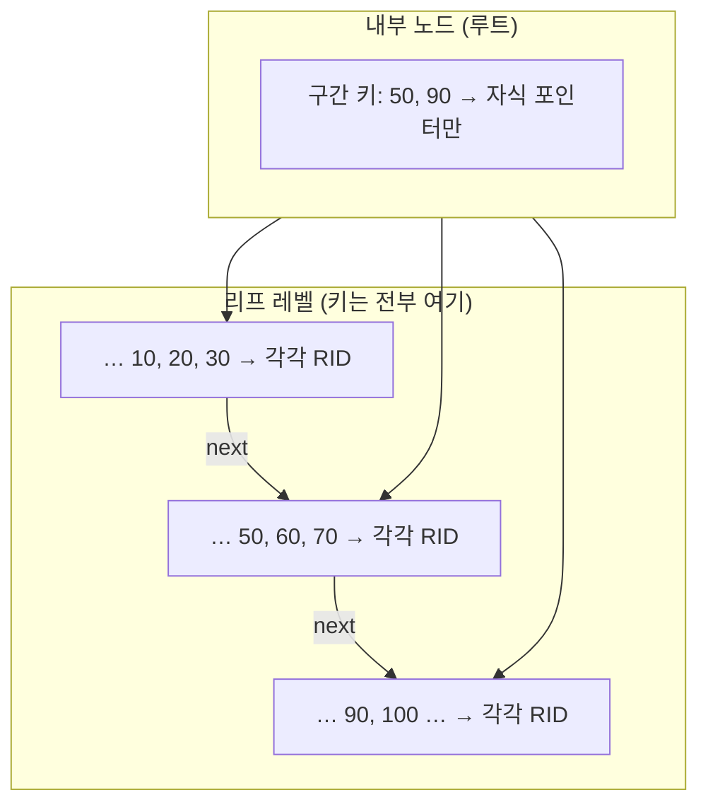
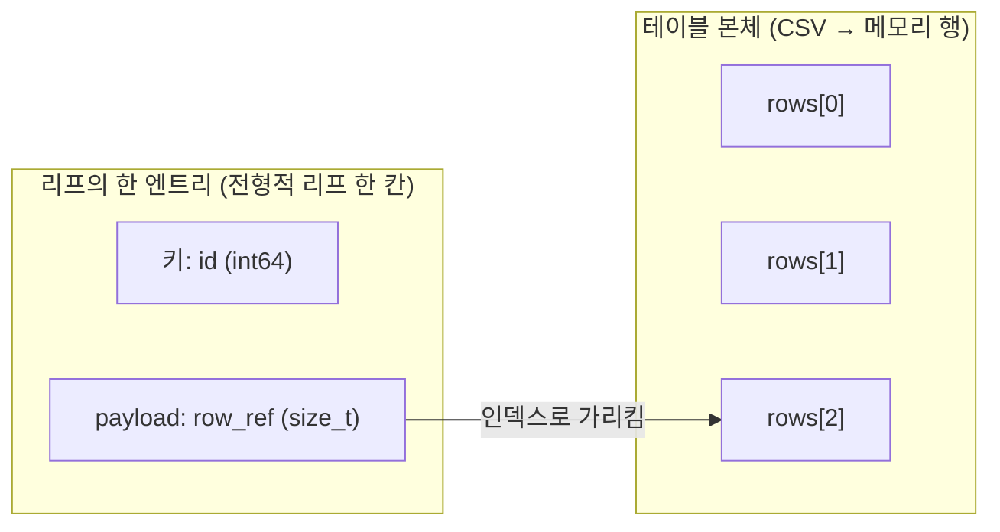
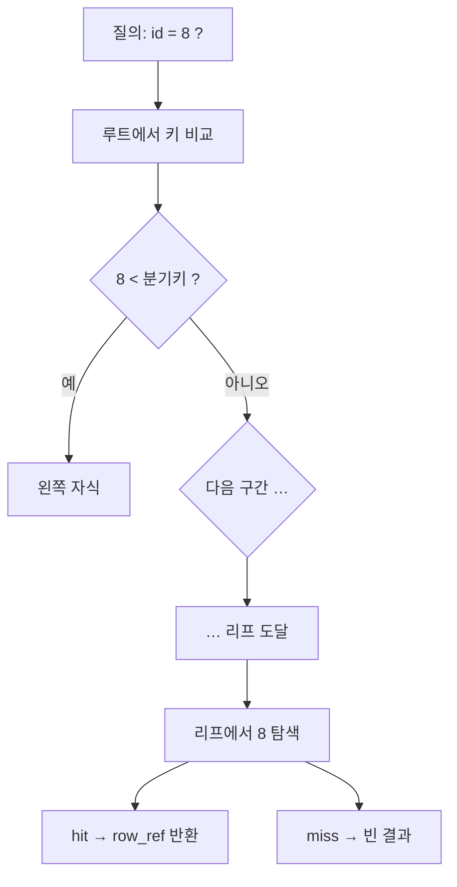
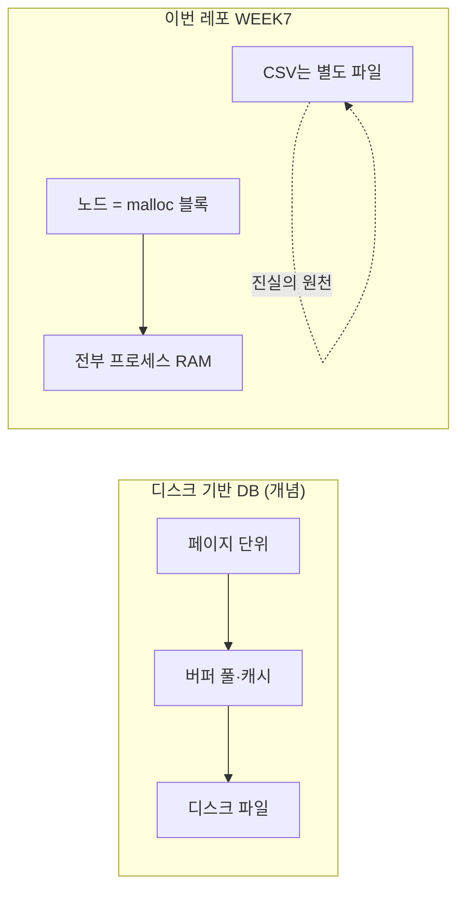
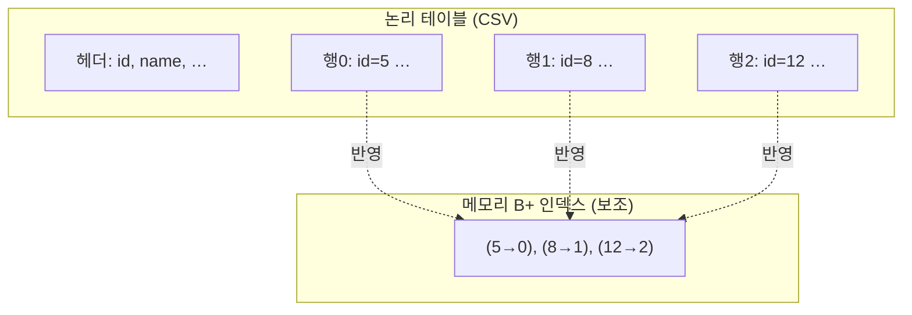
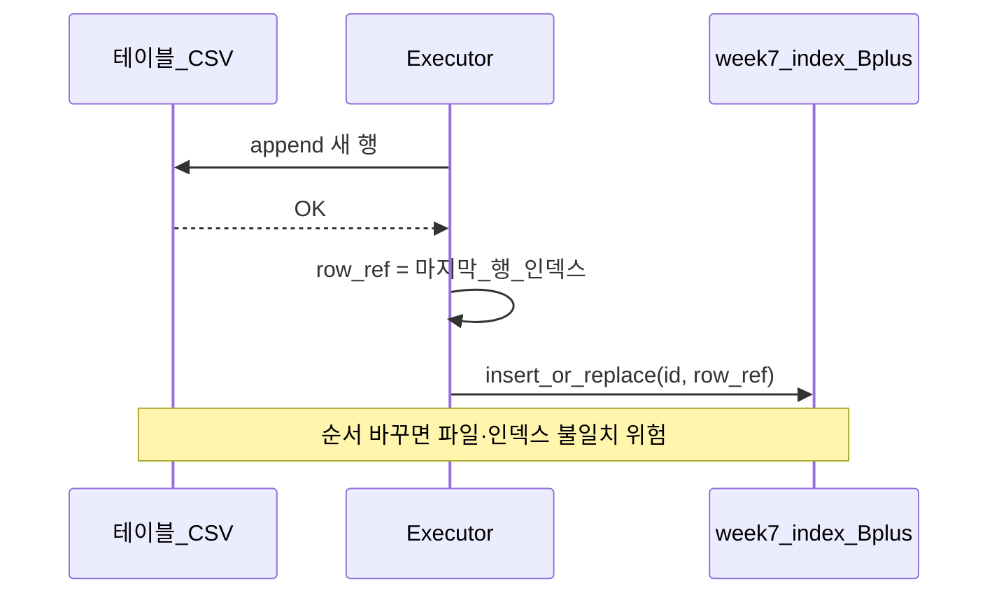
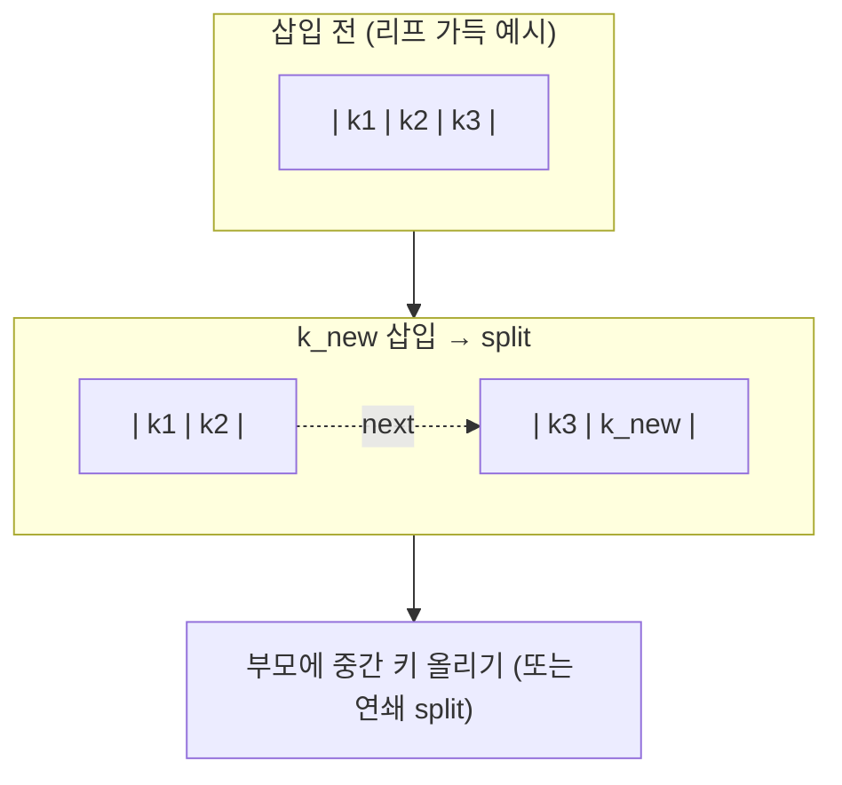
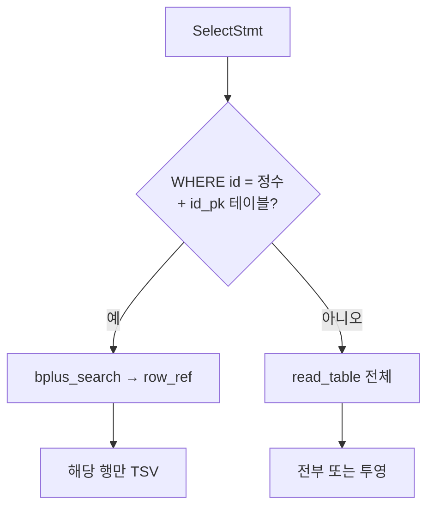
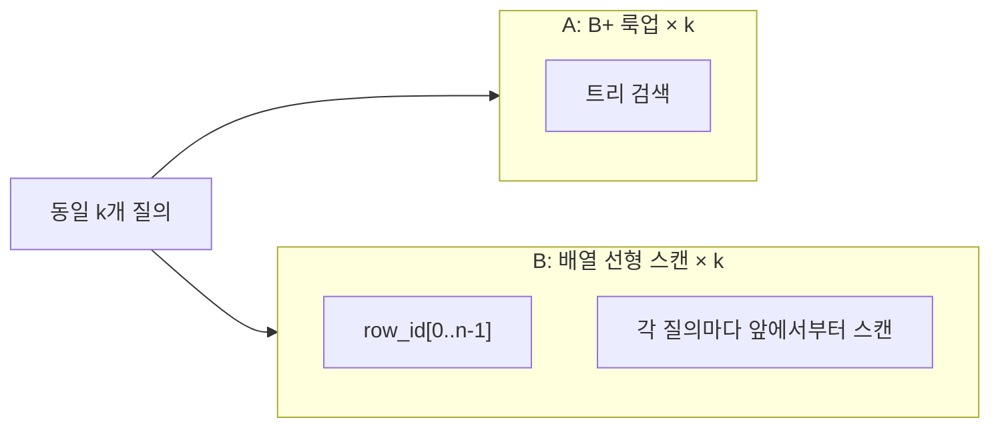

# WEEK7 시각 자료 — B+ 트리·인덱스 다이어그램

[`presentation-script.md`](presentation-script.md) **§2.4**와 [`presentation-script-full.md`](presentation-script-full.md)에도 아래와 **동일한 다이어그램**이 들어 있다. 발표 슬라이드·발표자 모니터에는 **이 파일만** 띄워도 된다.

---

## 발표 보조 요약

### 1) 구현 시퀀스

```text
B+ 트리 단독 모듈
→ 자동 id + 행 참조(row_ref)
→ INSERT 경로에 인덱스 연결
→ 파서·AST: WHERE id = 정수
→ SELECT 실행 분기
→ 엣지·에러
→ 대량 벤치 + README
```

| 단계 | 핵심 내용 |
|---|---|
| B+ 트리 단독 모듈 | SQL·CSV와 분리해 `insert`, `search`, `insert_or_replace` 검증 |
| 자동 id + row_ref | 첫 컬럼이 `id`이면 자동 id 부여, CSV 데이터 행 번호를 `row_ref`로 사용 |
| INSERT 연결 | CSV append 성공 후 `id -> row_index`를 B+ 트리에 등록 |
| WHERE 파싱 | `WHERE id = 정수`를 AST에 `has_where_id_eq`, `where_id_value`로 저장 |
| SELECT 분기 | `WHERE id`는 인덱스 lookup, 일반 SELECT는 기존 풀스캔 |
| 벤치 | 1,000,000건 기준 B+ lookup과 선형 탐색 비교 |

### 2) `malloc/calloc` vs `mmap`

| 구분 | `malloc/calloc` | `mmap` |
|---|---|---|
| 대상 | 프로세스 메모리 | 파일/메모리 매핑 |
| 연결 | `BPNode *` 포인터로 부모·자식·리프 연결 | page id, offset 관리 필요 |
| 구현 범위 | 메모리 B+ 트리 구현에 집중 | 파일 페이지, flush, 저장 형식까지 커짐 |
| 선택 | 이번 과제에 적합 | 디스크 기반 DB 구현에 가까움 |

### 3) B-tree vs B+ tree

| 구분 | B-tree | B+ tree |
|---|---|---|
| 데이터 위치 | 내부 노드와 리프 노드 모두 가능 | 실제 key/payload는 리프에 모임 |
| 내부 노드 역할 | 데이터 저장 가능 | 길 안내용 separator key |
| 리프 연결 | 필수 아님 | 리프끼리 `next`로 연결 |
| 강점 | 단건 검색에서 내부 노드 hit 가능 | 범위 검색, 정렬 순회, DB 인덱스에 유리 |

### 4) split 관점 차이

| 구분 | B-tree | B+ tree |
|---|---|---|
| 부모로 올라가는 key | 중간 key가 **이동** | 오른쪽 리프 첫 key가 **복사** |
| 아래 노드의 key | 올라간 key가 빠질 수 있음 | 실제 key/payload는 리프에 남음 |
| 부모 key 의미 | 실제 데이터 key일 수 있음 | 탐색용 separator key |
| 결과 | key/data가 내부·리프에 분산 가능 | key/data가 리프에 모여 range scan 유리 |

---

## 1) 전형적인 B+ 트리(개념도) — 디스크 엔진과의 대응

내부 노드는 **자식으로 가는 길**만 안내하고, **실제 검색 키는 리프**에 모인다고 생각하면 된다. 디스크 기반 DB에서는 리프 항목이 **RID / 페이지+슬롯** 같은 “행 위치”를 가리킨다. (특정 책이 아니라 **흔한 설명 그림**을 가정한다.)




**핵심 메시지**

- 내부: “50 미만은 왼쪽, 50 이상 90 미만은 가운데 …” 식의 **라우팅 키**.
- 리프: **정렬된 키 + 레코드 위치(포인터)**. 리프끼리 `next`로 잇면 범위 스캔.

---

## 2) 우리 구현과의 1:1 대응 (리프 = `id` + `row_ref`)

메모리에는 **페이지 객체가 없고**, 리프 한 칸이 곧 **(검색 키 id, payload = row_ref)** 한 쌍이다. `row_ref`는 CSV를 `read_table`로 읽었을 때의 **0-based 데이터 행 인덱스**다.




**핵심 메시지**

- 흔한 설명대로 “리프에 (키, RID)”가 있다면, 우리에선 **“(id, row_ref)”**로 옮겨 온 것에 가깝다.
- **RID 대신 row 번호**를 쓰는 이유: MVP가 **파일 한 덩어리 + 메모리 테이블** 모델이라, “몇 번째 데이터 행인지”가 곧 위치다.

---

## 3) ASCII — 개념도 한 장을 머릿속에 붙일 때

차수는 예시로만 작게 그렸다(실제 코드는 `BP_MAX_KEYS` 등 고정 차수).

### 3.1 내부 vs 리프 (개념만)

```
                        +------------------+
                        | 내부: 50 | 90    |  ← 라우팅용 복사 키
                        +--+--+--+--+--+--+
                           |     |     |
              +------------+     |     +------------+
              v                  v                  v
    +-------------------+ +-------------------+ +-------------------+
    | 리프: 10 20 30    | | 리프: 50 60 70    | | 리프: 90 100 …   |
    | RID RID RID       | | RID RID RID       | | RID  …            |
    +---------+---------+ +---------+---------+ +---------+---------+
              \-------------------+-------------------/
                        next 체인 (범위 스캔·개념도)
```

### 3.2 우리 리프 한 블록 (키 옆이 곧 `row_ref`)

```
  리프 (메모리)
  +------+------+------+
  | id:5 | id:8 | id:12|   ← 검색 키 (정렬)
  +------+------+------+
  | row:0| row:1| row:2|   ← payload = CSV 데이터 행 인덱스
  +------+------+------+
```

`WHERE id = 8` → 리프에서 `8` 찾음 → `row_ref = 1` → `rows[1]` 출력.

---

## 4) 검색 한 번 — 루트에서 리프까지 (흐름)




**핵심 메시지**

- 높이만큼 **내부에서 몇 번** 갈림길을 탄 뒤, **리프 한 번**에서 키 일치를 본다 → O(\log n) 직관.

---

## 5) 디스크 B+ vs 우리 메모리 B+ (한눈에)




**핵심 메시지**

- **트리 구조·리프 payload 개념**은 위와 같은 일반적인 B+ 설명과 같다.
- **없는 것**: 페이지 경계, 디스크 I/O를 줄이는 리프 배치, latch 등.

---

## 6) 테이블 본체 vs 인덱스 (논리적 두 층)




**핵심 메시지**

- 본체는 **파일에 누적되는 행들**; 인덱스는 **id → 행 번호**를 빨리 찾기 위한 사전.
- 프로세스 종료 시 인덱스는 사라져도, 다음에 CSV를 읽어 **다시 채울 수 있다**.

---

## 7) INSERT 직후 — 파일과 트리를 맞추는 순서




---

## 8) split 직관 (한 줄로 그리기)

가득 찬 리프에 키가 하나 더 들어오면 **한 노드를 둘로 쪼갠다**. 부모에도 자리가 없으면 **부모도 분할**이 올라간다.




---

## 9) SELECT 두 갈래 (인덱스 vs 풀스캔)




**핵심 메시지**

- 질의 모양에 따라 **완전히 다른 실행 경로**가 된다(대본 §6과 동일).

---

## 10) `bench_bplus compare`가 격리하는 것




**핵심 메시지**

- SQL·CSV I/O 없이 **CPU에서만** “로그 높이 vs O(n) 스캔” 차이를 본다.

