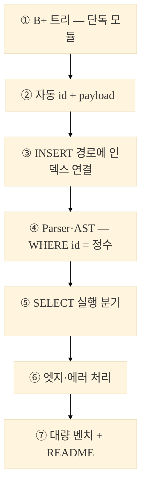
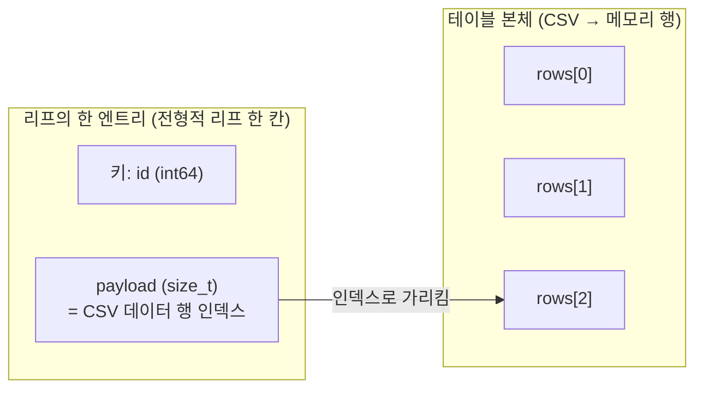
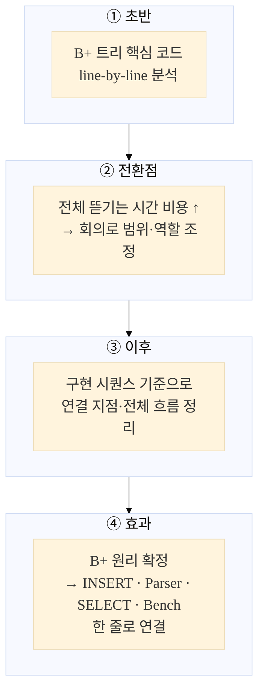

# WEEK7 Team 3 — 자동 ID + B+ 인덱스 / 대규모 성능 비교

---

## 1) 구현 시퀀스

가로 7칸(`LR`)은 슬라이드에서 글씨가 잘 작아지므로 **세로(`TB`) + `fontSize`** 로 바꿨습니다. (`init`을 지원하지 않는 뷰어는 [mermaid.live](https://mermaid.live)에서 PNG 내보내기.)




---

## 2) 구현 핵심




---

## 3) `malloc/calloc` vs `mmap`

---


| 구분    | `malloc/calloc`             | `mmap`                    |
| ----- | --------------------------- | ------------------------- |
| 대상    | 프로세스 메모리                    | 파일/메모리 매핑                 |
| 연결    | `BPNode *` 포인터로 부모·자식·리프 연결 | page id, offset 관리 필요     |
| 구현 범위 | 메모리 B+ 트리 구현에 집중            | 파일 페이지, flush, 저장 형식까지 커짐 |
| 선택    | 이번 과제에 적합                   | 디스크 기반 DB 구현에 가까움         |


---

## 4) B-tree vs B+ tree

### 3.1 내부 vs 리프 (개념만)

```
                        +------------------+
                        | 내부: 50 | 90    |  ← 라우팅용 복사 키
                        +--+--+--+--+--+--+
                           |     |     |
              +------------+     |     +------------+
              v                  v                  v
    +-------------------+ +-------------------+ +-------------------+
    | 리프: 10 20 30    | | 리프: 50 60 70    | | 리프: 90 100 …   |
    | pld pld pld       | | pld pld pld       | | pld  …            |  ← pld = payload(행 인덱스)
    +---------+---------+ +---------+---------+ +---------+---------+
              \-------------------+-------------------/
                        next 체인 (범위 스캔·개념도)
```

---

### 3.2 리프 한 블록

```
  리프 (메모리)
  +------+------+------+
  | id:5 | id:8 | id:12|   ← 검색 키 (정렬)
  +------+------+------+
  |pld:0 |pld:1 |pld:2 |   ← payload (CSV 데이터 행 인덱스)
  +------+------+------+
```

---


| 구분       | B-tree               | B+ tree                  |
| -------- | -------------------- | ------------------------ |
| 데이터 위치   | 내부 노드와 리프 노드 모두 가능   | 실제 key/payload는 리프에 모임   |
| 내부 노드 역할 | 데이터 저장 가능            | 길 안내용 separator key      |
| 리프 연결    | 필수 아님                | 리프끼리 `next`로 연결          |
| 강점       | 단건 검색에서 내부 노드 hit 가능 | 범위 검색, 정렬 순회, DB 인덱스에 유리 |


---

## 5) split 관점 차이 (B-tree vs B+ tree)

---


| 구분           | B-tree                 | B+ tree                        |
| ------------ | ---------------------- | ------------------------------ |
| 부모로 올라가는 key | 중간 key가 **이동**         | 오른쪽 리프 첫 key가 **복사**           |
| 아래 노드의 key   | 올라간 key가 빠질 수 있음       | 실제 key/payload는 리프에 남음         |
| 부모 key 의미    | 실제 데이터 key일 수 있음       | 탐색용 separator key              |
| 결과           | key/payload가 내부·리프에 분산 가능 | key/payload가 리프에 모여 range scan 유리 |

### 5.1 직관 다이어그램 — split 직후 구조

**B-tree:** overflow 시 **중간 키가 부모로 승격**하고, 그 키는 “구분자”로만 쓰이거나 아래 레벨에서는 빠질 수 있어 **내부·리프에 key가 흩어질 수 있음**.

```
  리프가 넘친 뒤 (개념)
           [ 30 ]                    ← 부모: 승격된 키
          /      \
   [10, 20]      [40, 50]            ← 30은 이 리프들에 “데이터 한 벌”로 남지 않을 수 있음
```

**B+ tree:** 리프를 나눈 뒤 **오른쪽 리프의 첫 키가 부모에 복사**되고, **실제 key/payload는 리프에 그대로** 남음.

```
  리프 split 직후 (개념)
           [ 30 ]                    ← 부모: 오른쪽 리프 첫 키의 “복사본” (separator)
          /      \
   [10, 20]      [30, 40, 50]       ← 30은 오른쪽 리프에도 존재 (range scan이 리프만 보면 됨)
```

---

## 협업 방식



| 구간  | 방식                                                |
| --- | ------------------------------------------------- |
| 초반  | B+ 트리 핵심 코드 중심으로 line-by-line 분석                  |
| 전환점 | 전체 코드를 모두 뜯는 방식은 시간이 커서 회의 후 범위 조정                |
| 이후  | 구현 시퀀스를 기준으로 전체 흐름과 연결 지점 파악                      |
| 효과  | B+ 트리 원리를 먼저 잡고 INSERT·Parser·SELECT·Bench 흐름을 연결 |


