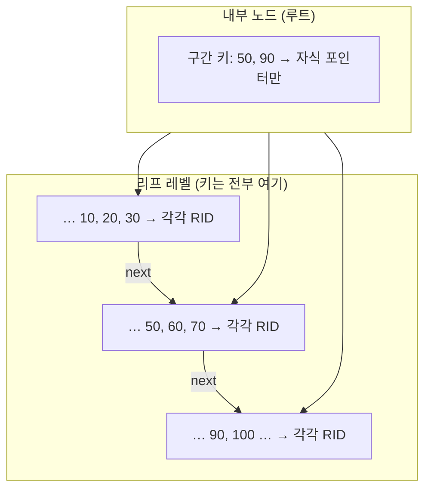
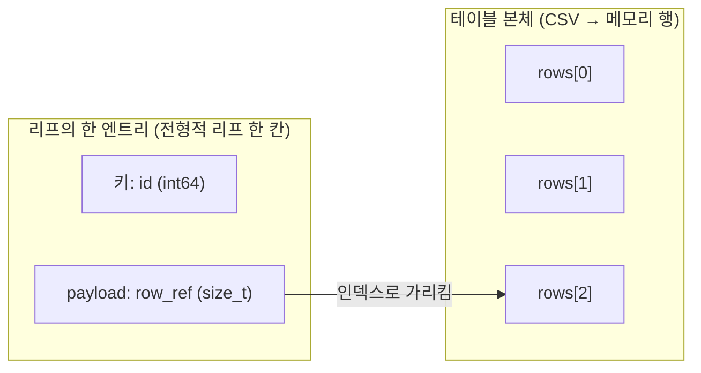
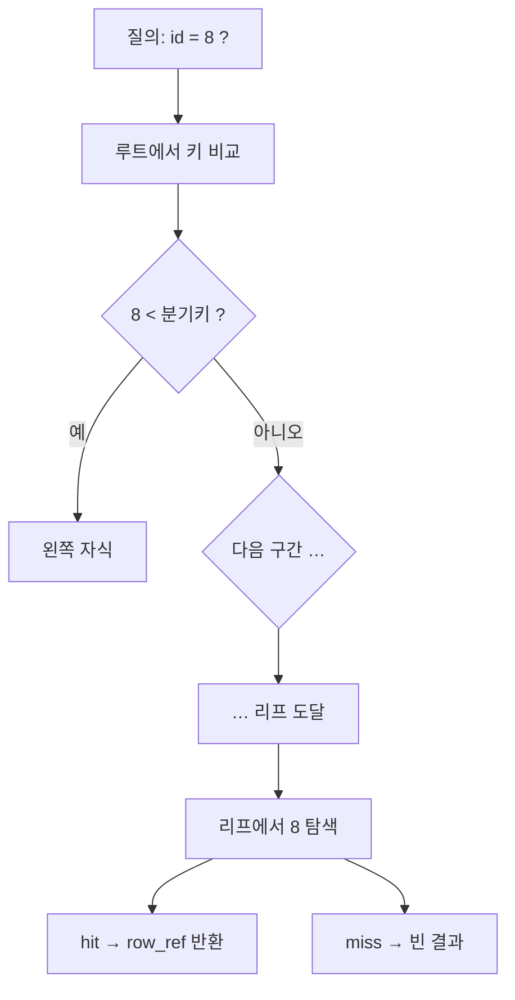
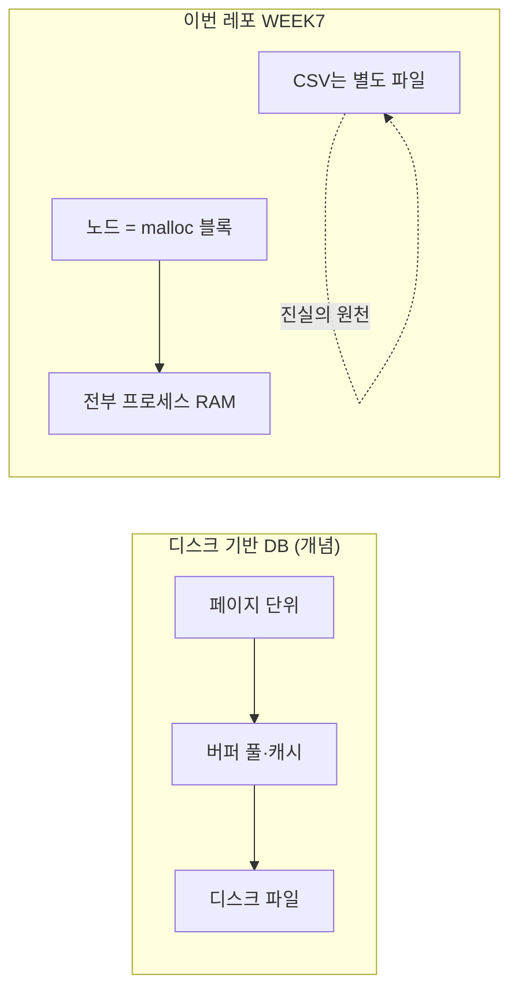
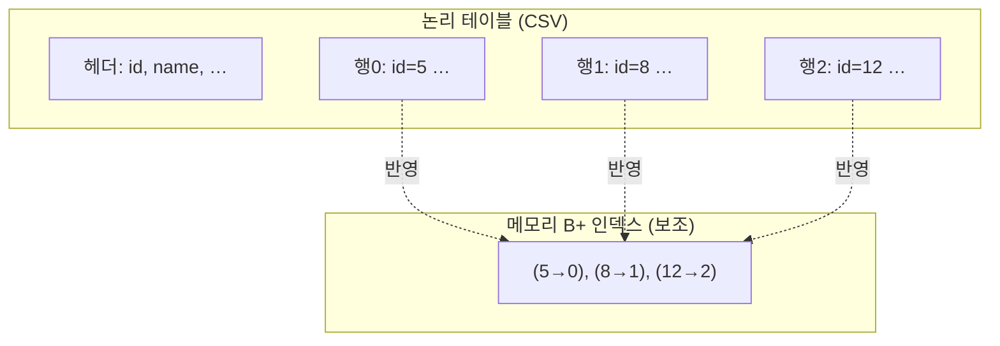
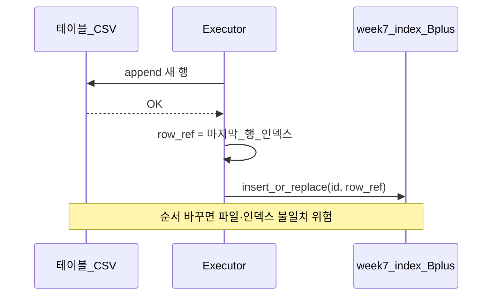
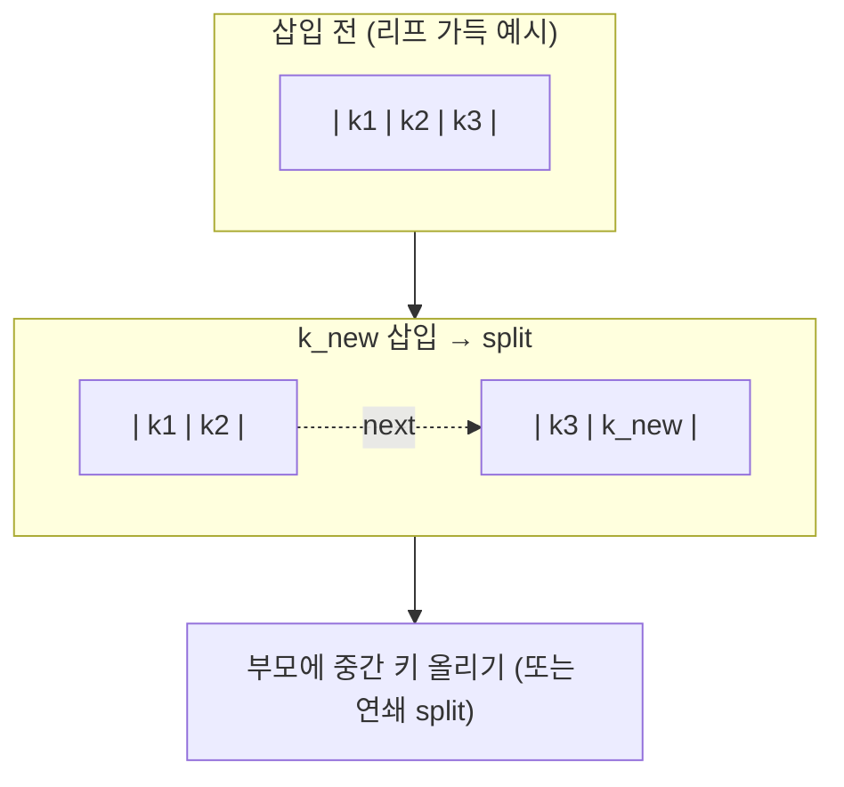
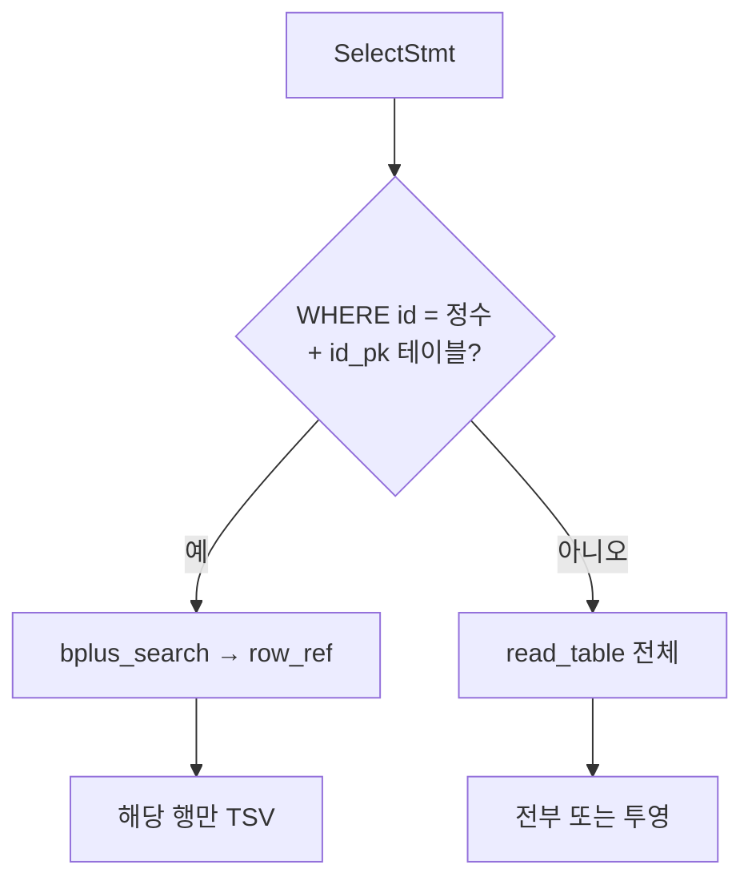
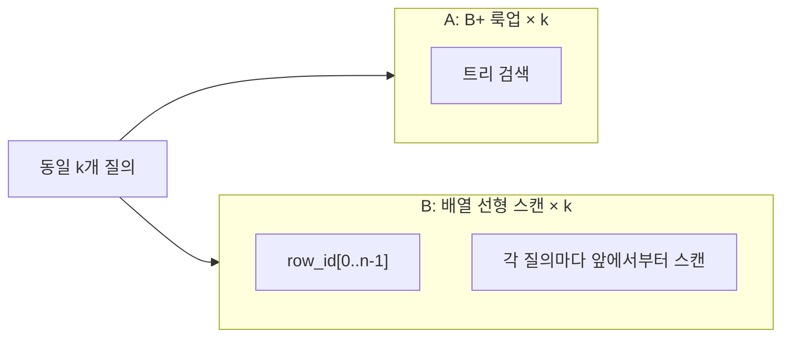

# WEEK7 시각 자료 — B+ 트리·인덱스 다이어그램

[`presentation-script.md`](presentation-script.md) **§2.4**와 [`presentation-script-full.md`](presentation-script-full.md)에도 아래와 **동일한 다이어그램**이 들어 있다. 발표 슬라이드·발표자 모니터에는 **이 파일만** 띄워도 된다.

---

## 발표 대본 — 3분 30초 이내

안녕하세요. 이번 WEEK7 과제는 기존 SQL 처리기에 **메모리 기반 B+ 트리 인덱스**를 붙이는 작업이었습니다.

먼저 전체 시퀀스는 다음과 같습니다.

```text
B+ 트리 단독 모듈
→ 자동 id + 행 참조(row_ref)
→ INSERT 경로에 인덱스 연결
→ 파서·AST: WHERE id = 정수
→ SELECT 실행 분기
→ 엣지·에러
→ 대량 벤치 + README
```

처음에는 SQL이나 CSV와 분리해서 B+ 트리만 단독으로 구현했습니다. 그다음 테이블 첫 컬럼이 `id`이면 자동 id를 부여하고, CSV의 몇 번째 행인지 나타내는 `row_index`를 `row_ref`로 사용했습니다. INSERT가 성공하면 B+ 트리에 `id -> row_index` 형태로 등록하고, SELECT에서 `WHERE id = 값` 조건이 있으면 이 인덱스를 타도록 연결했습니다.

메모리 구현 방식은 `mmap`이 아니라 `malloc/calloc`을 사용했습니다. 이번에 Malloc Lab을 공부하면서 둘을 비교해 봤는데, 이번 과제는 디스크 페이지 기반 DB가 아니라 메모리 안에서 동작하는 B+ 트리 인덱스를 SQL 처리기에 연결하는 것이 목표였습니다. 그래서 노드를 메모리에 만들고 포인터로 부모, 자식, 리프를 연결하기 쉬운 `malloc` 방식을 선택했습니다. `mmap`은 파일 페이지와 offset 관리까지 필요해서 구현 범위가 커진다고 판단했습니다.

B+ 트리를 공부하면서 B-tree와 B+ tree의 차이도 확인했습니다. B-tree는 내부 노드와 리프 노드 모두에 데이터를 저장할 수 있고, B+ tree는 내부 노드는 길 안내 역할을 하며 실제 key와 데이터 위치는 리프 노드에 모입니다. 또 리프 노드끼리 연결되어 있어서 범위 검색이나 정렬 순회에 유리합니다.

split 관점에서도 차이가 있습니다. B-tree는 중간 key를 부모로 이동시키는 느낌이고, B+ tree는 리프 split 때 오른쪽 리프의 첫 key를 부모에 복사해서 separator key로 사용합니다. 그래서 실제 key와 payload는 리프에 남고, 부모 key는 탐색을 위한 길 안내 역할을 합니다. 이 구조가 DB 인덱스에 적합하다는 점을 이해했습니다.

이제 데모를 보겠습니다. (데모 페이지를 연다)

먼저 자동 id 부여와 B+ 인덱스 등록 흐름입니다. 여기서 INSERT 문을 보면 id를 직접 넣지 않고 name과 email만 넣습니다. (자동 ID INSERT 버튼을 누른다) (SQL 실행 버튼을 누른다)

실행 결과를 보면 CSV에는 자동 id가 붙어서 저장되고, diff에서 새 row가 추가된 것을 확인할 수 있습니다. 이때 내부적으로는 append 성공 후 `id -> row_index`가 B+ 트리에 등록됩니다.

다음은 id 기반 조회입니다. (ID 기반 조회 버튼을 누른다) (SQL 실행 버튼을 누른다)

이 경우 기존처럼 CSV 전체를 훑는 것이 아니라, B+ 트리에서 id로 row_index를 찾고 해당 행을 출력합니다. 즉 기존 풀스캔 방식에서 인덱스 lookup 방식으로 SELECT 실행 경로가 분기됩니다.

마지막으로 대규모 성능 비교를 보겠습니다. (기본 vs 확장 동시 비교 버튼을 누른다)

여기서는 1,000,000건 기준으로 B+ 트리 lookup과 선형 탐색을 비교합니다. 결과를 보면 `index_lookup_sec`가 `linear_scan_sec`보다 훨씬 작게 나오고, `speedup` 값으로 차이를 확인할 수 있습니다. 이 벤치는 SQL 전체 I/O가 아니라, 인덱스 lookup과 선형 탐색의 CPU 비용을 비교한 것입니다.

마지막으로 협업 방식입니다. 처음에는 B+ 트리를 제대로 이해하려고 split, separator key, 리프 연결을 코드 line by line으로 뜯어봤습니다. 하지만 시간이 많이 걸려서, 회의 후에는 전체 시퀀스를 기준으로 흐름을 파악하는 방식으로 바꿨습니다. B+ 트리 단독 모듈부터 INSERT, WHERE 파싱, SELECT 분기까지 순서대로 보니 각 함수가 어디서 연결되는지 이해하기 쉬웠습니다.

정리하면, 이번 구현은 CSV 기반 SQL 처리기에 `id -> row_index` 형태의 메모리 B+ 트리 인덱스를 붙여서, `WHERE id = 값` 조회를 빠르게 만든 것입니다.

---

## 1) 전형적인 B+ 트리(개념도) — 디스크 엔진과의 대응

내부 노드는 **자식으로 가는 길**만 안내하고, **실제 검색 키는 리프**에 모인다고 생각하면 된다. 디스크 기반 DB에서는 리프 항목이 **RID / 페이지+슬롯** 같은 “행 위치”를 가리킨다. (특정 책이 아니라 **흔한 설명 그림**을 가정한다.)




**핵심 메시지**

- 내부: “50 미만은 왼쪽, 50 이상 90 미만은 가운데 …” 식의 **라우팅 키**.
- 리프: **정렬된 키 + 레코드 위치(포인터)**. 리프끼리 `next`로 잇면 범위 스캔.

---

## 2) 우리 구현과의 1:1 대응 (리프 = `id` + `row_ref`)

메모리에는 **페이지 객체가 없고**, 리프 한 칸이 곧 **(검색 키 id, payload = row_ref)** 한 쌍이다. `row_ref`는 CSV를 `read_table`로 읽었을 때의 **0-based 데이터 행 인덱스**다.




**핵심 메시지**

- 흔한 설명대로 “리프에 (키, RID)”가 있다면, 우리에선 **“(id, row_ref)”**로 옮겨 온 것에 가깝다.
- **RID 대신 row 번호**를 쓰는 이유: MVP가 **파일 한 덩어리 + 메모리 테이블** 모델이라, “몇 번째 데이터 행인지”가 곧 위치다.

---

## 3) ASCII — 개념도 한 장을 머릿속에 붙일 때

차수는 예시로만 작게 그렸다(실제 코드는 `BP_MAX_KEYS` 등 고정 차수).

### 3.1 내부 vs 리프 (개념만)

```
                        +------------------+
                        | 내부: 50 | 90    |  ← 라우팅용 복사 키
                        +--+--+--+--+--+--+
                           |     |     |
              +------------+     |     +------------+
              v                  v                  v
    +-------------------+ +-------------------+ +-------------------+
    | 리프: 10 20 30    | | 리프: 50 60 70    | | 리프: 90 100 …   |
    | RID RID RID       | | RID RID RID       | | RID  …            |
    +---------+---------+ +---------+---------+ +---------+---------+
              \-------------------+-------------------/
                        next 체인 (범위 스캔·개념도)
```

### 3.2 우리 리프 한 블록 (키 옆이 곧 `row_ref`)

```
  리프 (메모리)
  +------+------+------+
  | id:5 | id:8 | id:12|   ← 검색 키 (정렬)
  +------+------+------+
  | row:0| row:1| row:2|   ← payload = CSV 데이터 행 인덱스
  +------+------+------+
```

`WHERE id = 8` → 리프에서 `8` 찾음 → `row_ref = 1` → `rows[1]` 출력.

---

## 4) 검색 한 번 — 루트에서 리프까지 (흐름)




**핵심 메시지**

- 높이만큼 **내부에서 몇 번** 갈림길을 탄 뒤, **리프 한 번**에서 키 일치를 본다 → O(\log n) 직관.

---

## 5) 디스크 B+ vs 우리 메모리 B+ (한눈에)




**핵심 메시지**

- **트리 구조·리프 payload 개념**은 위와 같은 일반적인 B+ 설명과 같다.
- **없는 것**: 페이지 경계, 디스크 I/O를 줄이는 리프 배치, latch 등.

---

## 6) 테이블 본체 vs 인덱스 (논리적 두 층)




**핵심 메시지**

- 본체는 **파일에 누적되는 행들**; 인덱스는 **id → 행 번호**를 빨리 찾기 위한 사전.
- 프로세스 종료 시 인덱스는 사라져도, 다음에 CSV를 읽어 **다시 채울 수 있다**.

---

## 7) INSERT 직후 — 파일과 트리를 맞추는 순서




---

## 8) split 직관 (한 줄로 그리기)

가득 찬 리프에 키가 하나 더 들어오면 **한 노드를 둘로 쪼갠다**. 부모에도 자리가 없으면 **부모도 분할**이 올라간다.




---

## 9) SELECT 두 갈래 (인덱스 vs 풀스캔)




**핵심 메시지**

- 질의 모양에 따라 **완전히 다른 실행 경로**가 된다(대본 §6과 동일).

---

## 10) `bench_bplus compare`가 격리하는 것




**핵심 메시지**

- SQL·CSV I/O 없이 **CPU에서만** “로그 높이 vs O(n) 스캔” 차이를 본다.

