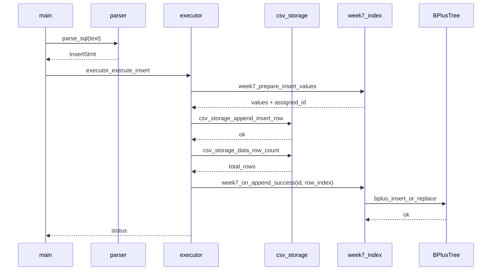
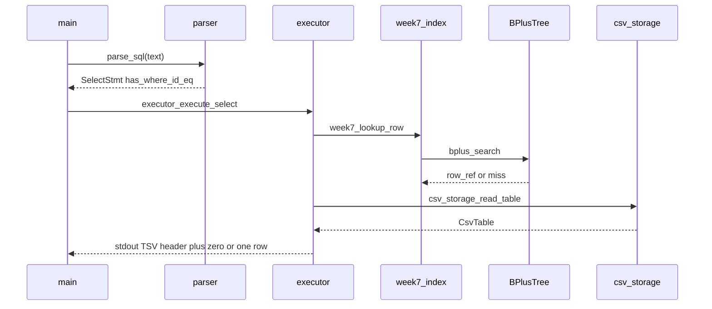
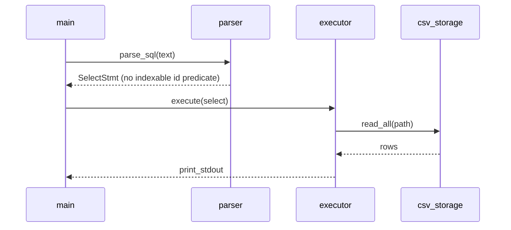
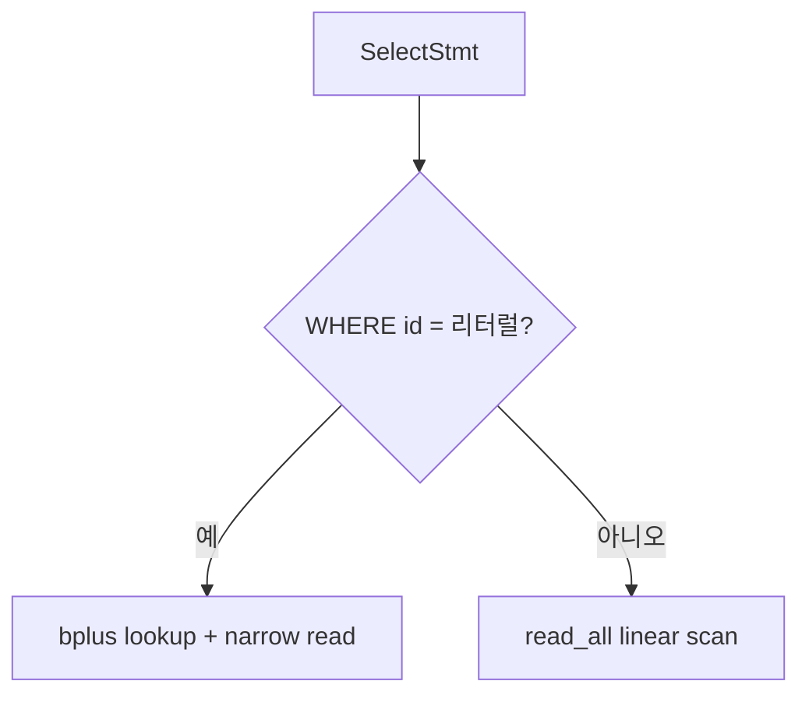

# WEEK7 공부용 — 실행 시퀀스 (B+ 인덱스 연계)

> **스펙 정본은 아님.** `docs/01`~`04`가 우선이며, 구현이 굳어지면` docs/02-architecture.md `§6.3·`docs/03-api-reference.md`에 반영한다.   MVP(6주차) 시퀀스는 **`docs/02-architecture.md` §6.1 ~ 6.2** — 이 파일은 **그 위에 덧씌우는 WEEK7 흐름만** 모은다.

---

## 1. INSERT — CSV append 이후 인덱스 등록

`append_row`가 성공한 뒤, **같은 문장 처리 안**에서 트리에 넣는 순서가 자연스럽다(실패 시 롤백 정책은 팀에서 단순하게 정하면 됨).

**짚을 점 (현재 구현)**

- `row_ref` = **0-based 데이터 행 인덱스**(`csv_storage_read_table`의 `rows[row_ref]`).
- `week7_prepare_insert_values` 가 첫 컬럼 `id` 인 경우 자동 `id` 를 넣은 `SqlValue` 배열을 만든다.
- 인덱스 삽입 실패 시: **현재는 -1 반환**(CSV 줄은 이미 append됨). 엄격 롤백은 미구현 — `docs/03-api-reference.md` 에 한 줄 남기면 발표 시 설명 가능.

---

## 2. SELECT — `WHERE id = 상수` (인덱스 경로)

풀스캔이 아니라, **키 한 번 조회 → 해당 행만 읽기**로 줄이는 그림이다.

**짚을 점 (현재 구현)**

- `miss`(키 없음): **헤더만** 출력, 데이터 행 없음 — `docs/03-api-reference.md` §4.2 WEEK7 절.
- 행 내용은 `read_row` 단일 API가 아니라 `**read_table` 후 `rows[row_ref]` 만 출력**한다(대용량에서 I/O는 여전히 전체 읽기 — 벤치 비교 시 README에 명시).

---

## 3. SELECT — 인덱스를 타지 않는 경우 (비교·벤치용)

`WHERE`가 없거나, `id`가 아닌 컬럼이면 **기존 MVP와 동일하게** `read_all`에 가깝게 동작시키면 벤치 비교가 쉽다.

---

## 4. 한 페이지로 보는 분기 (요약)

이 다이어그램은 **실행기(또는 얇은 planner)** 안의 분기만 요약한 것이다.

---

## 5. 정본 문서와의 역할 나누

| 문서                                       | 역할                         |
| ---------------------------------------- | -------------------------- |
| `docs/02-architecture.md` §6.1~6.2       | MVP 시퀀스 (변경 최소)            |
| `docs/02-architecture.md` §6.3           | WEEK7 상세는 **이 파일**을 본다고 안내 |
| 본 파일                                     | WEEK7 **공부·설계**용 시퀀스 전개    |
| `[assignment.md](assignment.md)`         | 과제 체크리스트                   |
| `[learning-guide.md](learning-guide.md)` | 개념·읽기 순서                   |

---

## 6. 벤치 (`bench_bplus compare`)

`bench_bplus compare n k` 는 **CSV/SQL 없이** `n`개 키를 B+ 트리에 넣은 뒤, 동일한 `k`개 질의에 대해 **트리 검색**과 **행 배열 선형 스캔** 시간을 나란히 낸다. `SELECT … WHERE id` 가 쓰는 룩업 비용과, 풀스캔에 가까운 **행 단위 비교 반복** 비용을 CPU만으로 분리해 비교할 때 쓴다.