# WEEK7 단계별 구현 가이드 (1~7) + 시퀀스 다이어그램

이 문서는 WEEK7 구현을 1~7단계로 나눠, 각 단계의 핵심 목표/함수 역할/시퀀스를 한 번에 볼 수 있게 정리한 참고 문서다.

---

## 1단계 — B+ 트리 단독 모듈

## 1단계 핵심 목표

- SQL/CSV 의존 없이 순수 B+ 트리 삽입·검색이 동작해야 함
- 노드 최대 키(`BP_MAX_KEYS`) 초과 시 리프/내부 분할이 정확해야 함
- 중복 키 정책을 명확히 분리해야 함
  - `bplus_insert`: 중복 거부
  - `bplus_insert_or_replace`: payload 갱신

### 해설

1단계는 이후 단계의 전제다. 여기서 트리 불변식(정렬, 분할, 부모 연결)이 흔들리면 2~5단계에서 보이는 증상은 executor/parser 버그처럼 보여도 실제 원인이 트리일 가능성이 크다.  
즉, SQL 연동 전에 트리 단독 테스트를 통과시키는 것이 전체 개발 시간을 가장 많이 절약한다.

### 요점 포인트

- `find_leaf`가 항상 같은 key에 대해 같은 리프 경로를 선택해야 한다.
- 분할 후 `sep` 선택 규칙(오른쪽 첫 키)을 일관되게 유지해야 부모 탐색 구간이 깨지지 않는다.
- `parent`/`kids` 재배치 누락은 분할 연쇄 시 치명적인 메모리/논리 오류로 이어진다.
- `insert`와 `insert_or_replace`의 중복 키 정책을 혼동하지 않는다.

---

## 함수별 역할

- `bplus_create() / bplus_destroy()`
  - 트리 생성/전체 메모리 해제
  - 초기 루트는 빈 리프
- `find_leaf(t, key)` (static)
  - 루트부터 리프까지 내려가 삽입/검색 대상 리프 결정
- `bplus_search(t, key, &payload)`
  - 대상 리프에서 키 탐색 후 payload 반환
- `leaf_insert_sorted(...)` (static)
  - 리프 여유 있을 때 정렬 유지 삽입
- `leaf_split_insert(...)` (static)
  - 꽉 찬 리프 + 새 키를 임시 병합 후 좌/우 리프로 분할
  - 부모에 올릴 `sep`(오른쪽 첫 키) 계산
- `internal_split_insert(...)` (static)
  - 꽉 찬 내부 노드 분할, 중간 키를 상위로 승격
- `insert_into_parent(...)` (static)
  - 분할 결과를 부모에 반영
  - 부모도 꽉 차면 재귀적으로 상위 전파
- `bplus_insert_or_replace(...)`
  - 동일 키 재삽입 시 payload만 최신 row_ref로 갱신

---

## 1단계 관점 전체 시퀀스

### A) 검색

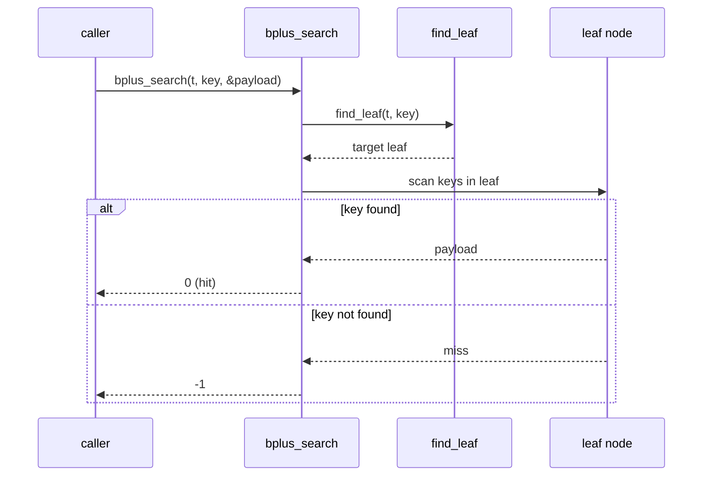

1. `find_leaf`로 경로 하강
2. 리프에서 키 선형 탐색
3. hit면 payload 반환, miss면 -1

### B) 삽입(여유 있음)

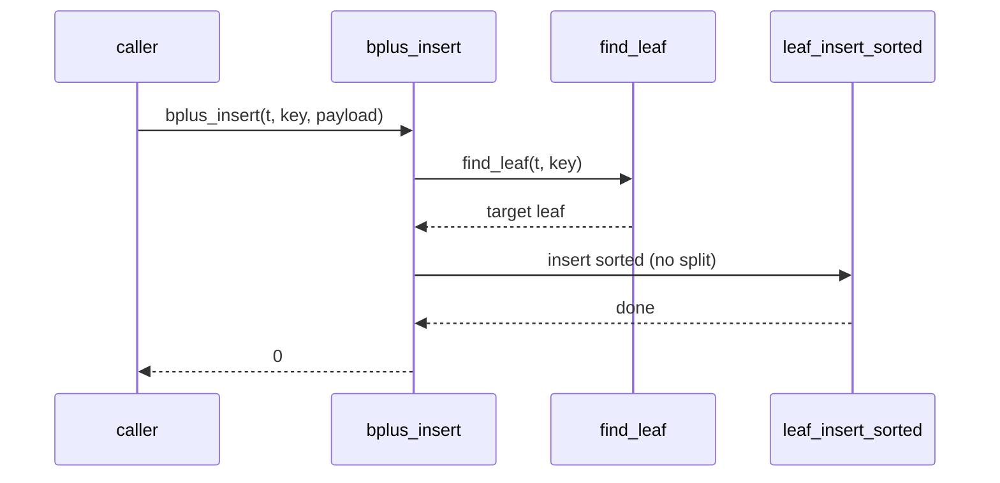

1. `find_leaf`
2. `leaf_insert_sorted`
3. 종료

### C) 삽입(리프 꽉 참)

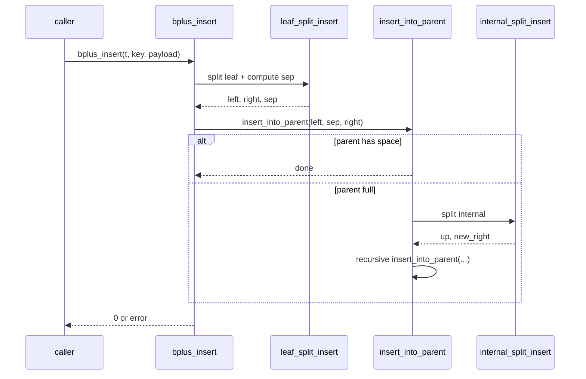

1. `leaf_split_insert`로 좌/우 리프 분할 + `sep` 계산
2. `insert_into_parent(left, sep, right)`
3. 부모 꽉 차면 내부 분할 재귀
4. 루트까지 전파되면 새 루트 생성 가능

=> 트리 균형/정렬 불변식 유지

---

# 2단계 — 자동 `id` + row_ref 기반 인덱스 상태 준비

## 2단계 핵심 목표

- `id` PK 테이블이면 인덱스가 `(id -> row_ref)`를 가져야 함
- `row_ref`는 0-based 데이터 행 인덱스
- INSERT 때 자동 `id`를 안정적으로 할당해야 함

### 해설

2단계는 "조회 최적화" 단계라기보다 "상태 정렬" 단계다. CSV(디스크 상태)와 인덱스(메모리 상태)를 맞춰 두는 준비가 핵심이다.  
특히 프로세스 재시작 이후에도 `week7_ensure_loaded`를 통해 기존 CSV를 다시 읽어 인덱스를 복원해야, `WHERE id=...`와 자동 `id`가 일관되게 동작한다.

### 요점 포인트

- `row_ref` 정의는 헤더 제외 0-based로 고정한다.
- `ensure_loaded`는 멱등이어야 한다(여러 번 불러도 상태가 안정적이어야 함).
- 자동 `id`는 `next_id` 하나로만 관리해 중복·역행을 막는다.
- 인덱스 반영은 append 성공 이후에만 수행해야 CSV/인덱스 불일치를 줄일 수 있다.

---

## 함수별 역할

- `csv_storage_read_table(table, &t)`
  - CSV 전체(헤더+행)를 읽어 메모리 구조로 만듦
  - `week7_ensure_loaded`에서 기존 데이터로 인덱스 재구축할 때 사용
- `csv_storage_column_count(table, &out_count)`
  - 헤더 컬럼 수 확인
  - INSERT 값 개수 검증(자동 id 붙였을 때 컬럼 수 맞는지) 보조
- `csv_storage_append_insert_row(table, values, value_count)`
  - 실제 INSERT를 CSV 파일 끝에 append
  - "디스크 반영"의 기준점
- `csv_storage_data_row_count(table, &out_count)`
  - 헤더 제외 데이터 행 수
  - append 직후 `row_ref = count - 1` 계산에 사용(마지막 줄 인덱스)

---

## 2단계 관점 전체 시퀀스

### A) 초기 로드(ensure)

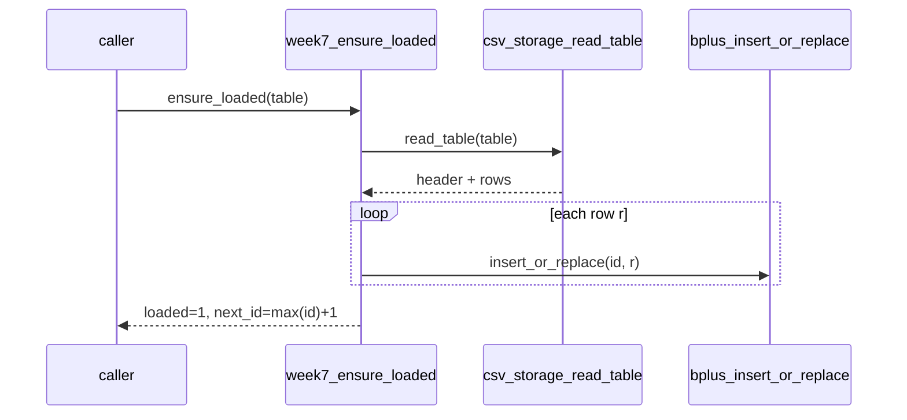

1. `read_table`로 기존 CSV 읽기
2. 각 데이터 행의 `id`를 꺼내 인덱스에 `(id -> row_index)` 삽입
3. 최대 `id`로 `next_id` 계산

=> 프로그램 재시작 후에도 인덱스 상태 복원 가능

### B) INSERT 준비

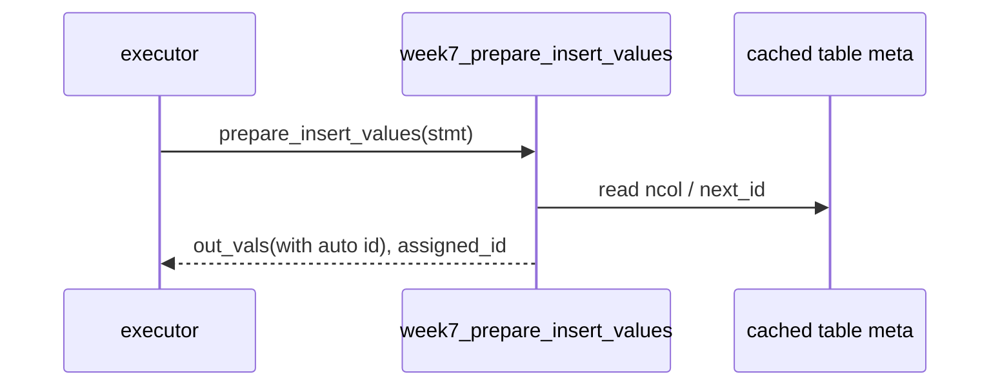

1. `column_count`/헤더 정보를 기준으로 값 개수 확인
2. `next_id`를 첫 컬럼에 채운 새 value 배열 준비

=> 자동 id 부여 일관성 확보

### C) INSERT 성공 후 동기화

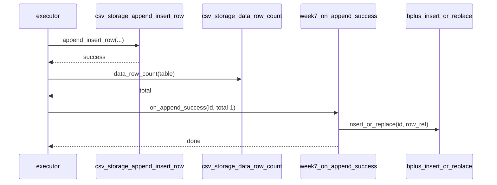

1. `append_insert_row` 성공
2. `data_row_count`로 현재 데이터 행 수 조회
3. `row_ref = total-1` 계산
4. 인덱스에 `(assigned_id -> row_ref)` 반영

=> CSV와 인덱스가 같은 행을 가리키게 맞춤

---

# 3단계 — INSERT 경로 인덱스 연동

## 3단계 핵심 목표

- CSV append와 인덱스 갱신 순서를 고정해 불일치 최소화
- 자동 id 부여 결과(`assigned_id`)를 append 결과 행(`row_ref`)와 정확히 매핑
- INSERT 직후 `WHERE id=...` 조회가 같은 행을 가리키게 보장

### 해설

3단계는 2단계에서 준비한 상태를 실제 실행 경로에 연결하는 단계다.  
핵심은 "쓰기 성공 후 반영" 순서 고정이다. append 실패인데 인덱스만 갱신되거나, 반대로 append 성공 후 인덱스 갱신이 빠지면 조회 일관성이 깨진다.

### 요점 포인트

- 흐름은 `prepare -> append -> row_ref 계산 -> index update` 순서로 고정한다.
- 각 단계 실패 시 즉시 반환해 다음 단계를 실행하지 않는다.
- `assigned_id`와 `row_ref` 짝이 틀리면 `WHERE id`가 다른 행을 가리킨다.

---

## 함수별 역할

- `executor_execute_insert(...)`
  - INSERT 실행 오케스트레이션
- `week7_prepare_insert_values(...)`
  - id PK 테이블이면 자동 id가 포함된 값 배열 준비
- `csv_storage_append_insert_row(...)`
  - 실제 파일 append
- `csv_storage_data_row_count(...)`
  - append 후 현재 데이터 행 수 조회
- `week7_on_append_success(table, assigned_id, row_index)`
  - `(id -> row_index)` 인덱스 반영 + `next_id` 보정

---

## 3단계 관점 전체 시퀀스

### A) 성공 경로 — 순서 고정

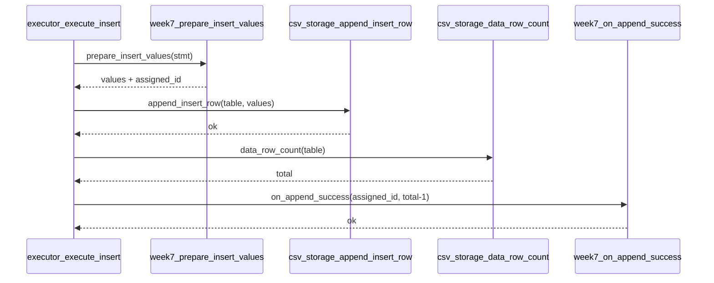

1. `prepare_insert_values`로 실제 쓰기 값 준비
2. `append_insert_row` 성공
3. `data_row_count`로 `row_ref = total - 1` 계산
4. `on_append_success`로 인덱스 동기화

**목표 매핑:** `CSV append와 인덱스 갱신 순서를 고정`

### B) 실패 경로 — 불일치 최소화

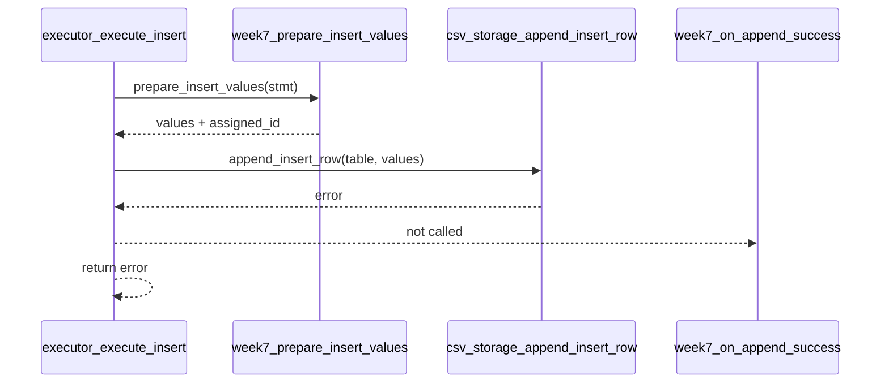

1. append가 실패하면 즉시 종료
2. `week7_on_append_success`를 호출하지 않음

**목표 매핑:** `append 실패 시 인덱스 갱신을 막아 불일치 최소화`

### C) INSERT 직후 조회 일치 확인

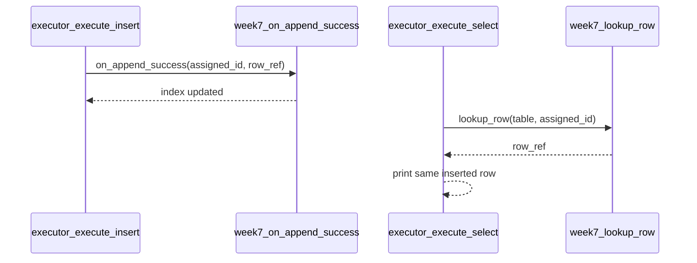

1. INSERT 성공 시 `(assigned_id -> row_ref)` 반영
2. 같은 `id`를 `WHERE id = ...`로 조회하면 동일 `row_ref`를 찾음

**목표 매핑:** `assigned_id`와 `row_ref`를 정확히 매핑해 직후 조회 일관성 보장

---

## 4단계 — 파서/AST `WHERE id = 정수` 추가

## 4단계 핵심 목표

- 지원 문법을 명시적으로 제한: `WHERE id = <int>`만 허용
- 파싱 결과를 AST에 저장해 executor가 분기 가능하게 함
- 미지원 WHERE 패턴은 실행기가 아니라 파서에서 거부

### 해설

4단계의 핵심은 기능 확장보다 입력 범위 통제다. parser에서 지원 범위를 좁게 고정하면 executor는 AST 플래그만 보고 단순 분기할 수 있어 오류 표면적이 줄어든다.  
즉 "어디까지 지원하는지"를 parser에서 명확히 선언하는 단계다.

### 요점 포인트

- `WHERE id = <int>` 외 패턴은 parse error로 명시적으로 실패시킨다.
- AST 필드(`has_where_id_eq`, `where_id_value`)가 executor 계약의 중심이다.
- lexer 토큰 추가 시 parser/테스트/해제 경로까지 함께 맞춘다.

---

## 함수/심볼 역할

- `lexer`
  - `TOKEN_WHERE`, `TOKEN_EQ` 토큰 제공
- `parser_parse_select(...)`
  - `SELECT ... FROM ... [WHERE id = int]` 파싱
- `SelectStmt`
  - `has_where_id_eq`, `where_id_value` 필드로 조건 전달
- `ast_select_stmt_free(...)`
  - 신규 AST 필드 포함 메모리 해제 일관성 유지

---

## 4단계 관점 전체 시퀀스

### A) WHERE 없음 — 기본 SELECT 경로

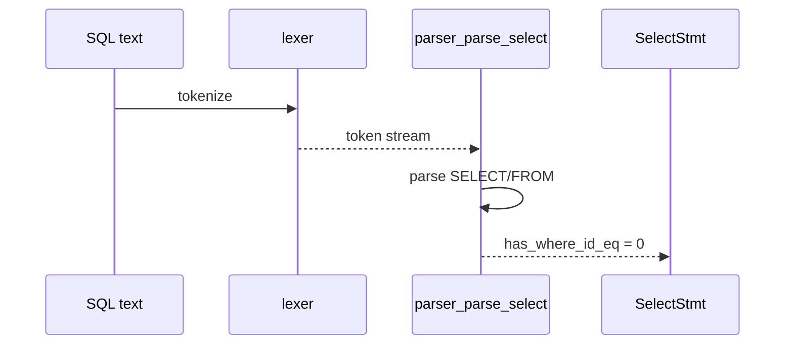

1. `SELECT ... FROM ...` 구문만 파싱
2. WHERE가 없으면 AST에 `has_where_id_eq = 0`

**목표 매핑:** 기본 SELECT 파싱 안정성 유지

### B) WHERE id = 정수 — 성공 경로

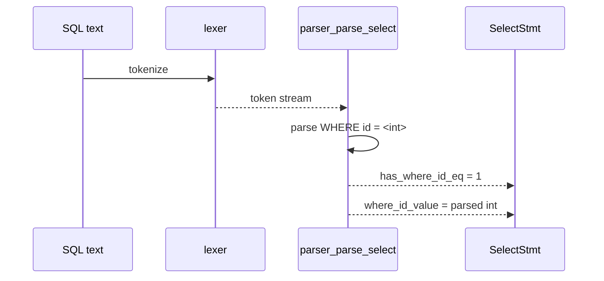

1. WHERE가 있으면 `id`, `=`, `정수` 순서 강제
2. 성공 시 `has_where_id_eq`, `where_id_value`를 AST에 저장

**목표 매핑:** executor가 분기 가능한 형태로 AST 전달

### C) 미지원 WHERE — 실패 경로

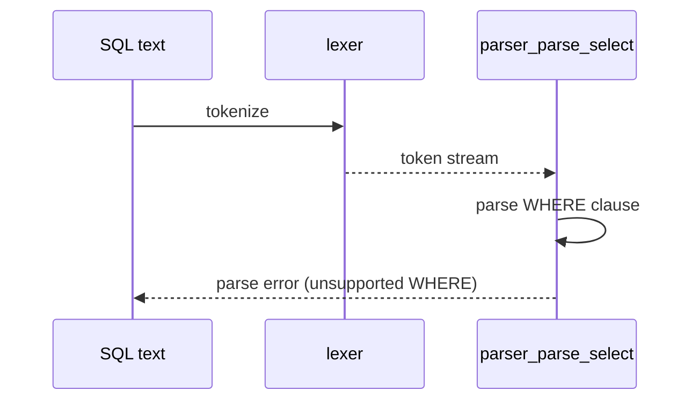

1. `WHERE id > 1`, `WHERE name = 1` 등 미지원 패턴 감지
2. parser 단계에서 즉시 parse error 반환

**목표 매핑:** 지원 범위를 parser에서 명시적으로 제한

---

## 5단계 — SELECT 실행 분기(인덱스 vs 기존 경로)

## 5단계 핵심 목표

- `WHERE id = ...`는 인덱스 경로로 row_ref 조회
- 그 외 SELECT는 기존 CSV 읽기 경로 유지
- hit/miss/비대상 테이블 정책을 명확히 분리

### 해설

5단계는 사용자 관점에서 "기능이 완성되는 단계"다. 다만 새 경로를 추가하면서 기존 경로를 깨지 않게 유지하는 것이 더 중요하다.  
즉 인덱스 경로 도입과 회귀 안정성을 동시에 달성해야 한다.

### 요점 포인트

- `WHERE id`는 인덱스 경로, 그 외는 기존 경로로 명확히 분리한다.
- hit/miss 출력 계약(헤더 출력 포함)을 고정한다.
- id PK 비대상 테이블 처리 정책을 일관되게 유지한다.
- 기존 `SELECT `*/컬럼 프로젝션 결과와의 회귀를 반드시 확인한다.

---

## 단계 간 연결 포인트(요약)

- **1 -> 2**: 트리 신뢰성이 확보돼야 CSV 로드 인덱싱이 가능하다.
- **2 -> 3**: 준비된 `next_id`/`row_ref` 규칙을 실제 INSERT 경로에 반영한다.
- **3 -> 4**: 쓰기 경로를 안정화한 뒤 읽기 조건 문법을 제한적으로 확장한다.
- **4 -> 5**: AST 조건을 기반으로 실행 경로를 인덱스/기존으로 분기한다.

---

## 함수별 역할

- `executor_execute_select(...)`
  - 전체 SELECT 분기 처리
- `week7_ensure_loaded(...)`
  - 조회 전에 인덱스 준비 보장
- `week7_table_has_id_pk(...)`
  - 인덱스 대상 테이블인지 확인
- `week7_lookup_row(...)`
  - `id -> row_ref` 조회
- `csv_storage_read_table(...)`
  - 출력 포맷용 헤더/행 데이터 읽기(현재 구현 기준)

---

## 5단계 관점 전체 시퀀스

### A) WHERE id 경로 — hit

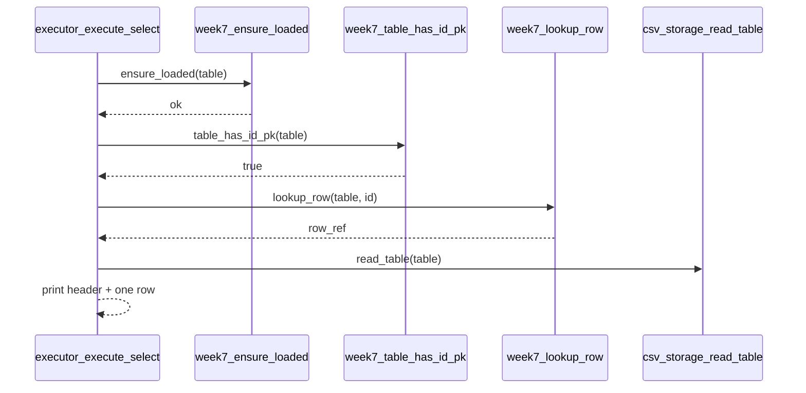

1. `ensure_loaded`
2. `table_has_id_pk` 확인
3. `lookup_row` hit으로 row_ref 조회
4. 헤더 + 해당 1행 출력

**목표 매핑:** 인덱스 경로 단건 조회 성공 확인

### B) WHERE id 경로 — miss

1. `lookup_row` miss
2. 데이터 행 없이 헤더만 출력

**목표 매핑:** miss 정책(헤더 only) 고정

### C) 비-WHERE(기존 경로)

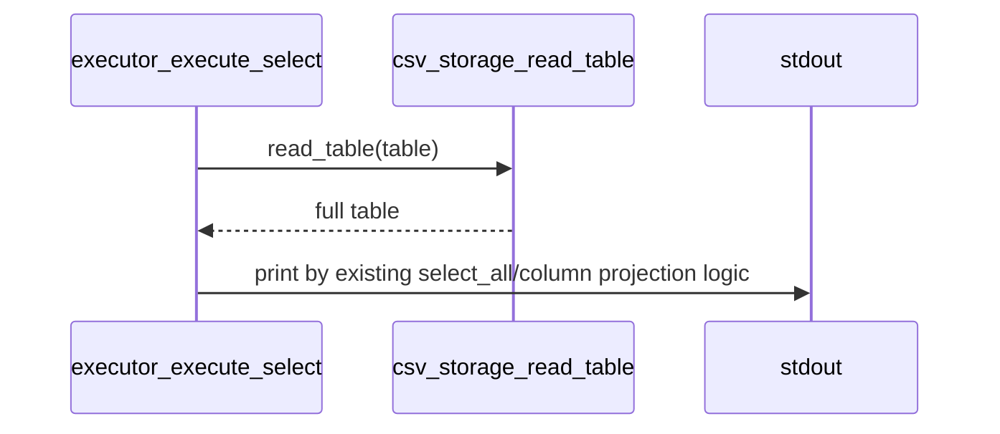

1. `csv_storage_read_table`
2. 기존 `select_all`/컬럼 선택 로직으로 출력

**목표 매핑:** 새 기능 추가 후에도 기존 SELECT 회귀 유지

---

## 6단계 — 엣지·에러

## 6단계 핵심 목표

- 없는 id, 빈 테이블, 파싱 실패, I/O 실패 등에서 종료 코드/출력 계약을 일치시킨다.
- miss(정상 0)와 parse error(비정상) 같은 경계 동작을 명확히 구분한다.

### 해설

6단계는 기능 추가보다는 계약 확정 단계다.  
동일한 입력에서 팀원 환경마다 결과(출력/exit code)가 달라지지 않도록 에러 경로를 정리한다.

### 요점 포인트

- `WHERE id` miss는 실패가 아니라 정상 결과(헤더 only)로 고정한다.
- 문법 위반은 parser 단계에서 parse error로 떨어져야 한다.
- I/O 실패는 실행 오류로 분리해 stderr/exit code를 일관되게 유지한다.

---

## 함수별 역할

- `sql_processor_run_file(...)`
  - 문장 단위 실행 루프와 종료 코드 매핑
- `parser_parse_select(...)`
  - 문법 위반(미지원 WHERE) 감지
- `executor_execute_select(...)`
  - miss/비대상 테이블/실행 오류 분기
- `week7_lookup_row(...)`
  - 인덱스 hit/miss 반환

---

## 6단계 관점 전체 시퀀스

### A) WHERE id miss — 정상 경로

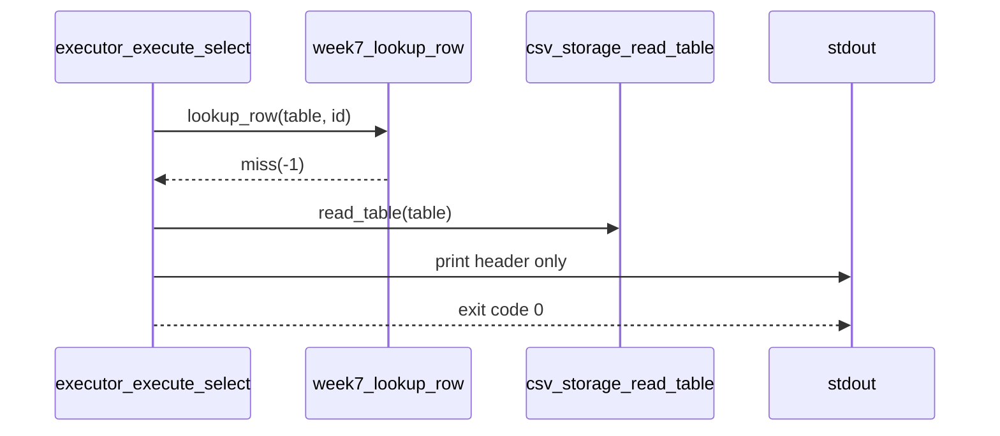

1. `lookup_row` miss
2. 헤더만 출력
3. 종료 코드는 정상(0)

**목표 매핑:** miss를 정상 결과로 일관되게 유지

### B) 미지원 WHERE — parse error

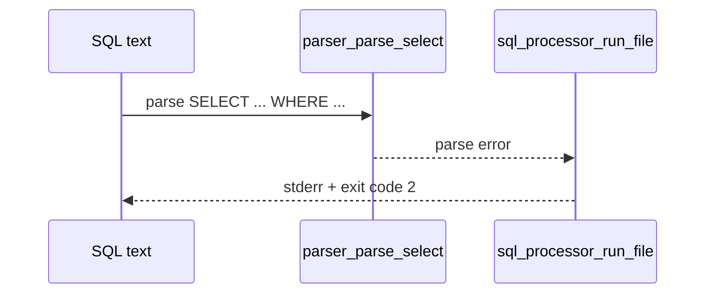

1. 미지원 WHERE 패턴 감지
2. parser에서 즉시 parse error
3. 문서 계약에 맞는 비정상 종료 코드 반환

**목표 매핑:** 문법 위반과 실행 실패를 구분

### C) I/O 실패 — 실행 오류

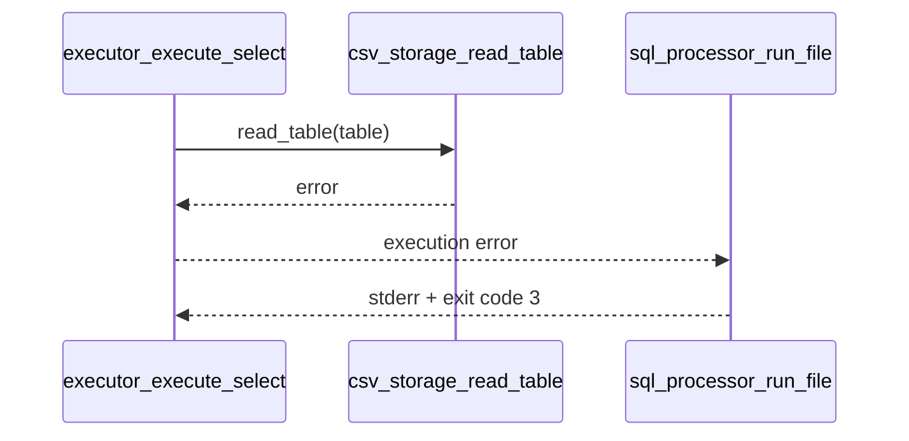

1. CSV 읽기/쓰기 실패 감지
2. 실행 오류로 분류
3. 실행 오류 코드로 종료

**목표 매핑:** 런타임 실패 경로 계약 고정

---

## 7단계 — 대량 벤치

## 7단계 핵심 목표

- `bench_bplus`로 인덱스 룩업 vs 선형 스캔 차이를 재현 가능한 형태로 제시한다.

### 해설

7단계는 성능 수치의 "재현성"을 확보하는 단계다.  
한 번 빠르게 나온 결과보다, 같은 명령을 다시 실행해 유사한 결론을 얻는 흐름이 더 중요하다.

### 요점 포인트

- `compare n k`는 CPU 룩업 비교이며 SQL 전체 경로와 목적이 다르다는 점을 분리해 설명한다.
- 수치 차이는 절대값보다 비율/경향 중심으로 해석한다.

---

## 함수별 역할

- `run_full(n)` (`bench_bplus.c`)
  - 대량 삽입 + 전체 검색 검증
- `run_compare(n, k)` (`bench_bplus.c`)
  - 동일 질의 집합에 대해 인덱스/선형 탐색 시간 비교
- `prng(...)`
  - 재현 가능한 질의 시퀀스 생성

---

## 7단계 관점 전체 시퀀스

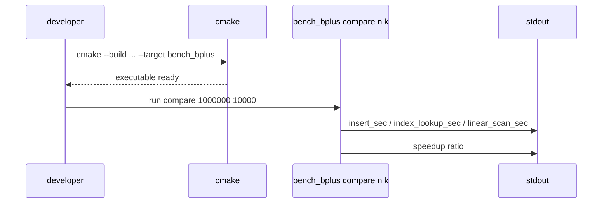

1. `bench_bplus` 타깃 빌드
2. `compare n k` 실행
3. 인덱스/선형 스캔 시간을 함께 수집

**목표 매핑:** 빌드부터 측정까지 하나의 재현 가능한 벤치 경로로 확인

