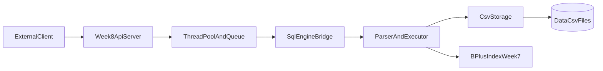
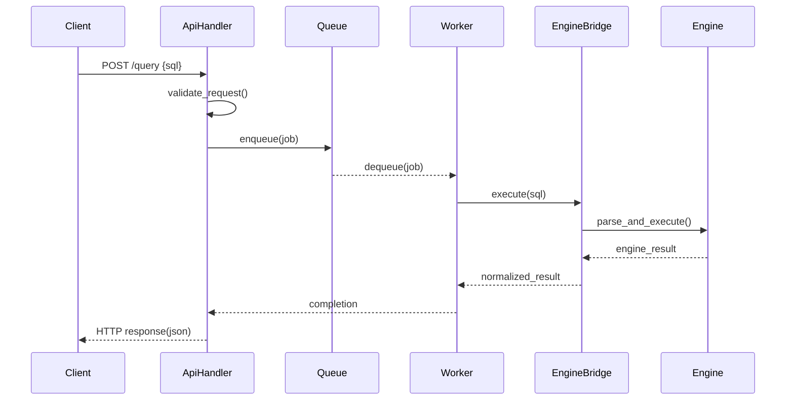
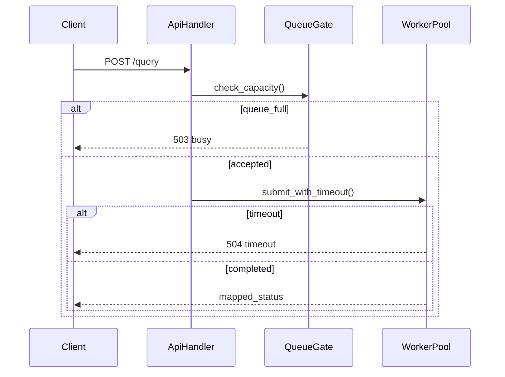

# WEEK8 Architecture — 미니 DBMS API 서버

이 문서는 WEEK8 범위에서 API 서버를 도입하기 위한 아키텍처를 정의합니다.  
기존 SQL 엔진의 정본 구조는 `docs/02-architecture.md`를 따르며, 본 문서는 **서버 계층과 동시성 계층 확장분**에 집중합니다.

## 1) 아키텍처 목표

- 외부 클라이언트가 HTTP로 SQL 실행을 요청할 수 있다.
- 요청을 Thread Pool로 병렬 처리한다.
- 기존 SQL 처리기(파서/실행기/CSV/B+ 트리)를 재사용한다.
- 과부하/오류 상황에서도 일관된 응답 계약을 유지한다.

## 2) 시스템 컨텍스트

핵심은 API 서버가 엔진을 직접 재구현하지 않고 `EngineBridge`를 통해 호출한다는 점입니다.

## 3) 계층 구조 및 책임

### 3.1 API Layer

- 엔드포인트:
  - `GET /health`
  - `POST /query`
- 책임:
  - 요청 JSON 검증
  - 요청 ID/타임아웃/메타데이터 설정
  - 내부 오류를 HTTP 응답으로 매핑

### 3.2 Concurrency Layer

- 구성:
  - 고정 크기 `ThreadPool`
  - `bounded queue`
- 책임:
  - Job 스케줄링
  - 과부하 시 백프레셔(즉시 거절 또는 제한 대기)
  - graceful shutdown 시 in-flight 요청 배수

### 3.3 Engine Bridge Layer

- 책임:
  - SQL 문자열을 기존 엔진 호출 경로로 전달
  - 엔진 결과를 API 직렬화 가능한 구조로 변환
  - 엔진 오류를 표준 오류 타입으로 정규화

### 3.4 Engine Layer (기존 재사용)

- Parser/Executor/Storage/B+트리
- 책임:
  - SQL 해석 및 실행
  - CSV 읽기/쓰기
  - `id` 기반 인덱스 조회/삽입

## 4) 요청 처리 시퀀스

### 4.1 정상 요청 (`POST /query`)

### 4.2 과부하/타임아웃

## 5) 데이터 및 인터페이스 계약

### 5.1 API 요청/응답 모델(개념)

- Request
  - `requestId` (optional)
  - `sql` (required)
  - `timeoutMs` (optional)
- Response(success)
  - `ok: true`
  - `data: { headers, rows, affectedRows }`
  - `metadata: { requestId, latencyMs }`
- Response(error)
  - `ok: false`
  - `error: { code, message }`
  - `metadata: { requestId }`

### 5.2 엔진 상태 매핑(예시)

- 입력 오류 -> `400`
- SQL 구문 오류 -> `422`
- 실행 오류(테이블 없음/컬럼 불일치/IO) -> `4xx/5xx` 정책값
- 과부하(큐 full) -> `503`
- 타임아웃 -> `504`

정확한 코드 테이블은 `W8-00` 계약 문서에서 고정합니다.

## 6) 동시성 제어 전략

- 기본 전략: **테이블 단위 락** (read/write 구분)
- INSERT:
  - write lock 획득
  - CSV append + index update를 하나의 임계영역으로 처리
- SELECT:
  - read lock 획득
  - 인덱스 조회/파일 읽기 수행
- 전역 정책:
  - 락 획득 순서 고정
  - 예외/실패 경로 unlock 보장

## 7) 비기능 요구사항 반영

### 성능

- Queue enqueue/dequeue O(1)
- `/health` O(1)
- 요청 처리 latency 계측(`metadata.latencyMs`)

### 확장성

- 워커 수/큐 크기를 설정값으로 분리
- 응답 envelope에 확장 가능한 `metadata` 필드 유지

### 유지보수성

- API/Engine 경계 명확화(브리지 단일 진입점)
- 오류 매핑 모듈 분리
- 문서 계약 변경 시 WEEK8 문서와 정본 문서 동시 갱신

## 8) 장애 및 리스크 포인트

- 큐 무한 증가로 인한 메모리 압박 -> bounded queue 사용
- 락 누락/교착 -> 락 순서 규칙 + 테스트 케이스 필수
- 엔진 결과 구조화 미흡 -> Bridge에서 단일 정규화
- 요청 취소와 엔진 실행 중단 불일치 -> timeout 의미(응답 timeout vs 실행 중단) 명시

## 9) 구현 단계 연결 (WEEK8 이슈 맵)

- 계약 확정: `issues/W8-00.md`
- 서버 골격: `issues/W8-01.md`
- 스레드풀/큐: `issues/W8-02.md`
- 엔진 브리지: `issues/W8-03.md`
- 엔드포인트 연동: `issues/W8-04.md`
- 동시성 안전성: `issues/W8-05.md`
- 보호 정책: `issues/W8-06.md`
- 검증: `issues/W8-07.md`, `issues/W8-08.md`
- 발표 패키징: `issues/W8-09.md`

## 10) 문서 정합성 규칙

- WEEK8 문서 변경 시 아래 파일과 계약 충돌을 점검합니다.
  - `docs/01-product-planning.md`
  - `docs/02-architecture.md`
  - `docs/03-api-reference.md`
  - `docs/weeks/WEEK8/planning.md`
  - `docs/weeks/WEEK8/assignment.md`
