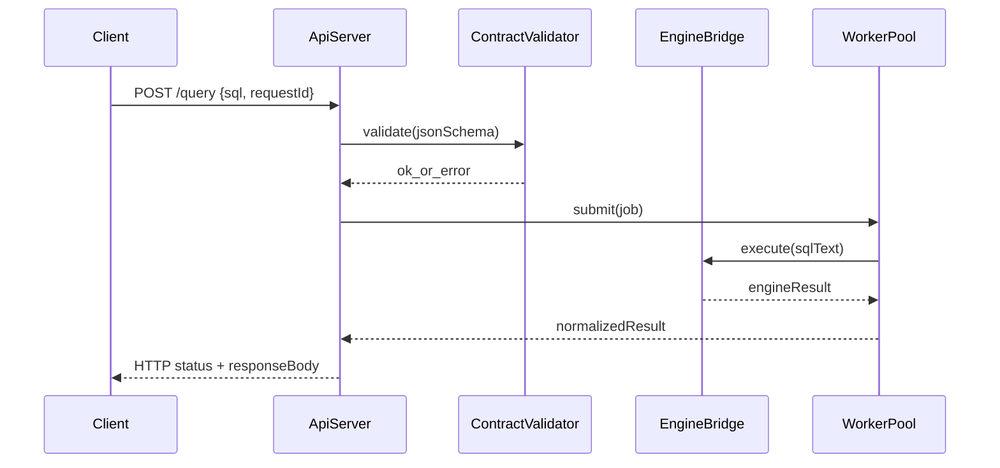

# W8-00 — API 계약 및 아키텍처 결정

## 1. 구현 목적 및 필요성
### 왜 이걸 하는가 (문제 맥락)
WEEK8에서 진짜 목표는 SQL 엔진 기능을 "내부에서만 실행"하는 데서 끝나지 않고, 외부 클라이언트가 HTTP로 안정적으로 호출할 수 있게 만드는 것입니다. 이때 가장 먼저 필요한 것이 API 계약(요청/응답/오류 규칙)이며, 계약이 없으면 팀원마다 구현/테스트 기준이 달라져 개발이 흔들립니다.

### 무엇을 연결하는가 (기술 맥락)
이 단계에서는 HTTP 레이어와 엔진 레이어를 연결하기 전에, 두 레이어가 공유할 공통 언어를 정의합니다. 구체적으로 요청 필드, 응답 envelope, 에러 코드, 상태 코드 매핑, 타임아웃/백프레셔 정책을 고정해 이후 구현 단계가 같은 기준을 바라보도록 만듭니다.

### 왜 중요한가 (학습 포인트)
실무에서는 코드를 빨리 짜는 것보다 계약을 먼저 확정해 변경 비용을 줄이는 능력이 매우 중요합니다. 이 문서를 통해 "구현 전 계약 설계", "오류를 구조화해서 다루는 방법", "테스트 기대값을 문서로 먼저 고정하는 방법"을 학습할 수 있습니다.

### 완성의 의미 (결과 관점)
이 단계가 완료되면 이후 W8-01~W8-09에서 어떤 동작이 정답인지 명확해집니다. 즉, 코드 구현의 기준선이 생기고, 데모/테스트/리뷰에서 판단 기준이 일관되게 유지됩니다.

### 1.1 실제로 하는 일
- API 계약 범위 확정: `GET /health`, `POST /query`의 요청/응답/오류 규칙을 명시합니다.
- 공통 JSON envelope 정의: 성공/실패 응답의 필수 필드와 의미를 고정합니다.
- 오류 코드 체계 정의: 입력 오류, 구문 오류, 실행 오류, 과부하, 타임아웃을 코드로 분리합니다.
- HTTP 상태코드 매핑표 작성: 내부 엔진 결과를 외부 API 계약으로 변환하는 기준을 정합니다.
- 정책값 기준 정리: SQL 길이 제한, 기본 timeout, queue full 처리 방식을 문서화합니다.
- 계약 테스트 기준 작성: 정상/실패 케이스별 기대 응답을 테스트 기준으로 고정합니다.

## 2. 가능한 구현 방식 비교
- 방식 A: 단일 엔드포인트(`/query`) + 최소 보조 엔드포인트(`/health`)  
  - 장점: 구현 속도 빠름, 과제 범위 집중, 문서/테스트 단순화  
  - 단점: 향후 세분화된 권한/리소스 제어 확장 시 리팩터링 필요
- 방식 B: SQL 타입별 다중 엔드포인트(`/insert`, `/select`)  
  - 장점: 요청 스키마 명확, 타입별 검증 분리 쉬움  
  - 단점: SQL 파서 재사용성 저하, 클라이언트 사용 복잡도 증가
- 방식 C: REST 리소스형 CRUD API  
  - 장점: 일반 웹 개발자 친화적  
  - 단점: 기존 SQL 처리기 재사용 목적과 충돌, 스펙 재정의 비용 큼
- 학습 관점 해석:
  - A는 "작게 시작하고 끝까지 완주"하는 설계 연습에 적합합니다.
  - B/C는 확장성 학습엔 좋지만, 이번 주차에서는 핵심 학습 포인트(계약-구현-테스트 연결)가 흐려질 수 있습니다.
- 선택 제안: 이번 주차는 A로 구현해 계약 고정의 효과를 체감하고, 발표에서 B/C를 확장안으로 비교 설명하는 구성이 가장 학습 효율이 높습니다.

## 3. 시퀀스 다이어그램 및 설명

- 핵심 흐름: API 계약 검증 실패는 즉시 4xx, 검증 성공 요청만 worker로 전달합니다.
- 출력 계약: 성공/오류 모두 JSON envelope를 사용해 클라이언트 파싱 규칙을 고정합니다.

## 4. 코드 구조 및 구현 절차
- 인터페이스 초안
  - `ApiRequest { requestId, sql, timeoutMs(optional) }`
  - `ApiResponse { ok, data, error, metadata }`
  - `EngineResult { statusCode, rows, affectedRows, stderrMessage }`
- 모듈 경계
  - `api_contract`: 스키마 검증, 에러 표준화
  - `api_router`: `/health`, `/query`
  - `error_mapper`: 엔진 오류 -> HTTP 오류 매핑
- 절차
  1. JSON 입력 스키마와 응답 envelope 정의
  2. CLI exit code(1/2/3)와 HTTP status 매핑표 작성
  3. 필수 필드/최대 SQL 길이/인코딩 규칙 정의
  4. 문서와 테스트 fixture를 함께 고정
- 수도코드
  - `if !validate(req): return bad_request`
  - `result = submit_and_wait(req.sql, req.timeout)`
  - `return map_engine_result(result)`

## 5. 비기능적 요구사항 고려
- 성능: 계약 검증은 O(n) (n=payload size)로 유지, 고비용 파싱은 worker 단계에서 수행
- 확장성: envelope에 `metadata` 필드를 두어 latency, traceId 확장 가능
- 유지보수성: 에러코드 테이블 단일 소스화(문서 + 상수 헤더 동기화)

## 6. 테스팅 방법
- 시나리오 1: 정상 요청
  - 입력: `{"sql":"SELECT * FROM users;"}`
  - 기대: HTTP 200, `ok=true`, `data.rows` 존재
- 시나리오 2: 필드 누락
  - 입력: `{}`
  - 기대: HTTP 400, `error.code=INVALID_REQUEST`
- 시나리오 3: 구문 오류 SQL
  - 입력: `{"sql":"SELEC * FROM users;"}`
  - 기대: HTTP 422, `error.code=SQL_PARSE_ERROR`

## 7. 용어 정의 및 주의사항
- Contract: 클라이언트와 서버 간 요청/응답 형식 약속
- ErrorEnvelope: 모든 실패 응답 공통 형식
- 주의사항
  - CLI stderr 원문을 그대로 노출하면 내부 경로가 유출될 수 있으므로 sanitization 필요
  - SQL 길이 제한이 없으면 메모리 압박 및 DoS 위험 증가

## 8. 제언
- API 버전 필드(`v1`)를 응답 metadata에 선반영하면 향후 breaking change 대응이 쉬워집니다.
- `docs/03-api-reference.md`에 HTTP 섹션 링크를 추가해 CLI/API 계약의 차이를 명확히 관리하세요.

## 9. 지금까지 자주 나온 질문 정리 (면접형)
### Q1. API 계약은 요청/응답 형식만 정하면 충분한가요?
A. 충분하지 않습니다. 계약에는 요청/응답 형식뿐 아니라 오류 코드 체계, HTTP 상태코드 매핑, timeout과 과부하 처리 정책까지 포함되어야 합니다. 그래야 구현팀과 테스트팀이 같은 기준으로 동작을 검증할 수 있습니다.

### Q2. 왜 구현 전에 계약부터 고정했나요?
A. 서버, 스레드풀, 엔진 브리지는 모두 입력/출력 규약에 의존합니다. 계약 없이 구현하면 각 모듈이 다른 가정을 가지게 되어 통합 시 충돌이 발생합니다. 계약을 먼저 고정하면 개발 순서가 명확해지고 재작업 비용이 줄어듭니다.

### Q3. 계약 변경이 생기면 가장 먼저 무엇을 확인하나요?
A. 문서-코드-테스트의 동기화 상태를 먼저 봅니다. 특히 응답 필드, 에러 코드, 상태코드 매핑이 변경되면 클라이언트 영향이 크므로 회귀 테스트와 문서 갱신을 동시에 수행해야 합니다.
## 10. 단계별로 알아가면 좋은 질문 (면접형)
### Q1. 현재 계약이 테스트 가능한 형태로 작성됐는가?
A. 핵심은 각 케이스에 대해 입력/기대 출력이 명확히 정의되어 있는지입니다. "정상", "입력 오류", "구문 오류", "실행 오류"를 각각 재현 가능한 샘플로 제시해야 테스트 자동화가 가능합니다.

### Q2. 에러 코드는 어떤 기준으로 나눴는가?
A. 계층 책임 기준으로 나눴습니다. 입력 검증 실패는 API 계층, SQL 파싱 실패는 파서 계층, 실행 실패는 엔진 계층으로 분리해 진단 가능성을 높였습니다.

### Q3. 이 계약이 확장에도 견딜 수 있는가?
A. 확장성은 envelope 구조와 metadata 슬롯에서 확보했습니다. 핵심 필드를 유지한 채 추가 필드를 붙일 수 있어 하위 호환성을 지키면서 기능 확장이 가능합니다.
## 11. 꼭 알아야 할 질문 (면접형)
### Q1. 왜 구현 전에 API 계약부터 고정했나요?
A. API 서버 프로젝트에서 계약은 코드보다 먼저 정해야 하는 설계 기준선입니다. 계약을 먼저 고정하면 세 가지 이점이 있습니다. 첫째, 팀 병렬 개발 시 인터페이스 충돌이 줄어듭니다. 둘째, 테스트 기대값을 먼저 확정할 수 있어 구현 후 검증이 빠릅니다. 셋째, 오류 처리 정책을 통일해 클라이언트가 예측 가능한 방식으로 동작합니다. 반대로 계약 없이 구현하면 기능은 빨리 나올 수 있어도, 추후 응답 포맷 변경과 에러 매핑 재작업으로 비용이 커집니다. 그래서 이번에는 `요청 스키마`, `응답 envelope`, `에러 코드/상태코드 매핑`, `timeout/queue full 정책`을 먼저 고정했습니다.

### Q2. 에러 코드를 상태코드와 분리한 이유는 무엇인가요?
A. HTTP 상태코드는 전송 계층 관점의 분류이고, 에러 코드는 도메인 관점의 분류입니다. 예를 들어 422 하나로는 파싱 오류인지 비즈니스 규칙 위반인지 구분이 어렵습니다. 그래서 `SQL_PARSE_ERROR`, `SQL_EXEC_ERROR`처럼 도메인 코드를 따로 두면 클라이언트가 재시도 여부, 사용자 메시지, 로깅 전략을 더 정밀하게 결정할 수 있습니다. 면접 관점에서 핵심은 "전송 규약과 도메인 의미를 분리해 확장성을 확보했다"는 점입니다.

### Q3. 이 문서가 실제 구현 품질에 어떻게 기여했나요?
A. 이 문서를 기준으로 W8-01~W8-04 구현 순서를 고정했고, 특히 테스트 작성 시 "무엇이 성공/실패인지"를 문서에서 바로 참조할 수 있었습니다. 실제로 `/query` 연동 시 입력 오류는 400, 파싱 오류는 422, 실행 오류는 409로 매핑하는 기준이 흔들리지 않았습니다. 즉 문서가 단순 설명이 아니라 구현과 테스트의 단일 진실 공급원 역할을 했다는 점이 가장 큰 성과입니다.