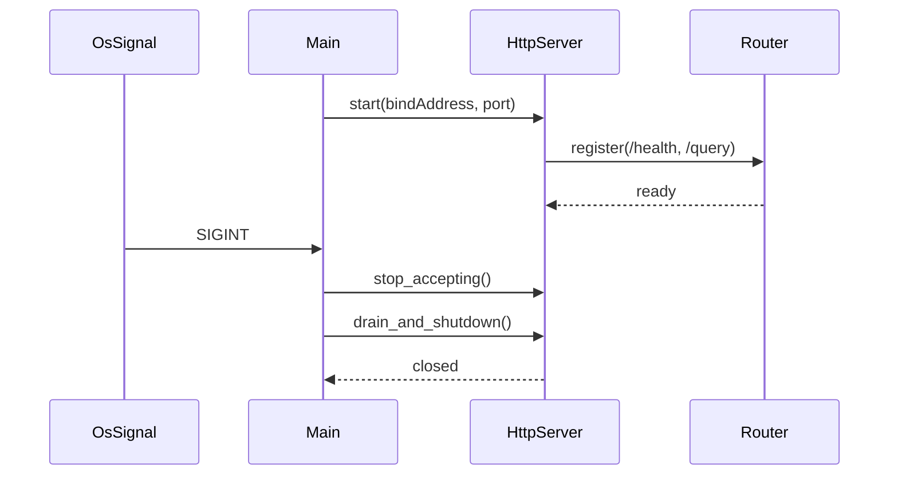

# W8-01 — 서버 부트스트랩 및 기본 라우팅

## 1. 구현 목적 및 필요성
### 왜 이걸 하는가 (문제 맥락)
API 프로젝트에서 가장 먼저 필요한 것은 "요청을 안정적으로 받는 서버 골격"입니다. 서버가 뜨고, 요청을 받고, 종료 신호를 안전하게 처리하지 못하면 이후 스레드풀이나 SQL 실행 기능을 붙여도 전체 시스템이 불안정해집니다.

### 무엇을 연결하는가 (기술 맥락)
이 단계에서는 소켓 생명주기(`socket -> bind -> listen -> accept`)와 최소 라우팅(`/health`, 404)을 연결합니다. 즉, 네트워크 입력을 받아 HTTP 응답으로 되돌려주는 가장 기본적인 서버 흐름을 구현해, 이후 비즈니스 로직이 올라갈 기반을 만듭니다.

### 왜 중요한가 (학습 포인트)
네트워크 서버의 기본 원리는 추상화 라이브러리 뒤에 가려지는 경우가 많습니다. 직접 tiny 서버를 구현하면 연결 수락, 요청 파싱, 응답 작성, graceful shutdown의 본질을 몸으로 익힐 수 있고, 문제 발생 시 디버깅 감각도 빠르게 올라갑니다.

### 완성의 의미 (결과 관점)
이 단계가 완료되면 "동작하는 API 서버 프로세스"가 생깁니다. 이후 단계에서는 이 골격 위에 스레드풀(W8-02), 엔진 연동(W8-03/04)을 얹기만 하면 되므로 개발 속도가 크게 빨라집니다.

### 1.1 실제로 하는 일
- 소켓 서버 기동: `socket -> bind -> listen` 초기화와 포트 리슨을 구현합니다.
- 수락 루프 구현: 블로킹 `accept` 루프에서 연결을 안정적으로 수락합니다.
- 최소 라우팅 구현: `GET /health`는 200, 미등록 경로는 404를 반환합니다.
- HTTP 응답 포맷 고정: 상태줄/헤더/JSON 본문/Connection 처리 규칙을 통일합니다.
- 종료 훅 구현: `SIGINT`/`SIGTERM` 수신 시 신규 수락 중단 및 정상 종료를 보장합니다.
- 스모크 테스트 추가: 서버 기동, `/health`, 404, 종료 경로를 자동 검증합니다.

## 2. 가능한 구현 방식 비교
- 방식 A: 단일 프로세스 + 블로킹 accept 루프
  - 장점: C에서 구현 단순, 디버깅 쉬움
  - 단점: graceful shutdown/timeout 처리 코드 증가
- 방식 B: 이벤트 루프 기반(non-blocking)
  - 장점: 연결 수 확장성 우수
  - 단점: 이번 과제의 스레드 풀 요구와 중복 복잡도
- 방식 C: 경량 HTTP 라이브러리 의존
  - 장점: 개발 속도 빠름
  - 단점: 팀별 환경 차이, 빌드 재현성 리스크
- 학습 관점 해석:
  - A는 소켓/HTTP 기본기를 직접 익히기에 가장 좋고, 디버깅 경험이 잘 남습니다.
  - B는 성능 구조 학습에는 좋지만 첫 서버 단계에서 난이도가 급격히 올라갑니다.
  - C는 빠르게 완성할 수 있으나 내부 원리 학습량이 줄어듭니다.
- 선택 제안: 이번 주차는 A + 명시적 shutdown 훅으로 구현해 "작동하는 서버를 끝까지 완성하는 경험"을 우선 확보합니다.

## 3. 시퀀스 다이어그램 및 설명

- 설명: 시그널 수신 시 신규 요청 중지 후 in-flight 요청을 배수합니다.

## 4. 코드 구조 및 구현 절차
- 인터페이스
  - `server_start(config)`
  - `server_stop(gracePeriodMs)`
  - `route_register(path, handler)`
- 구현 절차
  1. 서버 설정 구조체(`host`, `port`, `gracePeriodMs`) 정의
  2. `/health` 핸들러를 먼저 구현해 상태 확인 경로 확보
  3. 종료 플래그 + 시그널 핸들러 연결
  4. 종료 시 리스너 소켓과 워커 자원 정리 순서 고정
- 수도코드
  - `while (!shutdown) accept_connection()`
  - `if path==/health return 200`
  - `on_signal -> shutdown=true`

## 5. 비기능적 요구사항 고려
- 성능: `/health`는 O(1) 경로로 유지, JSON 직렬화 최소화
- 확장성: 라우터 테이블 구조를 확장 가능하게(정적 배열 + 핸들러 포인터)
- 유지보수성: 생명주기 로깅(start/ready/shutdown) 표준화

## 6. 테스팅 방법
- 입력: 서버 시작 후 `GET /health`
- 기대: HTTP 200, body `{"status":"ok"}`
- 입력: SIGINT 전달
- 기대: 새 연결 거부 + 기존 요청 처리 후 종료코드 0
- 입력: 중복 포트 사용
- 기대: start 실패 + 에러 로그

## 7. 용어 정의 및 주의사항
- Graceful shutdown: 즉시 kill이 아니라 정해진 시간 내 정상 종료
- In-flight request: 처리 중인 요청
- 주의사항
  - 시그널 핸들러에서 비동기 안전하지 않은 함수 호출 금지
  - 포트 바인딩 실패 시 재시도 정책을 단순화(무한 루프 금지)

## 8. 제언
- `/ready` 엔드포인트를 분리하면 부트 완료 상태와 프로세스 생존 상태를 구분할 수 있습니다.
- 발표 데모 안정성을 위해 기본 포트와 override 환경변수 둘 다 지원을 권장합니다.

## 9. 지금까지 자주 나온 질문 정리 (면접형)
### Q1. tiny 서버를 직접 구현한 이유는 무엇인가요?
A. 초기 단계에서 핵심은 HTTP 프레임워크 기능이 아니라 네트워크 생명주기 이해입니다. 직접 구현하면 accept 루프, 응답 작성, 종료 흐름을 정확히 이해할 수 있어 이후 문제 분석 능력이 좋아집니다. 상세 관점에서는 이 선택이 다른 대안과 비교해 어떤 트레이드오프를 가지는지, 운영 중 어떤 리스크를 줄여주는지, 그리고 테스트로 어떻게 검증할지를 함께 설명할 수 있어야 합니다.

### Q2. `Connection: close`를 선택한 근거는?
A. 연결 재사용보다 단순성과 재현성을 우선했기 때문입니다. keep-alive는 효율적이지만 상태 관리가 늘어나고 디버깅 복잡도가 증가합니다. 현재 단계는 안정적인 기본 경로 확보가 목표라 close 전략이 적합했습니다. 상세 관점에서는 이 선택이 다른 대안과 비교해 어떤 트레이드오프를 가지는지, 운영 중 어떤 리스크를 줄여주는지, 그리고 테스트로 어떻게 검증할지를 함께 설명할 수 있어야 합니다.

### Q3. graceful shutdown은 왜 초기에 넣었나요?
A. 종료 경로는 운영에서 자주 실패하는 구간입니다. 초기부터 종료 훅을 넣으면 스레드풀/큐를 붙인 뒤에도 자원 누수 없이 안전하게 확장할 수 있습니다. 상세 관점에서는 이 선택이 다른 대안과 비교해 어떤 트레이드오프를 가지는지, 운영 중 어떤 리스크를 줄여주는지, 그리고 테스트로 어떻게 검증할지를 함께 설명할 수 있어야 합니다.
## 10. 단계별로 알아가면 좋은 질문 (면접형)
### Q1. 서버 기동 실패를 어떻게 진단할 것인가?
A. `socket`, `bind`, `listen` 단계별 에러를 분리 로그로 남겨 원인을 즉시 식별해야 합니다. 포트 충돌과 권한 문제를 가장 먼저 확인하는 습관이 중요합니다. 상세 관점에서는 이 선택이 다른 대안과 비교해 어떤 트레이드오프를 가지는지, 운영 중 어떤 리스크를 줄여주는지, 그리고 테스트로 어떻게 검증할지를 함께 설명할 수 있어야 합니다.

### Q2. 라우팅 최소 범위를 어디까지 둘 것인가?
A. `/health`와 404만으로도 서버 골격 검증에는 충분합니다. 핵심은 기능 수가 아니라 요청-응답 루프가 안정적으로 닫히는지입니다. 상세 관점에서는 이 선택이 다른 대안과 비교해 어떤 트레이드오프를 가지는지, 운영 중 어떤 리스크를 줄여주는지, 그리고 테스트로 어떻게 검증할지를 함께 설명할 수 있어야 합니다.

### Q3. 운영 관점에서 첫 서버에 꼭 있어야 할 것은?
A. 명확한 시작 로그, 종료 로그, 기본 오류 응답입니다. 이 세 가지가 있어야 장애 재현과 관찰이 가능합니다. 상세 관점에서는 이 선택이 다른 대안과 비교해 어떤 트레이드오프를 가지는지, 운영 중 어떤 리스크를 줄여주는지, 그리고 테스트로 어떻게 검증할지를 함께 설명할 수 있어야 합니다.
## 11. 꼭 알아야 할 질문 (면접형)
### Q1. 왜 라이브러리 대신 tiny 서버를 직접 구현했나요?
A. 이번 단계의 목표는 기능 완성뿐 아니라 네트워크 기본기를 설명 가능한 수준으로 확보하는 것이었습니다. 직접 구현하면 `socket -> bind -> listen -> accept`와 HTTP 응답 작성 흐름을 정확히 이해할 수 있습니다. 라이브러리를 쓰면 속도는 빠르지만, 오류 상황에서 원인을 추적하거나 구조적 선택을 설명하기 어렵습니다. 과제 특성상 설명 가능성이 중요해 직접 구현을 선택했습니다. 상세 관점에서는 이 선택이 다른 대안과 비교해 어떤 트레이드오프를 가지는지, 운영 중 어떤 리스크를 줄여주는지, 그리고 테스트로 어떻게 검증할지를 함께 설명할 수 있어야 합니다.

### Q2. `Connection: close`를 선택한 이유는 무엇인가요?
A. 초기 단계에서는 단순성과 안정성이 우선이기 때문입니다. keep-alive를 쓰면 연결 재사용, 요청 경계 처리, idle timeout 관리까지 필요해 복잡도가 크게 증가합니다. 현재는 요청 1건당 연결 1건 처리로 동작을 명확히 하고, 이후 성능 요구가 커질 때 keep-alive를 확장 포인트로 두었습니다. 즉 초기 품질 확보를 위한 의도적 단순화입니다. 상세 관점에서는 이 선택이 다른 대안과 비교해 어떤 트레이드오프를 가지는지, 운영 중 어떤 리스크를 줄여주는지, 그리고 테스트로 어떻게 검증할지를 함께 설명할 수 있어야 합니다.

### Q3. graceful shutdown을 왜 초기에 넣었나요?
A. 서버 개발에서 종료 경로는 실패가 자주 나는 부분인데 후순위로 미루면 운영 리스크가 큽니다. 특히 스레드풀/큐를 붙이기 전에 종료 훅을 먼저 넣어야, 이후 단계에서도 안전하게 자원을 정리할 수 있습니다. 면접에서는 "정상 경로만 구현하지 않고 종료/실패 경로를 설계했다"는 점이 시스템 사고를 보여주는 포인트입니다. 상세 관점에서는 이 선택이 다른 대안과 비교해 어떤 트레이드오프를 가지는지, 운영 중 어떤 리스크를 줄여주는지, 그리고 테스트로 어떻게 검증할지를 함께 설명할 수 있어야 합니다.