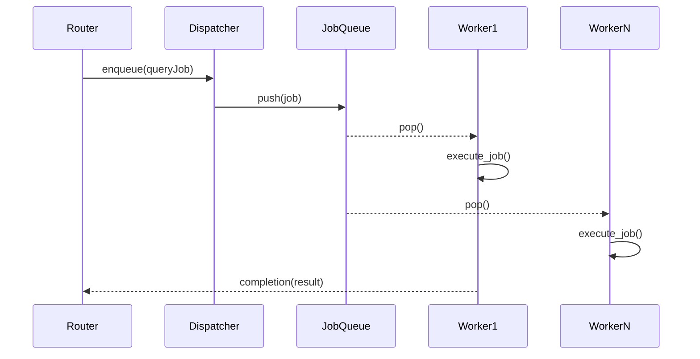

# W8-02 — Thread Pool 및 Job Queue

## 1. 구현 목적 및 필요성
### 왜 이걸 하는가 (문제 맥락)
과제 요구사항의 핵심은 요청을 병렬로 처리하는 것입니다. 요청마다 스레드를 새로 만들면 오버헤드가 커지고 폭주 상황에서 서버가 쉽게 무너질 수 있으므로, 미리 만든 worker를 재사용하는 스레드풀과 bounded queue가 필요합니다.

### 무엇을 연결하는가 (기술 맥락)
accept 루프가 받은 연결을 즉시 처리하지 않고 job queue에 넣고, worker 스레드가 이를 소비해 처리하는 구조를 만듭니다. 즉, "요청 수락"과 "요청 실행"을 분리해 처리량과 안정성을 동시에 관리하는 구조를 구현합니다.

### 왜 중요한가 (학습 포인트)
이 단계는 동시성 시스템의 핵심 개념(생산자-소비자 모델, 큐 포화 처리, worker 생명주기)을 학습하는 구간입니다. 단순히 병렬 처리만이 아니라, 과부하 상황에서 어떻게 시스템을 보호할지(backpressure)까지 함께 익힐 수 있습니다.

### 완성의 의미 (결과 관점)
이 단계가 끝나면 서버는 단일 요청 처리기가 아니라 병렬 처리 가능한 API 서버가 됩니다. 이후 `/query` 연동 시 실제 부하 환경에서도 안정적으로 요청을 처리할 수 있는 기반이 갖춰집니다.

### 1.1 실제로 하는 일
- 고정 worker 생성: 서버 시작 시 worker 스레드를 미리 생성해 재사용합니다.
- bounded queue 구현: 요청 job 저장 큐를 고정 크기로 두고 메모리 상한을 통제합니다.
- producer/consumer 연결: accept 루프는 enqueue, worker는 dequeue 후 요청 처리로 책임을 분리합니다.
- 큐 포화 정책 적용: 수용 불가 시 즉시 `503`/`QUEUE_FULL` 응답을 반환합니다.
- 종료 시 drain/join 처리: stop 요청 시 worker 깨우기, join, 큐/동기화 자원 정리를 수행합니다.
- 병렬 처리 테스트 추가: 동시 요청 처리, 큐 동작, 종료 동작을 자동 검증합니다.

## 2. 가능한 구현 방식 비교
- 방식 A: 고정 크기 스레드 풀 + bounded queue
  - 장점: 메모리 상한 통제, 백프레셔 정책 명확
  - 단점: 피크 시 거절 응답 필요
- 방식 B: 요청당 스레드 생성
  - 장점: 구현 직관적
  - 단점: 컨텍스트 스위칭/생성 비용 큼, 폭주 위험
- 방식 C: work-stealing 큐
  - 장점: 고성능 확장성
  - 단점: 구현 복잡도 과다(현 제약 부적합)
- 학습 관점 해석:
  - A는 "작동하는 스레드풀의 핵심 원리"를 가장 선명하게 학습할 수 있는 출발점입니다.
  - B는 비교 학습용으로는 유의미하지만, 실무에서 흔히 피하는 anti-pattern도 함께 보여줍니다.
  - C는 고급 주제이지만 이번 스코프에서는 핵심 학습(기본 풀/큐 원리)보다 구현 난도가 앞설 수 있습니다.
- 선택 제안: 이번 주차는 A를 기준 구현으로 삼고, C는 확장 토픽으로 발표에서 비교 설명하는 전략이 학습 효율이 높습니다.

## 3. 시퀀스 다이어그램 및 설명

- 설명: 라우터는 큐에 push만 담당하고 실행은 워커가 담당해 책임을 분리합니다.

## 4. 코드 구조 및 구현 절차
- 인터페이스
  - `thread_pool_init(workerCount, queueCapacity)`
  - `thread_pool_submit(job, timeoutMs)`
  - `thread_pool_shutdown(mode)`
- 데이터 구조
  - `Job { requestId, sqlText, deadline, completionHandle }`
  - `RingBufferQueue { head, tail, size, mutex, condNotEmpty, condNotFull }`
- 구현 절차
  1. bounded ring buffer 구현
  2. worker 루프(대기-실행-결과반환) 구성
  3. submit 시 큐 full 정책(대기/즉시실패) 확정
  4. shutdown 시 poison pill 또는 종료 플래그 적용
- 수도코드
  - `submit: lock -> if full return QUEUE_FULL -> push -> signal`
  - `worker: lock -> while empty wait -> pop -> unlock -> run(job)`

## 5. 비기능적 요구사항 고려
- 성능: enqueue/dequeue O(1), lock 경합 최소화
- 확장성: worker 수를 CPU 코어/IO 패턴에 맞게 튜닝 가능하게 구성
- 유지보수성: 큐 메트릭(현재 길이, 거절 건수) 노출

## 6. 테스팅 방법
- 시나리오 1: 동시 50요청
  - 기대: 큐 정책 내에서 처리/거절 규칙 일관
- 시나리오 2: 큐 용량 1에서 burst 요청
  - 기대: 지정 정책대로 일부 429/503
- 시나리오 3: shutdown 중 submit
  - 기대: 즉시 실패 반환

## 7. 용어 정의 및 주의사항
- Bounded queue: 최대 길이가 고정된 큐
- Backpressure: 과부하 시 요청을 지연/거절해 시스템 보호
- 주의사항
  - 조건변수 wait는 while 루프로 감싸 spurious wakeup 대응
  - 작업 객체 수명 관리 미흡 시 use-after-free 위험

## 8. 제언
- 초기 기본값은 `workerCount = min(4, coreCount)`로 시작해 벤치 후 조정하세요.
- 큐 대기시간 메트릭을 수집하면 W8-06 타임아웃 정책 결정이 쉬워집니다.

## 9. 지금까지 자주 나온 질문 정리 (면접형)
### Q1. 스레드풀과 요청당 스레드 생성의 본질적 차이는?
A. 요청당 생성은 단순하지만 고부하에서 생성/소멸 비용이 누적됩니다. 스레드풀은 worker를 재사용해 비용을 줄이고, 동시 처리 상한을 정책적으로 통제할 수 있습니다. 상세 관점에서는 이 선택이 다른 대안과 비교해 어떤 트레이드오프를 가지는지, 운영 중 어떤 리스크를 줄여주는지, 그리고 테스트로 어떻게 검증할지를 함께 설명할 수 있어야 합니다.

### Q2. bounded queue를 쓰는 이유는?
A. 무제한 큐는 순간적으로 편하지만 결국 메모리와 지연이 폭증합니다. bounded queue는 수용 한계를 명시해 장애를 통제 가능한 실패로 바꿉니다. 상세 관점에서는 이 선택이 다른 대안과 비교해 어떤 트레이드오프를 가지는지, 운영 중 어떤 리스크를 줄여주는지, 그리고 테스트로 어떻게 검증할지를 함께 설명할 수 있어야 합니다.

### Q3. 워크스틸링을 지금 채택하지 않은 이유?
A. 기준선 없이 고급 스케줄러를 넣으면 효과를 설명하기 어렵습니다. 먼저 단순 모델로 안정성을 확보하고, 이후 실험으로 비교하는 것이 학습과 전달 모두 유리합니다. 상세 관점에서는 이 선택이 다른 대안과 비교해 어떤 트레이드오프를 가지는지, 운영 중 어떤 리스크를 줄여주는지, 그리고 테스트로 어떻게 검증할지를 함께 설명할 수 있어야 합니다.
## 10. 단계별로 알아가면 좋은 질문 (면접형)
### Q1. worker 수는 어떤 근거로 정하나요?
A. CPU 코어 수, 요청의 CPU/IO 비중, 큐 대기시간을 함께 봅니다. 초기값은 보수적으로 두고 지표 기반으로 조정하는 것이 안전합니다. 상세 관점에서는 이 선택이 다른 대안과 비교해 어떤 트레이드오프를 가지는지, 운영 중 어떤 리스크를 줄여주는지, 그리고 테스트로 어떻게 검증할지를 함께 설명할 수 있어야 합니다.

### Q2. 큐 포화 시 정책은 어떻게 결정하나요?
A. 시스템 목표에 따라 다릅니다. 지연 민감 서비스는 즉시 거절이 유리하고, 성공률 우선이면 제한 대기를 고려할 수 있습니다. 상세 관점에서는 이 선택이 다른 대안과 비교해 어떤 트레이드오프를 가지는지, 운영 중 어떤 리스크를 줄여주는지, 그리고 테스트로 어떻게 검증할지를 함께 설명할 수 있어야 합니다.

### Q3. shutdown에서 무엇을 보장해야 하나요?
A. 신규 요청 중단, 대기 worker 깨우기, 자원 해제 순서를 보장해야 합니다. 이 순서가 깨지면 데드락이나 fd 누수가 발생합니다. 상세 관점에서는 이 선택이 다른 대안과 비교해 어떤 트레이드오프를 가지는지, 운영 중 어떤 리스크를 줄여주는지, 그리고 테스트로 어떻게 검증할지를 함께 설명할 수 있어야 합니다.
## 11. 꼭 알아야 할 질문 (면접형)
### Q1. 왜 요청당 스레드 생성 대신 고정 스레드풀을 썼나요?
A. 요청당 스레드 생성은 구현은 직관적이지만 고부하에서 생성/파괴 비용과 컨텍스트 스위칭 비용이 급격히 증가합니다. 고정 스레드풀은 worker를 재사용해 오버헤드를 낮추고, 동시 처리 상한을 제어할 수 있어 시스템이 예측 가능한 상태를 유지합니다. 즉 성능뿐 아니라 안정성 관점에서 유리합니다. 상세 관점에서는 이 선택이 다른 대안과 비교해 어떤 트레이드오프를 가지는지, 운영 중 어떤 리스크를 줄여주는지, 그리고 테스트로 어떻게 검증할지를 함께 설명할 수 있어야 합니다.

### Q2. bounded queue를 둔 핵심 이유는 무엇인가요?
A. 무제한 큐는 순간적으로 편하지만 결국 메모리 압박과 지연 폭증으로 장애를 키웁니다. bounded queue는 수용 가능한 요청량을 명시적으로 제한해 과부하를 제어 가능한 실패(`QUEUE_FULL`)로 바꿉니다. 이 결정은 "장애를 숨기지 않고 제한한다"는 운영 원칙과 맞습니다. 상세 관점에서는 이 선택이 다른 대안과 비교해 어떤 트레이드오프를 가지는지, 운영 중 어떤 리스크를 줄여주는지, 그리고 테스트로 어떻게 검증할지를 함께 설명할 수 있어야 합니다.

### Q3. 워크스틸링을 당장 채택하지 않은 이유는?
A. 워크스틸링은 고급 최적화 기법으로 효과가 있을 수 있지만, 구현 난도와 검증 비용이 큽니다. 이번 주차 목표는 기본 스레드풀을 안정적으로 완성하고 설명 가능한 수준까지 가져가는 것입니다. 기준 구현 없이 고급 스케줄러를 도입하면 성능 개선 근거를 제시하기 어렵기 때문에, 먼저 기준선(A안)을 만들고 필요 시 확장 실험으로 가는 전략을 선택했습니다. 상세 관점에서는 이 선택이 다른 대안과 비교해 어떤 트레이드오프를 가지는지, 운영 중 어떤 리스크를 줄여주는지, 그리고 테스트로 어떻게 검증할지를 함께 설명할 수 있어야 합니다.