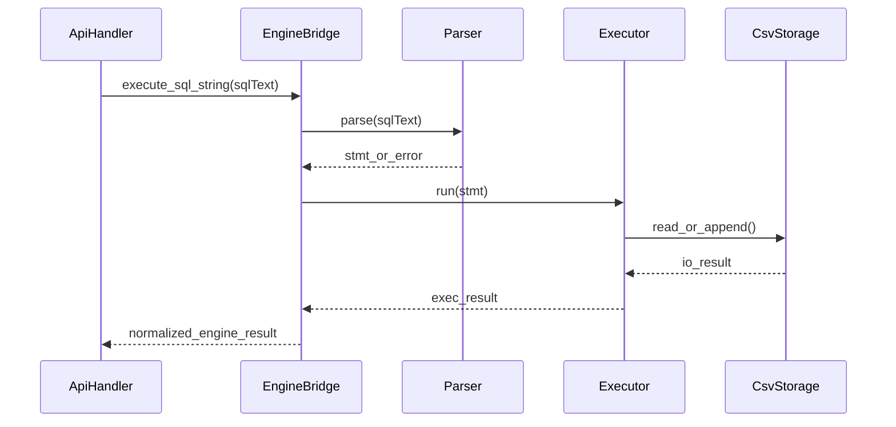

# W8-03 — SQL 엔진 Bridge 인터페이스 분리

## 1. 구현 목적 및 필요성
### 왜 이걸 하는가 (문제 맥락)
WEEK8은 새 엔진을 만드는 과제가 아니라, 기존 SQL 처리기와 B+트리 자산을 API 환경에서 재사용해 제품 형태로 완성하는 과제입니다. 엔진을 다시 작성하면 일정이 늘고 회귀 위험이 커지므로, 재사용 가능한 브리지 계층이 필요합니다.

### 무엇을 연결하는가 (기술 맥락)
API에서 들어온 SQL 문자열을 기존 parser/executor 실행 경로로 전달하고, 실행 결과를 API 레이어가 쓰기 쉬운 구조(상태 코드, stdout/stderr 텍스트, 메시지)로 변환하는 번역 계층을 구현합니다. 즉, "API 입력"과 "엔진 내부 실행" 사이를 안전하게 중계합니다.

### 왜 중요한가 (학습 포인트)
실무에서 자주 필요한 역량은 "새로 만들기"보다 "기존 자산을 경계 분리해서 재사용하기"입니다. 이 단계에서 계층 분리, 결합도 제어, 오류 전달 규약 설계 같은 아키텍처 핵심 감각을 학습할 수 있습니다.

### 완성의 의미 (결과 관점)
이 단계가 완료되면 API 서버는 기존 엔진을 직접 호출할 수 있게 됩니다. 즉, CLI 중심 구조에서 서비스형 구조로 확장 가능한 기술적 다리가 완성됩니다.

### 1.1 실제로 하는 일
- 문자열 실행 진입점 추가: 파일 기반 실행 외에 SQL text 직접 실행 API를 제공합니다.
- 브리지 인터페이스 정의: `execute_sql -> status/stdout/stderr` 구조를 표준화합니다.
- 결과 정규화 구현: 엔진 반환값을 API 계층이 다루기 쉬운 구조체로 변환합니다.
- 메모리 소유권 규칙 확정: 결과 버퍼의 생성/해제 책임을 명시합니다.
- 오류 전달 일관화: parse/exec 오류를 브리지 상태 코드로 일관되게 노출합니다.
- 브리지 단위 테스트 추가: 정상, 구문 오류, 실행 오류 경로를 자동 검증합니다.

## 2. 가능한 구현 방식 비교
- 방식 A: 기존 main 로직을 함수로 추출해 라이브러리화
  - 장점: 중복 최소화, 회귀 위험 낮음
  - 단점: 기존 코드 분리 리팩터링 필요
- 방식 B: API 요청마다 임시 `.sql` 파일 생성 후 CLI 재실행
  - 장점: 빠른 프로토타입
  - 단점: 파일 I/O 오버헤드, 보안/동시성 취약
- 방식 C: 파서/실행기를 API 레이어에서 재조립
  - 장점: 세밀한 제어 가능
  - 단점: 책임 중복, 결합도 상승
- 학습 관점 해석:
  - A는 기존 자산을 살리면서도 인터페이스 설계를 연습할 수 있어 실무 학습 가치가 큽니다.
  - B는 빠른 데모에는 유리하지만, 성능/보안/동시성 측면에서 나쁜 습관이 남기 쉽습니다.
  - C는 구조를 잘못 잡으면 "API가 엔진을 침범"하는 전형적인 안티패턴을 만들 수 있습니다.
- 선택 제안: 이번 주차는 A를 채택해 재사용 + 분리 설계를 동시에 학습하는 것이 가장 효과적입니다.

## 3. 시퀀스 다이어그램 및 설명

- 설명: 브리지는 API에 노출되지 않도록 내부 도메인 계약을 캡슐화합니다.

## 4. 코드 구조 및 구현 절차
- 인터페이스
  - `engine_bridge_execute(sqlText, executionContext, outResult)`
  - `engine_result_free(result)`
- 결과 구조
  - `EngineStatus { OK, CLI_USAGE_ERR, PARSE_ERR, EXEC_ERR }`
  - `EnginePayload { rows, headers, affectedRows, message }`
- 구현 절차
  1. 기존 CLI 함수에서 "문자열 SQL 단위 실행" 경로 분리
  2. stdout/stderr 의존 코드를 구조화 결과로 치환
  3. API용 직렬화 가능한 결과 객체 정의
  4. 메모리 소유권 규칙(호출자 free) 명시
- 수도코드
  - `stmt = parser_parse(sqlText)`
  - `if parse_fail return PARSE_ERR`
  - `exec = executor_run(stmt)`
  - `return normalize(exec)`

## 5. 비기능적 요구사항 고려
- 성능: 불필요한 문자열 복사 최소화(읽기 전용 버퍼 전달)
- 확장성: 추후 다중 문장 트랜잭션 지원을 위한 `executionContext` 슬롯 확보
- 유지보수성: CLI와 API가 동일 엔진 경로를 타도록 단일 진입점 유지

## 6. 테스팅 방법
- 입력: `SELECT * FROM users;`
- 기대: 기존 CLI와 동일한 row/컬럼 순서
- 입력: 문법 오류 SQL
- 기대: `PARSE_ERR` 반환 + 안정적 메모리 해제
- 입력: 존재하지 않는 테이블
- 기대: `EXEC_ERR`와 표준 메시지 반환

## 7. 용어 정의 및 주의사항
- Bridge: 외부 인터페이스(API)와 내부 엔진 사이 번역 계층
- Ownership: 메모리 해제 책임 주체
- 주의사항
  - parser/executor 내부 static buffer 사용 시 멀티스레드 안전성 재검토 필요
  - stderr 문자열 공유 버퍼는 요청 간 오염 위험

## 8. 제언
- 엔진 결과 구조를 `docs/03-api-reference.md`의 exit code 의미와 함께 문서화하면 디버깅이 쉬워집니다.
- 브리지 계층에 tracing hook을 넣어 latency 분해(파싱/실행/I/O)를 수집하세요.

## 9. 지금까지 자주 나온 질문 정리 (면접형)
### Q1. 브리지 계층을 따로 둔 이유는 무엇인가요?
A. API와 엔진의 결합도를 낮추기 위해서입니다. 브리지가 있으면 API는 실행 결과 계약만 알면 되고, 엔진 내부 변경이 API 전반으로 전파되지 않습니다. 상세 관점에서는 이 선택이 다른 대안과 비교해 어떤 트레이드오프를 가지는지, 운영 중 어떤 리스크를 줄여주는지, 그리고 테스트로 어떻게 검증할지를 함께 설명할 수 있어야 합니다.

### Q2. 왜 stdout/stderr를 구조화하나요?
A. CLI는 사람이 읽는 출력이 중심이지만 API는 기계가 파싱 가능한 구조가 필요합니다. 구조화하면 상태코드 매핑과 오류 응답 일관성이 높아집니다. 상세 관점에서는 이 선택이 다른 대안과 비교해 어떤 트레이드오프를 가지는지, 운영 중 어떤 리스크를 줄여주는지, 그리고 테스트로 어떻게 검증할지를 함께 설명할 수 있어야 합니다.

### Q3. B+트리를 재사용하는 실익은?
A. 요구사항 충족뿐 아니라 조회 성능과 정합성 유지에 유리합니다. 이미 검증된 인덱스 자산을 재사용하면 회귀 위험도 낮출 수 있습니다. 상세 관점에서는 이 선택이 다른 대안과 비교해 어떤 트레이드오프를 가지는지, 운영 중 어떤 리스크를 줄여주는지, 그리고 테스트로 어떻게 검증할지를 함께 설명할 수 있어야 합니다.
## 10. 단계별로 알아가면 좋은 질문 (면접형)
### Q1. 브리지의 성공/실패 경계는 어디인가?
A. 브리지는 실행 결과를 번역하는 계층이므로, 파싱/실행 실패를 명확한 상태 코드로 변환해야 합니다. 내부 에러를 외부 계약으로 안정적으로 표현하는 것이 핵심입니다. 상세 관점에서는 이 선택이 다른 대안과 비교해 어떤 트레이드오프를 가지는지, 운영 중 어떤 리스크를 줄여주는지, 그리고 테스트로 어떻게 검증할지를 함께 설명할 수 있어야 합니다.

### Q2. 메모리 소유권은 어떻게 설계했나?
A. 결과 버퍼 생성 주체와 해제 주체를 명확히 문서화해야 누수/이중 해제를 피할 수 있습니다. API 계층이 해제 책임을 갖는 패턴이 일반적입니다. 상세 관점에서는 이 선택이 다른 대안과 비교해 어떤 트레이드오프를 가지는지, 운영 중 어떤 리스크를 줄여주는지, 그리고 테스트로 어떻게 검증할지를 함께 설명할 수 있어야 합니다.

### Q3. 재사용 설계가 실패하는 대표 원인은?
A. 편의상 API가 엔진 내부 구조를 직접 참조하기 시작할 때입니다. 브리지 경계를 유지하고 내부 타입 노출을 최소화해야 합니다. 상세 관점에서는 이 선택이 다른 대안과 비교해 어떤 트레이드오프를 가지는지, 운영 중 어떤 리스크를 줄여주는지, 그리고 테스트로 어떻게 검증할지를 함께 설명할 수 있어야 합니다.
## 11. 꼭 알아야 할 질문 (면접형)
### Q1. 왜 엔진을 새로 만들지 않고 브리지를 만들었나요?
A. 이번 과제는 기존 SQL 엔진과 B+트리 자산을 활용해 API 서버를 완성하는 것이 목표입니다. 엔진을 재작성하면 일정 위험이 커지고, 기존 테스트 자산을 버리게 됩니다. 브리지는 재사용성과 계층 분리를 동시에 만족하는 방식으로, API가 엔진 내부 구현을 몰라도 동작하게 해 결합도를 낮춥니다. 상세 관점에서는 이 선택이 다른 대안과 비교해 어떤 트레이드오프를 가지는지, 운영 중 어떤 리스크를 줄여주는지, 그리고 테스트로 어떻게 검증할지를 함께 설명할 수 있어야 합니다.

### Q2. 브리지에서 stdout/stderr를 구조화하는 이유는?
A. 기존 엔진은 CLI 중심이라 출력이 스트림 기반입니다. API에서는 클라이언트가 파싱 가능한 구조가 필요하므로, 브리지 단계에서 상태코드와 텍스트 결과를 구조화해야 합니다. 이렇게 하면 API 핸들러는 실행 디테일을 몰라도 코드/메시지 기반으로 응답을 안정적으로 매핑할 수 있습니다. 상세 관점에서는 이 선택이 다른 대안과 비교해 어떤 트레이드오프를 가지는지, 운영 중 어떤 리스크를 줄여주는지, 그리고 테스트로 어떻게 검증할지를 함께 설명할 수 있어야 합니다.

### Q3. B+트리를 서버에서도 재사용하는 의미는?
A. API 서버가 붙으면 요청량이 늘어나므로 조회 성능과 정합성이 더 중요해집니다. `WHERE id=...` 경로를 인덱스로 처리하면 풀스캔 대비 지연을 줄일 수 있고, 기존 검증된 로직을 유지해 회귀 위험도 낮춥니다. 즉 재사용은 단순 편의가 아니라 성능/안정성/일정 모두를 위한 선택입니다. 상세 관점에서는 이 선택이 다른 대안과 비교해 어떤 트레이드오프를 가지는지, 운영 중 어떤 리스크를 줄여주는지, 그리고 테스트로 어떻게 검증할지를 함께 설명할 수 있어야 합니다.