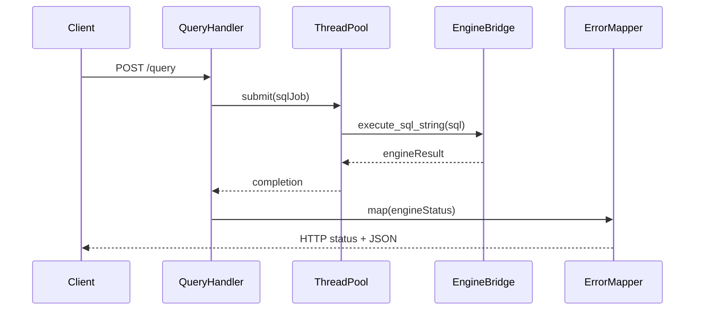

# W8-04 — /query 엔드포인트와 엔진 연동

## 1. 구현 목적 및 필요성
### 왜 이걸 하는가 (문제 맥락)
WEEK8의 핵심은 "DB 엔진을 만들었다"에서 끝나는 게 아니라, 외부 클라이언트가 HTTP API로 실제로 DB 기능을 호출할 수 있게 만드는 것입니다. 즉, 내부 로직을 사용자 요청 흐름으로 연결하는 단계입니다.

### 무엇을 연결하는가 (기술 맥락)
서버는 요청을 받고, 내부 실행 계층은 SQL을 처리합니다. 이 단계에서는 이 둘을 하나의 흐름으로 묶습니다: 클라이언트 요청 -> API 핸들러 -> SQL 실행 -> 결과 변환 -> API 응답.

### 왜 중요한가 (학습 포인트)
여기서 처음으로 "네트워크 요청 처리"와 "DB 엔진 실행"이 만납니다. 그래서 단순 기능 구현이 아니라, 입력 검증, 오류 매핑, 응답 포맷 설계 같은 실무 핵심 감각을 학습할 수 있습니다.

### 완성의 의미 (결과 관점)
이 단계가 되면 데모에서 "요청 한 번으로 실제 SQL이 실행되고 결과가 돌아오는 것"을 보여줄 수 있습니다. 즉, 문서/설계가 아니라 동작하는 제품의 최소 형태가 됩니다.

### 1.1 실제로 하는 일
- 라우팅 분기 구현: `GET /health`와 `POST /query`를 경로+메서드 기준으로 분리합니다.
- `/query` 입력 검증: JSON 파싱, 필수 필드(`sql`) 확인, 공백/비정상 입력을 4xx로 처리합니다.
- SQL 실행 연결: 검증된 요청을 엔진 브리지로 전달해 SQL을 실행합니다.
- 결과 변환: 엔진 결과(성공/구문 오류/실행 오류)를 API 응답 스키마로 매핑합니다.
- 응답 반환: 공통 JSON envelope 형태로 상태코드와 본문을 일관되게 반환합니다.
- 최소 통합 테스트: 정상 요청, 파싱 오류, 실행 오류 케이스를 API 경로에서 검증합니다.

## 2. 가능한 구현 방식 비교
- 방식 A: 동기 응답(요청 스레드가 완료까지 대기)
  - 장점: 단순, 클라이언트 사용 쉬움
  - 단점: 긴 쿼리에서 연결 점유
- 방식 B: 비동기 잡 ID 발급 + 폴링
  - 장점: 장기 작업 친화
  - 단점: 상태 저장/추가 API 필요
- 방식 C: 스트리밍 응답
  - 장점: 대용량 SELECT에 유리
  - 단점: 구현 복잡도 및 데모 난이도 상승
- 학습 관점 해석:
  - A는 요청 하나가 시스템을 어떻게 통과하는지 이해하기 가장 직관적입니다.
  - B/C는 확장성 측면에서 의미가 있지만, 이번 주차 핵심인 "완주 가능한 통합" 학습에 비해 복잡도가 높습니다.
  - 특히 초기 단계에서는 동기 모델이 디버깅과 회귀 테스트를 단순하게 만들어 학습 속도를 높여줍니다.
- 선택 제안: 이번 주차는 A로 구현해 기본 흐름을 완성하고, B/C는 후속 확장 시나리오로 설명하는 것이 학습/발표 모두에 유리합니다.

## 3. 시퀀스 다이어그램 및 설명

- 설명: 핸들러는 엔진 세부를 모르고 결과 상태만 받아 매핑합니다.

## 4. 코드 구조 및 구현 절차
- 인터페이스
  - `handle_query(httpRequest) -> httpResponse`
  - `map_engine_status_to_http(engineStatus)`
- 응답 스키마
  - 성공: `{ ok:true, data:{ headers, rows, affectedRows }, metadata:{ requestId, latencyMs } }`
  - 실패: `{ ok:false, error:{ code, message }, metadata:{ requestId } }`
- 구현 절차
  1. JSON 파싱 및 입력 검증
  2. 작업 생성 후 thread pool 제출
  3. 완료 대기(요청별 timeout 적용)
  4. 엔진 상태 -> HTTP 상태 변환
- 수도코드
  - `job = make_query_job(req.sql)`
  - `res = pool_submit_and_wait(job, timeout)`
  - `return serialize(map_result(res))`

## 5. 비기능적 요구사항 고려
- 성능: JSON 직렬화 비용과 row 수 제한 고려
- 확장성: pagination 필드 추가 가능하도록 응답 구조 설계
- 유지보수성: 에러 매핑을 독립 모듈화해 재사용

## 6. 테스팅 방법
- 입력: `INSERT INTO users VALUES (NULL,'a',20);`
- 기대: HTTP 200, `affectedRows=1`
- 입력: `SELECT * FROM missing;`
- 기대: HTTP 404 또는 422(정책 확정값), 표준 에러 코드
- 입력: 빈 SQL 문자열
- 기대: HTTP 400

## 7. 용어 정의 및 주의사항
- QueryHandler: `/query` 요청 책임 모듈
- ErrorMapper: 내부 오류를 외부 계약으로 번역하는 계층
- 주의사항
  - 대용량 SELECT 응답은 메모리 급증을 유발할 수 있으므로 row cap 필요
  - 클라이언트 취소 후에도 백엔드 작업이 계속될지 정책 명시 필요

## 8. 제언
- `metadata.latencyMs`를 필수 필드로 두면 발표에서 성능 근거를 제시하기 쉽습니다.
- 초기에는 SQL 1문장만 허용하고, 다중 문장은 후속 이슈로 분리하세요.

## 9. 지금까지 자주 나온 질문 정리 (면접형)
### Q1. `/query` 엔드포인트는 무엇을 의미하나요?
A. HTTP 경로 기반 API 진입점입니다. 같은 서버라도 경로/메서드 조합으로 책임을 분리해 `/health`와 `/query`를 독립적으로 다룹니다. 상세 관점에서는 이 선택이 다른 대안과 비교해 어떤 트레이드오프를 가지는지, 운영 중 어떤 리스크를 줄여주는지, 그리고 테스트로 어떻게 검증할지를 함께 설명할 수 있어야 합니다. 면접에서는 결론만 말하기보다 "선택 근거 -> 대안 비교 -> 검증 방법" 순서로 답하면 설득력이 높아집니다.

### Q2. "긴 쿼리에서 연결 점유"의 정확한 의미는?
A. 동기 응답 모델에서는 SQL 완료까지 해당 클라이언트 소켓과 worker 스레드가 점유됩니다. 리스닝 소켓은 계속 수락 가능하지만 worker가 부족해지면 대기/거절이 늘어납니다. 상세 관점에서는 이 선택이 다른 대안과 비교해 어떤 트레이드오프를 가지는지, 운영 중 어떤 리스크를 줄여주는지, 그리고 테스트로 어떻게 검증할지를 함께 설명할 수 있어야 합니다. 면접에서는 결론만 말하기보다 "선택 근거 -> 대안 비교 -> 검증 방법" 순서로 답하면 설득력이 높아집니다.

### Q3. 프로세스 블로킹과 스레드 블로킹은 어떻게 구분하나요?
A. 엄밀히는 호출한 스레드가 블로킹됩니다. 단일 스레드 프로세스에서는 전체가 멈춘 것처럼 보일 뿐입니다. 상세 관점에서는 이 선택이 다른 대안과 비교해 어떤 트레이드오프를 가지는지, 운영 중 어떤 리스크를 줄여주는지, 그리고 테스트로 어떻게 검증할지를 함께 설명할 수 있어야 합니다. 면접에서는 결론만 말하기보다 "선택 근거 -> 대안 비교 -> 검증 방법" 순서로 답하면 설득력이 높아집니다.
## 10. 단계별로 알아가면 좋은 질문 (면접형)
### Q1. 입력 검증은 어느 레이어에서 끝내야 하나?
A. 가능한 한 API 레이어에서 끝내야 합니다. 엔진까지 잘못된 요청이 내려가지 않게 해야 오류 분류가 명확해집니다. 상세 관점에서는 이 선택이 다른 대안과 비교해 어떤 트레이드오프를 가지는지, 운영 중 어떤 리스크를 줄여주는지, 그리고 테스트로 어떻게 검증할지를 함께 설명할 수 있어야 합니다. 면접에서는 결론만 말하기보다 "선택 근거 -> 대안 비교 -> 검증 방법" 순서로 답하면 설득력이 높아집니다.

### Q2. 오류 매핑을 어떻게 설계했나?
A. 내부 상태코드를 외부 계약 코드로 일관 매핑했습니다. parse는 422, exec는 409, invalid request는 400처럼 분리해 클라이언트 처리 전략을 단순화했습니다. 상세 관점에서는 이 선택이 다른 대안과 비교해 어떤 트레이드오프를 가지는지, 운영 중 어떤 리스크를 줄여주는지, 그리고 테스트로 어떻게 검증할지를 함께 설명할 수 있어야 합니다. 면접에서는 결론만 말하기보다 "선택 근거 -> 대안 비교 -> 검증 방법" 순서로 답하면 설득력이 높아집니다.

### Q3. 동기 모델의 단점을 어떻게 완화할 것인가?
A. timeout, queue capacity, backpressure 정책으로 자원 점유를 제한합니다. 이후 필요 시 비동기 모델로 확장할 수 있도록 응답 metadata를 남겨두는 것이 좋습니다. 상세 관점에서는 이 선택이 다른 대안과 비교해 어떤 트레이드오프를 가지는지, 운영 중 어떤 리스크를 줄여주는지, 그리고 테스트로 어떻게 검증할지를 함께 설명할 수 있어야 합니다. 면접에서는 결론만 말하기보다 "선택 근거 -> 대안 비교 -> 검증 방법" 순서로 답하면 설득력이 높아집니다.
## 11. 꼭 알아야 할 질문 (면접형)
### Q1. `/query`를 별도 엔드포인트로 둔 이유는 무엇인가요?
A. API 설계에서 경로는 책임 경계를 명확히 하는 장치입니다. `/health`는 상태 점검, `/query`는 SQL 실행으로 분리하면 운영 체크와 비즈니스 요청이 섞이지 않습니다. 또한 테스트 관점에서도 경로별 기대 동작이 분리되어 실패 원인을 빠르게 좁힐 수 있습니다. 상세 관점에서는 이 선택이 다른 대안과 비교해 어떤 트레이드오프를 가지는지, 운영 중 어떤 리스크를 줄여주는지, 그리고 테스트로 어떻게 검증할지를 함께 설명할 수 있어야 합니다. 면접에서는 결론만 말하기보다 "선택 근거 -> 대안 비교 -> 검증 방법" 순서로 답하면 설득력이 높아집니다.

### Q2. 동기 응답 모델의 장단점을 어떻게 설명하나요?
A. 장점은 구현 단순성과 디버깅 용이성입니다. 요청이 들어오면 같은 흐름에서 검증-실행-응답이 완료되므로 추적이 쉽습니다. 단점은 긴 쿼리 시 해당 요청의 소켓과 worker가 응답까지 점유된다는 점입니다. 이번 주차는 완주와 설명 가능성을 우선해 동기 모델을 선택했고, timeout/backpressure로 단점을 보완했습니다. 상세 관점에서는 이 선택이 다른 대안과 비교해 어떤 트레이드오프를 가지는지, 운영 중 어떤 리스크를 줄여주는지, 그리고 테스트로 어떻게 검증할지를 함께 설명할 수 있어야 합니다. 면접에서는 결론만 말하기보다 "선택 근거 -> 대안 비교 -> 검증 방법" 순서로 답하면 설득력이 높아집니다.

### Q3. 오류 매핑을 API 레이어에서 한 이유는 무엇인가요?
A. 엔진은 실행 결과를 제공하고, API는 외부 계약을 책임집니다. 이 책임 분리를 지키면 엔진 변경이 있어도 API 계약을 안정적으로 유지할 수 있습니다. 예를 들어 parse error를 422로 고정하는 정책은 API에서 관리해야 클라이언트가 예측 가능한 동작을 보장받습니다. 상세 관점에서는 이 선택이 다른 대안과 비교해 어떤 트레이드오프를 가지는지, 운영 중 어떤 리스크를 줄여주는지, 그리고 테스트로 어떻게 검증할지를 함께 설명할 수 있어야 합니다. 면접에서는 결론만 말하기보다 "선택 근거 -> 대안 비교 -> 검증 방법" 순서로 답하면 설득력이 높아집니다.