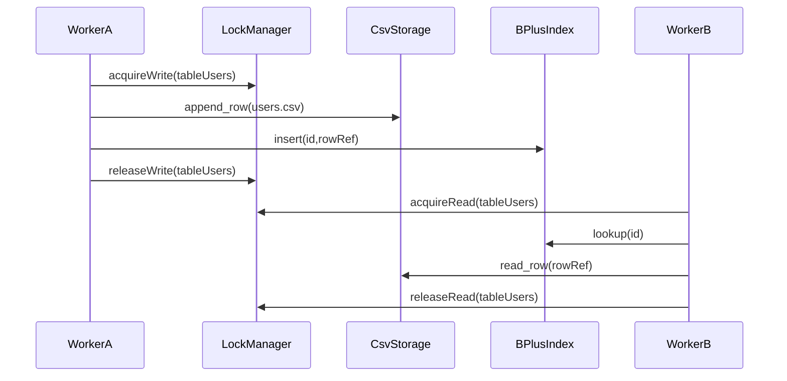

# W8-05 — 동시성 안전성(파일 I/O 및 인덱스 접근)

## 1. 구현 목적 및 필요성
### 왜 이걸 하는가 (문제 맥락)
멀티스레드 서버에서 가장 위험한 실패는 성능 저하보다 데이터 정합성 붕괴입니다. 특히 CSV 파일 쓰기와 B+트리 인덱스 갱신이 동시 접근되면 누락, 중복, 깨진 상태가 발생할 수 있어 동시성 안전성 설계가 필수입니다.

### 무엇을 연결하는가 (기술 맥락)
요청 처리 경로에서 CSV append/read와 인덱스 insert/lookup를 락 정책으로 보호합니다. 즉, "요청 병렬성"과 "데이터 일관성"을 동시에 만족하도록 임계영역 범위를 설계하고, 읽기/쓰기 경로를 구분합니다.

### 왜 중요한가 (학습 포인트)
동시성 학습에서 핵심은 스레드를 늘리는 것이 아니라 정확성을 지키는 방법을 이해하는 것입니다. 이 단계에서 락 granularity, 데드락 회피, race 재현 테스트 같은 실무형 동시성 사고를 학습할 수 있습니다.

### 완성의 의미 (결과 관점)
이 단계가 완료되면 동시 요청 상황에서도 데이터가 일관되게 유지됩니다. 즉, 발표에서 "병렬 처리 + 정합성 보장"을 함께 설명할 수 있는 수준이 됩니다.

### 1.1 실제로 하는 일
- 공유 자원 식별: CSV 파일 접근과 B+트리 접근 경로를 동시성 보호 대상으로 정의합니다.
- 락 전략 구현: 테이블 단위 read/write 락(또는 동등 전략)으로 읽기/쓰기 경로를 분리합니다.
- INSERT 임계영역 통합: CSV append와 인덱스 갱신을 하나의 원자적 구간으로 묶습니다.
- SELECT 보호 경로 정리: 인덱스 조회/행 조회 시 일관된 락 규칙을 적용합니다.
- 실패 경로 안전화: 에러 발생 시에도 unlock 누락이 없도록 정리 로직을 보강합니다.
- 정합성 테스트 추가: 동시 INSERT/SELECT에서 중복/유실/손상 여부를 검증합니다.

## 2. 가능한 구현 방식 비교
- 방식 A: 전역 mutex 1개
  - 장점: 구현 단순, 안전성 높음
  - 단점: 병렬성 크게 저하
- 방식 B: 테이블 단위 read-write lock
  - 장점: 다른 테이블 간 병렬성 확보, 읽기 동시성 향상
  - 단점: 락 관리 복잡도 증가
- 방식 C: 파일락(fcntl/flock) 중심
  - 장점: 프로세스 간 안정성까지 고려 가능
  - 단점: 플랫폼별 차이, 디버깅 난이도
- 학습 관점 해석:
  - A는 개념 입문에는 쉬우나 병렬성 손실이 커서 실제 운영 감각 학습에는 한계가 있습니다.
  - B는 정확성과 성능 사이 균형점을 찾는 연습에 가장 적합합니다.
  - C는 심화 주제로 좋지만 이번 주차의 구현/검증 범위를 빠르게 넘기 쉽습니다.
- 선택 제안: 이번에는 B를 기준으로 구현하고, C는 확장 고려사항으로만 관리하는 것이 학습 효율이 좋습니다.

## 3. 시퀀스 다이어그램 및 설명

- 설명: INSERT는 write lock, SELECT WHERE id는 read lock으로 분리합니다.

## 4. 코드 구조 및 구현 절차
- 인터페이스
  - `lock_manager_acquire(tableName, mode)`
  - `lock_manager_release(tableName, mode)`
- 핵심 구조
  - `TableLockMap { tableName -> rwlock }`
  - `CriticalSectionGuard`(수동 해제 누락 방지용 패턴)
- 구현 절차
  1. 테이블명 기준 lock registry 구현
  2. INSERT 경로에서 CSV append + index insert를 단일 임계영역으로 묶기
  3. SELECT 경로는 read lock 사용
  4. 에러/예외 경로에서도 unlock 보장
- 수도코드
  - `acquire_write(table)`
  - `append_csv(); update_index();`
  - `release_write(table)`

## 5. 비기능적 요구사항 고려
- 성능: 테이블 단위 락으로 불필요한 직렬화 감소
- 확장성: 테이블 수 증가 시 lock map 메모리 관리 필요(O(t))
- 유지보수성: 락 획득 순서를 표준화해 데드락 예방

## 6. 테스팅 방법
- 시나리오 1: 동일 테이블 동시 INSERT 100회
  - 기대: 누락/중복/깨진 라인 없음
- 시나리오 2: INSERT + SELECT WHERE id 동시 수행
  - 기대: 크래시 없음, 조회 일관성 유지
- 시나리오 3: 중간 실패 유도(IO error)
  - 기대: 락 누수 없이 후속 요청 정상 처리

## 7. 용어 정의 및 주의사항
- Linearizability(준선형화): 동시 연산이 어떤 순차 순서로 실행된 것처럼 보이는 성질
- Lock granularity: 락 범위(전역/테이블/행)
- 주의사항
  - 락 잡은 상태에서 외부 콜백 호출 금지(교착 위험)
  - index 갱신 실패 시 CSV append 롤백 전략 또는 에러 보정 정책 정의 필요

## 8. 제언
- 일단 "정확성 우선"으로 락을 다소 보수적으로 적용한 뒤, 벤치 결과로 점진 완화하세요.
- 데모 전 정합성 체크 스크립트(중복 id, 깨진 CSV 라인 검사)를 준비하면 안정성이 높아집니다.

## 9. 지금까지 자주 나온 질문 정리 (면접형)
### Q1. 전역 mutex 1개 방식은 정확히 어떤 방식인가요?
A. 전역 mutex 1개 방식은 공유 자원 접근 구간 전체를 하나의 락으로 보호하는 방법입니다. 구현은 단순하고 안전하지만, 사실상 대부분의 요청이 같은 락을 기다리게 되어 직렬 처리에 가까워집니다. 그래서 초기 안정화용 기준선으로는 쓸 수 있어도, 병렬 처리 성능 목표를 달성하기엔 한계가 큽니다.

### Q2. 전역 mutex면 병렬 처리가 의미 없는 것 아닌가요?
A. 같은 테이블/같은 임계영역에 대한 동시 작업은 거의 직렬화되므로 지적이 맞습니다. 다만 이 방식은 "정합성을 먼저 확보하는 임시 안전 버전"으로는 의미가 있습니다. 이번 구현에서는 최종적으로 테이블 단위 read-write lock으로 전환해, 같은 테이블 쓰기는 보호하면서도 다른 테이블 작업과 읽기 경로의 병렬성을 살리는 방향을 택했습니다.

### Q3. 방식 B(테이블 단위 rwlock)와 방식 C(파일락)는 어떻게 다르나요?
A. 방식 B는 한 프로세스 내부 멀티스레드 동시성을 제어하는 전략이고, 방식 C는 여러 프로세스가 같은 파일을 접근할 때까지 고려하는 전략입니다. 현재 구조처럼 단일 프로세스 API 서버에서는 B가 구현 복잡도 대비 효과가 가장 좋습니다. 반면 C는 다중 프로세스 환경에서 유효하지만 플랫폼 차이와 디버깅 복잡도가 커서 이번 스코프에서는 확장 옵션으로 보는 것이 합리적입니다.

### Q4. 쓰기는 원자성을 지켜야 하니 결국 병렬 처리가 안 되는 건가요?
A. "같은 데이터 대상에 대한 쓰기"는 원자성 때문에 직렬화되는 게 맞습니다. 하지만 병렬성은 락 단위를 어디까지 좁히느냐에 따라 충분히 확보할 수 있습니다. 예를 들어 같은 테이블 쓰기-쓰기는 직렬화하되, 다른 테이블 작업이나 읽기 경로는 병렬 처리하도록 설계하면 전체 처리량을 유지하면서 정합성도 지킬 수 있습니다.

### Q5. 쓰기에서 캐시는 못 쓰나요?
A. 쓸 수는 있지만 읽기 캐시보다 일관성 관리가 훨씬 어렵습니다. write-through, write-around, write-back 같은 패턴이 있지만, 현재 CSV 기반 구조에서는 쓰기 캐시를 무리하게 넣기보다 저장소 일관성을 먼저 확보하고, 필요 시 제한된 범위(메타데이터/인덱스)부터 점진 도입하는 것이 안전합니다.
## 10. 단계별로 알아가면 좋은 질문 (면접형)
### Q1. race condition을 어떻게 재현하고 검증할 것인가?
A. 의도적으로 동시 INSERT/SELECT를 반복 실행하고 결과 정합성을 체크해야 합니다. 재현 스크립트와 자동 검사 로직이 핵심입니다. 상세 관점에서는 이 선택이 다른 대안과 비교해 어떤 트레이드오프를 가지는지, 운영 중 어떤 리스크를 줄여주는지, 그리고 테스트로 어떻게 검증할지를 함께 설명할 수 있어야 합니다. 면접에서는 결론만 말하기보다 "선택 근거 -> 대안 비교 -> 검증 방법" 순서로 답하면 설득력이 높아집니다.

### Q2. 데드락을 예방하는 최소 규칙은?
A. 락 획득 순서를 전역 규칙으로 고정하고, 예외 경로에서도 동일하게 해제하는 것입니다. 상세 관점에서는 이 선택이 다른 대안과 비교해 어떤 트레이드오프를 가지는지, 운영 중 어떤 리스크를 줄여주는지, 그리고 테스트로 어떻게 검증할지를 함께 설명할 수 있어야 합니다. 면접에서는 결론만 말하기보다 "선택 근거 -> 대안 비교 -> 검증 방법" 순서로 답하면 설득력이 높아집니다.

### Q3. 실패 경로에서 정합성을 어떻게 보장하나?
A. 부분 성공 상태를 허용하지 않도록 에러 발생 시 롤백/보정 정책을 명시해야 합니다. 최소한 불일치 감지와 장애 표시가 필요합니다. 상세 관점에서는 이 선택이 다른 대안과 비교해 어떤 트레이드오프를 가지는지, 운영 중 어떤 리스크를 줄여주는지, 그리고 테스트로 어떻게 검증할지를 함께 설명할 수 있어야 합니다. 면접에서는 결론만 말하기보다 "선택 근거 -> 대안 비교 -> 검증 방법" 순서로 답하면 설득력이 높아집니다.
## 11. 꼭 알아야 할 질문 (면접형)
### Q1. 왜 동시성에서 성능보다 정합성을 먼저 봤나요?
A. 데이터 시스템에서 잘못된 빠름은 올바른 느림보다 위험합니다. 동시성 버그는 재현이 어렵고, 한번 발생하면 데이터 복구 비용이 큽니다. 그래서 먼저 정합성 규칙(원자성, 락 범위, 실패 시 정리)을 고정하고, 그 위에서 성능을 튜닝하는 순서를 택했습니다. 상세 관점에서는 이 선택이 다른 대안과 비교해 어떤 트레이드오프를 가지는지, 운영 중 어떤 리스크를 줄여주는지, 그리고 테스트로 어떻게 검증할지를 함께 설명할 수 있어야 합니다. 면접에서는 결론만 말하기보다 "선택 근거 -> 대안 비교 -> 검증 방법" 순서로 답하면 설득력이 높아집니다.

### Q2. 락 granularity를 어떻게 결정했나요?
A. 전역 락은 안전하지만 병렬성을 크게 희생합니다. 반대로 너무 세밀한 락은 구현 복잡도와 데드락 위험을 높입니다. 이번 단계는 테이블 단위 락을 기준으로 선택해 안전성과 병렬성의 균형을 맞추고, 향후 병목이 확인되면 세분화하는 전략을 택했습니다. 상세 관점에서는 이 선택이 다른 대안과 비교해 어떤 트레이드오프를 가지는지, 운영 중 어떤 리스크를 줄여주는지, 그리고 테스트로 어떻게 검증할지를 함께 설명할 수 있어야 합니다. 면접에서는 결론만 말하기보다 "선택 근거 -> 대안 비교 -> 검증 방법" 순서로 답하면 설득력이 높아집니다.

### Q3. INSERT 경로에서 무엇을 같은 임계영역으로 묶어야 하나요?
A. 최소한 CSV append와 인덱스 갱신은 같은 임계영역에 있어야 합니다. 둘 중 하나만 성공하면 데이터와 인덱스가 불일치해 조회 오류를 만듭니다. 면접에서는 "원자적 업데이트 단위를 어디로 정의했는가"를 명확히 답할 수 있어야 합니다. 상세 관점에서는 이 선택이 다른 대안과 비교해 어떤 트레이드오프를 가지는지, 운영 중 어떤 리스크를 줄여주는지, 그리고 테스트로 어떻게 검증할지를 함께 설명할 수 있어야 합니다. 면접에서는 결론만 말하기보다 "선택 근거 -> 대안 비교 -> 검증 방법" 순서로 답하면 설득력이 높아집니다.