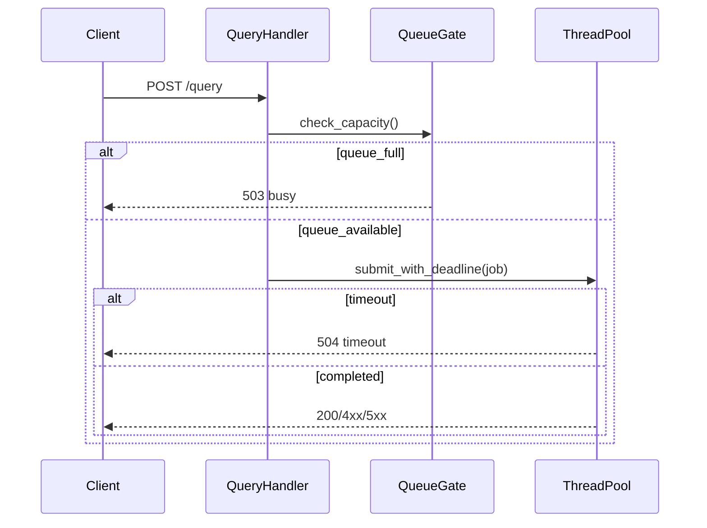

# W8-06 — 타임아웃, 백프레셔, 요청 취소 정책

## 1. 구현 목적 및 필요성
### 왜 이걸 하는가 (문제 맥락)
서버는 정상 상황뿐 아니라 과부하/지연 상황에서도 무너지지 않아야 합니다. 스레드풀이 있어도 큐가 무한히 쌓이거나 요청이 오래 붙잡히면 전체 서비스 품질이 급격히 나빠지므로 보호 정책이 필요합니다.

### 무엇을 연결하는가 (기술 맥락)
요청 수락 단계와 실행 단계에 각각 보호 장치를 둡니다. 수락 단계에서는 queue admission/backpressure를 적용하고, 실행 단계에서는 timeout/deadline을 적용해 자원 점유를 제어합니다.

### 왜 중요한가 (학습 포인트)
실무 서버에서 중요한 역량은 "빨리 처리"뿐 아니라 "위험을 제한"하는 능력입니다. 이 단계에서는 실패를 통제 가능한 형태로 반환하는 법(503/504, retryable 정책)과 운영 관점의 방어 설계를 학습할 수 있습니다.

### 완성의 의미 (결과 관점)
이 단계가 끝나면 트래픽이 몰리는 상황에서도 서버가 예측 가능한 방식으로 동작합니다. 즉, 품질 데모에서 안정성 관점의 완성도를 보여줄 수 있습니다.

### 1.1 실제로 하는 일
- admission 제어 구현: 큐 상태를 확인해 수용 가능 요청만 처리 경로로 보냅니다.
- timeout 정책 적용: 요청별 deadline을 두고 초과 시 `504`를 반환합니다.
- 과부하 응답 표준화: `QUEUE_FULL`, `REQUEST_TIMEOUT` 오류 포맷을 계약에 맞춥니다.
- retry 가능성 명시: 오류별 `retryable` 정책을 응답에 반영합니다.
- 로그/메트릭 포인트 추가: 거절 건수, timeout 건수, 대기시간을 추적 가능하게 만듭니다.
- 보호 정책 테스트 추가: burst/지연/정상 부하 시나리오를 자동 검증합니다.

## 2. 가능한 구현 방식 비교 (정책)
- 방식 A: 고정 timeout + 큐 full 즉시 거절
  - 장점: 구현 단순, 시스템 보호 확실
  - 단점: 요청 성공률 저하 가능
- 방식 B: 동적 timeout(큐 길이 기반)
  - 장점: 상황 적응형
  - 단점: 정책 복잡, 예측성 낮음
- 방식 C: 우선순위 큐 + SLA 등급
  - 장점: 중요한 요청 보호
  - 단점: 현재 범위 밖 설계 비용 큼
- 학습 관점 해석:
  - A는 정책 효과를 빠르게 검증하기 좋고, 실패 시 원인 추적이 쉽습니다.
  - B/C는 트래픽 패턴과 서비스 중요도에 맞춰 정책을 정교화하는 방향입니다.
  - 이번 단계에서는 정책 기준선을 먼저 고정하고, 지표로 효과를 검증하는 루프가 가장 교육적입니다.
- 선택 제안: A를 기준선으로 채택하고, 테스트 지표를 기반으로 B/C 도입 여부를 점진적으로 결정합니다.

## 2.1 취소/타임아웃 실행 메커니즘 비교
- 메커니즘 M1: Cooperative cancellation(요청별 cancel token)
  - 장점: 강제 종료 없이 실행 중 요청을 안전하게 중단 가능, timeout 반응성 향상
  - 단점: 엔진 루프 내 체크 포인트 설계 및 token 수명/동기화 관리 필요
- 메커니즘 M2: 감시 스레드(watcher thread) + deadline registry
  - 장점: deadline 시점에 맞춘 취소 트리거 가능, polling 대비 정확도/효율 개선
  - 단점: 별도 스레드와 자료구조(min-heap/정렬 큐) 관리가 필요해 구현 복잡도 증가
- 적용 관점:
  - M1/M2는 A/B/C 정책과 배타적 관계가 아니라 조합 가능한 실행 메커니즘입니다.
  - 예: `A + M1`, `B + M1 + M2`, `C + M1 + M2`
- 선택 제안:
  - 현재 스코프에서는 `A + M1`을 기본으로 두고, 필요 시 `M2`를 확장 적용하는 방식이 현실적입니다.

## 3. 시퀀스 다이어그램 및 설명

- 설명: 큐 게이트에서 1차 보호, 처리 단계에서 deadline으로 2차 보호를 수행합니다.

## 4. 코드 구조 및 구현 절차
- 인터페이스
  - `queue_gate_try_admit()`
  - `submit_with_deadline(job, deadlineMs)`
  - `cancel_token_is_expired()`
- 구현 절차
  1. 큐 길이 임계치와 즉시 거절 코드 정의
  2. 요청별 deadline 계산
  3. 워커 실행 전/중 취소 체크 지점 설정
  4. timeout/queue_full 오류를 표준 envelope로 매핑
- 수도코드
  - `if !admit(): return BUSY`
  - `result = wait_until(deadline)`
  - `if expired: return TIMEOUT`

## 5. 비기능적 요구사항 고려
- 성능: timeout 체크 비용은 O(1), 고빈도 타이머 호출 최소화
- 확장성: 정책 값을 설정 파일/환경변수로 외부화
- 유지보수성: 보호 정책 로그를 단일 포맷으로 기록

## 6. 테스팅 방법
- 입력: queueCapacity보다 큰 burst 요청
- 기대: 일부 요청은 즉시 503, 서버 지속 응답 가능
- 입력: 고의 지연 SQL(테스트 훅)
- 기대: deadline 초과 시 504
- 입력: 정상 부하
- 기대: 오탐 timeout 없이 대부분 성공

## 7. 용어 정의 및 주의사항
- Backpressure: 시스템이 처리량 초과 입력을 제어하는 메커니즘
- Deadline: 요청의 절대 만료 시각
- 주의사항
  - timeout은 응답 기준인지, 실제 엔진 실행 중단까지 보장하는지 명확히 구분 필요
  - 취소 미지원 엔진에서는 "응답 timeout + 백그라운드 완료" 상태를 문서화해야 함

## 8. 제언
- 첫 버전은 정책값을 보수적으로 시작하고, `W8-08` 측정치로 튜닝하세요.
- 에러 코드에 재시도 가능 여부(`retryable`)를 넣으면 클라이언트 전략이 단순해집니다.

## 9. 지금까지 자주 나온 질문 정리 (면접형)
### Q1. 스레드풀만으로 안정성이 보장되지 않는 이유는?
A. 스레드풀은 동시 실행 수만 제한합니다. 입력 폭주를 제어하지 않으면 큐 적체와 지연 폭증이 발생해 결국 서비스 품질이 무너집니다.

### Q2. 503과 504를 나누는 실무적 이유는?
A. 실패 원인을 구분해야 클라이언트 재시도 전략이 달라집니다. 수용 불가(503)와 처리 지연(504)을 분리하면 대응이 정교해집니다.

### Q3. retryable 필드는 왜 필요한가?
A. 클라이언트가 자동 재시도 여부를 즉시 판단할 수 있게 하기 위함입니다. 서버-클라이언트 협업 관점에서 운영 효율이 좋아집니다.
## 10. 단계별로 알아가면 좋은 질문 (면접형)
### Q1. timeout 기준값은 어떻게 정하나?
A. 평균 지연이 아니라 p95/p99 지연과 사용자 기대 응답 시간을 함께 고려해 정합니다. 초기값은 보수적으로 두고 운영 지표로 조정합니다.

### Q2. backpressure 정책을 어떤 기준으로 선택하나?
A. 서비스 목표가 지연 최소화인지 성공률 극대화인지에 따라 달라집니다. 이번 과제는 안정성과 예측 가능성을 우선해 즉시 거절 정책이 적합합니다.

### Q3. 보호 정책 도입 효과를 어떻게 입증하나?
A. 도입 전후의 오류율, timeout 비율, 큐 길이 지표를 비교해 정량적으로 설명해야 합니다.
## 11. 꼭 알아야 할 질문 (면접형)
### Q1. 스레드풀이 있는데 왜 backpressure가 필요한가요?
A. 스레드풀은 동시 처리 상한을 정할 뿐, 입력 폭주를 자동으로 제어하지는 않습니다. queue가 무제한이면 결국 대기 시간이 폭증하고 자원이 고갈됩니다. backpressure는 시스템이 감당 가능한 양만 받도록 하여 실패를 제어 가능한 형태로 만듭니다.

### Q2. 503과 504를 어떻게 구분하나요?
A. 503은 "지금은 수용 자체가 불가"(예: queue full), 504는 "수용은 했지만 기한 내 완료 실패"를 의미합니다. 이 구분은 클라이언트 재시도 전략에 직접 영향을 주기 때문에 명확히 나눠야 합니다.

### Q3. timeout 정책에서 가장 중요한 설계 포인트는?
A. timeout의 의미를 명확히 정의하는 것입니다. 응답만 timeout 처리할지, 실제 실행 중단까지 보장할지 경계를 정해야 합니다. 이 경계가 불명확하면 운영 중 "응답은 실패인데 내부 실행은 계속됨" 같은 혼란이 생깁니다.