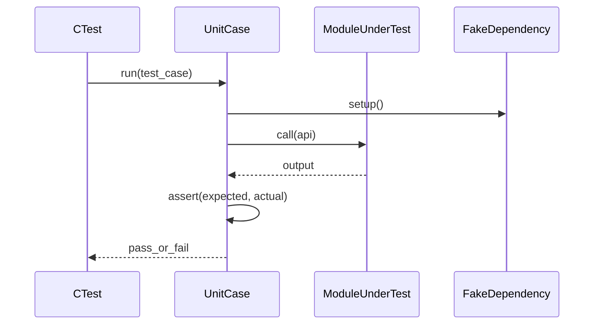

# W8-07 — 단위 테스트 전략

## 1. 구현 목적 및 필요성
### 왜 이걸 하는가 (문제 맥락)
AI 기반 구현에서는 "코드 생성 속도"가 빨라지는 만큼 회귀 위험도 함께 커집니다. 핵심 모듈에 대한 단위 테스트가 없으면 작은 변경이 전체 기능을 깨뜨려도 늦게 발견됩니다.

### 무엇을 연결하는가 (기술 맥락)
서버, 스레드풀, 엔진 브리지, 에러 매핑 같은 모듈별 책임을 테스트 케이스와 연결합니다. 즉, 설계한 인터페이스가 실제로 계약대로 동작하는지를 함수 단위에서 먼저 검증합니다.

### 왜 중요한가 (학습 포인트)
단위 테스트는 단순 검증 도구가 아니라 설계를 점검하는 장치입니다. 이 단계에서 경계값 테스트, 실패 케이스 우선 설계, flaky 회피 전략을 학습하면 이후 통합 단계 디버깅 비용을 크게 줄일 수 있습니다.

### 완성의 의미 (결과 관점)
이 단계가 완료되면 핵심 모듈의 신뢰도가 올라가고, 기능 추가 시 회귀를 빠르게 탐지할 수 있습니다. 즉, 구현 속도와 품질을 동시에 가져갈 수 있는 기반이 만들어집니다.

### 1.1 실제로 하는 일
- 테스트 대상 분해: 서버/스레드풀/브리지/매핑 모듈별 단위 테스트 범위를 정합니다.
- 공통 fixture 정리: 샘플 SQL, 가짜 결과 객체, 테스트 데이터 준비 절차를 고정합니다.
- 핵심 실패 케이스 우선 작성: 입력 오류, 큐 포화, 파싱 실패, 실행 실패를 먼저 검증합니다.
- 회귀 테스트 루프 구축: 버그 수정 시 재현 테스트를 추가해 재발을 방지합니다.
- 실행 시간 관리: fast unit 중심으로 테스트 시간을 짧게 유지합니다.
- CI/로컬 명령 통일: 팀원이 동일 명령으로 동일 결과를 확인하게 만듭니다.

## 2. 가능한 구현 방식 비교
- 방식 A: CTest + 자체 assertion 매크로
  - 장점: 현재 빌드 체계 친화적, 도구 의존도 낮음
  - 단점: 테스트 유틸 직접 유지 필요
- 방식 B: 외부 C 테스트 프레임워크(CMocka 등)
  - 장점: 표현력/fixture 기능 우수
  - 단점: 의존성 설치/CI 재현 비용
- 방식 C: 스크립트 기반 블랙박스 테스트만
  - 장점: 시작 빠름
  - 단점: 단위 결함 위치 추적 어려움
- 학습 관점 해석:
  - A는 테스트 인프라를 직접 이해하기 좋아 팀 전체 테스트 문해력을 높입니다.
  - B는 편의성이 좋지만 도구 학습비가 추가될 수 있어 이번 주차에서는 선택적 도입이 적합합니다.
  - C는 데모용 확인에는 유용하나, 실패 원인을 학습하기엔 정보가 부족합니다.
- 선택 제안: A를 기본으로 두고, 복잡한 모듈에만 최소한의 mock 유틸을 보강하는 전략을 권장합니다.

## 3. 시퀀스 다이어그램 및 설명

- 설명: 외부 I/O를 fake로 격리해 결정적 테스트를 유지합니다.

## 4. 코드 구조 및 구현 절차
- 대상 모듈
  - `error_mapper`
  - `engine_bridge` (파서/실행기 mock)
  - `thread_pool`/`job_queue`
- 구현 절차
  1. 테스트 분류(`fast unit`, `slow integration`) 태깅
  2. 공통 fixture(샘플 SQL, 가짜 결과 객체) 준비
  3. 경계값/오류값 우선 테스트 작성
  4. 회귀 버그 발생 시 테스트 먼저 추가
- 수도코드
  - `given queue full when submit then return QUEUE_FULL`
  - `given parse error when map then http422`

## 5. 비기능적 요구사항 고려
- 성능: 단위 테스트 전체 실행시간 10초 내 목표
- 확장성: 모듈 증가 시 테스트 디렉터리 규칙 고정
- 유지보수성: 테스트 이름에 입력/기대동작을 포함

## 6. 테스팅 방법
- 입력: 엔진 상태 `PARSE_ERR`
- 기대: HTTP 422 매핑
- 입력: 큐 capacity=1, 2개 submit
- 기대: 두 번째 요청 실패 코드 일치
- 입력: 유효 SQL 결과 객체
- 기대: JSON 직렬화 필드 누락 없음

## 7. 용어 정의 및 주의사항
- Deterministic test: 실행 환경에 상관없이 동일 결과를 내는 테스트
- Test double: 실제 의존 대신 사용하는 fake/mock/stub
- 주의사항
  - 실제 스레드 timing에 의존하는 테스트는 flaky 위험이 큼
  - 파일 시스템 경로 하드코딩은 OS별 실패 원인

## 8. 제언
- flaky 가능성이 있는 동시성 테스트는 재시도 허용 대신 원인 제거를 우선하세요.
- 실패 로그에 requestId/workerId를 찍으면 디버깅 속도가 크게 향상됩니다.

## 9. 지금까지 자주 나온 질문 정리 (면접형)
### Q1. 왜 단계별 단위 테스트를 강하게 권장하나요?
A. 단계형 개발에서는 변경이 연쇄적으로 영향을 주기 때문에, 모듈 단위에서 조기 검출하지 않으면 통합 시 원인 추적 비용이 폭증합니다.

### Q2. 단위 테스트와 E2E 테스트의 우선순위는?
A. 둘 다 필요하지만 순서는 단위 먼저입니다. 단위가 안정돼야 E2E 실패 원인을 빠르게 좁힐 수 있습니다.

### Q3. AI 생성 코드 검증에서 핵심은 무엇인가요?
A. 정상 경로보다 실패 경로를 먼저 고정하는 것입니다. 생성 코드는 예외 케이스 누락이 잦아 실패 테스트가 품질을 좌우합니다.
## 10. 단계별로 알아가면 좋은 질문 (면접형)
### Q1. 좋은 단위 테스트의 조건은?
A. 입력/기대 출력이 명확하고, 실패 시 원인을 즉시 알 수 있어야 합니다. 테스트 이름도 시나리오를 설명해야 합니다.

### Q2. flaky 테스트를 발견하면 어떻게 대응하나?
A. 재시도로 가리지 말고 비결정성을 제거해야 합니다. 시간 의존성, 공유 상태, 스레드 타이밍을 먼저 점검합니다.

### Q3. 테스트 범위를 어떻게 확장하나?
A. 버그가 발생한 지점에 회귀 테스트를 즉시 추가하는 방식이 가장 효율적입니다. 실패 경험이 테스트 자산으로 축적됩니다.
## 11. 꼭 알아야 할 질문 (면접형)
### Q1. 왜 단계별 단위 테스트가 필요한가요?
A. 단계별 구현에서는 작은 변경이 연쇄적으로 영향을 주기 쉽습니다. 단위 테스트를 단계마다 추가하면 결함을 가장 가까운 모듈에서 즉시 검출할 수 있어 통합 단계의 디버깅 비용을 크게 줄입니다. 이는 개발 속도를 늦추는 게 아니라 오히려 안정적인 속도를 만드는 전략입니다.

### Q2. 단위 테스트와 통합 테스트의 역할 차이는?
A. 단위 테스트는 "모듈 계약"을 검증하고, 통합 테스트는 "모듈 간 연결"을 검증합니다. 단위가 튼튼해야 통합 실패 원인을 빠르게 좁힐 수 있습니다. 둘 중 하나만으로는 품질을 설명하기 어렵습니다.

### Q3. AI 생성 코드에서 테스트 전략은 어떻게 달라지나요?
A. 생성 속도가 빠를수록 회귀 가능성도 함께 증가하므로, 테스트 루프를 더 자주 돌려야 합니다. 특히 실패 케이스를 먼저 작성하면 생성 코드가 놓치기 쉬운 예외 경로를 조기에 잡을 수 있습니다. 즉 AI 사용 시 테스트는 선택이 아니라 필수 안전장치입니다.