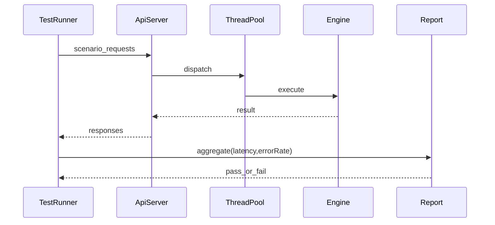

# W8-08 — API/E2E/동시성 테스트

## 1. 구현 목적 및 필요성
### 왜 이걸 하는가 (문제 맥락)
단위 테스트가 통과해도 실제 사용자 경로에서 계약 불일치나 동시성 문제가 발생할 수 있습니다. 발표에서는 "로컬에서 한 번 됐다"가 아니라 "전체 시스템이 재현 가능하게 동작한다"는 증거가 필요합니다.

### 무엇을 연결하는가 (기술 맥락)
클라이언트 요청부터 API 응답, 엔진 실행, 파일 반영, 동시 요청 처리까지 전체 경로를 하나의 검증 시나리오로 묶습니다. 즉, 기능/오류/성능 관점을 E2E 테스트에서 동시에 점검합니다.

### 왜 중요한가 (학습 포인트)
실무 품질 검증의 핵심은 "정답 여부"와 "운영 안정성"을 함께 보는 것입니다. 이 단계에서 시나리오 설계, 지표 수집(p95/오류율), 테스트 데이터 격리 같은 운영형 테스트 감각을 학습할 수 있습니다.

### 완성의 의미 (결과 관점)
이 단계가 완료되면 데모와 발표에서 동작 근거를 수치와 로그로 제시할 수 있습니다. 즉, 기능 구현을 넘어 신뢰 가능한 시스템으로 설명 가능한 상태가 됩니다.

### 1.1 실제로 하는 일
- E2E 시나리오 구성: health, query 성공/실패, 동시 요청 시나리오를 정의합니다.
- 테스트 데이터 초기화: 시나리오 간 데이터 오염이 없도록 reset 절차를 만듭니다.
- 기능 검증 자동화: INSERT->SELECT 결과 일치, 오류 코드 일치를 검증합니다.
- 동시성 검증 자동화: 혼합 부하(read/write)에서 안정성과 오류율을 확인합니다.
- 성능 지표 수집: latency(p50/p95), 성공률, 거절률을 측정합니다.
- 결과 리포트화: 발표에 바로 쓸 수 있는 요약 결과를 산출합니다.

## 2. 가능한 구현 방식 비교
- 방식 A: curl/bash 시나리오 + 간단 동시성 스크립트
  - 장점: 즉시 사용 가능, 환경 요구 낮음
  - 단점: 리포트 구조 제한
- 방식 B: Python 테스트 러너(요청/검증 통합)
  - 장점: 시나리오 확장/리포트 용이
  - 단점: 런타임 의존성 추가
- 방식 C: 전문 부하도구(k6/jmeter)
  - 장점: 고급 지표 제공
  - 단점: 학습/설정 비용
- 학습 관점 해석:
  - A는 빠른 반복 검증에 유리해 기본 시나리오 학습에 좋습니다.
  - B는 구조화된 검증과 리포트 작성 능력을 키우는 데 효과적입니다.
  - C는 심화 학습용으로 유익하지만, 이번 주차의 시간 제약에서는 선택적 사용이 적절합니다.
- 선택 제안: A+B 혼합으로 기본 안정성 검증을 확실히 하고, C는 필요 시 확장 실험으로 다루는 전략이 좋습니다.

## 3. 시퀀스 다이어그램 및 설명

- 설명: 기능/성능/오류율을 한 번에 수집해 발표 근거 데이터로 활용합니다.

## 4. 코드 구조 및 구현 절차
- 테스트 묶음
  - `smoke`: health/query 기본 성공
  - `functional`: INSERT/SELECT/오류 매핑
  - `concurrency`: 동시 요청 burst
- 구현 절차
  1. 테스트 데이터 초기화 스크립트 준비
  2. 시나리오별 기대 결과 정의(정확한 행 수, 오류 코드)
  3. 동시성 실행 후 CSV/인덱스 정합성 검사
  4. 요약 리포트 생성(성공률, p95)
- 수도코드
  - `run_smoke(); run_functional(); run_concurrency();`
  - `assert errorRate < threshold`

## 5. 비기능적 요구사항 고려
- 성능: p50/p95 latency 측정
- 확장성: 시나리오 파일 분리로 새로운 케이스 추가 용이
- 유지보수성: 테스트 데이터 리셋 절차 표준화

## 6. 테스팅 방법
- 입력: 정상 시나리오(INSERT 10회 + SELECT)
- 기대: 최종 row 수 10 증가
- 입력: 동시 100요청(읽기 70/쓰기 30)
- 기대: 서버 비정상 종료 없음, 오류율 정책 범위 내
- 입력: queue 폭주
- 기대: 503 반환 증가하지만 서버 생존

## 7. 용어 정의 및 주의사항
- E2E: 클라이언트부터 저장소까지 전체 경로 검증
- p95 latency: 전체 요청 중 95%가 이 값 이하로 응답
- 주의사항
  - 테스트간 데이터 오염 방지를 위해 독립 테이블/초기화 필수
  - 벤치 숫자를 발표에 쓸 때 테스트 조건(머신 스펙) 함께 기록 필요

## 8. 제언
- 데모 직전에는 "짧은 smoke"와 "표본 동시성 테스트"만 재실행하는 2단계 검증 루틴을 두세요.
- 실패 시 자동으로 서버 로그 tail을 첨부하는 스크립트를 만들면 원인 파악이 빨라집니다.

## 9. 지금까지 자주 나온 질문 정리 (면접형)
### Q1. E2E 테스트가 꼭 필요한 이유는?
A. 실제 장애는 경계에서 발생합니다. 라우팅, JSON 파싱, 엔진 호출, 락 경합은 단위 테스트만으로는 놓치기 쉽습니다. 상세 관점에서는 이 선택이 다른 대안과 비교해 어떤 트레이드오프를 가지는지, 운영 중 어떤 리스크를 줄여주는지, 그리고 테스트로 어떻게 검증할지를 함께 설명할 수 있어야 합니다. 면접에서는 결론만 말하기보다 "선택 근거 -> 대안 비교 -> 검증 방법" 순서로 답하면 설득력이 높아집니다.

### Q2. 동시성 테스트의 성공 기준은 무엇인가요?
A. 단순 성공률이 아니라 정합성 유지, 오류 코드 일관성, 지연 임계치 준수를 함께 봐야 합니다. 상세 관점에서는 이 선택이 다른 대안과 비교해 어떤 트레이드오프를 가지는지, 운영 중 어떤 리스크를 줄여주는지, 그리고 테스트로 어떻게 검증할지를 함께 설명할 수 있어야 합니다. 면접에서는 결론만 말하기보다 "선택 근거 -> 대안 비교 -> 검증 방법" 순서로 답하면 설득력이 높아집니다.

### Q3. 발표용 검증 결과는 무엇이 핵심인가요?
A. 재현 가능한 숫자입니다. p95 latency, 성공률, 과부하 시 에러 분포를 조건과 함께 제시해야 설득력이 생깁니다. 상세 관점에서는 이 선택이 다른 대안과 비교해 어떤 트레이드오프를 가지는지, 운영 중 어떤 리스크를 줄여주는지, 그리고 테스트로 어떻게 검증할지를 함께 설명할 수 있어야 합니다. 면접에서는 결론만 말하기보다 "선택 근거 -> 대안 비교 -> 검증 방법" 순서로 답하면 설득력이 높아집니다.
## 10. 단계별로 알아가면 좋은 질문 (면접형)
### Q1. 테스트 시나리오 순서는 어떻게 가져가야 하나?
A. smoke -> functional -> concurrency 순서가 좋습니다. 실패 범위를 좁히며 원인 추적이 쉬워집니다. 상세 관점에서는 이 선택이 다른 대안과 비교해 어떤 트레이드오프를 가지는지, 운영 중 어떤 리스크를 줄여주는지, 그리고 테스트로 어떻게 검증할지를 함께 설명할 수 있어야 합니다. 면접에서는 결론만 말하기보다 "선택 근거 -> 대안 비교 -> 검증 방법" 순서로 답하면 설득력이 높아집니다.

### Q2. 데이터 초기화를 왜 엄격히 하나요?
A. 초기화가 없으면 테스트 간 오염으로 오탐/미탐이 발생합니다. 재현성을 위해 케이스 독립성이 필수입니다. 상세 관점에서는 이 선택이 다른 대안과 비교해 어떤 트레이드오프를 가지는지, 운영 중 어떤 리스크를 줄여주는지, 그리고 테스트로 어떻게 검증할지를 함께 설명할 수 있어야 합니다. 면접에서는 결론만 말하기보다 "선택 근거 -> 대안 비교 -> 검증 방법" 순서로 답하면 설득력이 높아집니다.

### Q3. 성능 수치를 해석할 때 주의점은?
A. 단일 숫자만 보지 말고 부하 조건, 요청 믹스, 환경 스펙을 같이 봐야 합니다. 조건 없는 숫자는 비교 가치가 낮습니다. 상세 관점에서는 이 선택이 다른 대안과 비교해 어떤 트레이드오프를 가지는지, 운영 중 어떤 리스크를 줄여주는지, 그리고 테스트로 어떻게 검증할지를 함께 설명할 수 있어야 합니다. 면접에서는 결론만 말하기보다 "선택 근거 -> 대안 비교 -> 검증 방법" 순서로 답하면 설득력이 높아집니다.
## 11. 꼭 알아야 할 질문 (면접형)
### Q1. 단위 테스트가 모두 통과해도 E2E가 필요한 이유는?
A. 실제 장애는 경계에서 발생합니다. 라우팅, JSON 파싱, 엔진 호출, 락 경합, timeout은 각각 단위에서는 정상이어도 전체 연결에서 깨질 수 있습니다. E2E는 사용자 관점의 진짜 동작을 검증하는 마지막 안전망입니다. 상세 관점에서는 이 선택이 다른 대안과 비교해 어떤 트레이드오프를 가지는지, 운영 중 어떤 리스크를 줄여주는지, 그리고 테스트로 어떻게 검증할지를 함께 설명할 수 있어야 합니다. 면접에서는 결론만 말하기보다 "선택 근거 -> 대안 비교 -> 검증 방법" 순서로 답하면 설득력이 높아집니다.

### Q2. 동시성 테스트에서 무엇을 성공 기준으로 잡아야 하나요?
A. "전부 성공"만이 정답은 아닙니다. 보호 정책이 있는 시스템이라면 허용 가능한 오류율, 응답 시간 임계치, 데이터 정합성 보존 여부를 함께 봐야 합니다. 즉 기능 성공률과 정책 일관성을 동시에 기준으로 삼아야 합니다. 상세 관점에서는 이 선택이 다른 대안과 비교해 어떤 트레이드오프를 가지는지, 운영 중 어떤 리스크를 줄여주는지, 그리고 테스트로 어떻게 검증할지를 함께 설명할 수 있어야 합니다. 면접에서는 결론만 말하기보다 "선택 근거 -> 대안 비교 -> 검증 방법" 순서로 답하면 설득력이 높아집니다.

### Q3. 발표용 지표는 어떻게 선택해야 하나요?
A. 핵심은 재현 가능성과 설명 가능성입니다. p95 latency, 성공률, 503/504 비율처럼 의미가 명확한 지표를 선택하고, 테스트 조건(요청 수, read/write 비율, 머신 환경)을 함께 제시해야 신뢰를 얻을 수 있습니다. 상세 관점에서는 이 선택이 다른 대안과 비교해 어떤 트레이드오프를 가지는지, 운영 중 어떤 리스크를 줄여주는지, 그리고 테스트로 어떻게 검증할지를 함께 설명할 수 있어야 합니다. 면접에서는 결론만 말하기보다 "선택 근거 -> 대안 비교 -> 검증 방법" 순서로 답하면 설득력이 높아집니다.