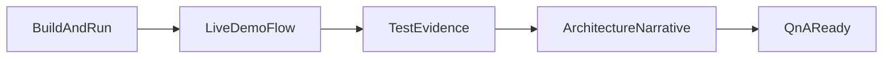

# W8-09 — README 데모 및 발표 패키징

## 1. 구현 목적 및 필요성
### 왜 이걸 하는가 (문제 맥락)
WEEK8 발표는 별도 슬라이드가 아니라 README 중심으로 진행됩니다. 구현이 좋아도 전달 구조가 없으면 팀의 기술 선택과 검증 노력이 제대로 평가되지 않습니다.

### 무엇을 연결하는가 (기술 맥락)
실행 방법, API 예시, 테스트 결과, 설계 의사결정을 README와 WEEK8 문서 링크로 연결합니다. 즉, 코드/테스트/설명 자료를 하나의 데모 플로우로 정리해 누구나 재현 가능한 문서 체계를 만듭니다.

### 왜 중요한가 (학습 포인트)
개발의 마지막 단계는 "잘 만든 것을 잘 설명하는 능력"입니다. 이 단계에서 기술 커뮤니케이션, 근거 기반 설명, Q&A 대비 방식까지 실무에서 중요한 전달 역량을 학습할 수 있습니다.

### 완성의 의미 (결과 관점)
이 단계가 완료되면 4분 발표에서 구현 내용과 검증 근거를 일관되게 전달할 수 있습니다. 즉, 단순 과제 제출이 아니라 포트폴리오로 재사용 가능한 결과물 형태가 갖춰집니다.

### 1.1 실제로 하는 일
- README 데모 경로 고정: 빌드, 서버 실행, API 호출 순서를 문서로 표준화합니다.
- 실행 예시 정리: 복붙 가능한 curl/명령어 예시를 제공해 재현성을 높입니다.
- 테스트 근거 연결: 단위/E2E 결과를 README와 WEEK8 문서에 연결합니다.
- 아키텍처 핵심 요약: 선택한 방식과 트레이드오프를 발표용으로 압축합니다.
- Q&A 대비 포인트 정리: 동시성/오류처리/재사용 설계 질문에 대한 답변 프레임을 만듭니다.
- 리허설 체크리스트 작성: 발표 직전 환경 점검/실패 대응 절차를 고정합니다.

## 2. 가능한 구현 방식 비교
- 방식 A: README 내 단일 섹션으로 통합
  - 장점: 접근성 최고, 링크 이동 최소화
  - 단점: 문서 길이 증가
- 방식 B: README 요약 + 상세 문서 링크
  - 장점: 구조 깔끔, 확장 용이
  - 단점: 발표 중 파일 이동 필요
- 방식 C: 스크립트 주석 기반만 운영
  - 장점: 작성 비용 낮음
  - 단점: 발표 전달력 낮음
- 학습 관점 해석:
  - A는 빠른 공유에 유리하지만 문서가 길어지면 핵심 학습 포인트가 묻힐 수 있습니다.
  - B는 요약과 상세를 분리해 발표 흐름과 복습 흐름을 동시에 만족시킵니다.
  - C는 최소 비용 방식이지만 팀의 설계·검증 사고를 충분히 전달하기 어렵습니다.
- 선택 제안: B를 기준으로 구성해 "핵심 메시지 + 근거 문서"를 동시에 보여주는 구조를 권장합니다.

## 3. 시퀀스 다이어그램 및 설명

- 설명: 실행, 검증, 설명, Q&A 대비를 한 흐름으로 묶어 발표 리스크를 줄입니다.

## 4. 코드 구조 및 구현 절차
- 문서 구조
  - README: Quick Start, API 예시, 테스트 명령, 결과 요약
  - WEEK8 문서: 아키텍처/이슈 설계 링크, 동시성 정책 설명
- 절차
  1. 실행 명령 3개(빌드/서버기동/요청예시) 고정
  2. 테스트 결과 표준 포맷(성공률, latency, 실패사유) 반영
  3. 차별점 1~2개(예: 백프레셔, id 정합성 검사) 명시
  4. Q&A 예상 질문과 답변 포인트 정리
- 수도코드(발표 플로우)
  - `show_health()` -> `run_insert_select_demo()` -> `show_test_report()`

## 5. 비기능적 요구사항 고려
- 성능: 발표에서 latency 지표를 간단히 제시
- 확장성: README가 주차 확장(WEEK9+)에도 재사용 가능한 틀 유지
- 유지보수성: 명령어/경로가 실제 저장소와 항상 일치하도록 체크리스트 운영

## 6. 테스팅 방법
- 입력: README Quick Start 순서대로 실행
- 기대: 새 환경에서도 동일 결과 재현
- 입력: 데모 SQL/HTTP 샘플
- 기대: 문서 예시와 실제 응답 일치
- 입력: Q&A 예상 질문(동시성, 오류처리)
- 기대: 코드/로그 근거로 설명 가능

## 7. 용어 정의 및 주의사항
- Demo script: 발표 중 그대로 실행할 명령/시나리오 집합
- Evidence: 테스트 로그, 지표, 실패 대응 근거
- 주의사항
  - README 명령이 오래된 상태면 발표 신뢰도 급락
  - 과장된 성능 수치보다 재현 가능한 수치가 중요

## 8. 제언
- 발표 전날 "클린 환경 리허설"을 반드시 1회 수행하세요.
- 실패 대비 플랜 B(사전 수집 로그/스크린샷/재실행 절차)를 문서화하면 발표 안정성이 크게 높아집니다.

## 9. 지금까지 자주 나온 질문 정리 (면접형)
### Q1. README 중심 발표에서 가장 중요한 것은?
A. 재현성입니다. 처음 보는 사람이 명령어를 그대로 따라 했을 때 동일 결과가 나와야 신뢰를 얻습니다.

### Q2. 왜 "왜 이 선택을 했는가"를 강조하나요?
A. 구현 사실보다 의사결정 근거가 실무 역량을 보여줍니다. 대안과 트레이드오프를 설명해야 설득력이 생깁니다.

### Q3. Q&A 대비를 어떻게 해야 하나요?
A. 답변을 암기하기보다 근거를 준비해야 합니다. 테스트 결과, 로그, 실패 사례를 근거로 말하면 질문이 바뀌어도 대응 가능합니다.
## 10. 단계별로 알아가면 좋은 질문 (면접형)
### Q1. 발표 흐름을 어떻게 구성하면 좋은가?
A. 문제 -> 설계 선택 -> 구현 결과 -> 검증 근거 -> 한계/개선 순서가 가장 자연스럽습니다.

### Q2. 데모 실패에 대비한 실무적 준비는?
A. 플랜 B를 문서화해야 합니다. 재실행 절차, 대체 시나리오, 사전 수집 로그를 준비하면 리스크를 줄일 수 있습니다.

### Q3. 포트폴리오로 재사용하려면 무엇이 필요할까?
A. 코드뿐 아니라 실행 가이드, 테스트 근거, 설계 의사결정 기록이 함께 있어야 합니다. 세 요소가 있어야 완성된 결과물로 평가받습니다.
## 11. 꼭 알아야 할 질문 (면접형)
### Q1. 왜 README 중심 전달을 강조하나요?
A. README는 팀 외부 사람이 가장 먼저 보는 계약 문서이자 실행 가이드입니다. 발표 자료가 없어도 README가 잘 정리되어 있으면 재현성과 신뢰도가 올라갑니다. 즉 문서는 결과물을 완성하는 마지막 개발 단계입니다.

### Q2. 발표에서 기술 선택을 어떻게 설명해야 하나요?
A. "무엇을 썼다"보다 "왜 그 선택을 했고 무엇을 포기했는지"를 말해야 설득력이 생깁니다. 예를 들어 동기 모델 채택 이유(완주/디버깅 용이), 단점(긴 쿼리 점유), 보완책(timeout/backpressure)을 함께 제시하면 실무형 판단으로 보입니다.

### Q3. Q&A 대비에서 가장 중요한 준비는?
A. 모르는 걸 외우는 게 아니라 근거를 준비하는 것입니다. 테스트 로그, 에러 시나리오, 트레이드오프 표를 준비하면 질문이 들어와도 감이 아니라 증거로 답할 수 있습니다. 면접/발표 모두에서 가장 강한 답변은 재현 가능한 근거 기반 답변입니다.