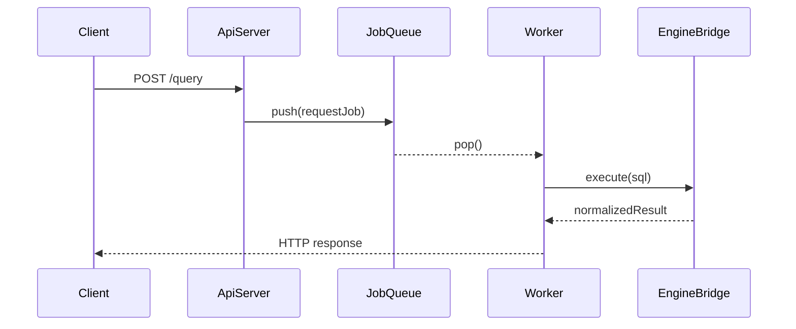

# WEEK8 발표 비주얼 문서

## 0. 문서 사용 방식
이 문서는 슬라이드 장표 분할용이 아니라, 문서 자체를 띄워놓고 발표하는 용도로 작성했습니다.  
그래서 한 화면에서 "핵심 그림 -> 비교 그래프 -> 시연 체크리스트" 순서로 바로 설명할 수 있게 구성했습니다.

## 1. 핵심 아키텍처 그림
먼저 전체 구조를 한 번에 보여주는 그림입니다.


핵심 메시지:
- 요청 수신과 실행을 분리했다.
- API 계약 책임과 SQL 실행 책임을 분리했다.
- timeout/backpressure를 중간 경계에서 통제한다.

## 2. 요청 처리 흐름 그림
`/query` 요청이 실제로 어떻게 처리되는지 보여주는 흐름도입니다.



핵심 메시지:
- Router는 수락과 검증에 집중한다.
- Worker는 실행에 집중한다.
- Bridge는 응답 계약 일관성을 보장한다.

## 3. 비교 섹션 시각화 원칙 (실측 기반)
비교 그래프는 "추정값"이 아니라 실제 테스트 결과로만 채웁니다.

고정 지표:
- `throughput`
- `p95 latency`
- `error rate(503/504)`

고정 실험 조건:
- 동일 머신, 동일 빌드, 동일 데이터셋
- 동일 요청 수와 동일 read/write mix
- 각 케이스 3회 이상 반복 후 평균/최댓값 기록

## 4. 02 비교 그래프 블록 (A vs B)
비교 대상:
- A: 고정 스레드풀 + bounded queue
- B: 요청당 스레드 생성

문서에 넣을 그래프:
1. Throughput 비교 (bar)
2. p95 latency 비교 (line or bar)
3. 503 비율 비교 (bar)

그래프 해석 문장 템플릿:
- "A는 상한 제어로 지연 분포가 안정적이고, B는 피크 구간에서 스레드 생성 비용으로 p95가 크게 증가했다."
- "A는 일부 503을 허용하는 대신 시스템 생존성을 유지했고, B는 실패 형태가 불규칙해 원인 추적 비용이 컸다."

실측 결과(3회 평균):
- normal: per_request `11648.91 rps / 1.49 ms`, pool `11447.07 rps / 1.58 ms`
- burst: per_request `12240.27 rps / 7.10 ms`, pool `11410.10 rps / 8.17 ms`
- saturation: per_request `2130.17 rps / 12.33 ms`, pool `2067.96 rps / 11.98 ms`

그래프 파일:
- `artifacts/week8/bench_02/throughput_02.png`
- `artifacts/week8/bench_02/p95_02.png`
- `artifacts/week8/bench_02/error503_02.png`
- 요약표: `artifacts/week8/bench_02/summary_02.md`

해석 시 주의:
- 이번 02 벤치는 `GET /health` 워크로드라서 두 정책 모두 `503 ratio=0`으로 측정되었습니다.
- queue 포화(503) 차이를 강조하려면 `/query` 또는 인위적 지연 훅을 포함한 별도 부하 실험이 추가로 필요합니다.

## 5. 06 비교 그래프 블록 (A vs B)
비교 대상:
- A: 고정 timeout + queue full 즉시 거절
- B: 동적 timeout (큐 길이 기반)

문서에 넣을 그래프:
1. 504 비율 비교
2. 503 비율 비교
3. p95/p99 latency 비교

그래프 해석 문장 템플릿:
- "A는 예측 가능성이 높고 대응이 단순했으며, B는 트래픽 변화 대응력은 높지만 튜닝 전제 조건이 필요했다."
- "503/504 분리를 통해 클라이언트 재시도 전략을 구분할 수 있었고, 운영 로그 해석이 쉬워졌다."

## 6. 실측 데이터 생성 절차 (발표 전 필수)
아래 순서로 실제 데이터 CSV를 생성하고 그래프를 만듭니다.

1) 서버 실행  
- A 정책/구현으로 서버 기동
- B 정책/구현으로 서버 기동

2) 부하 테스트 실행  
- 정상 부하 / 버스트 부하 / 장기 요청 시나리오 각각 수행

3) 결과 저장  
- `scenario, policy, throughput, p95_ms, p99_ms, rate_503, rate_504` 포맷 CSV로 저장

4) 그래프 생성  
- 같은 CSV에서 02용/06용 그래프를 분리 출력

## 7. 그래프 생성용 CSV 형식
```csv
scenario,policy,throughput,p95_ms,p99_ms,rate_503,rate_504
normal,A,0,0,0,0,0
normal,B,0,0,0,0,0
burst,A,0,0,0,0,0
burst,B,0,0,0,0,0
long_query,A,0,0,0,0,0
long_query,B,0,0,0,0,0
```

## 8. 시연 체크리스트 (유지)
| 항목 | 확인 포인트 | 기대 결과 |
| --- | --- | --- |
| 서버 상태 | `/health` 선확인 | 200 OK |
| 기능 시연 | `/query` 정상 SQL | `ok=true` |
| 과부하 시연 | burst 요청 | `503/QUEUE_FULL` |
| timeout 시연 | 장기 SQL | `504/TIMEOUT` |
| 로그 근거 | 응답코드/지연/에러코드 | 발표 중 즉시 제시 |

## 9. 발표 중 강조할 한 줄 결론
- "이 문서는 설계 그림이 아니라, 실제 측정값으로 선택 근거를 증명하는 운영형 비주얼 문서입니다."
