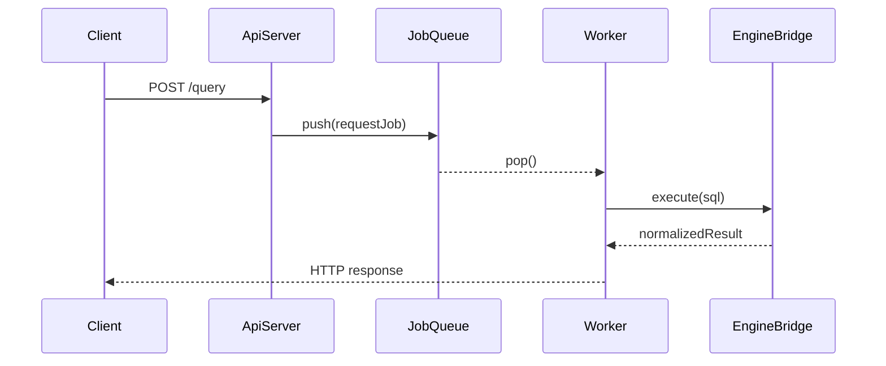

# WEEK8 발표 비주얼 문서

## 0. 문서 사용 방식
이 문서는 슬라이드 장표 분할용이 아니라, 문서 자체를 띄워놓고 발표하는 용도로 작성했습니다.  
그래서 한 화면에서 "핵심 그림 -> 비교 그래프 -> 시연 체크리스트" 순서로 바로 설명할 수 있게 구성했습니다.

## 1. 핵심 아키텍처 그림
먼저 전체 구조를 한 번에 보여주는 그림입니다.


핵심 메시지:
- 요청 수신과 실행을 분리했다.
- API 계약 책임과 SQL 실행 책임을 분리했다.
- timeout/backpressure를 중간 경계에서 통제한다.

## 2. 요청 처리 흐름 그림
`/query` 요청이 실제로 어떻게 처리되는지 보여주는 흐름도입니다.



핵심 메시지:
- Router는 수락과 검증에 집중한다.
- Worker는 실행에 집중한다.
- Bridge는 응답 계약 일관성을 보장한다.

## 3. 비교 섹션 시각화 원칙 (실측 기반)
비교 그래프는 "추정값"이 아니라 실제 테스트 결과로만 채웁니다.

고정 지표:
- `throughput`
- `p95 latency`
- `error rate(503/504)`

고정 실험 조건:
- 동일 머신, 동일 빌드, 동일 데이터셋
- 동일 요청 수와 동일 read/write mix
- 각 케이스 3회 이상 반복 후 평균/최댓값 기록

## 4. 02 비교 그래프 블록 (A vs B)
비교 대상:
- A: 고정 스레드풀 + bounded queue
- B: 요청당 스레드 생성

02는 그래프 대신 표 + 설명으로 정리:

| scenario | policy | throughput_mean | p95_mean | p99_mean | 503_mean | 504_mean | success_mean |
| --- | --- | ---: | ---: | ---: | ---: | ---: | ---: |
| normal | pool | 17462.41 | 3.29 | 4.95 | 0.0000 | 0.0000 | 0.3000 |
| normal | per_request | 18994.63 | 3.10 | 5.48 | 0.0000 | 0.0000 | 0.1000 |
| burst | pool | 17243.53 | 13.71 | 18.90 | 0.0847 | 0.0000 | 0.2153 |
| burst | per_request | 19006.23 | 11.87 | 17.85 | 0.0000 | 0.0000 | 0.0848 |
| saturation | pool | 16594.96 | 25.47 | 34.55 | 0.2428 | 0.0000 | 0.0563 |
| saturation | per_request | 19704.23 | 15.44 | 23.17 | 0.0000 | 0.0000 | 0.0000 |

요약 설명:
- throughput 기준으로는 세 시나리오 모두 per_request(B)가 pool(A)보다 높게 측정되었습니다.
- p95/p99 지연도 burst/saturation 구간에서 per_request(B)가 더 낮게 나왔습니다.
- 반면 pool(A)은 burst/saturation에서 503 비율이 증가해, 본 실험 조건에서는 backpressure가 더 자주 작동한 것으로 해석할 수 있습니다.

근거 파일:
- `artifacts/week8/bench_02_deep/benchmark_results_02_deep.csv`
- `artifacts/week8/bench_02_deep/summary_02_deep.md`

## 5. 06 비교 그래프 블록 (A vs B)
비교 대상:
- A: 고정 timeout + queue full 즉시 거절
- B: 동적 timeout (큐 길이 기반)

06은 그래프 대신 표 + 설명으로 정리:

| scenario | policy | throughput_mean | p95_mean | p99_mean | 503_mean | 504_mean | success_mean |
| --- | --- | ---: | ---: | ---: | ---: | ---: | ---: |
| normal | dynamic | 18924.24 | 2.98 | 4.52 | 0.0000 | 0.0000 | 0.1250 |
| normal | fixed | 14585.53 | 3.85 | 5.65 | 0.0000 | 0.0000 | 0.6250 |
| burst | dynamic | 18764.17 | 12.05 | 18.00 | 0.0348 | 0.0000 | 0.0901 |
| burst | fixed | 14411.82 | 18.46 | 24.25 | 0.2099 | 0.0945 | 0.3206 |
| saturation | dynamic | 18802.88 | 13.27 | 21.65 | 0.0936 | 0.0000 | 0.0314 |
| saturation | fixed | 13841.98 | 27.24 | 35.60 | 0.3200 | 0.2959 | 0.0089 |

요약 설명:
- 동적 timeout(B)은 고부하 구간(burst/saturation)에서 p95/p99가 더 낮고 throughput이 높게 나왔습니다.
- 고정 timeout(A)은 동일 구간에서 503/504 비율이 더 높게 관찰되었습니다.
- 특히 saturation에서 fixed는 `504_mean=0.2959`로 timeout 손실이 크게 나타났고, dynamic은 `504_mean=0.0000`으로 측정되었습니다.

근거 파일:
- `artifacts/week8/bench_06/benchmark_results_06.csv`
- `artifacts/week8/bench_06/summary_06.md`

## 6. 실측 데이터 생성 절차 (발표 전 필수)
아래 순서로 실제 데이터 CSV를 생성하고 그래프를 만듭니다.

1) 서버 실행  
- A 정책/구현으로 서버 기동
- B 정책/구현으로 서버 기동

2) 부하 테스트 실행  
- 정상 부하 / 버스트 부하 / 장기 요청 시나리오 각각 수행

3) 결과 저장  
- `scenario, policy, throughput, p95_ms, p99_ms, rate_503, rate_504` 포맷 CSV로 저장

4) 그래프 생성  
- 같은 CSV에서 02용/06용 그래프를 분리 출력

## 7. 그래프 생성용 CSV 형식
```csv
scenario,policy,throughput,p95_ms,p99_ms,rate_503,rate_504
normal,A,0,0,0,0,0
normal,B,0,0,0,0,0
burst,A,0,0,0,0,0
burst,B,0,0,0,0,0
long_query,A,0,0,0,0,0
long_query,B,0,0,0,0,0
```

## 8. 시연 체크리스트 (유지)
| 항목 | 확인 포인트 | 기대 결과 |
| --- | --- | --- |
| 서버 상태 | `/health` 선확인 | 200 OK |
| 기능 시연 | `/query` 정상 SQL | `ok=true` |
| 과부하 시연 | burst 요청 | `503/QUEUE_FULL` |
| timeout 시연 | 장기 SQL | `504/TIMEOUT` |
| 로그 근거 | 응답코드/지연/에러코드 | 발표 중 즉시 제시 |

## 9. 발표 중 강조할 한 줄 결론
- "이 문서는 설계 그림이 아니라, 실제 측정값으로 선택 근거를 증명하는 운영형 비주얼 문서입니다."
