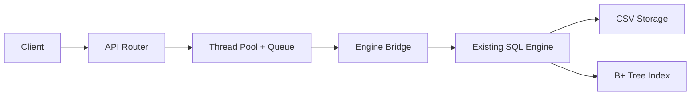
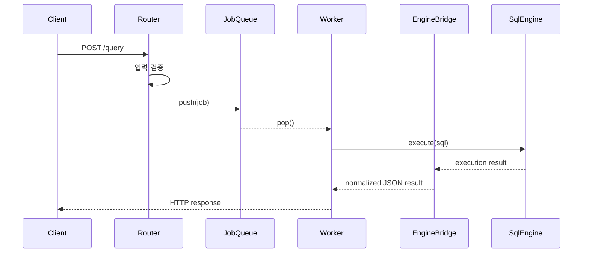
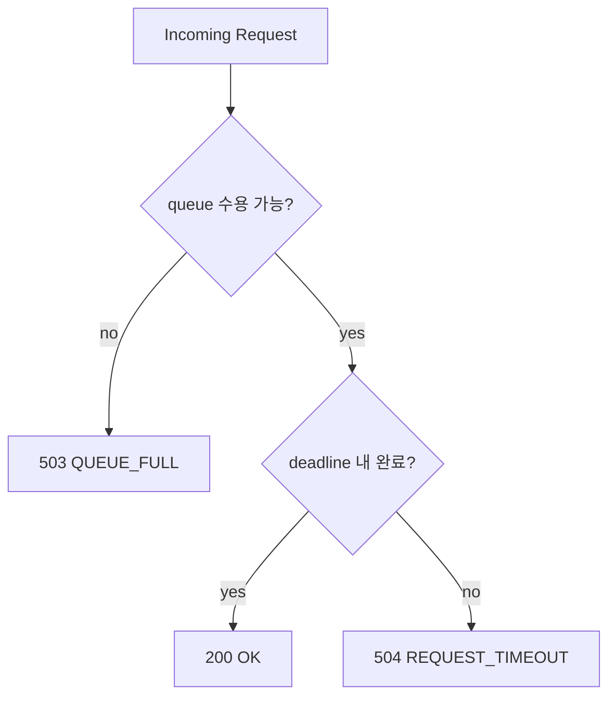

# WEEK8 발표 비주얼 문서 (4분 발표용)

이 문서는 4분 발표 기준으로 슬라이드 흐름을 맞춘 비주얼 문서입니다.  
핵심 원칙은 README 스타일에 맞춰 **프로젝트 소개 -> 구조 -> 핵심 선택 -> 실측 요약 -> 시연 -> 결론** 순서로 설명하는 것입니다.

## 1. 발표 흐름 (4분 기준)

1. 프로젝트 소개 — 30초  
   기존 SQL 처리기 위에 API 서버를 붙여 요청-응답 제품으로 확장했다는 점을 먼저 설명합니다.
2. 해결하려는 문제 — 35초  
   API 계약, 동시성, 보호 정책 세 가지를 짧게 정의합니다.
3. 핵심 아키텍처 — 55초  
   전체 구조를 한 번에 설명합니다.
4. 요청 처리 흐름 — 45초  
   `/query`가 실제로 어떤 단계를 거쳐 처리되는지 보여줍니다.
5. 핵심 선택과 실측 요약 — 45초  
   스레드풀, bounded queue, timeout/backpressure를 왜 선택했는지와 실측 해석을 짧게 정리합니다.
6. 시연 포인트와 마무리 — 30초  
   정상 응답, 과부하, timeout을 보여주고 결론으로 마무리합니다.

## 2. 핵심 아키텍처 그림
먼저 전체 구조를 한 번에 보여주는 그림입니다.

핵심 메시지:
- 기존 SQL 엔진을 버리지 않고 그대로 재사용했다.
- API 계층과 SQL 실행 계층을 분리했다.
- 병렬 처리와 보호 정책은 Router와 Pool 경계에서 통제한다.

## 3. 요청 처리 흐름 그림
`/query` 요청이 실제로 어떻게 처리되는지 보여주는 흐름도입니다.

핵심 메시지:
- Router는 수락과 검증에 집중한다.
- Queue와 Worker는 병렬 처리 상한을 관리한다.
- Bridge는 응답 형식을 일관되게 만든다.

## 4. 오류 의미와 보호 정책
이 슬라이드는 “왜 503과 504를 나눴는가”를 짧게 설명할 때 사용합니다.

핵심 메시지:
- `503`은 아예 수용하지 못한 요청이다.
- `504`는 수용은 했지만 시간 안에 끝내지 못한 요청이다.
- 실패를 구분하면 운영 중 해석과 재시도 정책도 달라질 수 있다.

## 5. 비교 섹션 시각화 원칙
비교 슬라이드는 숫자를 많이 읽는 용도가 아니라, **실측을 근거로 선택 이유를 설명하는 용도**로 씁니다.

고정 지표:
- `throughput`
- `p95 latency`
- `503/504 비율`

고정 실험 조건:
- 동일 머신, 동일 빌드, 동일 데이터셋
- 동일 요청 수와 동일 시나리오
- 각 케이스 3회 이상 반복

발표 중 한 줄 요약:
- “이번 실측은 가장 빠른 방식 하나를 고르는 게 아니라, 부하 상황에서도 설명 가능한 정책을 찾기 위한 비교입니다.”

## 6. 02 비교 그래프 블록 (실측 표 유지)
비교 대상:
- A: 고정 스레드풀 + bounded queue
- B: 요청당 스레드 생성

이 표는 발표에서 전부 읽지는 않더라도, **실제로 테스트해서 검증한 근거 자료**이기 때문에 유지합니다.

| scenario | policy | throughput_mean | p95_mean | p99_mean | 503_mean | 504_mean | success_mean |
| --- | --- | ---: | ---: | ---: | ---: | ---: | ---: |
| normal | pool | 17462.41 | 3.29 | 4.95 | 0.0000 | 0.0000 | 0.3000 |
| normal | per_request | 18994.63 | 3.10 | 5.48 | 0.0000 | 0.0000 | 0.1000 |
| burst | pool | 17243.53 | 13.71 | 18.90 | 0.0847 | 0.0000 | 0.2153 |
| burst | per_request | 19006.23 | 11.87 | 17.85 | 0.0000 | 0.0000 | 0.0848 |
| saturation | pool | 16594.96 | 25.47 | 34.55 | 0.2428 | 0.0000 | 0.0563 |
| saturation | per_request | 19704.23 | 15.44 | 23.17 | 0.0000 | 0.0000 | 0.0000 |

발표용 요약:
- 단순 `/health` 중심 워크로드에서는 per-request가 throughput과 일부 지연 지표에서 더 높게 나왔습니다.
- 하지만 pool 방식은 bounded queue를 통해 서버가 감당 가능한 상한을 분명히 둘 수 있다는 점이 중요합니다.
- 그래서 이 표는 “누가 더 빠른가”만 보는 자료가 아니라, 어떤 정책을 선택했는지 설명하는 근거입니다.

근거 파일:
- `artifacts/week8/bench_02_deep/benchmark_results_02_deep.csv`
- `artifacts/week8/bench_02_deep/summary_02_deep.md`

## 7. 06 비교 그래프 블록 (실측 표 유지)
비교 대상:
- A: 고정 timeout + queue full 즉시 거절
- B: 동적 timeout (큐 길이 기반)

이 표도 발표에서 숫자를 다 읽기 위한 용도가 아니라, **보호 정책 선택을 실제로 검증한 자료**로 남깁니다.

| scenario | policy | throughput_mean | p95_mean | p99_mean | 503_mean | 504_mean | success_mean |
| --- | --- | ---: | ---: | ---: | ---: | ---: | ---: |
| normal | dynamic | 18924.24 | 2.98 | 4.52 | 0.0000 | 0.0000 | 0.1250 |
| normal | fixed | 14585.53 | 3.85 | 5.65 | 0.0000 | 0.0000 | 0.6250 |
| burst | dynamic | 18764.17 | 12.05 | 18.00 | 0.0348 | 0.0000 | 0.0901 |
| burst | fixed | 14411.82 | 18.46 | 24.25 | 0.2099 | 0.0945 | 0.3206 |
| saturation | dynamic | 18802.88 | 13.27 | 21.65 | 0.0936 | 0.0000 | 0.0314 |
| saturation | fixed | 13841.98 | 27.24 | 35.60 | 0.3200 | 0.2959 | 0.0089 |

발표용 요약:
- 고부하 구간에서는 dynamic timeout이 더 안정적인 지연과 낮은 timeout 손실을 보였습니다.
- fixed timeout은 단순하고 설명하기 쉽지만, saturation 구간에서는 503과 504 비율이 더 높게 나타났습니다.
- 그래서 이 표는 성능 비교이면서 동시에 실패를 어떤 정책으로 드러낼 것인지 보여주는 자료입니다.

근거 파일:
- `artifacts/week8/bench_06/benchmark_results_06.csv`
- `artifacts/week8/bench_06/summary_06.md`

## 8. 시연 체크리스트

| 항목 | 확인 포인트 | 기대 결과 |
| --- | --- | --- |
| 상태 확인 | `/health` | 200 OK |
| 기능 확인 | `/query` 정상 SQL | 200 OK |
| 과부하 확인 | burst 요청 | 503 |
| timeout 확인 | long request | 504 |

발표 중 한 줄:
- “시연의 목적은 한 번 예쁘게 성공하는 것이 아니라, 정책이 실제로 재현 가능하게 동작하는 것을 보여주는 것입니다.”

## 9. 발표 마무리 한 줄
- “WEEK8의 핵심은 기존 SQL 엔진을 API 서버로 확장하고, 병렬 처리와 보호 정책까지 포함해 설명 가능한 시스템으로 만든 것입니다.”
