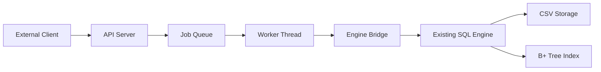
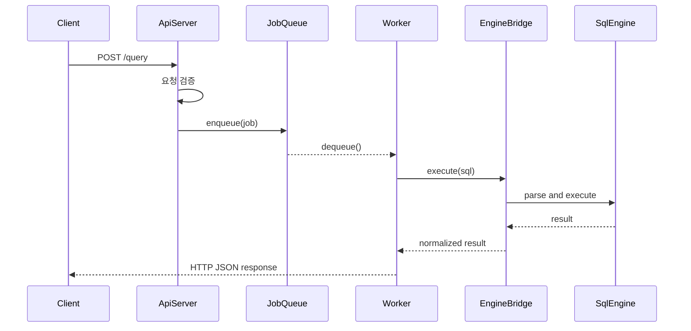

# WEEK8 발표 비주얼 문서 (4분 발표용)

## 1. 소개

발표에서 먼저 전달할 핵심 문장:
- 이번 주 과제는 **미니 DBMS API 서버 구현**이다.
- 외부 클라이언트가 API를 통해 DBMS 기능을 사용할 수 있어야 한다.
- 이전 주차의 SQL 처리기와 B+ 트리 인덱스를 그대로 재사용한다.

짧게 보여줄 키워드:
- `C`
- `API Server`
- `Thread Pool`
- `SQL Engine Reuse`
- `B+ Tree`

## 2. 정의

발표에서 정의할 핵심 포인트:
- 멀티 스레드 동시성 이슈
- 내부 DB 엔진과 외부 API 서버 사이 연결 설계
- API 서버 아키텍처

품질 기준:
- 단위 테스트로 함수 검증
- API 서버 기능 테스트
- 엣지 케이스 고려
- 포트폴리오 수준 완성도

## 3. 아키텍쳐 및 흐름

발표할 때 말할 핵심:
- 외부 요청은 API 서버가 받는다.
- 병렬 처리는 Thread Pool과 Job Queue가 담당한다.
- SQL 실행은 기존 엔진을 그대로 재사용한다.

## 4. 모듈별 방식과 성능 테스트

### 4-1. 02 — Thread Pool 및 Job Queue

비교 내용:
- 방식 A: 고정 크기 스레드 풀 + bounded queue
  - 장점: 메모리 상한 통제, 백프레셔 정책 명확
  - 단점: 피크 시 거절 응답 필요
- 방식 B: 요청당 스레드 생성
  - 장점: 구현 직관적
  - 단점: 컨텍스트 스위칭/생성 비용 큼, 폭주 위험

실제 테스트 결과 표:

| scenario | policy | throughput_mean | p95_mean | p99_mean | 503_mean | 504_mean | success_mean |
| --- | --- | ---: | ---: | ---: | ---: | ---: | ---: |
| normal | pool | 17462.41 | 3.29 | 4.95 | 0.0000 | 0.0000 | 0.3000 |
| normal | per_request | 18994.63 | 3.10 | 5.48 | 0.0000 | 0.0000 | 0.1000 |
| burst | pool | 17243.53 | 13.71 | 18.90 | 0.0847 | 0.0000 | 0.2153 |
| burst | per_request | 19006.23 | 11.87 | 17.85 | 0.0000 | 0.0000 | 0.0848 |
| saturation | pool | 16594.96 | 25.47 | 34.55 | 0.2428 | 0.0000 | 0.0563 |
| saturation | per_request | 19704.23 | 15.44 | 23.17 | 0.0000 | 0.0000 | 0.0000 |

발표 포인트:
- 이 표는 실제 테스트 결과이므로 그대로 사용한다.
- 발표에서는 숫자를 전부 읽지 않고, `왜 Thread Pool 방식을 채택했는지`를 중심으로 설명한다.

근거 파일:
- `artifacts/week8/bench_02_deep/benchmark_results_02_deep.csv`
- `artifacts/week8/bench_02_deep/summary_02_deep.md`

### 4-2. 06 — 타임아웃, 백프레셔, 요청 취소 정책

비교 내용:
- 방식 A: 고정 timeout + 큐 full 즉시 거절
  - 장점: 구현 단순, 시스템 보호 확실
  - 단점: 요청 성공률 저하 가능
- 방식 B: 동적 timeout(큐 길이 기반)
  - 장점: 상황 적응형
  - 단점: 정책 복잡, 예측성 낮음

실제 테스트 결과 표:

| scenario | policy | throughput_mean | p95_mean | p99_mean | 503_mean | 504_mean | success_mean |
| --- | --- | ---: | ---: | ---: | ---: | ---: | ---: |
| normal | dynamic | 18924.24 | 2.98 | 4.52 | 0.0000 | 0.0000 | 0.1250 |
| normal | fixed | 14585.53 | 3.85 | 5.65 | 0.0000 | 0.0000 | 0.6250 |
| burst | dynamic | 18764.17 | 12.05 | 18.00 | 0.0348 | 0.0000 | 0.0901 |
| burst | fixed | 14411.82 | 18.46 | 24.25 | 0.2099 | 0.0945 | 0.3206 |
| saturation | dynamic | 18802.88 | 13.27 | 21.65 | 0.0936 | 0.0000 | 0.0314 |
| saturation | fixed | 13841.98 | 27.24 | 35.60 | 0.3200 | 0.2959 | 0.0089 |

발표 포인트:
- 이 표도 실제 테스트 결과이므로 그대로 사용한다.
- 발표에서는 `고정 정책`과 `동적 정책`의 차이를 설명하고, 과부하 상황에서 어떤 정책이 더 설명 가능한지에 초점을 둔다.

근거 파일:
- `artifacts/week8/bench_06/benchmark_results_06.csv`
- `artifacts/week8/bench_06/summary_06.md`

## 5. 수요코딩회 요구사항 시연

시연 순서:
- `GET /health`
- `POST /query`
- 동시 요청으로 병렬 처리 확인
- 과부하 또는 timeout 상황 확인

시연 체크리스트:

| 항목 | 시연 내용 | 기대 결과 |
| --- | --- | --- |
| 기능 | `GET /health` | 200 OK |
| 기능 | `POST /query`로 SELECT/INSERT | 200 OK |
| 병렬 처리 | 동시 요청 전송 | Thread Pool 기반 처리 확인 |
| 보호 정책 | queue full 또는 timeout 상황 | 503 / 504 확인 |
| 품질 | 테스트 근거 제시 | 요구사항 검증 설명 |

같이 언급할 테스트 파일:
- `tests/test_week8_engine_bridge.c`
- `tests/test_week8_api_server.c`
- `tests/test_week8_locking.c`
