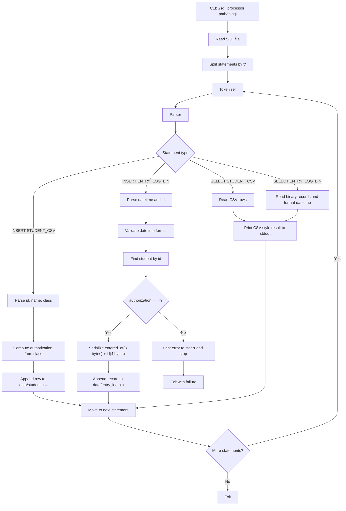

# SQL Processor

C99로 구현하는 작은 파일 기반 SQL 처리기 프로젝트입니다. 이 저장소의 목표는 범용 DBMS를 만드는 것이 아니라, 정해진 두 테이블만 대상으로 `INSERT` 와 `SELECT` 를 처리하는 최소 기능의 SQL processor를 만드는 것입니다.

현재 저장소는 단계적으로 구현 중이며, 현재 기준으로는 Step 6까지 진행되어 SQL 파일 읽기, `;` 기준 문장 분리, tokenizer, parser(AST 생성), executor, `STUDENT_CSV` CSV storage, `ENTRY_LOG_BIN` binary storage, datetime 검증/변환, 권한 검사까지 전체 파이프라인이 연결되어 있습니다.

아래 README는 "현재 구현 상태"와 [`sql_processor_codex_spec.md`](sql_processor_codex_spec.md) 기준의 "최종 목표 범위"를 구분해서 정리한 문서입니다.

## Current Status

- Step 1 완료: SQL 파일 전체 읽기, 세미콜론 기준 문장 분리
- Step 2 완료: 최소 SQL tokenizer 구현
- Step 3 완료: 지원하는 5가지 SQL 형태를 AST로 바꾸는 parser 구현
- Step 4 완료: `STUDENT_CSV` CSV storage + executor + CLI 실행 연결
- Step 5 완료: datetime 파싱/포맷 + `ENTRY_LOG_BIN` binary storage + `ENTRY_LOG_BIN SELECT`
- Step 6 완료: 학생 존재 여부 검사 + authorization 검사 + full pipeline 연결
- 테스트 완료:
  - `test_step1`
  - `test_tokenizer`
  - `test_parser`
  - `test_datetime_utils`
  - `test_student_storage`
  - `test_entry_log_storage`
  - `test_step4`
  - `test_step5`
  - `test_step6`
- 현재 구현은 명세 범위를 모두 연결한 상태다.
- 현재 `sql_processor` CLI 동작:
  - `INSERT INTO STUDENT_CSV ...`
  - `SELECT * FROM STUDENT_CSV;`
  - `SELECT * FROM STUDENT_CSV WHERE id = <int>;`
  - `INSERT INTO ENTRY_LOG_BIN VALUES ('YYYY-MM-DD HH:MM:SS', id);`
  - `SELECT * FROM ENTRY_LOG_BIN WHERE id = <int>;`

## Project Overview

아래 항목은 최종 목표 기준 동작입니다.

- 입력은 `./sql_processor <sql_file_path>` 형태의 CLI 한 가지입니다.
- SQL 파일 안의 여러 문장을 순서대로 실행합니다.
- `STUDENT_CSV` 는 CSV 파일로 저장합니다.
- `ENTRY_LOG_BIN` 은 고정 길이 binary 레코드로 저장합니다.
- `SELECT` 결과는 `stdout`, 에러는 `stderr` 로 출력합니다.
- 에러가 발생하면 그 문장에서 즉시 실행을 중단합니다.

## Supported SQL

이 프로젝트는 아래 다섯 가지 문법만 지원하도록 설계되어 있으며, Step 3 parser도 정확히 이 다섯 가지 패턴만 허용합니다.

```sql
INSERT INTO STUDENT_CSV VALUES (id, 'name', class);
INSERT INTO ENTRY_LOG_BIN VALUES ('YYYY-MM-DD HH:MM:SS', id);
SELECT * FROM STUDENT_CSV;
SELECT * FROM STUDENT_CSV WHERE id = <int>;
SELECT * FROM ENTRY_LOG_BIN WHERE id = <int>;
```

지원하지 않는 기능:

- `CREATE TABLE`
- `UPDATE`
- `DELETE`
- `JOIN`
- `ORDER BY`
- `GROUP BY`
- 서브쿼리
- 임의 컬럼 선택
- 복잡한 `WHERE` 조건
- 범용 SQL 엔진

## Overall Flow

현재 모듈 구현 범위는 `SQL file read -> statement split -> tokenizer -> parser(AST) -> executor -> CSV/Binary storage` 전체입니다. 아래 mermaid 다이어그램은 현재 실제 실행 흐름과 거의 동일합니다.



## DB Architecture

아래 그림은 현재 구현이 아니라 최종 목표 아키텍처입니다.


## Table Structure

| Logical table | Physical file | Columns | Notes |
| --- | --- | --- | --- |
| `STUDENT_CSV` | `data/student.csv` | `id`, `name`, `class`, `authorization` | `authorization` 은 `class` 로부터 자동 계산 |
| `ENTRY_LOG_BIN` | `data/entry_log.bin` | `entered_at`, `id` | append-only binary, 레코드당 12바이트 |

### STUDENT_CSV

- 헤더를 포함한 CSV 텍스트 파일입니다.
- 헤더는 `id,name,class,authorization` 입니다.
- 구분자는 `,` 입니다.
- `authorization` 은 `T` 또는 `F` 로 저장합니다.
- `name` 에는 공백, 쉼표, 줄바꿈을 허용하지 않습니다.

예시:

```text
id,name,class,authorization
302,Kim,302,T
303,Lee,303,F
100,Coach,100,T
```

### ENTRY_LOG_BIN

- append-only binary 파일입니다.
- 레코드 하나는 총 12바이트입니다.
- `entered_at` 은 8바이트 signed integer Unix timestamp(초 단위)로 저장합니다.
- `id` 는 4바이트 signed integer 로 저장합니다.
- 구조체 전체를 한 번에 `fwrite` 하지 않고, 각 필드를 순서대로 직접 직렬화합니다.

레코드 구성:

```text
entered_at: 8 bytes
id:         4 bytes
total:     12 bytes
```

## Authorization Rule

`authorization` 은 사용자가 직접 넣지 않고 `class` 값으로 자동 계산합니다.

- `class == 302` 이면 `T`
- `class == 100` 이면 `T`
- 그 외는 `F`

`ENTRY_LOG_BIN` 에 입장 기록을 저장하려면 아래 조건을 모두 만족해야 합니다.

1. 해당 `id` 가 `STUDENT_CSV` 에 존재해야 합니다.
2. 해당 학생의 `authorization` 값이 `T` 여야 합니다.

조건을 만족하지 못하면 에러를 출력하고 실행을 중단합니다.

## Build

```bash
make
```

빌드가 끝나면 `sql_processor` 실행 파일이 생성됩니다.

## Run

```bash
./sql_processor <sql_file_path>
```

예시:

```bash
./sql_processor tests/fixtures/three_statements.sql
```

프로젝트 최종 목표 기준 동작:

- SQL 파일 전체를 읽습니다.
- 여러 문장을 순서대로 실행합니다.
- `SELECT` 결과는 `stdout` 에 출력합니다.
- 에러는 `stderr` 에 출력합니다.

현재 구현에서는 지원하는 다섯 가지 statement를 실제로 끝까지 실행합니다.

예를 들어 학생 3명을 INSERT한 뒤 `SELECT * FROM STUDENT_CSV;` 를 실행하면 현재는 아래처럼 나옵니다.

```text
id,name,class,authorization
302,Kim,302,T
303,Lee,303,F
100,Coach,100,T
```

## Test

```bash
make test
```

현재 자동화 테스트는 Step 6 기준으로 아래 동작을 검증합니다.

- SQL 파일 전체 읽기
- 단일 문장 분리
- 다중 문장 분리와 순서 보존
- 앞뒤 공백 제거
- CLI smoke test
- `SELECT` / `INSERT` tokenizer 동작
- 공백 무시, 문자열 토큰 처리
- 잘못된 문자열/지원하지 않는 문자 거부
- 지원하는 5가지 SQL 패턴 parser 성공
- 지원하지 않는 `SELECT id ...`, 잘못된 `WHERE`, 알 수 없는 테이블명, 값 개수 불일치 거부
- `student.csv` 자동 생성과 헤더 작성
- 학생 row append / 전체 조회 / id 조회
- 중복 id 거부
- authorization 계산 결과가 CSV와 SELECT 출력에 반영되는지
- CLI 기준 Step 4 기능 흐름
- datetime 문자열 파싱 / timestamp 변환 / 출력 문자열 포맷
- `entry_log.bin` 12바이트 레코드 append / id별 조회
- 잘못된 datetime 거부
- 권한 없는 학생의 `ENTRY_LOG_BIN` INSERT 거부
- 존재하지 않는 학생의 `ENTRY_LOG_BIN` INSERT 거부
- 중간 에러 발생 시 이후 statement 실행 중단
- Step 6 end-to-end CLI 흐름

## Demo

짧고 굵게 보여 주려면 개별 파일을 하나씩 여는 대신 아래 명령을 사용하면 된다.

```bash
make demo
```

이 명령은 `manual_samples/` 아래 발표용 샘플 SQL 5개를 한 번에 실행하고,
결과를 `manual_runs/latest/` 아래에 정리한다.

발표 때는 아래 HTML 파일 하나만 열면 된다.

- `manual_runs/latest/web_demo/index.html`

이 웹 데모에는:

- 각 샘플의 목적
- 종료 코드
- 실제 CLI 실행 명령
- 샘플 SQL 원문
- 두 테이블 정의
- 케이스 실행 후 현재 테이블 상태
- `stdout` 와 `stderr`
- 케이스별 raw file 링크

가 케이스별로 한 화면에 정리된다.

Markdown 요약판도 같이 생성된다.

- `manual_runs/latest/DEMO_OVERVIEW.md`

샘플 SQL 원본 설명은 아래 문서에 있다.

- `manual_samples/README.md`

## Example SQL File

아래처럼 여러 문장을 한 파일에 넣어 순차 실행하는 형태를 가정합니다.

```sql
INSERT INTO STUDENT_CSV VALUES (302, 'Kim', 302);
INSERT INTO STUDENT_CSV VALUES (303, 'Lee', 303);
INSERT INTO STUDENT_CSV VALUES (100, 'Coach', 100);
SELECT * FROM STUDENT_CSV;
INSERT INTO ENTRY_LOG_BIN VALUES ('2026-04-08 09:00:00', 302);
SELECT * FROM ENTRY_LOG_BIN WHERE id = 302;
```

## Example Output

아래 출력은 현재 CLI에서 실제로 나오는 형식이다.

`SELECT * FROM STUDENT_CSV;`

```text
id,name,class,authorization
302,Kim,302,T
303,Lee,303,F
100,Coach,100,T
```

`SELECT * FROM ENTRY_LOG_BIN WHERE id = 302;`

```text
entered_at,id
2026-04-08 09:00:00,302
```

결과가 없으면 에러 대신 아래처럼 출력합니다.

```text
no rows found
```

## Execution Rules

- SQL 파일의 각 문장은 반드시 `;` 로 끝나야 합니다.
- 문장들은 파일 안에서 순서대로 실행합니다.
- 중간에 에러가 발생하면 이후 문장은 실행하지 않습니다.
- SQL 주석은 지원하지 않습니다.
- 문자열은 작은따옴표 `'` 로 감싸야 합니다.
- 문자열 내부 세미콜론은 지원하지 않습니다.
- 학생 이름에는 공백을 허용하지 않습니다.

## Limitations

- 두 개의 고정 테이블만 지원합니다.
- 고정된 다섯 가지 SQL 형태만 처리합니다.
- `WHERE id = <int>` 형태만 지원합니다.
- 동적 스키마 로딩을 하지 않습니다.
- 여러 건물이나 방으로 일반화하지 않습니다.
- 범용 DBMS처럼 확장하는 것이 목표가 아닙니다.

## Future Improvements

- `data/student.csv`, `data/entry_log.bin` 초기화와 예외 처리 보강
- 에러 메시지 표준화
- 발표와 데모에 맞춘 예시 SQL fixture 확장
